# Repeating Earthquake Activity at RCM

## Waveforms
[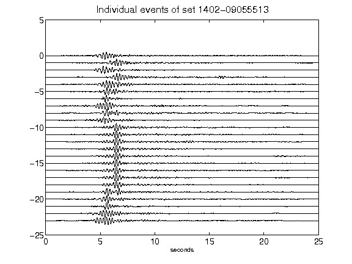](figures/1402-09055513_AllEv.png)[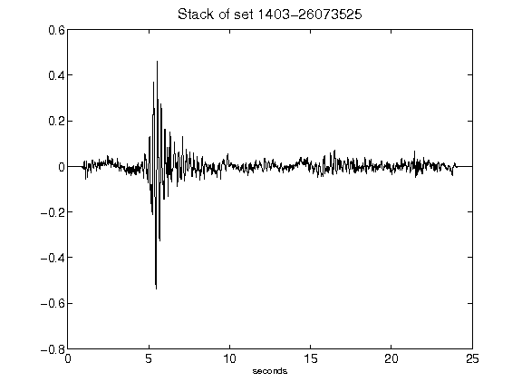](figures/1403-26073525_Stack.png)[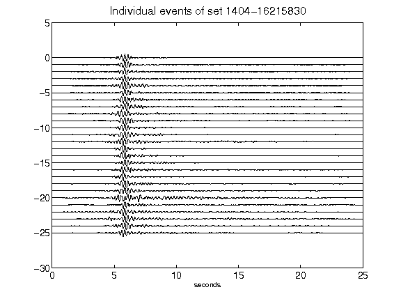](figures/1404-16215830_AllEv.png)[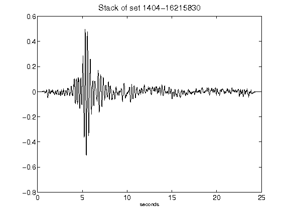](figures/1404-16215830_Stack.png)[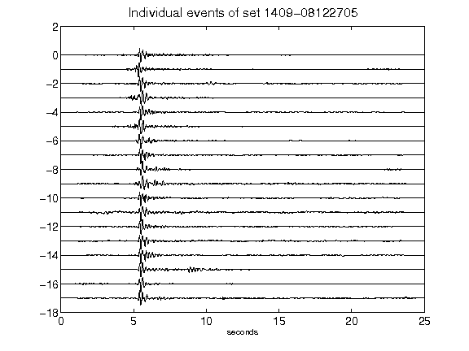](figures/1409-08122705_AllEv.png)[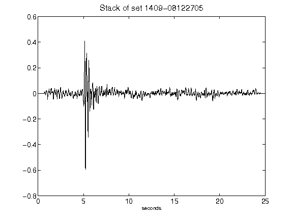](figures/1409-08122705_Stack.png)[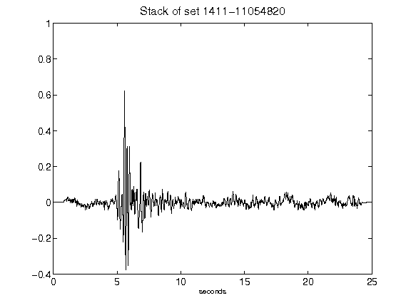](figures/1411-11054820_Stack.png)[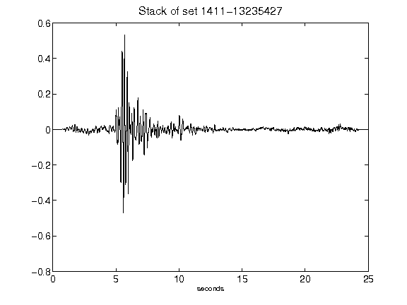](figures/1411-13235427_Stack.png)[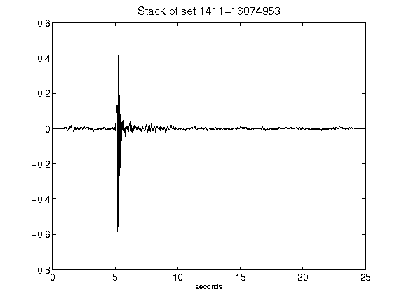](figures/1411-16074953_Stack.png)[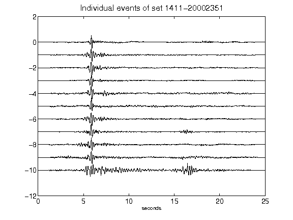](figures/1411-20002351_AllEv.png)[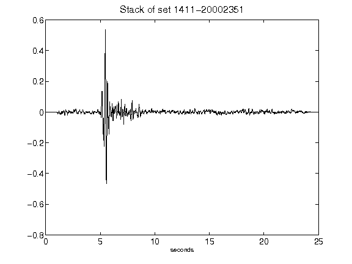](figures/1411-20002351_Stack.png)[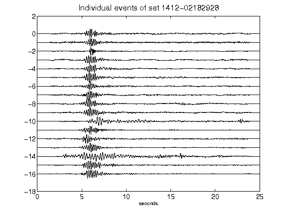](figures/1412-02182928_AllEv.png)[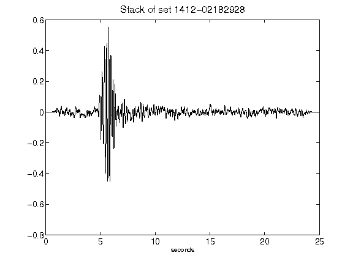](figures/1412-02182928_Stack.png)[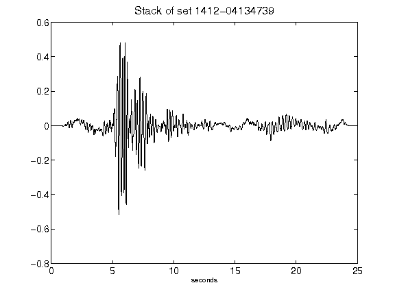](figures/1412-04134739_Stack.png)[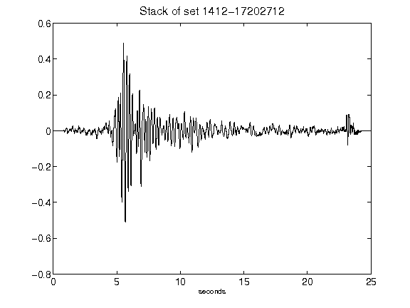](figures/1412-17202712_Stack.png)[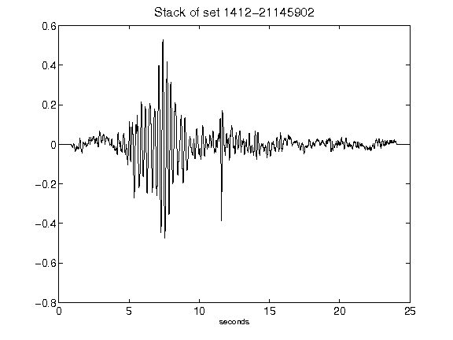](figures/1412-21145902_Stack.png)[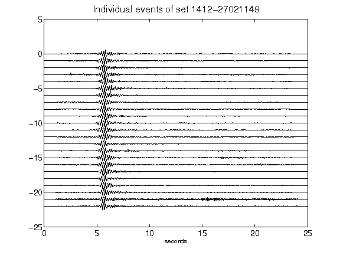](figures/1412-27021149_AllEv.png)[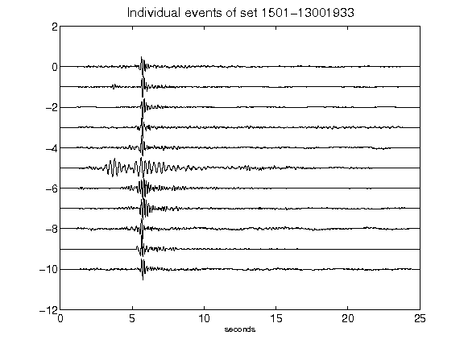](figures/1501-13001933_AllEv.png)[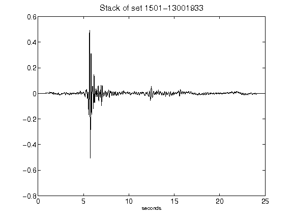](figures/1501-13001933_Stack.png)[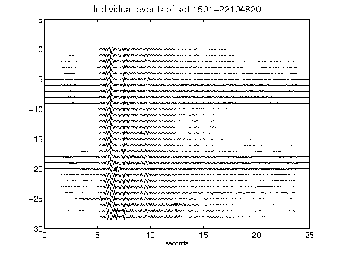](figures/1501-22104820_AllEv.png)[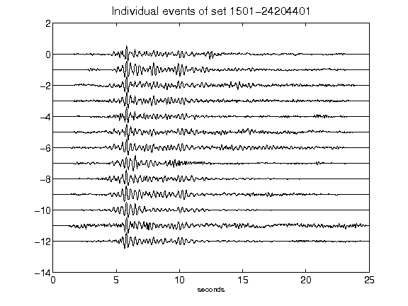](figures/1501-24204401_AllEv.png)[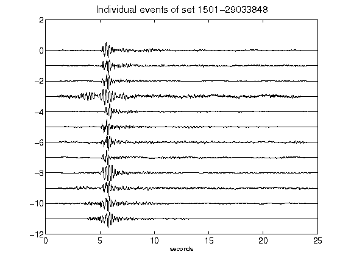](figures/1501-29033848_AllEv.png)