# Repeating Earthquake Activity at RCM

## Waveforms
[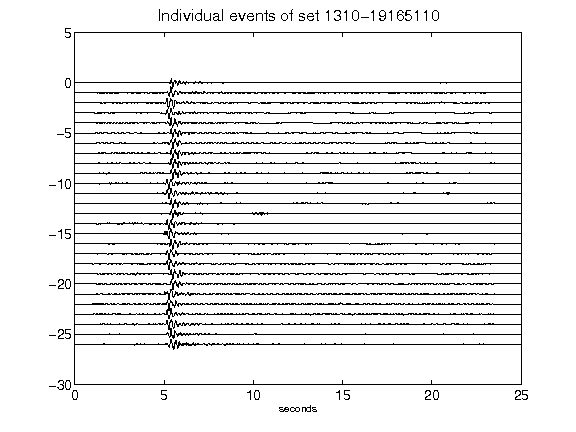](figures/1310-19165110_AllEv.png)[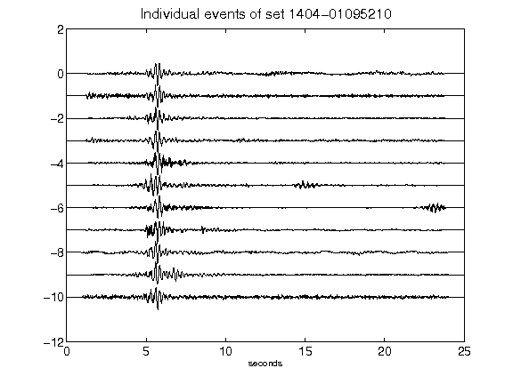](figures/1404-01095210_AllEv.png)[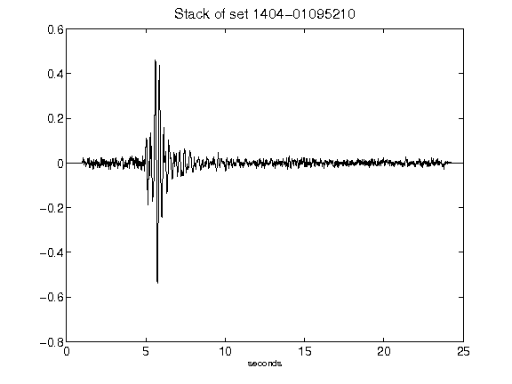](figures/1404-01095210_Stack.png)[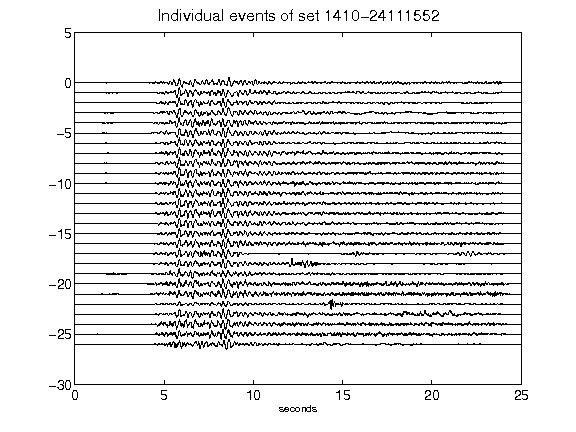](figures/1410-24111552_AllEv.png)[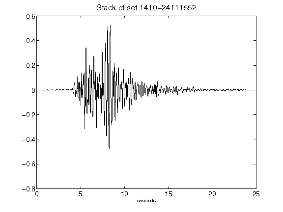](figures/1410-24111552_Stack.png)[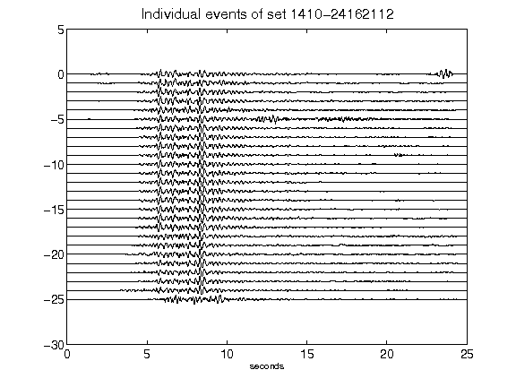](figures/1410-24162112_AllEv.png)[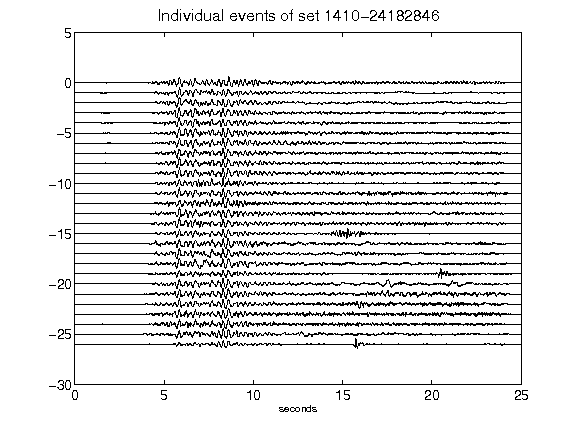](figures/1410-24182846_AllEv.png)[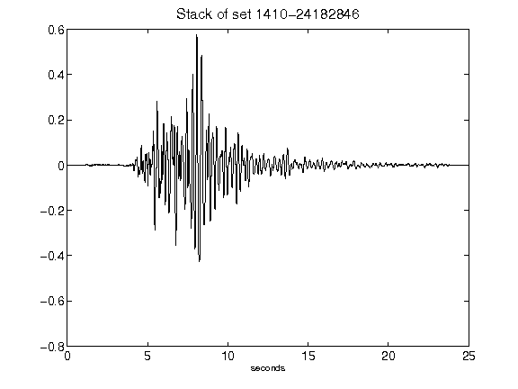](figures/1410-24182846_Stack.png)[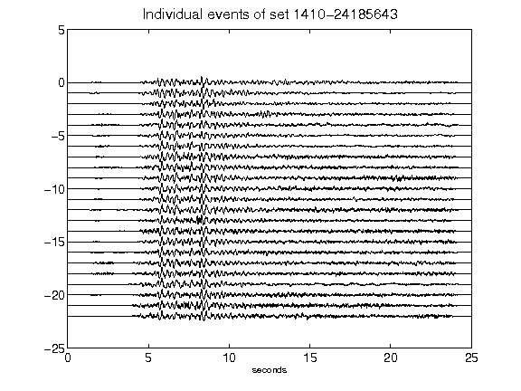](figures/1410-24185643_AllEv.png)[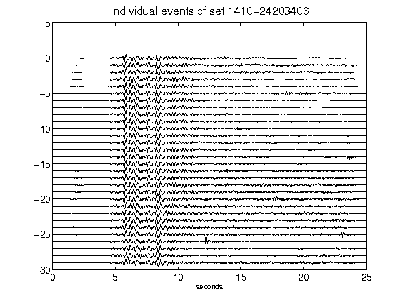](figures/1410-24203406_AllEv.png)[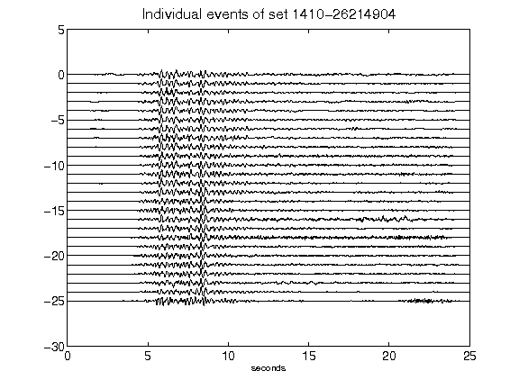](figures/1410-26214904_AllEv.png)[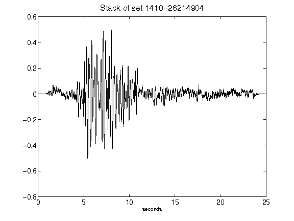](figures/1410-26214904_Stack.png)[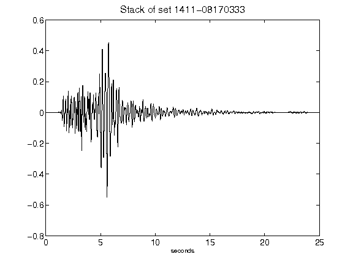](figures/1411-08170333_Stack.png)[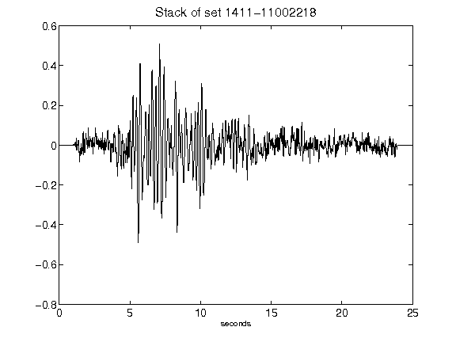](figures/1411-11002218_Stack.png)[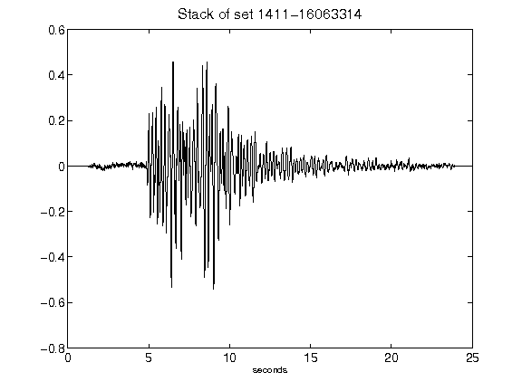](figures/1411-16063314_Stack.png)[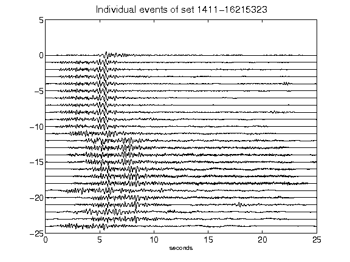](figures/1411-16215323_AllEv.png)[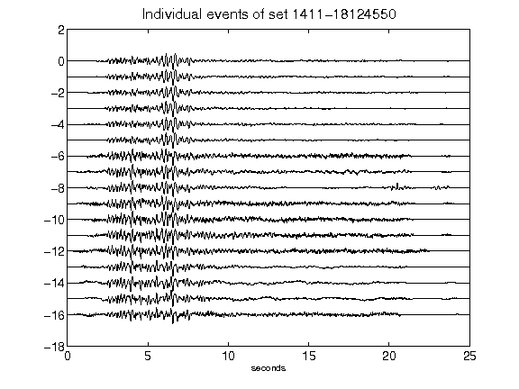](figures/1411-18124550_AllEv.png)[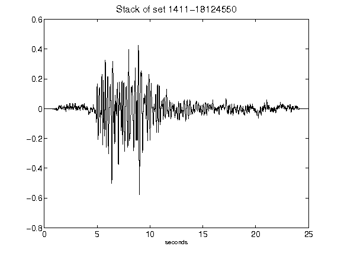](figures/1411-18124550_Stack.png)[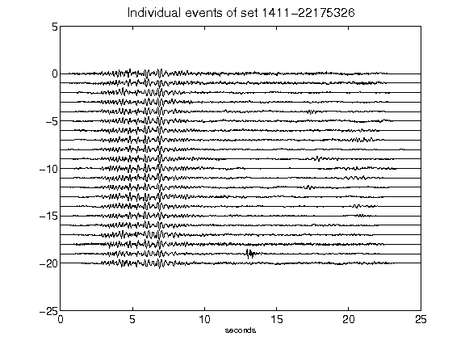](figures/1411-22175326_AllEv.png)[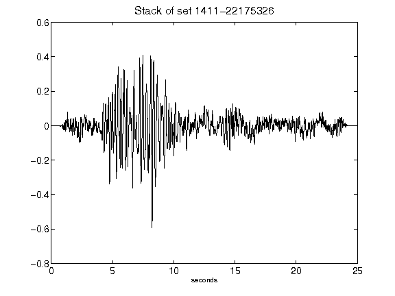](figures/1411-22175326_Stack.png)