# Repeating Earthquake Activity at RCM

## Waveforms
[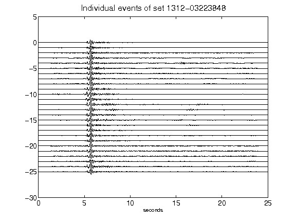](figures/1312-03223848_AllEv.png)[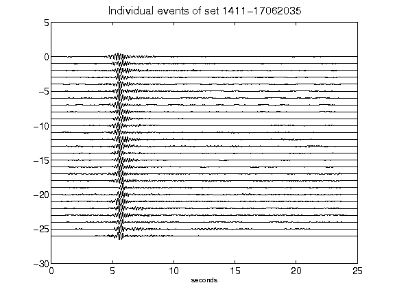](figures/1411-17062035_AllEv.png)[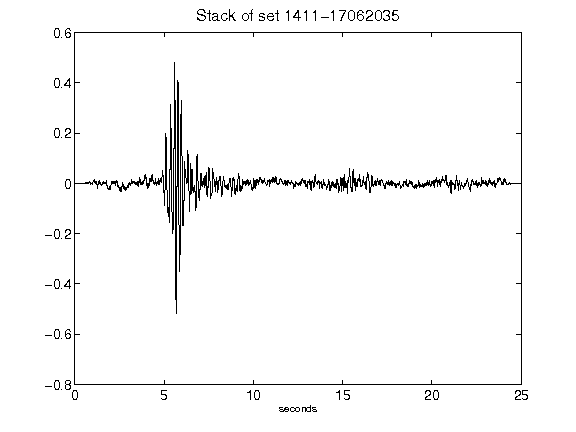](figures/1411-17062035_Stack.png)[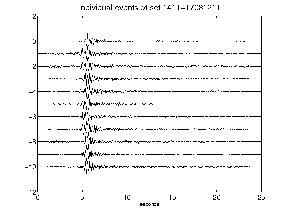](figures/1411-17081211_AllEv.png)[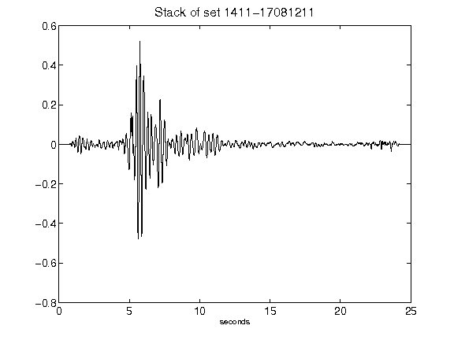](figures/1411-17081211_Stack.png)[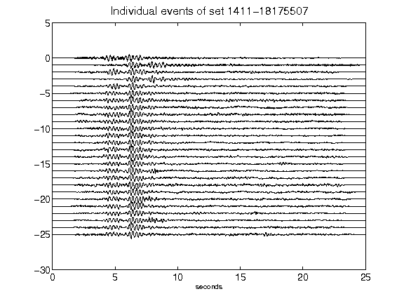](figures/1411-18175507_AllEv.png)[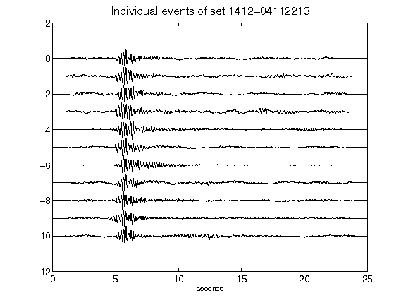](figures/1412-04112213_AllEv.png)[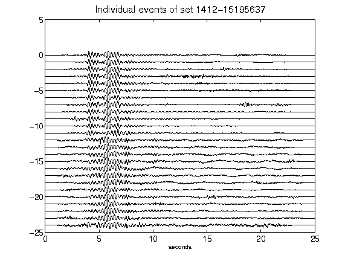](figures/1412-15195637_AllEv.png)[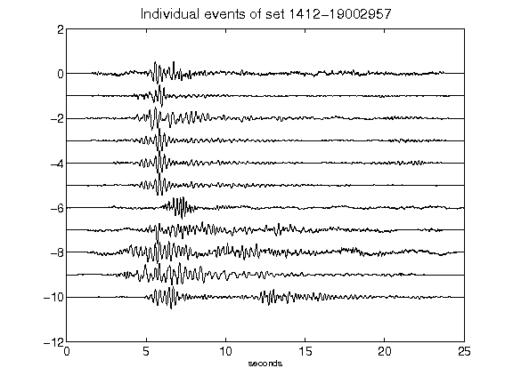](figures/1412-19002957_AllEv.png)[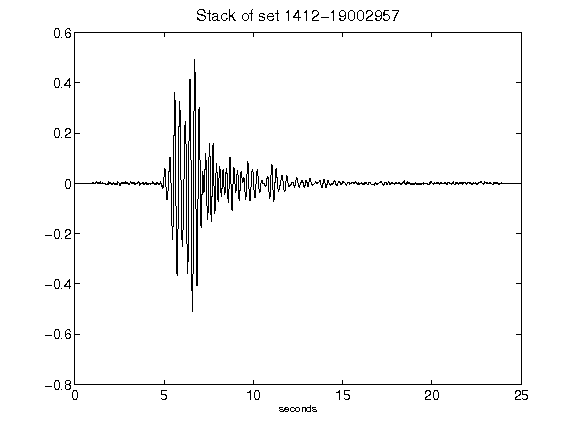](figures/1412-19002957_Stack.png)[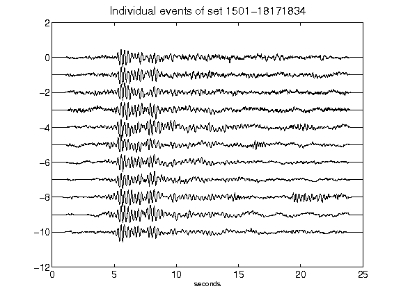](figures/1501-18171834_AllEv.png)[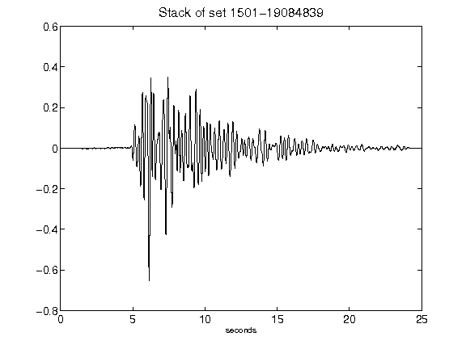](figures/1501-19084839_Stack.png)[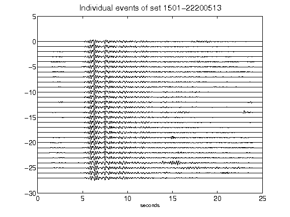](figures/1501-22200513_AllEv.png)[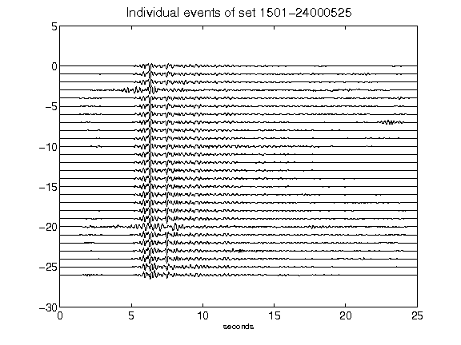](figures/1501-24000525_AllEv.png)[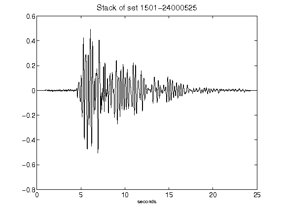](figures/1501-24000525_Stack.png)[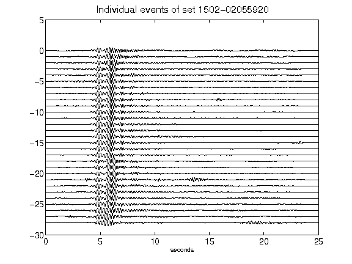](figures/1502-02055920_AllEv.png)[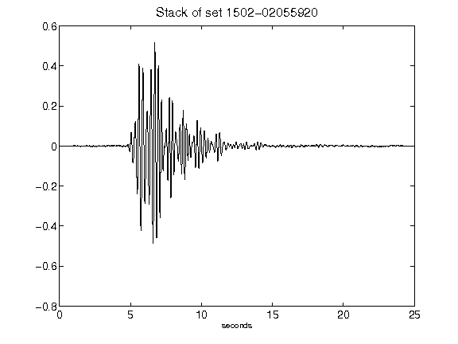](figures/1502-02055920_Stack.png)