# Repeating Earthquake Activity at RCM

## Waveforms
[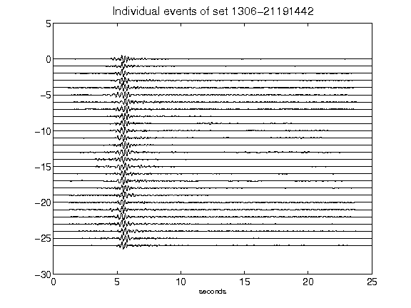](figures/1306-21191442_AllEv.png)[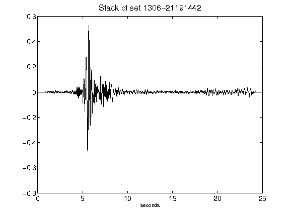](figures/1306-21191442_Stack.png)[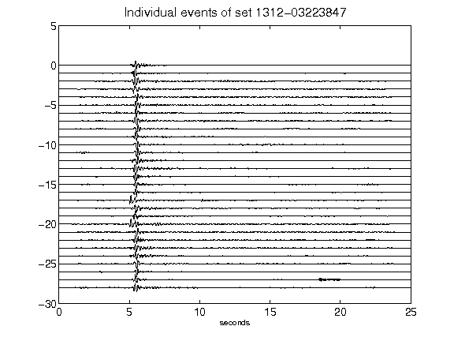](figures/1312-03223847_AllEv.png)[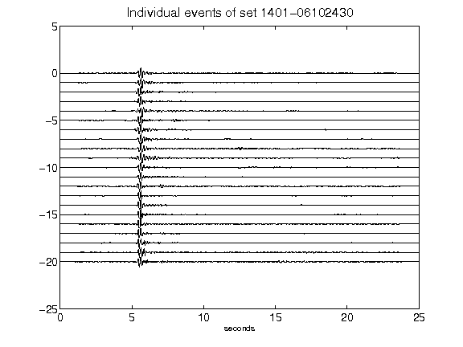](figures/1401-06102430_AllEv.png)[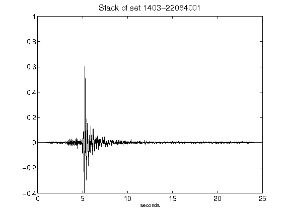](figures/1403-22064001_Stack.png)[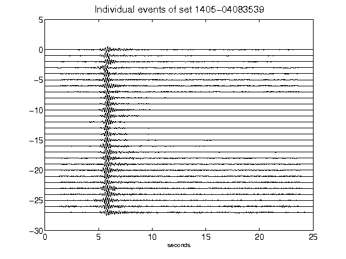](figures/1405-04083539_AllEv.png)[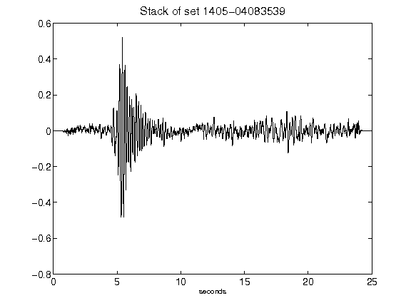](figures/1405-04083539_Stack.png)[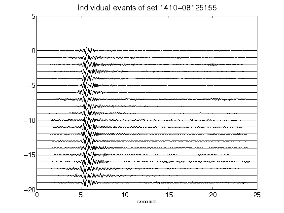](figures/1410-08125155_AllEv.png)[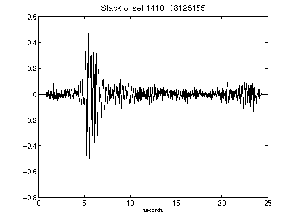](figures/1410-08125155_Stack.png)[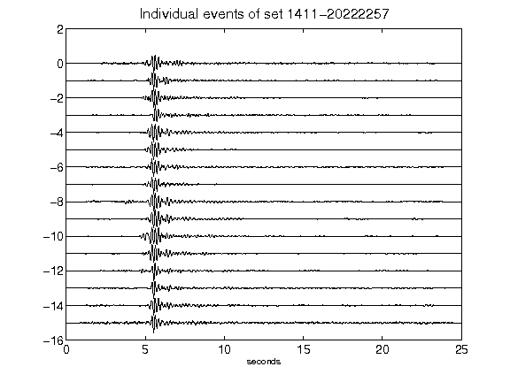](figures/1411-20222257_AllEv.png)[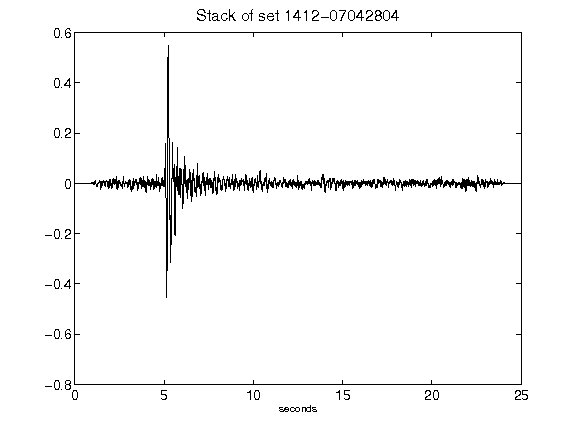](figures/1412-07042804_Stack.png)[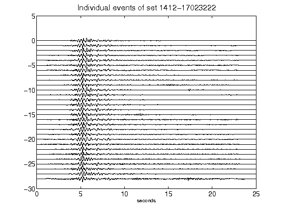](figures/1412-17023222_AllEv.png)[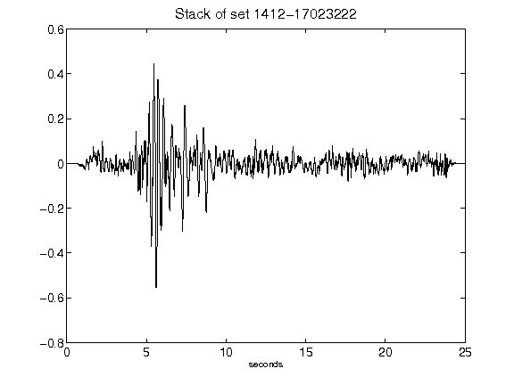](figures/1412-17023222_Stack.png)[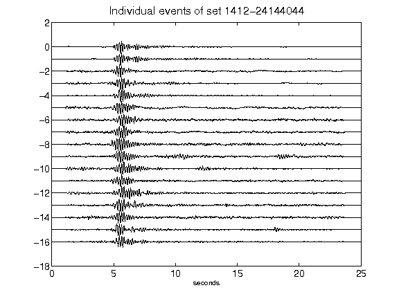](figures/1412-24144044_AllEv.png)[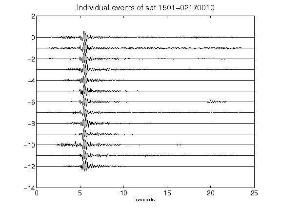](figures/1501-02170010_AllEv.png)[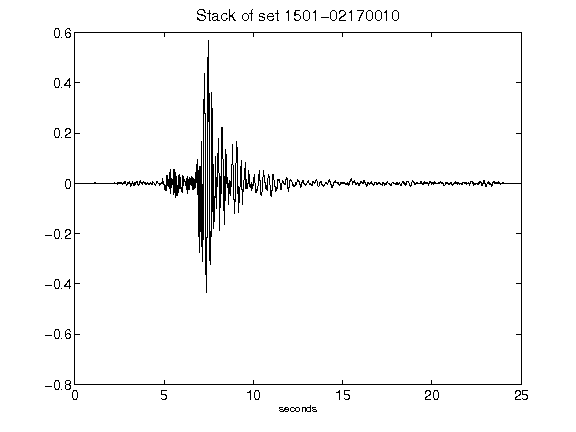](figures/1501-02170010_Stack.png)[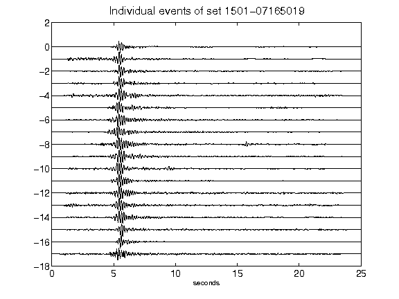](figures/1501-07165019_AllEv.png)[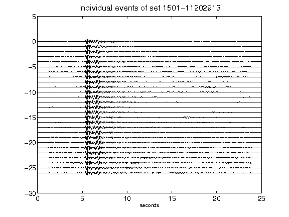](figures/1501-11202913_AllEv.png)[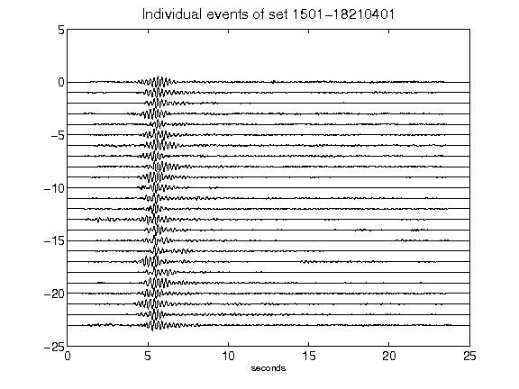](figures/1501-18210401_AllEv.png)[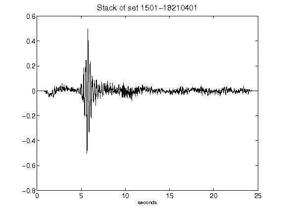](figures/1501-18210401_Stack.png)[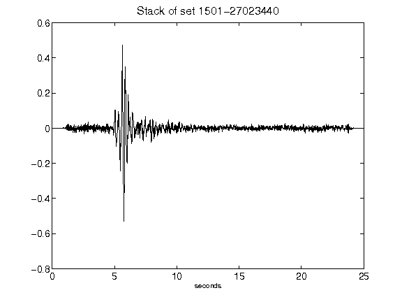](figures/1501-27023440_Stack.png)[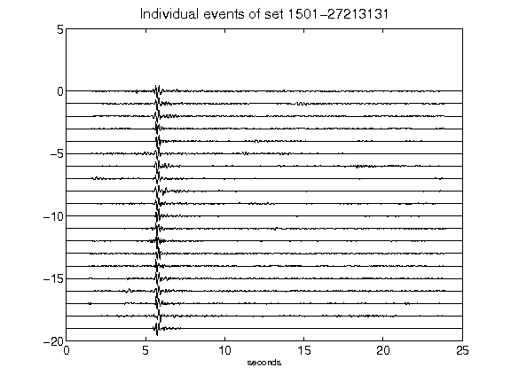](figures/1501-27213131_AllEv.png)[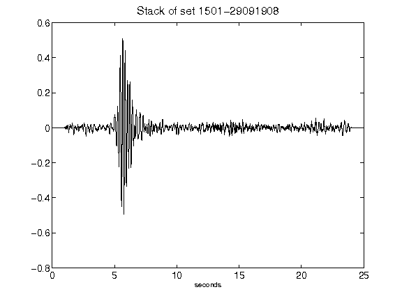](figures/1501-29091908_Stack.png)[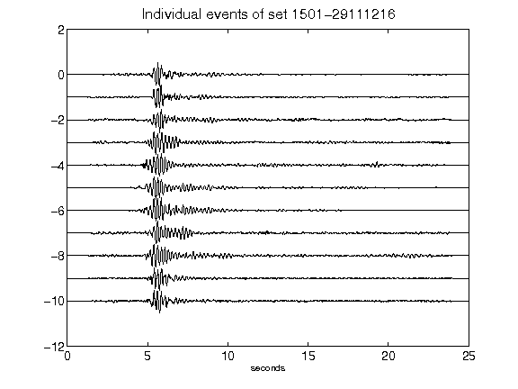](figures/1501-29111216_AllEv.png)[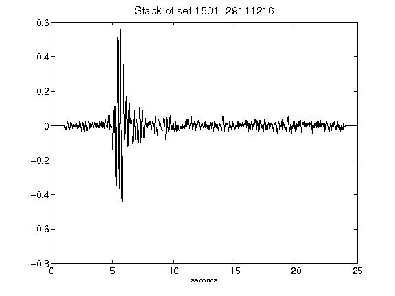](figures/1501-29111216_Stack.png)[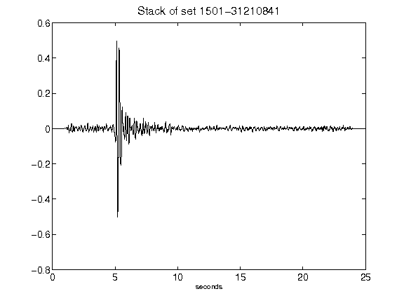](figures/1501-31210841_Stack.png)[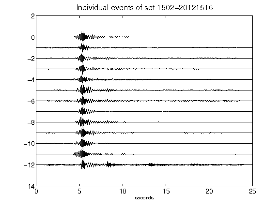](figures/1502-20121516_AllEv.png)[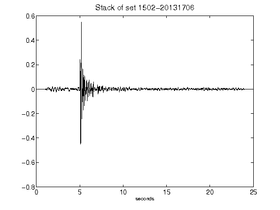](figures/1502-20131706_Stack.png)[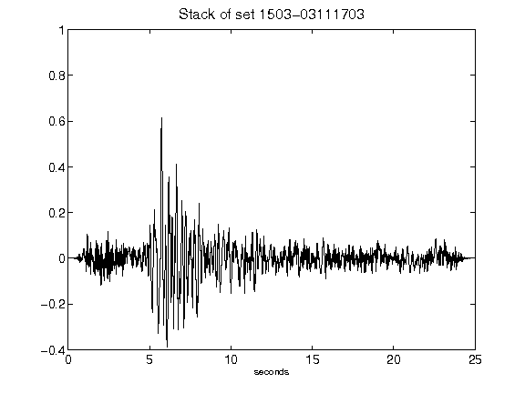](figures/1503-03111703_Stack.png)[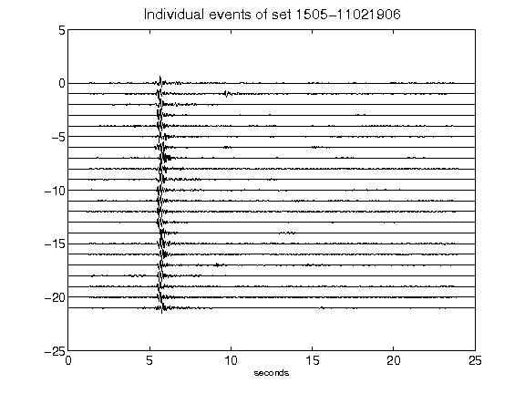](figures/1505-11021906_AllEv.png)[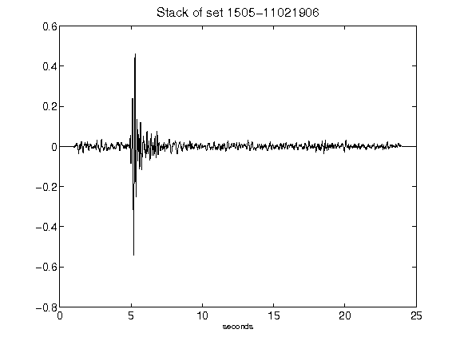](figures/1505-11021906_Stack.png)[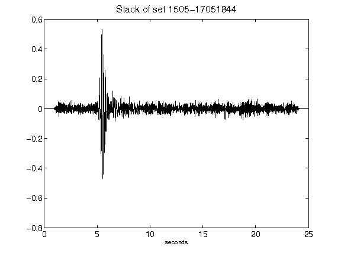](figures/1505-17051844_Stack.png)[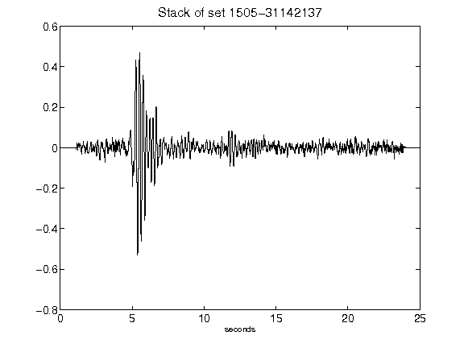](figures/1505-31142137_Stack.png)