# Repeating Earthquake Activity at RCM

## Waveforms
[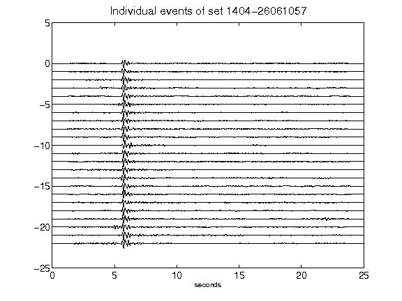](figures/1404-26061057_AllEv.png)[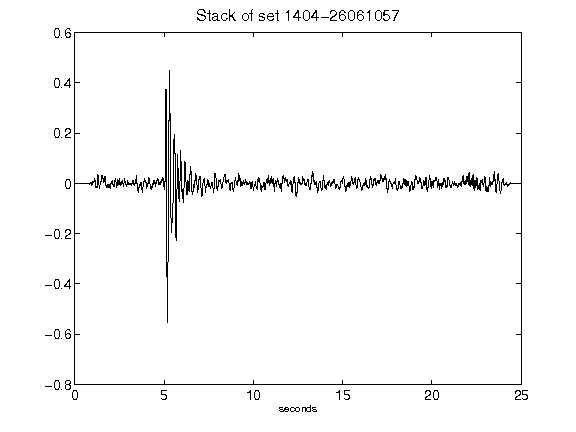](figures/1404-26061057_Stack.png)[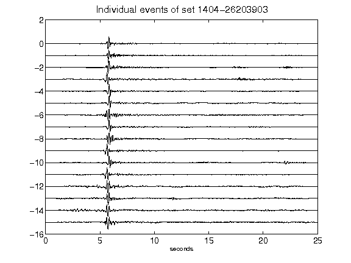](figures/1404-26203903_AllEv.png)[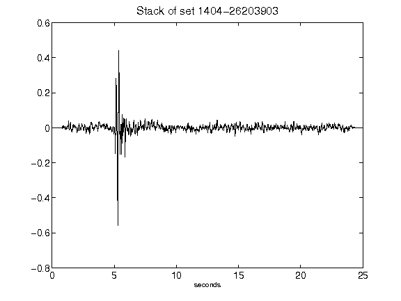](figures/1404-26203903_Stack.png)[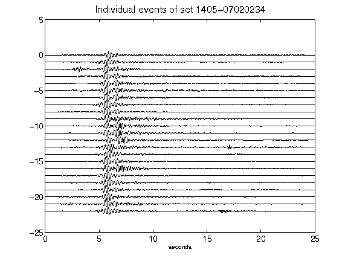](figures/1405-07020234_AllEv.png)[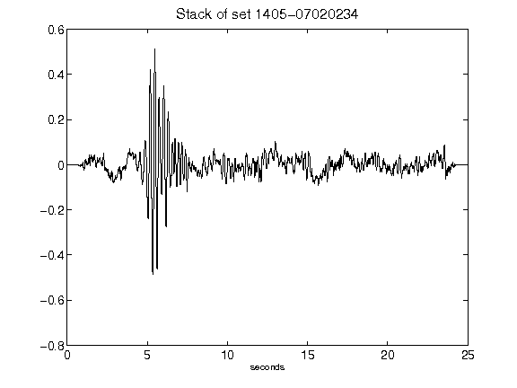](figures/1405-07020234_Stack.png)[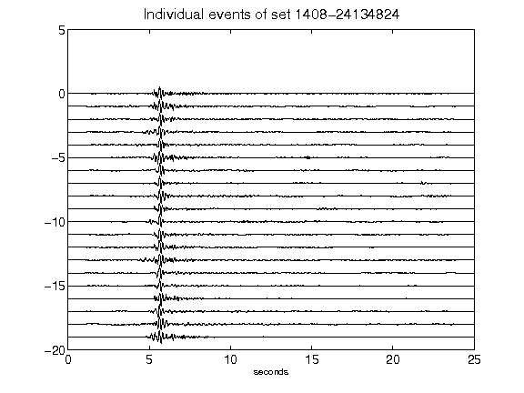](figures/1408-24134824_AllEv.png)[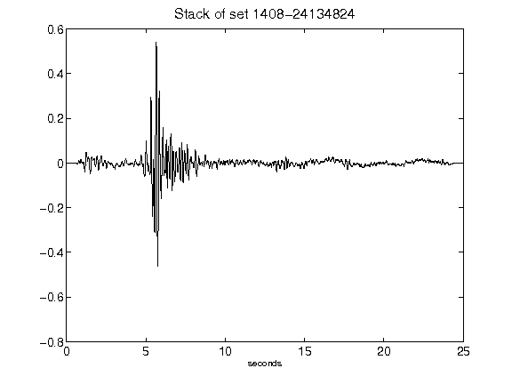](figures/1408-24134824_Stack.png)[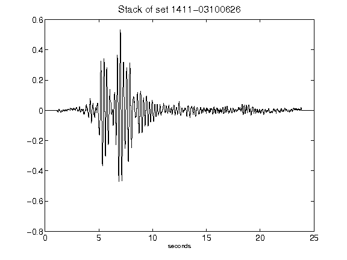](figures/1411-03100626_Stack.png)[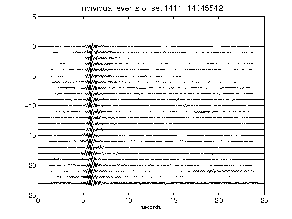](figures/1411-14045542_AllEv.png)[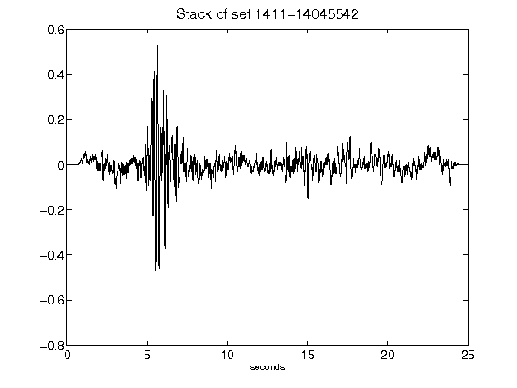](figures/1411-14045542_Stack.png)[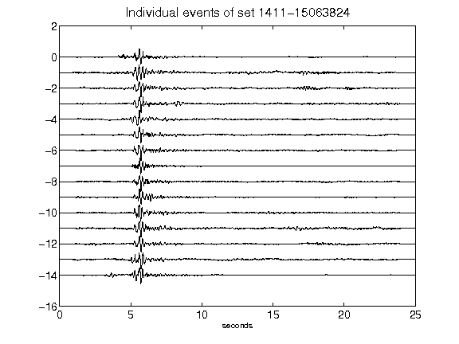](figures/1411-15063824_AllEv.png)[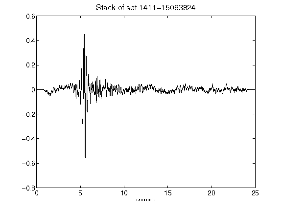](figures/1411-15063824_Stack.png)[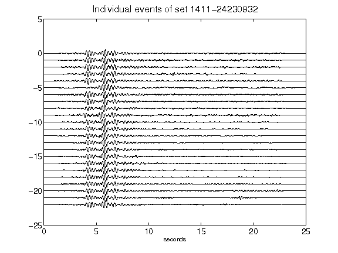](figures/1411-24230932_AllEv.png)[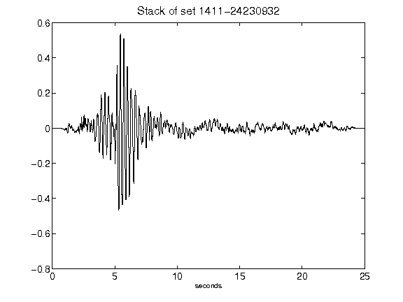](figures/1411-24230932_Stack.png)[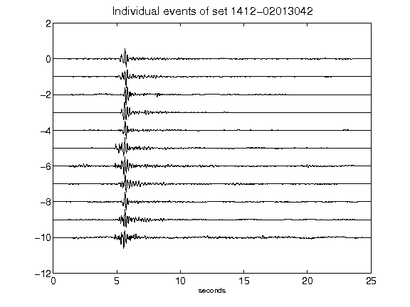](figures/1412-02013042_AllEv.png)[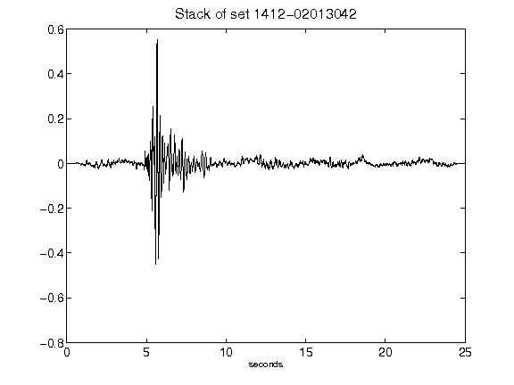](figures/1412-02013042_Stack.png)[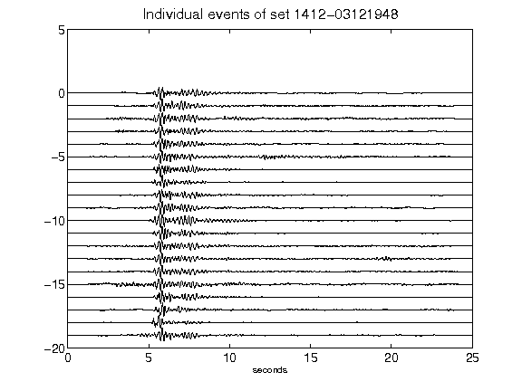](figures/1412-03121948_AllEv.png)[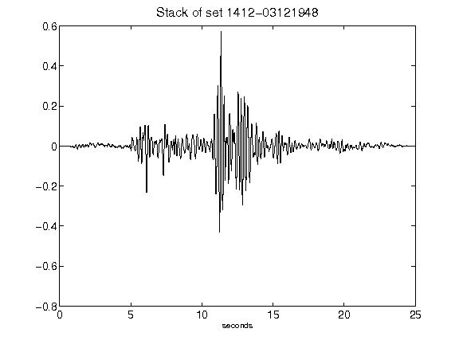](figures/1412-03121948_Stack.png)