# Repeating Earthquake Activity at RCM

## Waveforms
[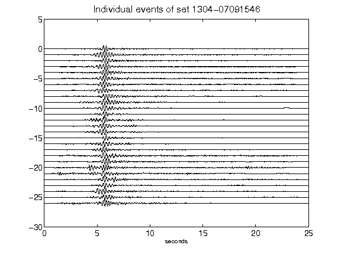](figures/1304-07091546_AllEv.png)[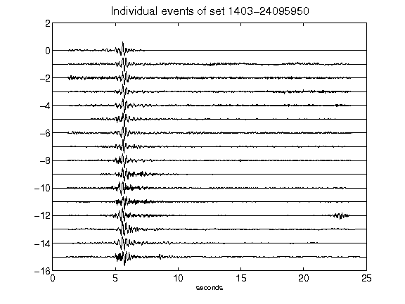](figures/1403-24095950_AllEv.png)[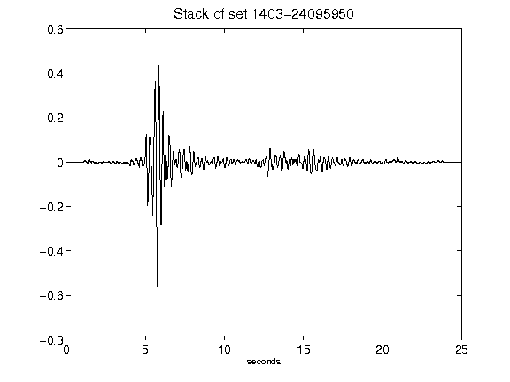](figures/1403-24095950_Stack.png)[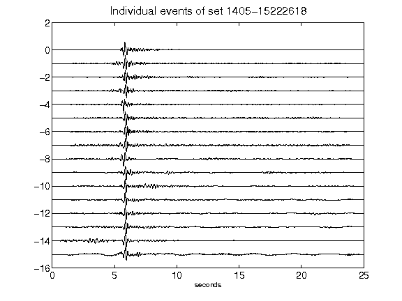](figures/1405-15222618_AllEv.png)[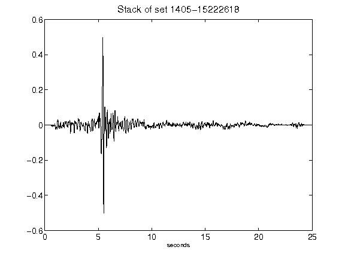](figures/1405-15222618_Stack.png)[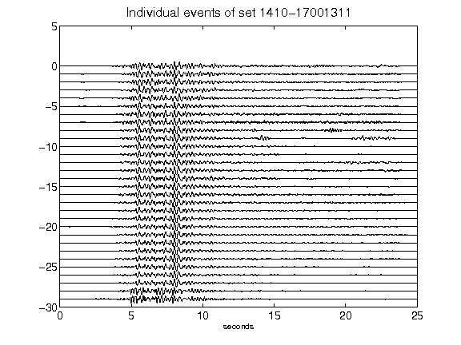](figures/1410-17001311_AllEv.png)[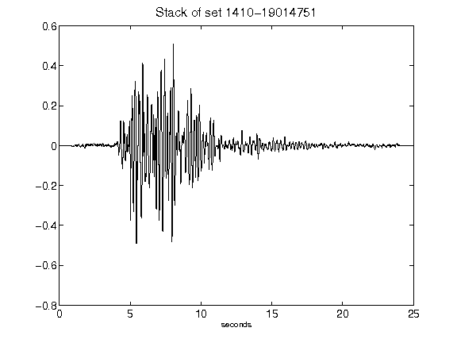](figures/1410-19014751_Stack.png)[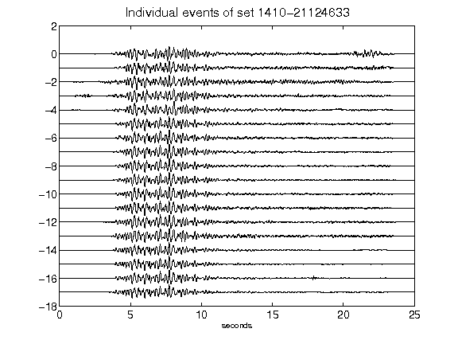](figures/1410-21124633_AllEv.png)[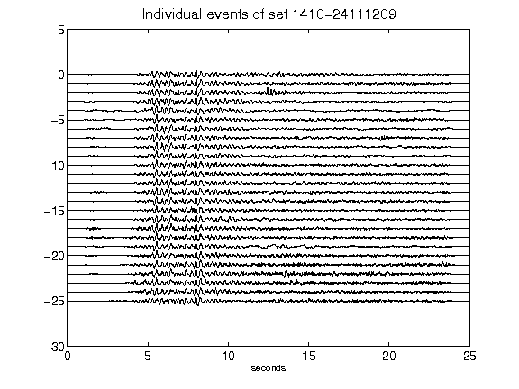](figures/1410-24111209_AllEv.png)[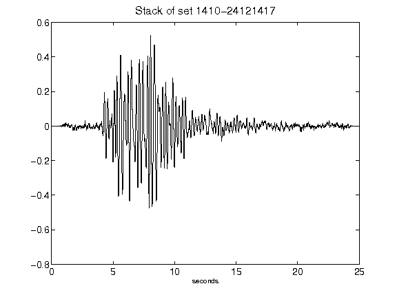](figures/1410-24121417_Stack.png)[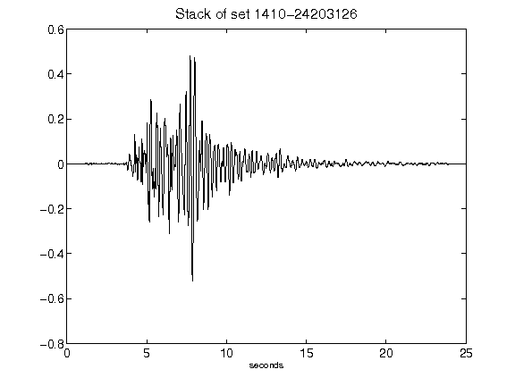](figures/1410-24203126_Stack.png)[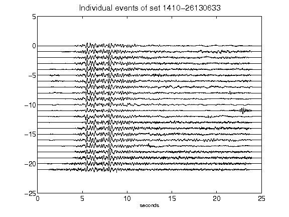](figures/1410-26130633_AllEv.png)[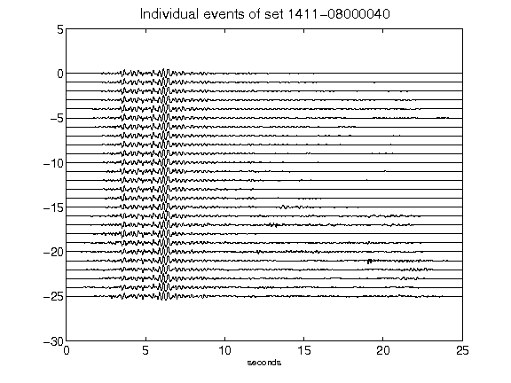](figures/1411-08000040_AllEv.png)[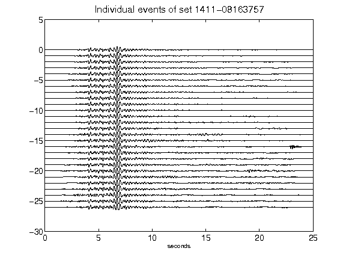](figures/1411-08163757_AllEv.png)