# Repeating Earthquake Activity at RCM

## Waveforms
[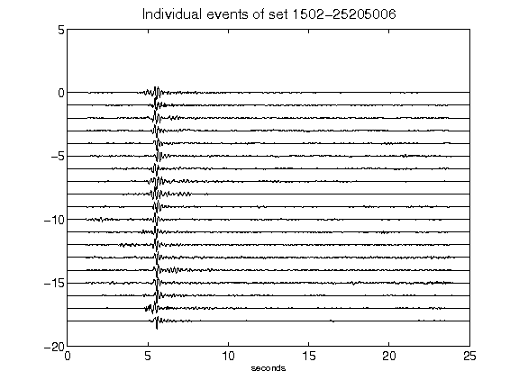](figures/1502-25205006_AllEv.png)[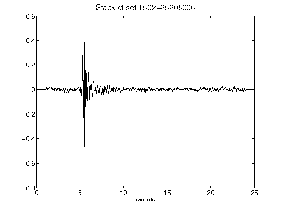](figures/1502-25205006_Stack.png)[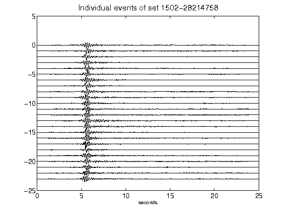](figures/1502-28214758_AllEv.png)[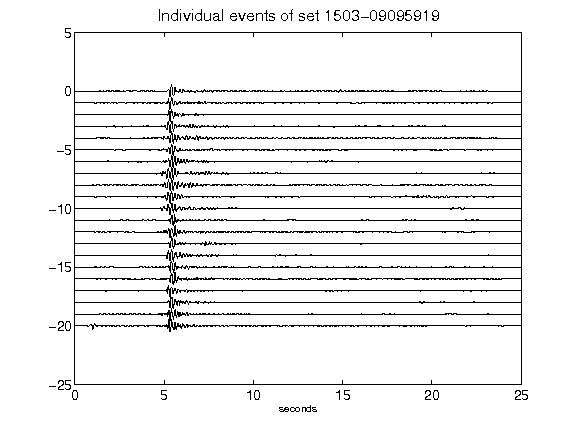](figures/1503-09095919_AllEv.png)[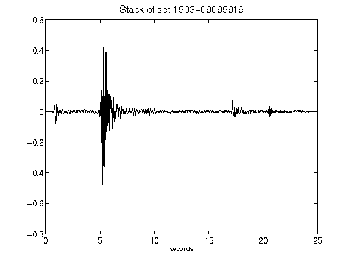](figures/1503-09095919_Stack.png)[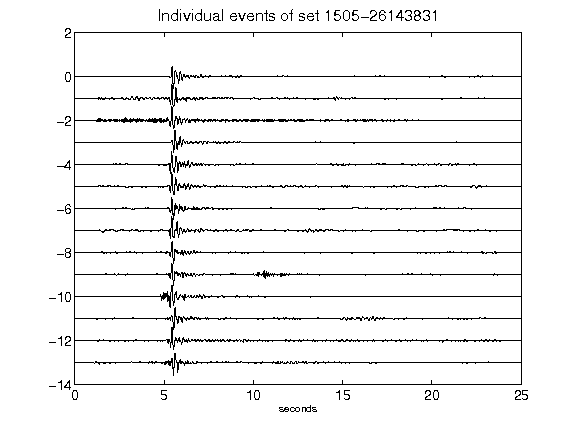](figures/1505-26143831_AllEv.png)[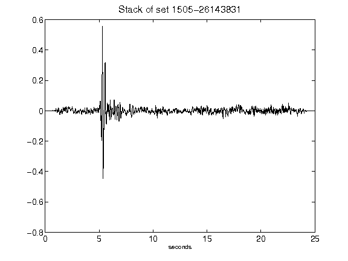](figures/1505-26143831_Stack.png)[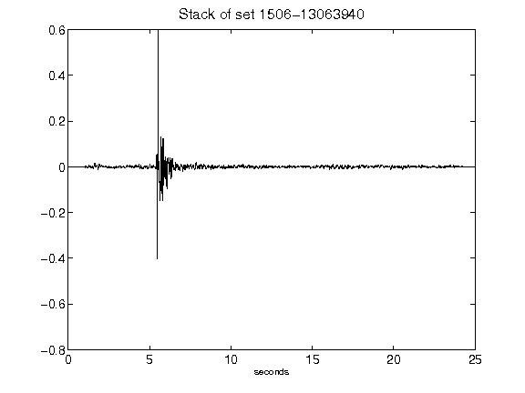](figures/1506-13063940_Stack.png)[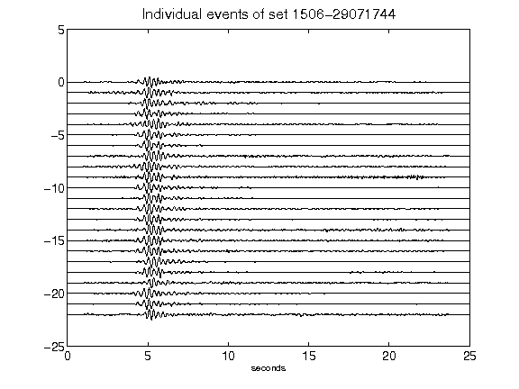](figures/1506-29071744_AllEv.png)[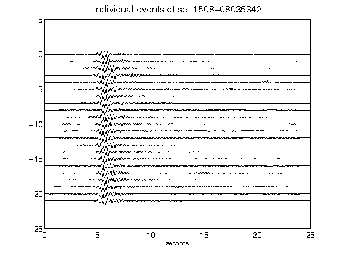](figures/1508-08035342_AllEv.png)[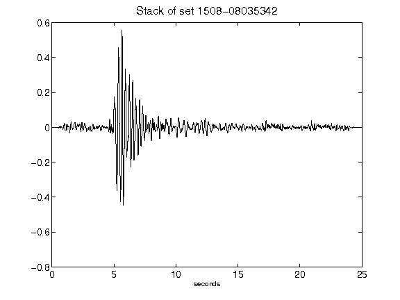](figures/1508-08035342_Stack.png)[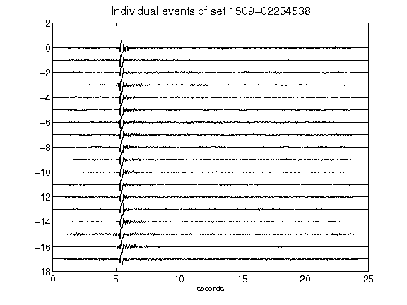](figures/1509-02234538_AllEv.png)[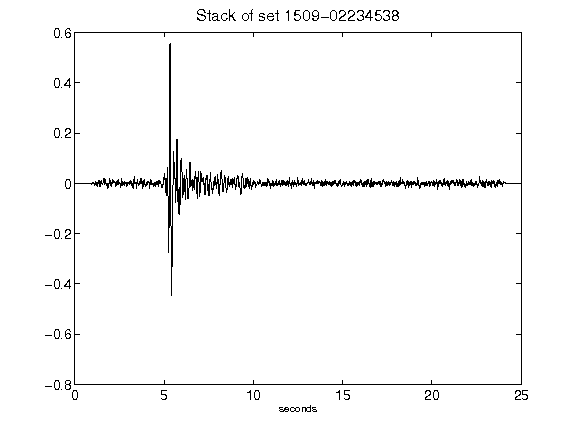](figures/1509-02234538_Stack.png)[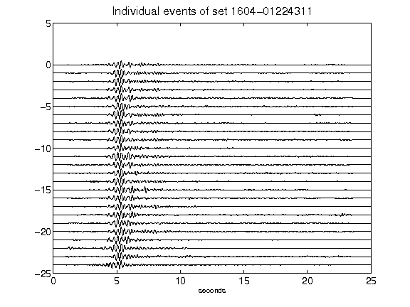](figures/1604-01224311_AllEv.png)[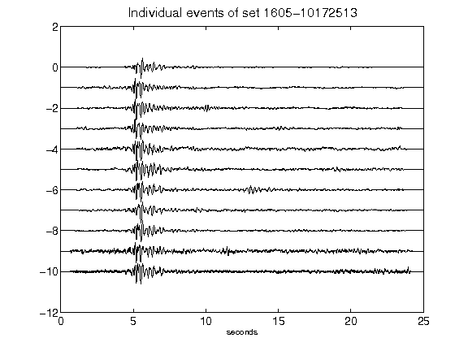](figures/1605-10172513_AllEv.png)[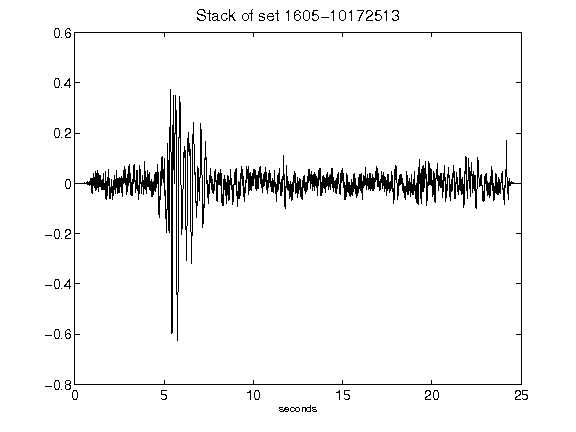](figures/1605-10172513_Stack.png)[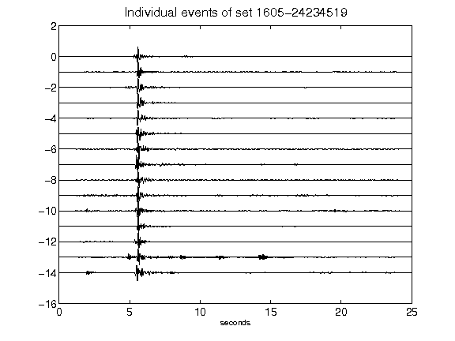](figures/1605-24234519_AllEv.png)[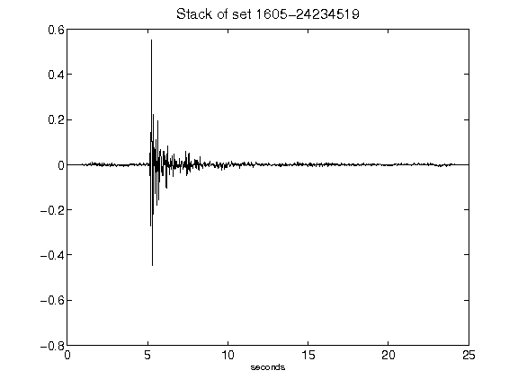](figures/1605-24234519_Stack.png)[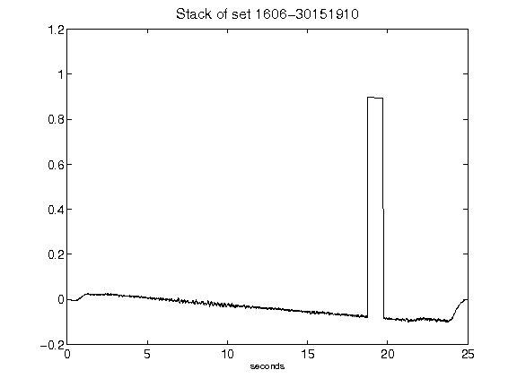](figures/1606-30151910_Stack.png)