# Repeating Earthquake Activity at RCM

## Waveforms
[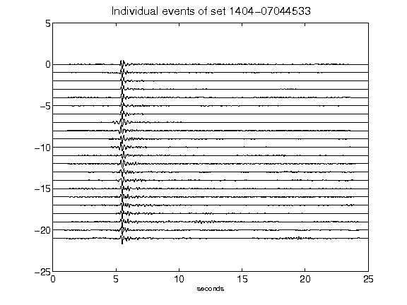](figures/1404-07044533_AllEv.png)[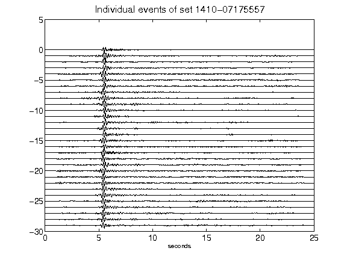](figures/1410-07175557_AllEv.png)[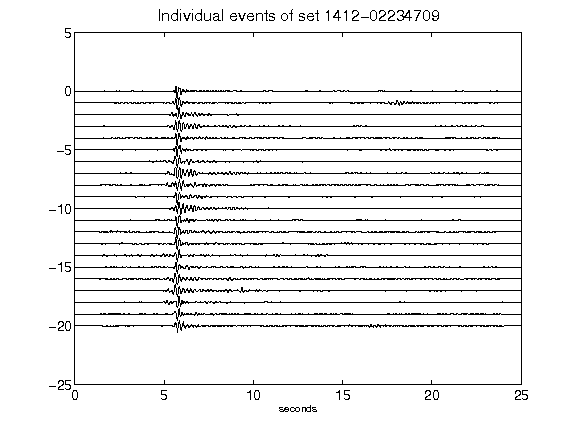](figures/1412-02234709_AllEv.png)[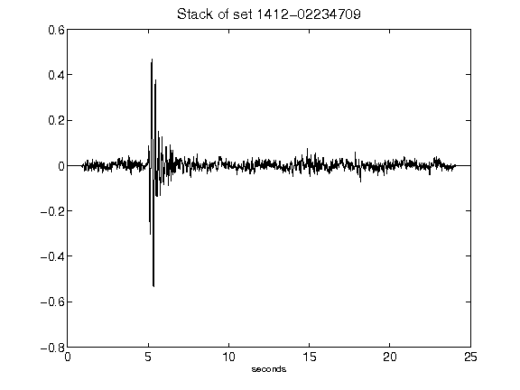](figures/1412-02234709_Stack.png)[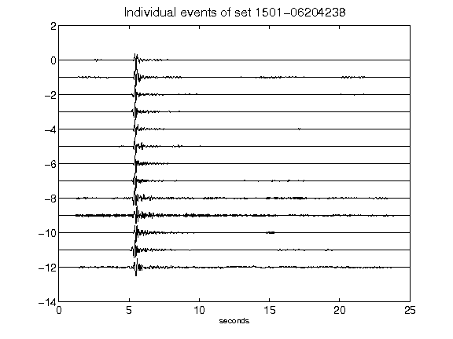](figures/1501-06204238_AllEv.png)[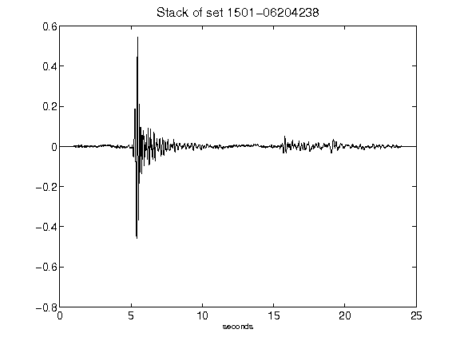](figures/1501-06204238_Stack.png)[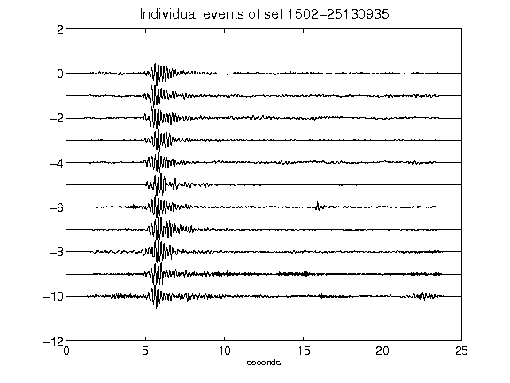](figures/1502-25130935_AllEv.png)[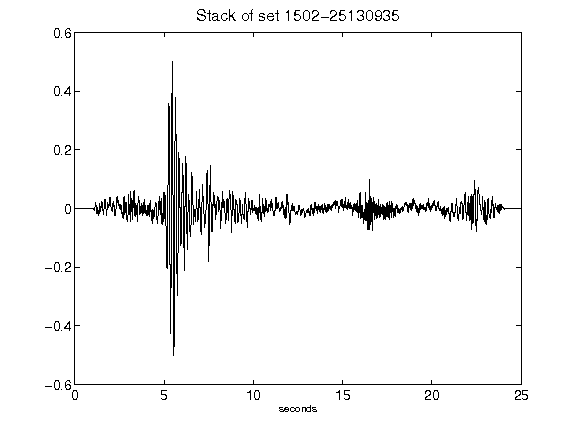](figures/1502-25130935_Stack.png)[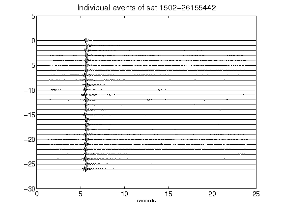](figures/1502-26155442_AllEv.png)[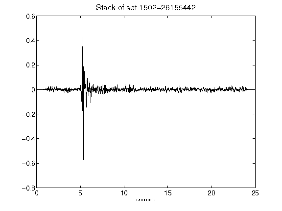](figures/1502-26155442_Stack.png)[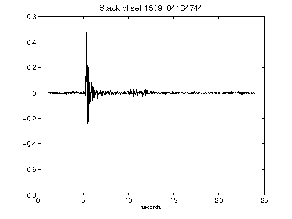](figures/1509-04134744_Stack.png)[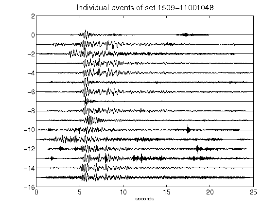](figures/1509-11001048_AllEv.png)[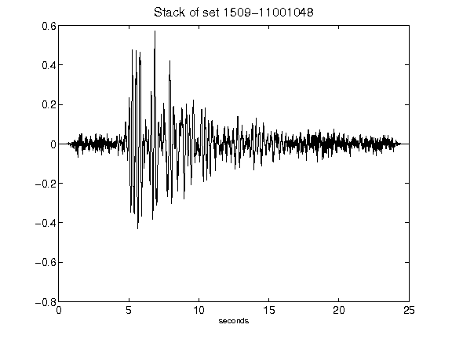](figures/1509-11001048_Stack.png)