# Repeating Earthquake Activity at RCM

## Waveforms
[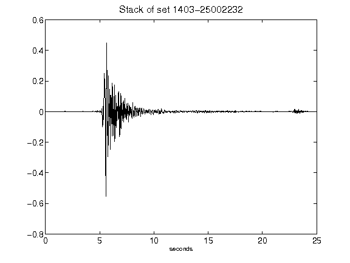](figures/1403-25002232_Stack.png)[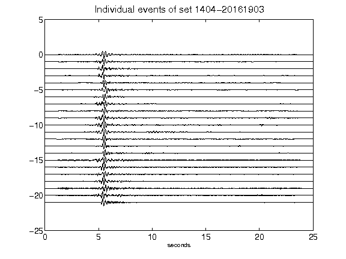](figures/1404-20161903_AllEv.png)[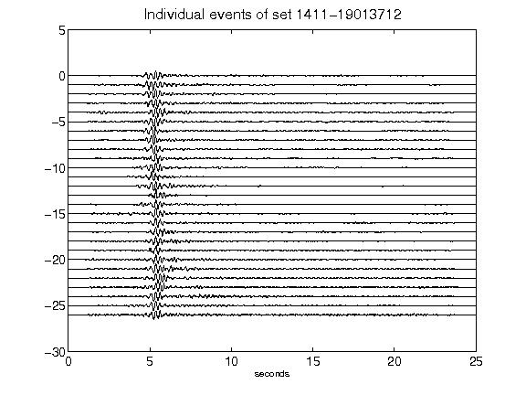](figures/1411-19013712_AllEv.png)[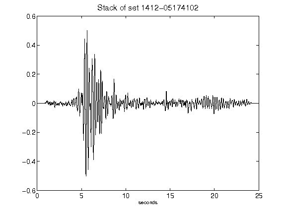](figures/1412-05174102_Stack.png)[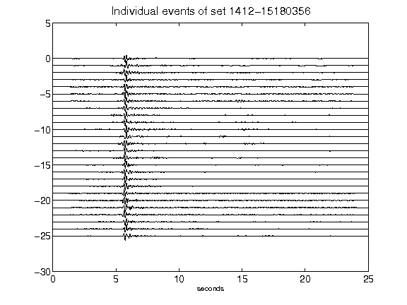](figures/1412-15180356_AllEv.png)[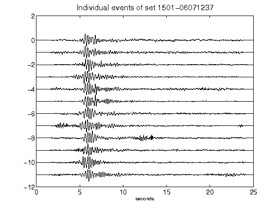](figures/1501-06071237_AllEv.png)[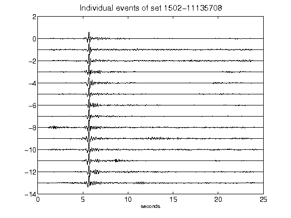](figures/1502-11135708_AllEv.png)[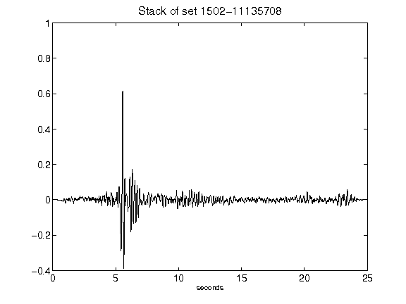](figures/1502-11135708_Stack.png)[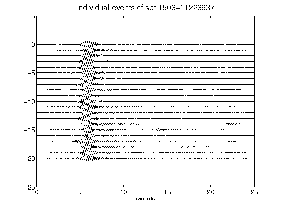](figures/1503-11223937_AllEv.png)[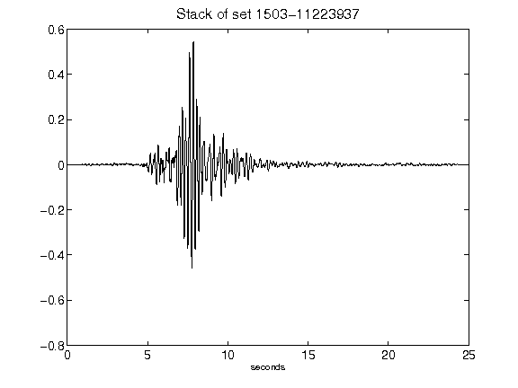](figures/1503-11223937_Stack.png)[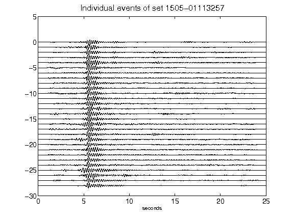](figures/1505-01113257_AllEv.png)[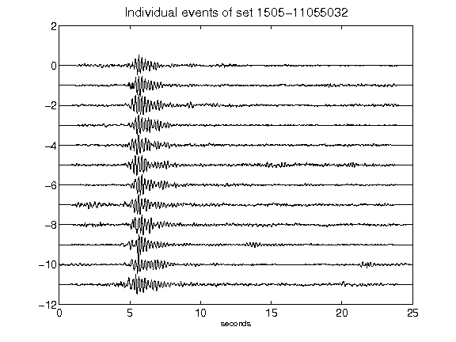](figures/1505-11055032_AllEv.png)[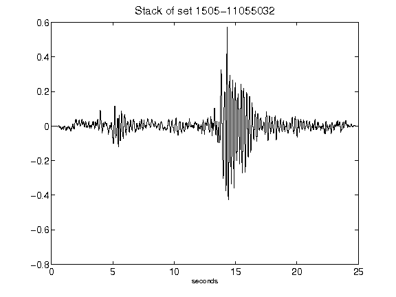](figures/1505-11055032_Stack.png)