# Repeating Earthquake Activity at RCM

## Waveforms
[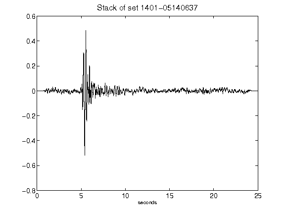](figures/1401-05140637_Stack.png)[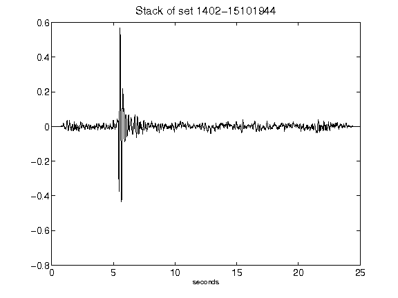](figures/1402-15101944_Stack.png)[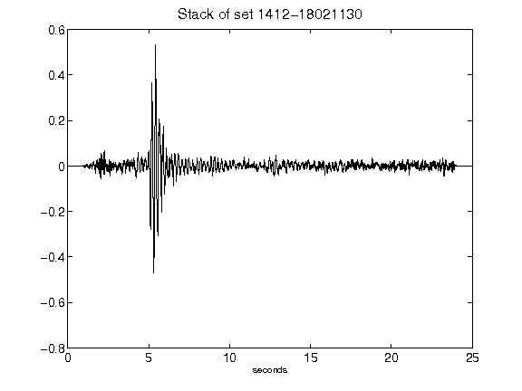](figures/1412-18021130_Stack.png)[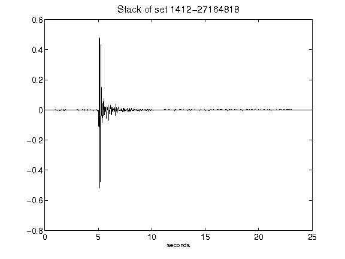](figures/1412-27164818_Stack.png)[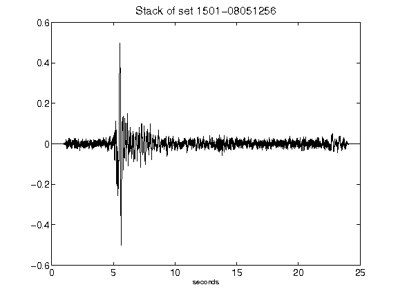](figures/1501-08051256_Stack.png)[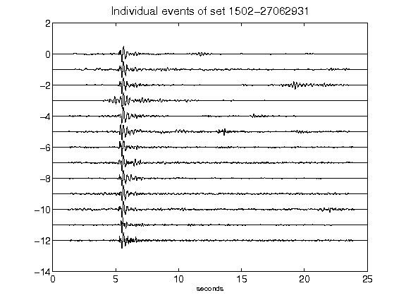](figures/1502-27062931_AllEv.png)[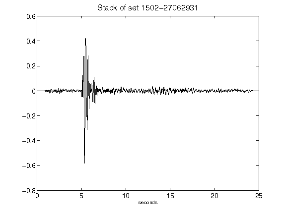](figures/1502-27062931_Stack.png)[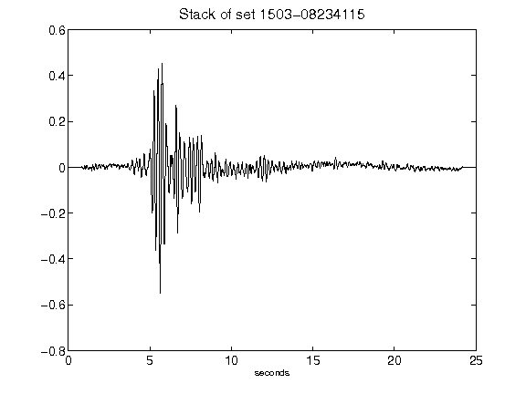](figures/1503-08234115_Stack.png)[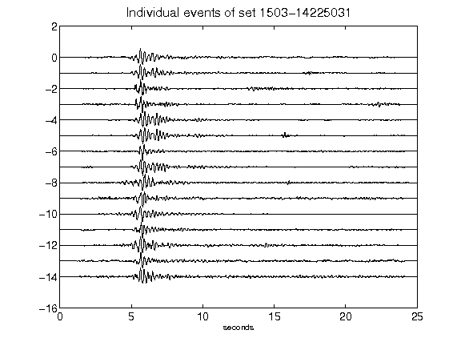](figures/1503-14225031_AllEv.png)[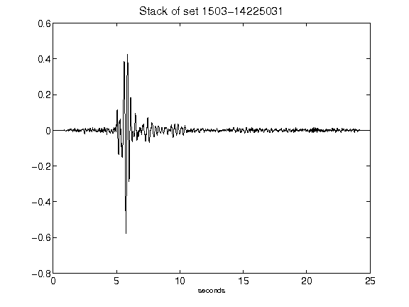](figures/1503-14225031_Stack.png)[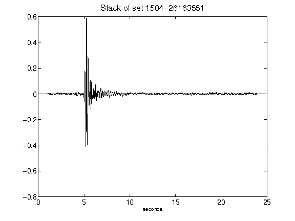](figures/1504-26163551_Stack.png)[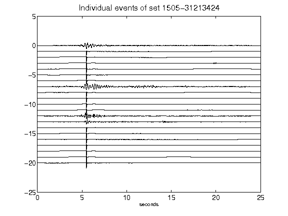](figures/1505-31213424_AllEv.png)[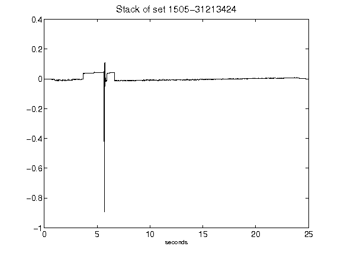](figures/1505-31213424_Stack.png)