# Repeating Earthquake Activity at RCM

## Waveforms
[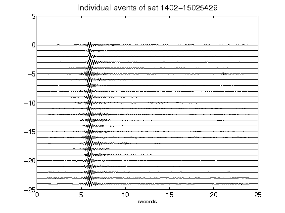](figures/1402-15025429_AllEv.png)[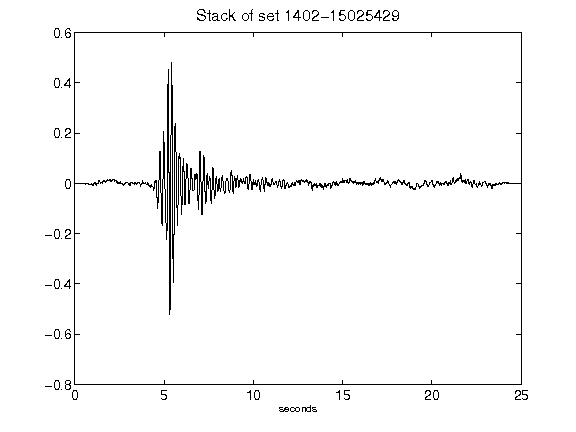](figures/1402-15025429_Stack.png)[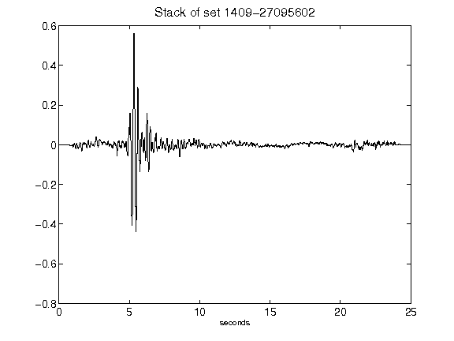](figures/1409-27095602_Stack.png)[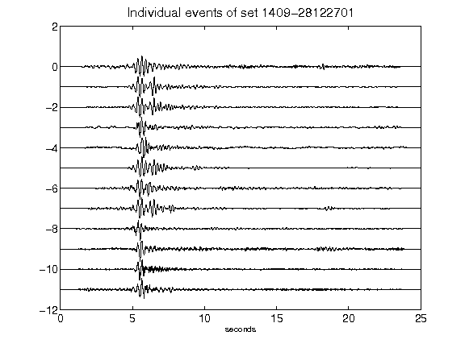](figures/1409-28122701_AllEv.png)[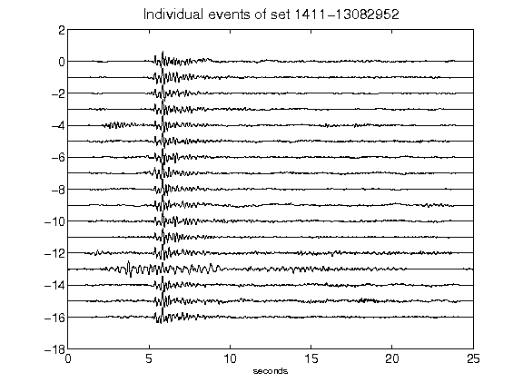](figures/1411-13082952_AllEv.png)[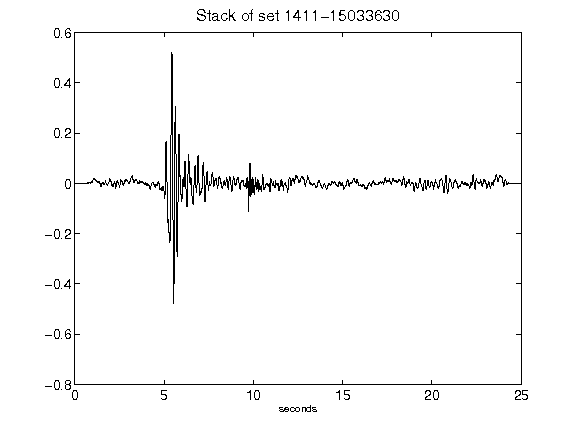](figures/1411-15033630_Stack.png)[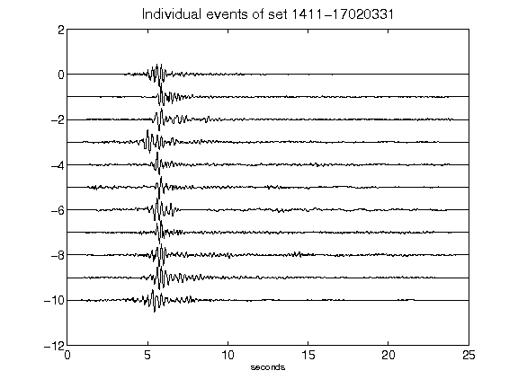](figures/1411-17020331_AllEv.png)[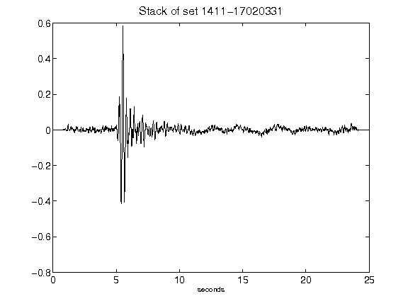](figures/1411-17020331_Stack.png)[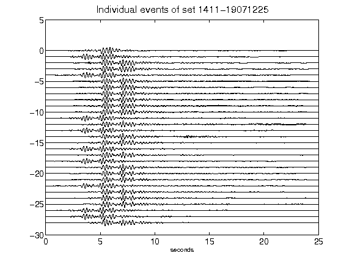](figures/1411-19071225_AllEv.png)[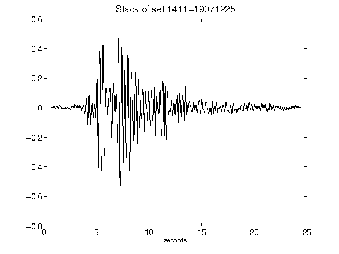](figures/1411-19071225_Stack.png)[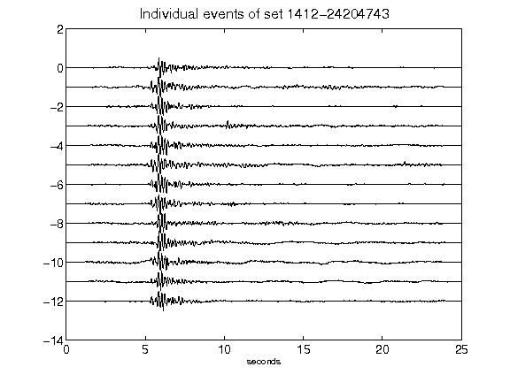](figures/1412-24204743_AllEv.png)[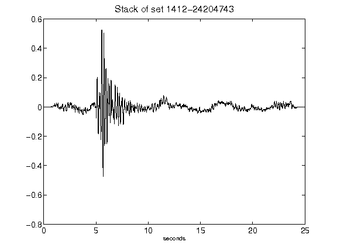](figures/1412-24204743_Stack.png)[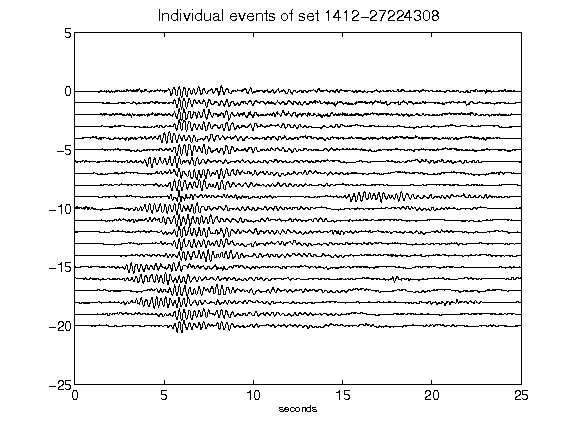](figures/1412-27224308_AllEv.png)[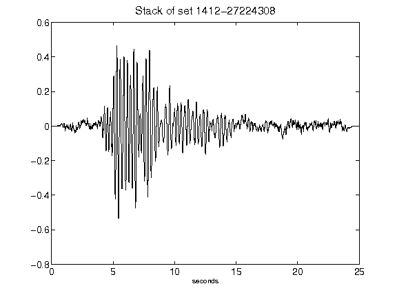](figures/1412-27224308_Stack.png)[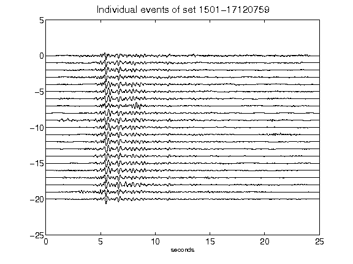](figures/1501-17120759_AllEv.png)[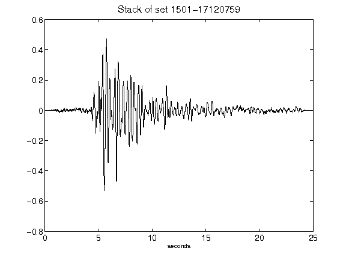](figures/1501-17120759_Stack.png)