# Repeating Earthquake Activity at RCM

## Waveforms
[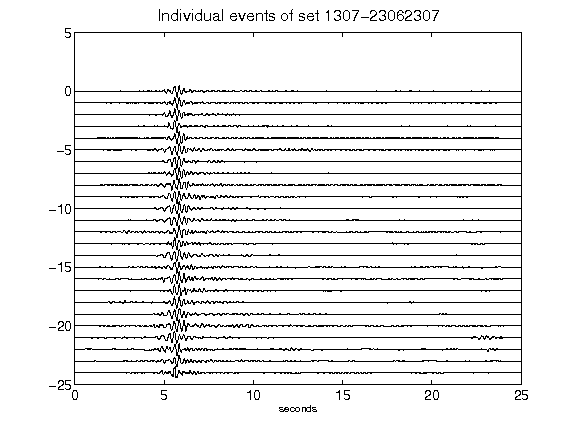](figures/1307-23062307_AllEv.png)[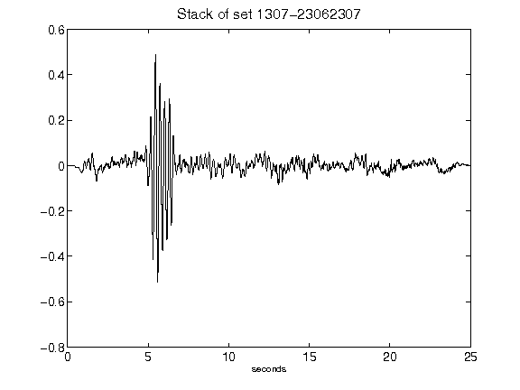](figures/1307-23062307_Stack.png)[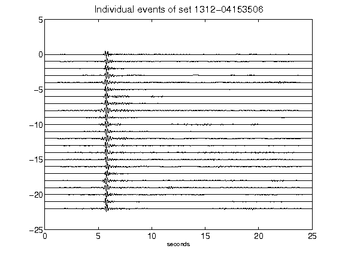](figures/1312-04153506_AllEv.png)[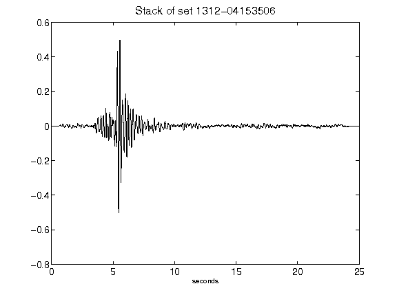](figures/1312-04153506_Stack.png)[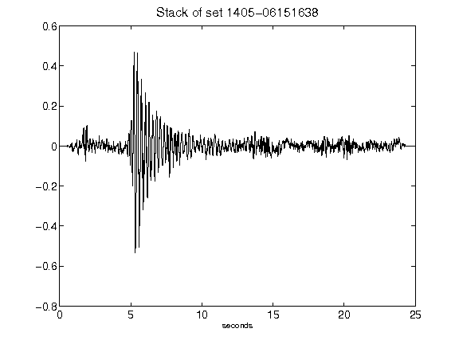](figures/1405-06151638_Stack.png)[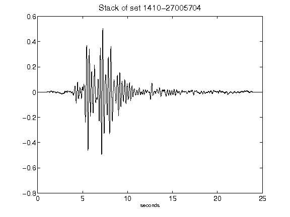](figures/1410-27005704_Stack.png)[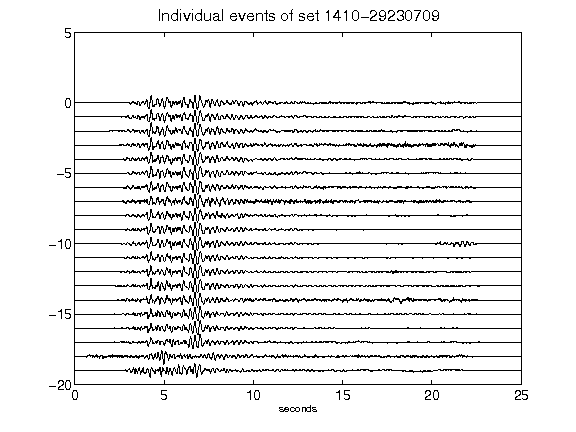](figures/1410-29230709_AllEv.png)[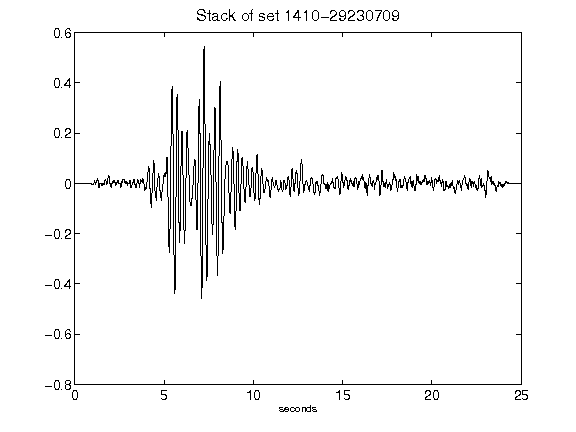](figures/1410-29230709_Stack.png)[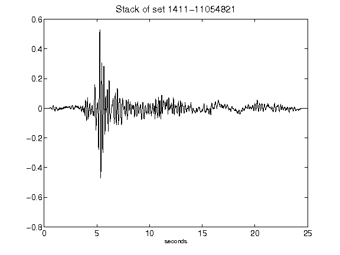](figures/1411-11054821_Stack.png)[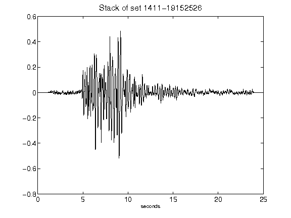](figures/1411-19152526_Stack.png)[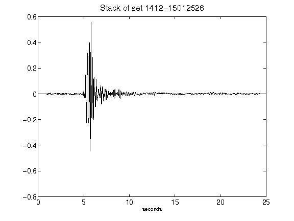](figures/1412-15012526_Stack.png)