# Repeating Earthquake Activity at RCM

## Waveforms
[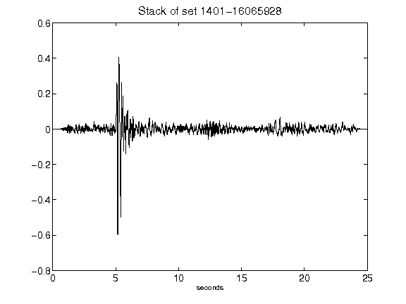](figures/1401-16065928_Stack.png)[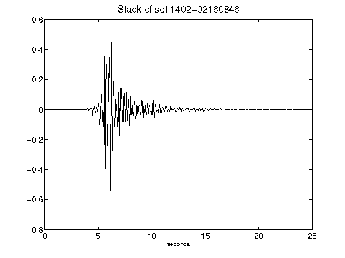](figures/1402-02160846_Stack.png)[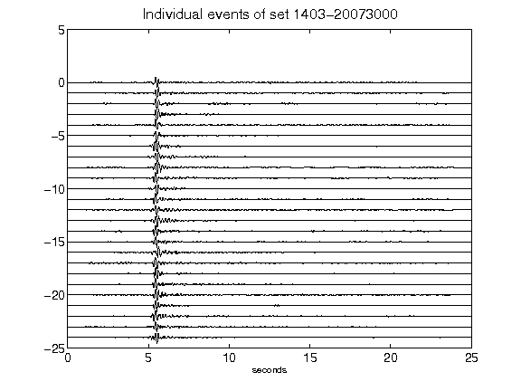](figures/1403-20073000_AllEv.png)[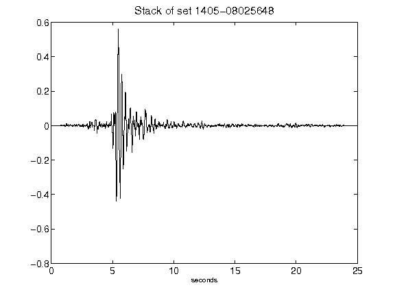](figures/1405-08025648_Stack.png)[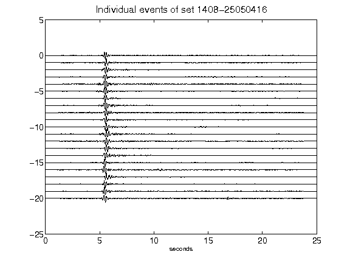](figures/1408-25050416_AllEv.png)[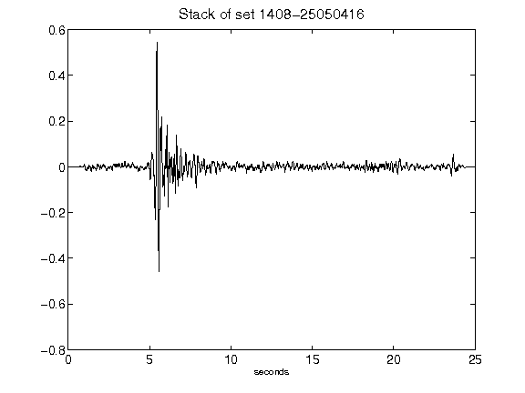](figures/1408-25050416_Stack.png)[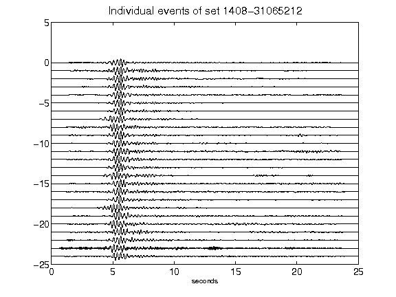](figures/1408-31065212_AllEv.png)[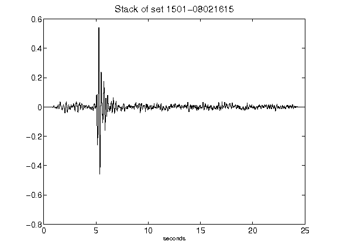](figures/1501-08021615_Stack.png)[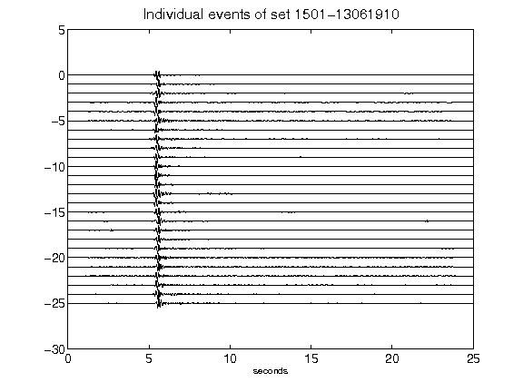](figures/1501-13061910_AllEv.png)[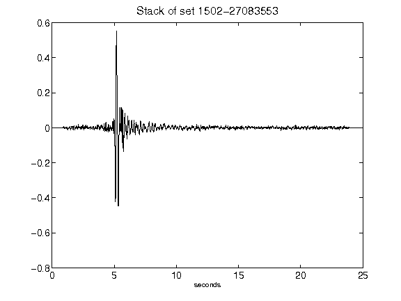](figures/1502-27083553_Stack.png)[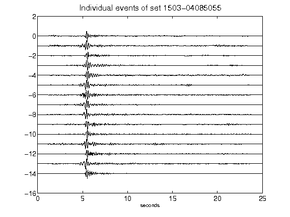](figures/1503-04085055_AllEv.png)[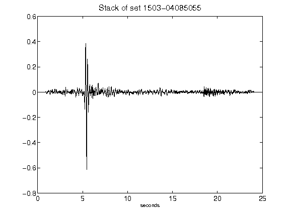](figures/1503-04085055_Stack.png)[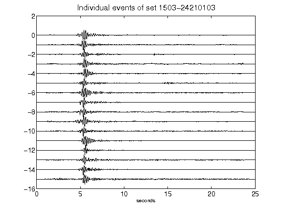](figures/1503-24210103_AllEv.png)[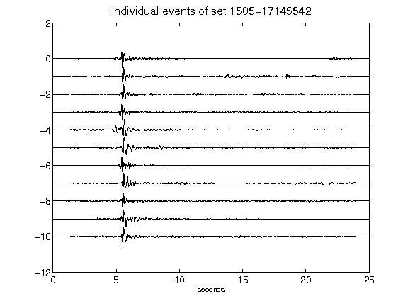](figures/1505-17145542_AllEv.png)[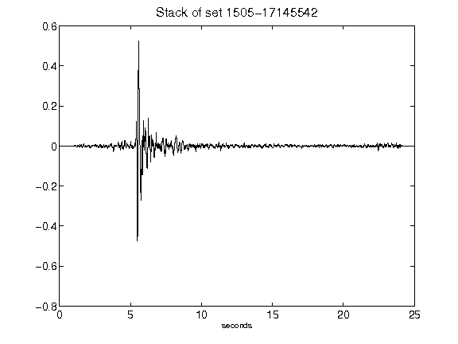](figures/1505-17145542_Stack.png)[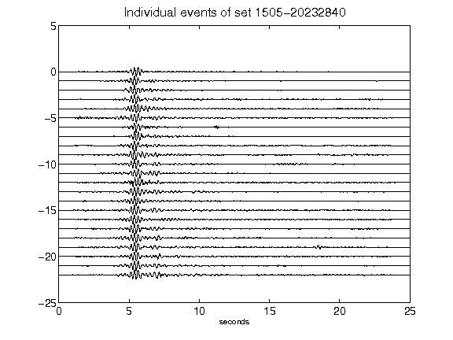](figures/1505-20232840_AllEv.png)[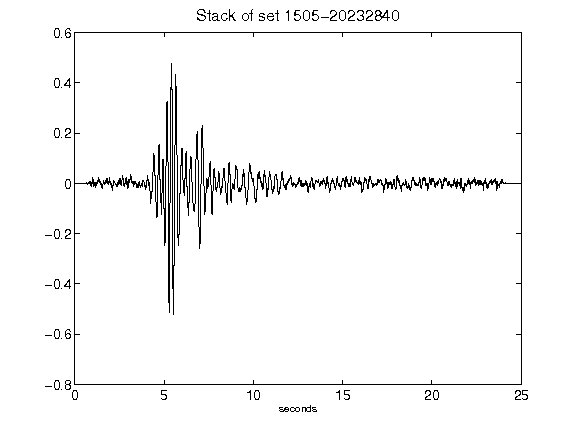](figures/1505-20232840_Stack.png)[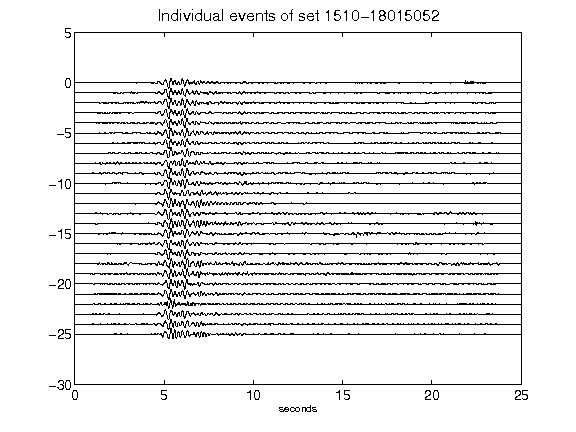](figures/1510-18015052_AllEv.png)[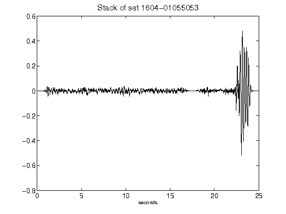](figures/1604-01055053_Stack.png)[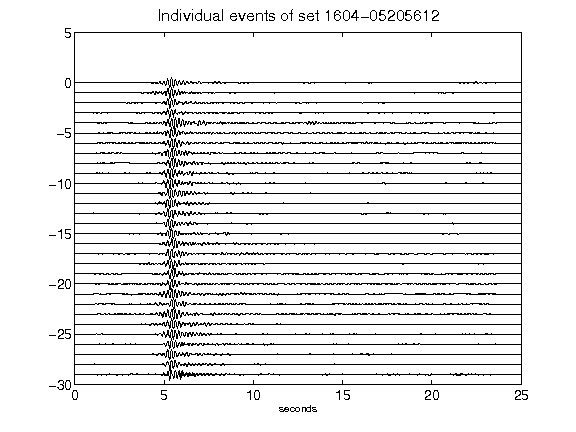](figures/1604-05205612_AllEv.png)[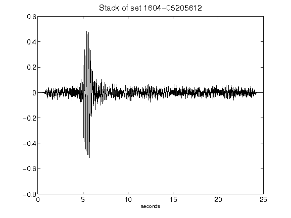](figures/1604-05205612_Stack.png)[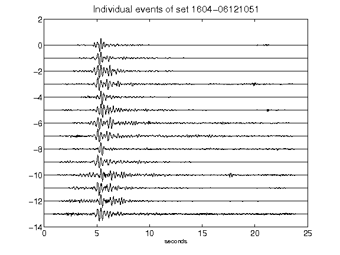](figures/1604-06121051_AllEv.png)[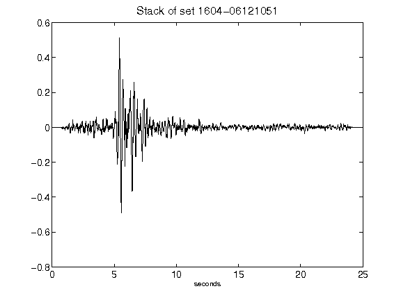](figures/1604-06121051_Stack.png)[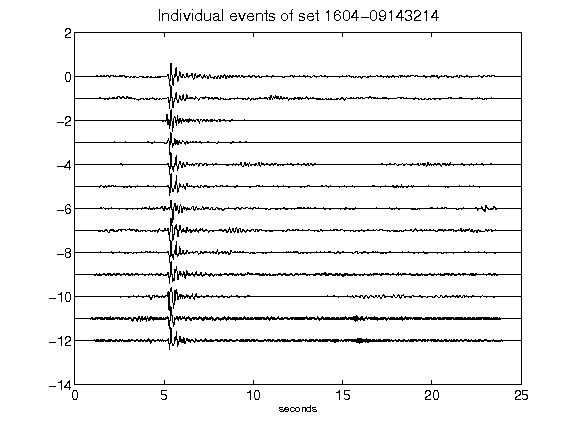](figures/1604-09143214_AllEv.png)[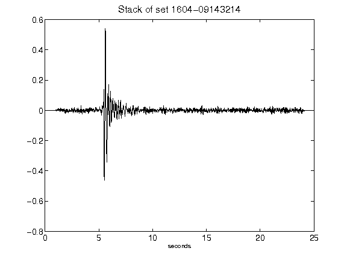](figures/1604-09143214_Stack.png)[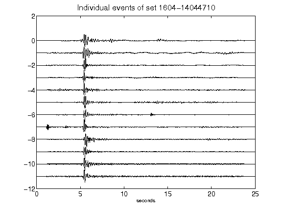](figures/1604-14044710_AllEv.png)[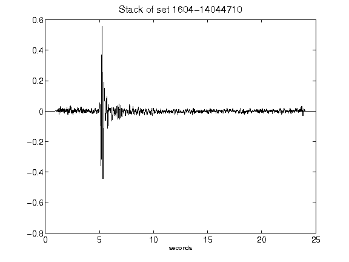](figures/1604-14044710_Stack.png)[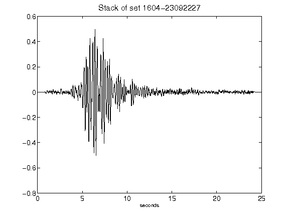](figures/1604-23092227_Stack.png)