# Repeating Earthquake Activity at RCM

## Waveforms
[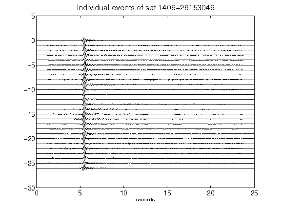](figures/1406-26153049_AllEv.png)[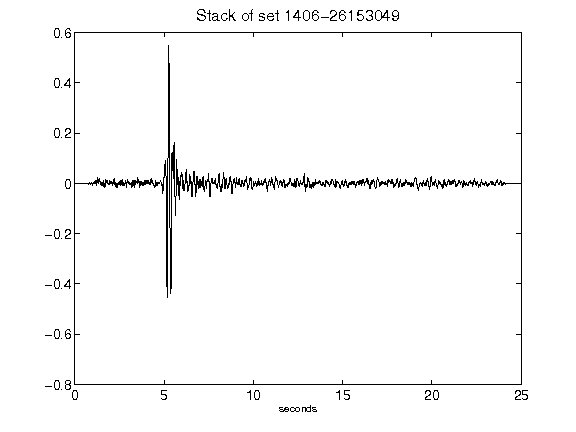](figures/1406-26153049_Stack.png)[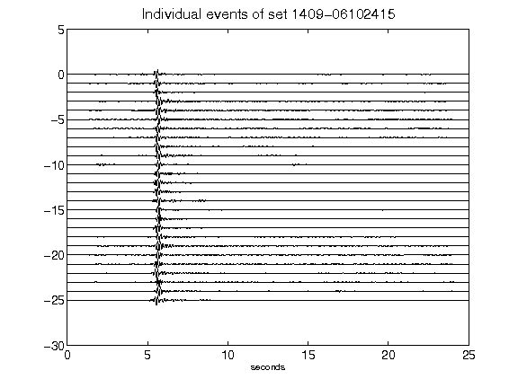](figures/1409-06102415_AllEv.png)[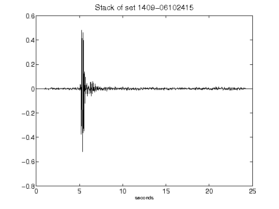](figures/1409-06102415_Stack.png)[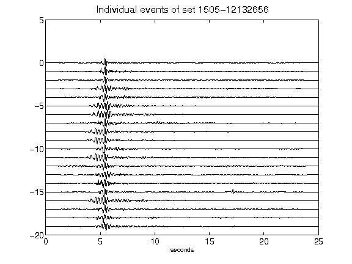](figures/1505-12132656_AllEv.png)[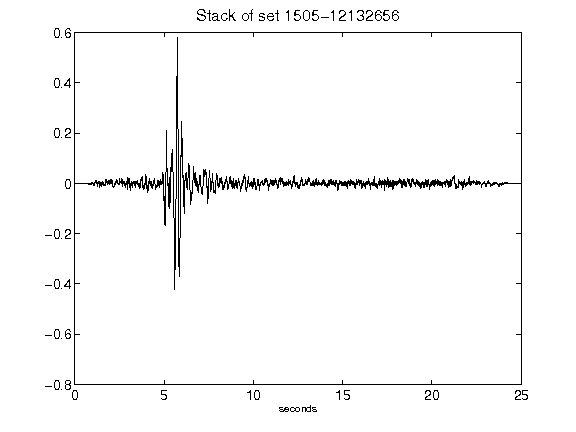](figures/1505-12132656_Stack.png)[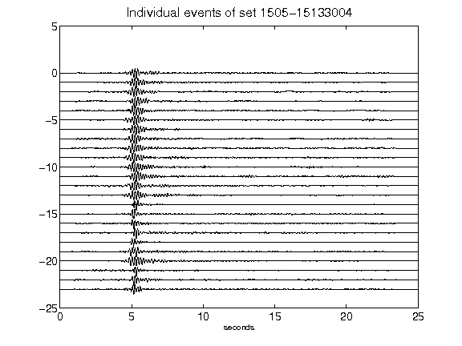](figures/1505-15133004_AllEv.png)[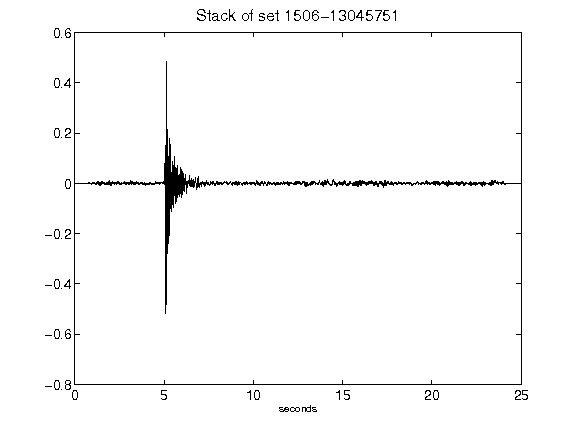](figures/1506-13045751_Stack.png)[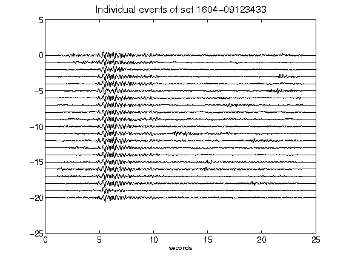](figures/1604-09123433_AllEv.png)[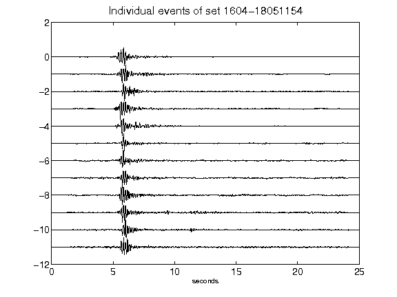](figures/1604-18051154_AllEv.png)[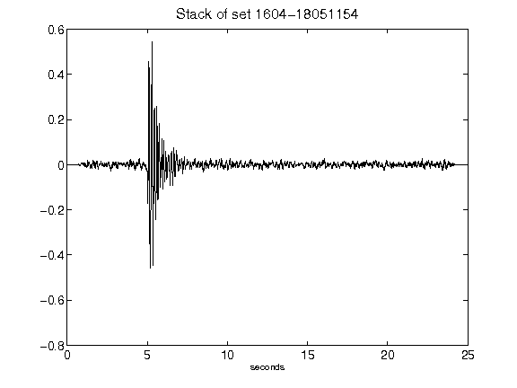](figures/1604-18051154_Stack.png)[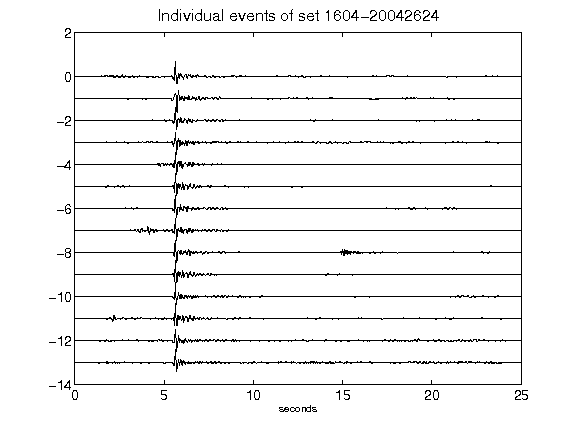](figures/1604-20042624_AllEv.png)[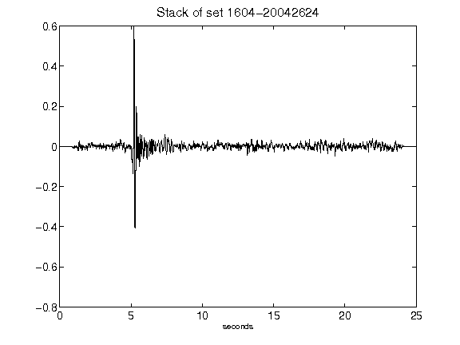](figures/1604-20042624_Stack.png)[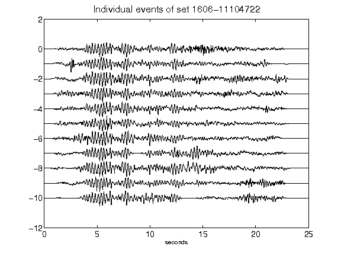](figures/1606-11104722_AllEv.png)