# Repeating Earthquake Activity at RCM

## Waveforms
[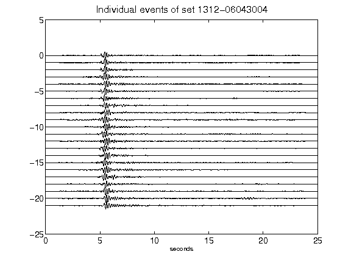](figures/1312-06043004_AllEv.png)[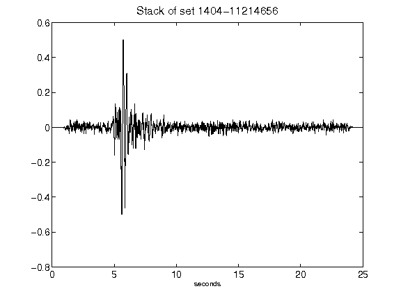](figures/1404-11214656_Stack.png)[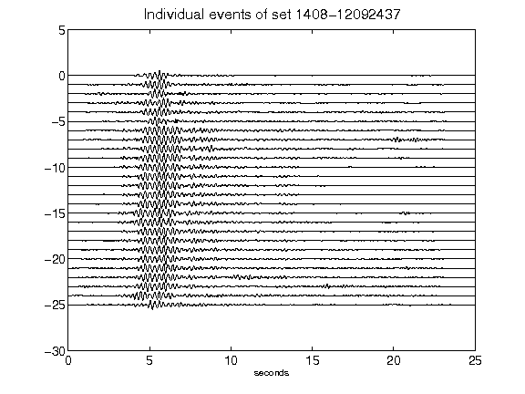](figures/1408-12092437_AllEv.png)[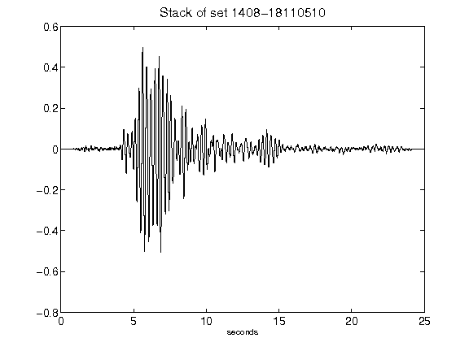](figures/1408-18110510_Stack.png)[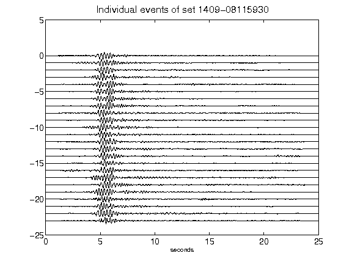](figures/1409-08115930_AllEv.png)[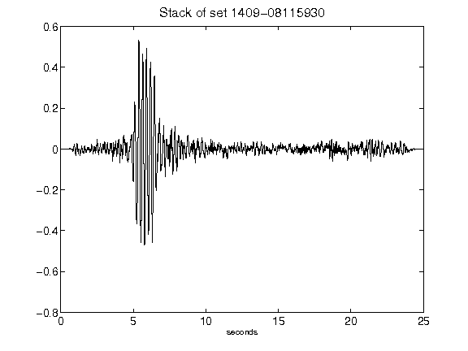](figures/1409-08115930_Stack.png)[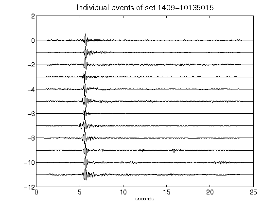](figures/1409-10135015_AllEv.png)[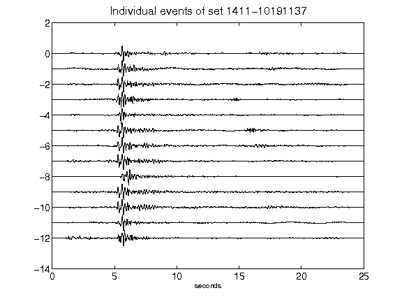](figures/1411-10191137_AllEv.png)[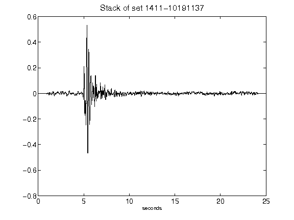](figures/1411-10191137_Stack.png)[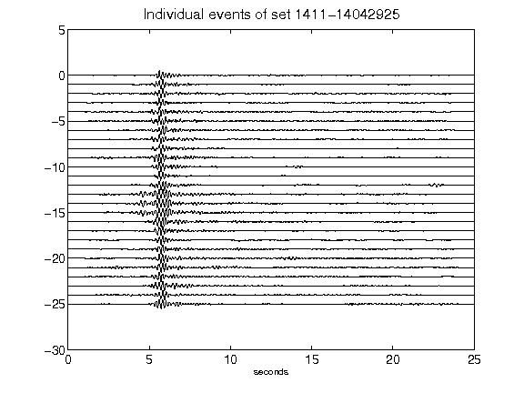](figures/1411-14042925_AllEv.png)[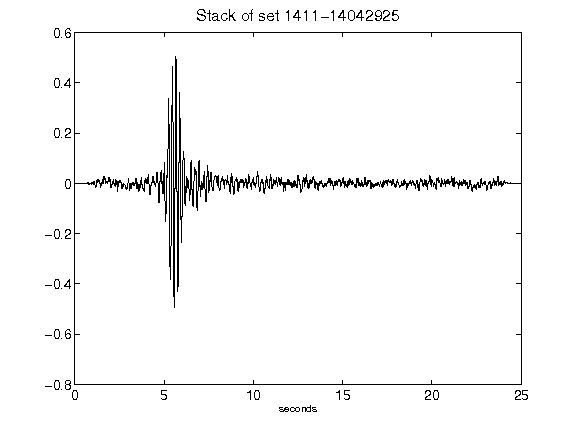](figures/1411-14042925_Stack.png)[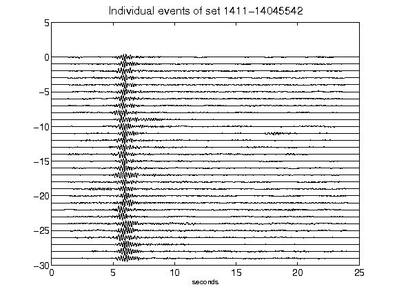](figures/1411-14045542_AllEv.png)[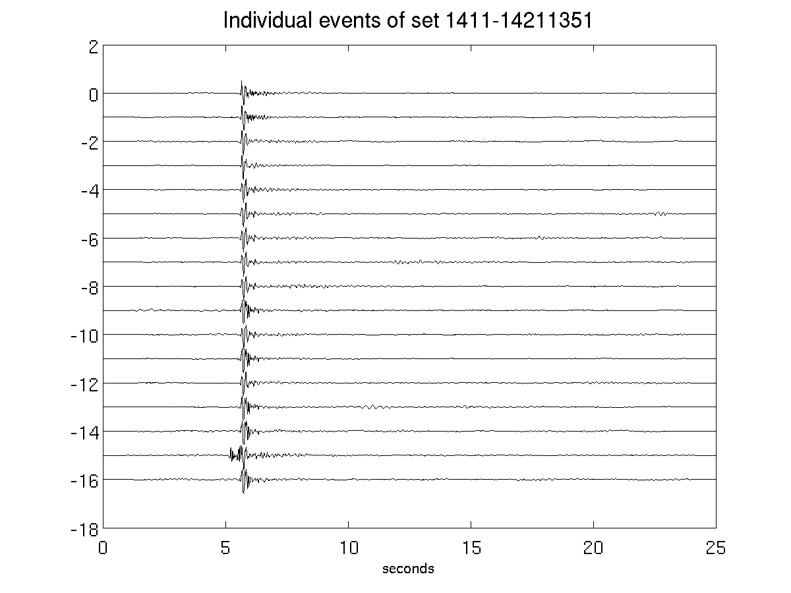](figures/1411-14211351_AllEv.png)[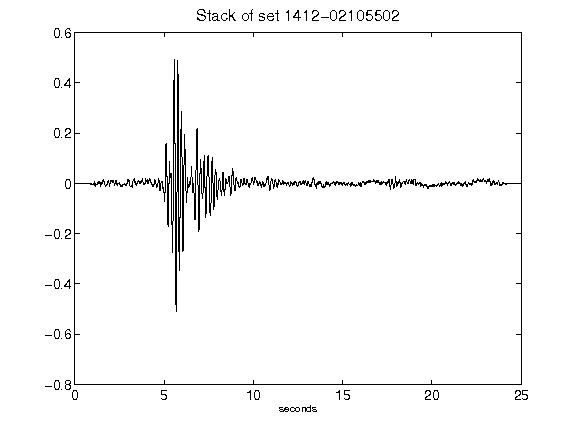](figures/1412-02105502_Stack.png)[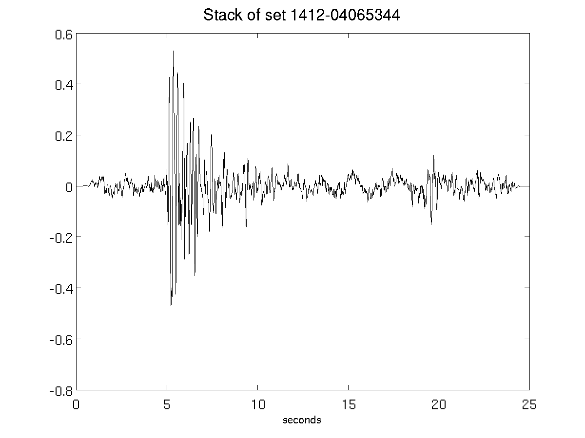](figures/1412-04065344_Stack.png)[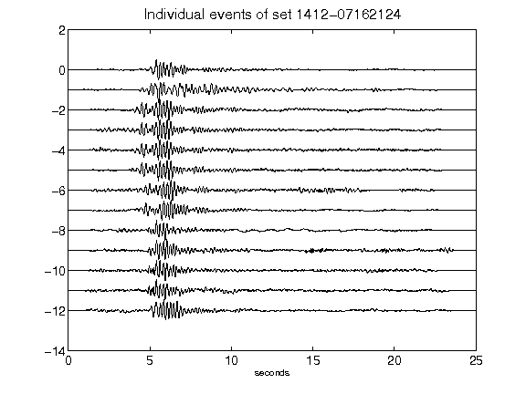](figures/1412-07162124_AllEv.png)[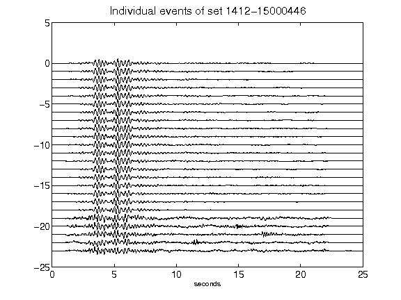](figures/1412-15000446_AllEv.png)[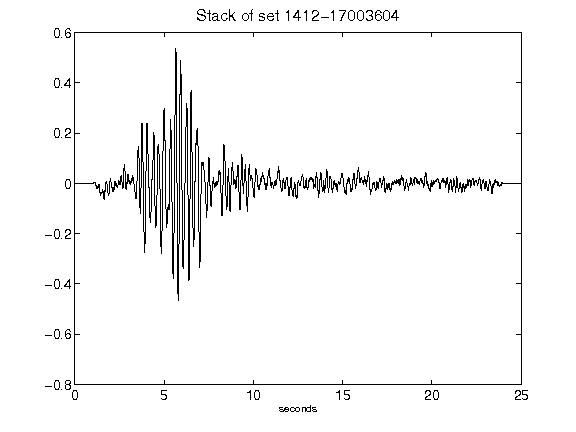](figures/1412-17003604_Stack.png)[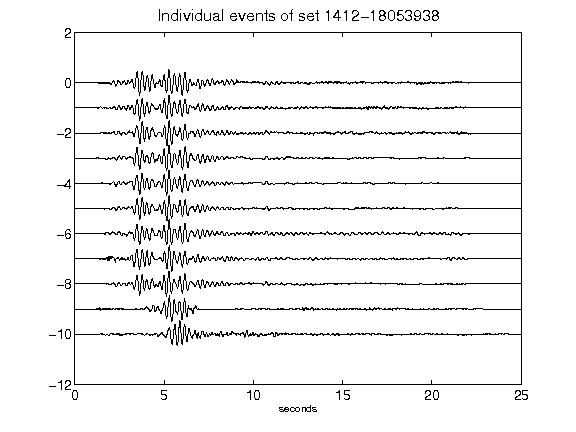](figures/1412-18053938_AllEv.png)[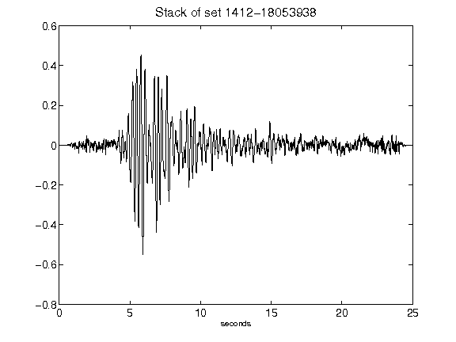](figures/1412-18053938_Stack.png)[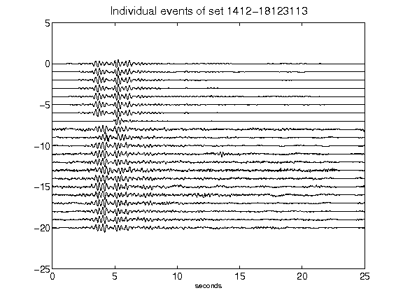](figures/1412-18123113_AllEv.png)[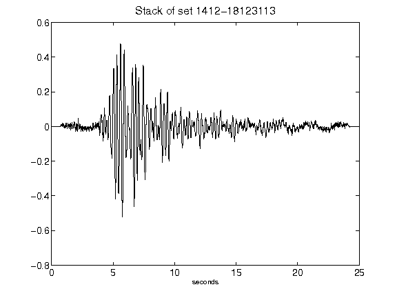](figures/1412-18123113_Stack.png)[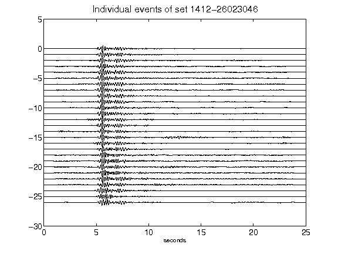](figures/1412-26023046_AllEv.png)[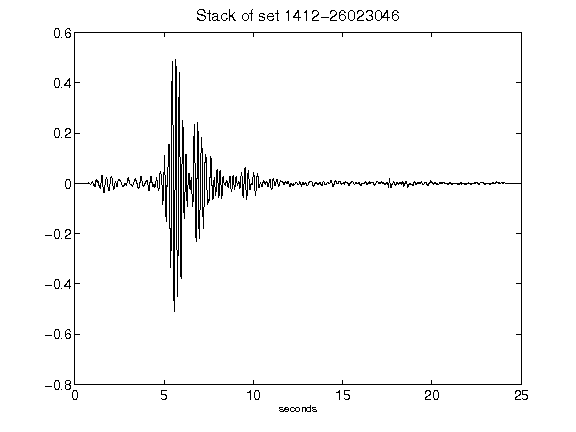](figures/1412-26023046_Stack.png)[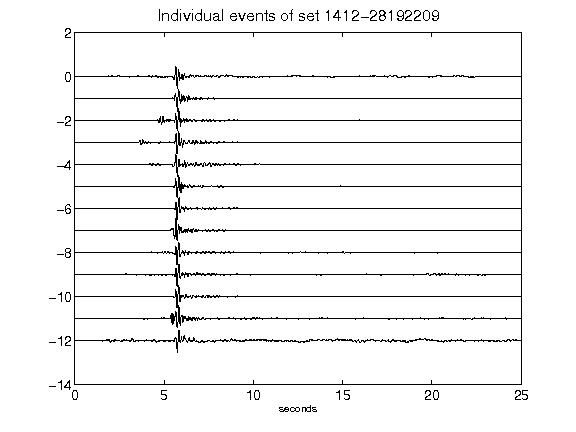](figures/1412-28192209_AllEv.png)[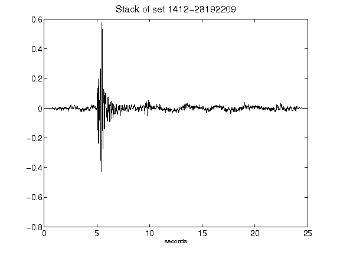](figures/1412-28192209_Stack.png)[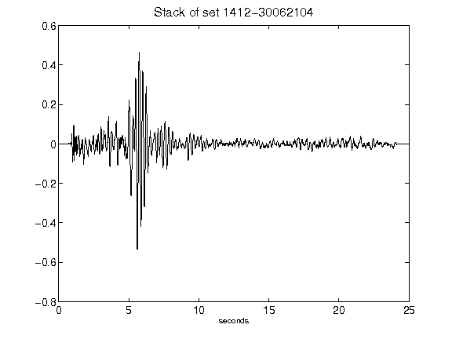](figures/1412-30062104_Stack.png)[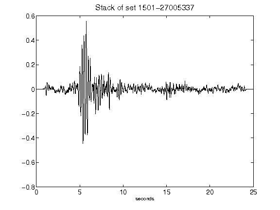](figures/1501-27005337_Stack.png)[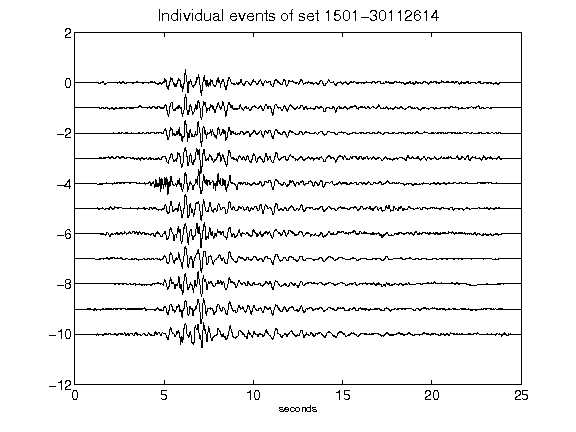](figures/1501-30112614_AllEv.png)[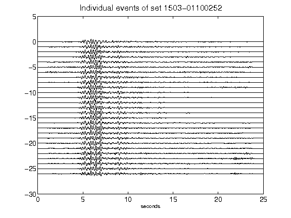](figures/1503-01100252_AllEv.png)[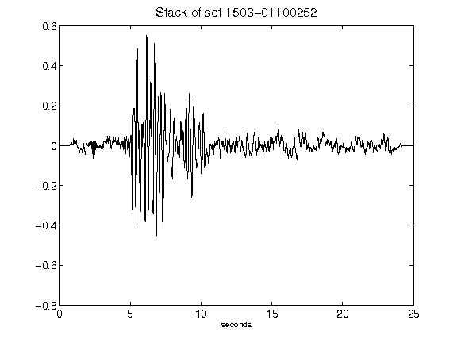](figures/1503-01100252_Stack.png)[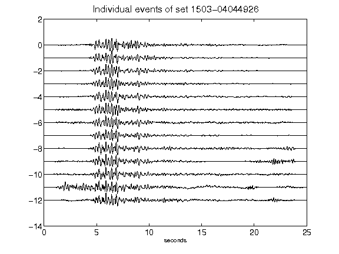](figures/1503-04044926_AllEv.png)[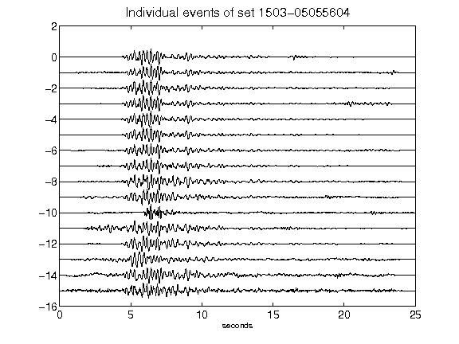](figures/1503-05055604_AllEv.png)[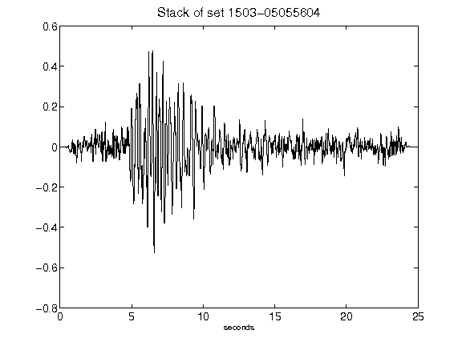](figures/1503-05055604_Stack.png)[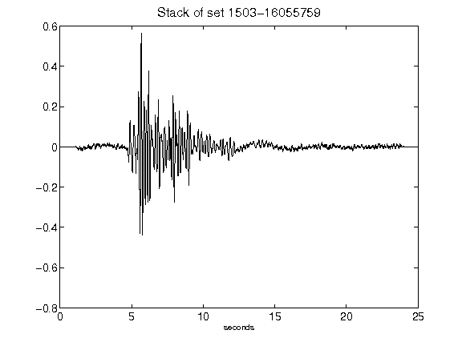](figures/1503-16055759_Stack.png)