# Repeating Earthquake Activity at RCM

## Waveforms
[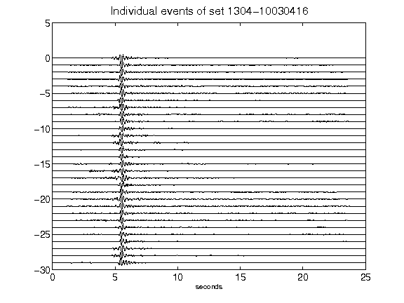](figures/1304-10030416_AllEv.png)[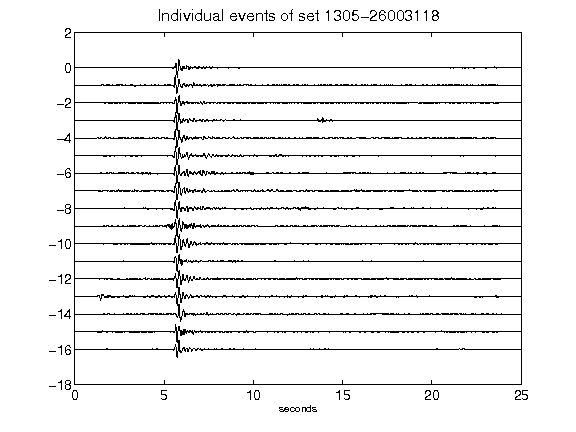](figures/1305-26003118_AllEv.png)[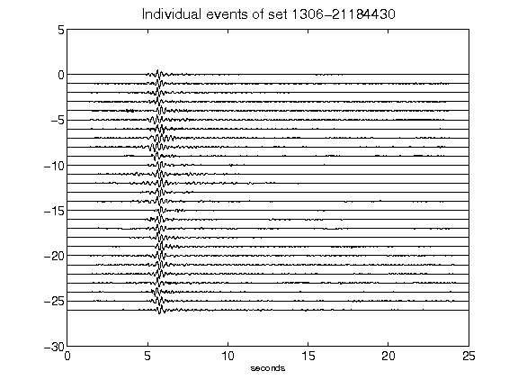](figures/1306-21184430_AllEv.png)[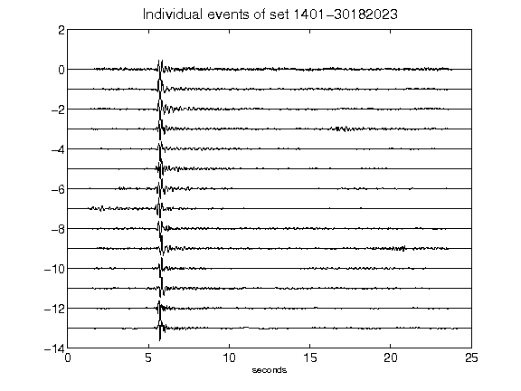](figures/1401-30182023_AllEv.png)[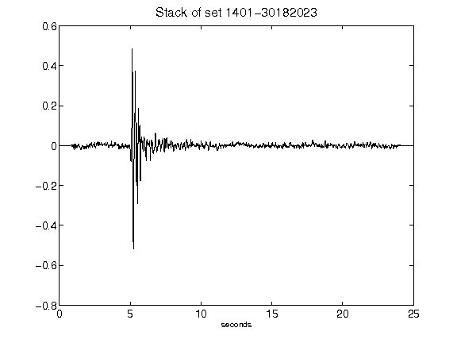](figures/1401-30182023_Stack.png)[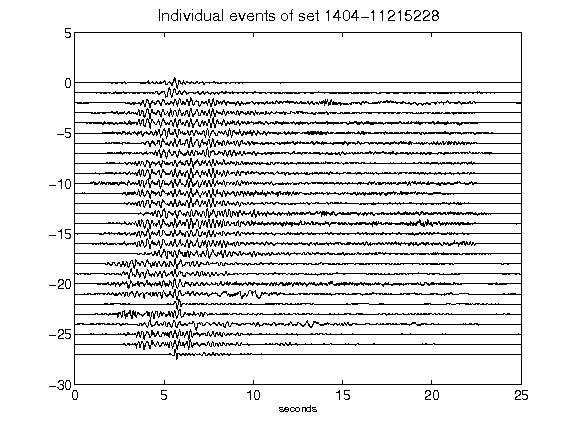](figures/1404-11215228_AllEv.png)[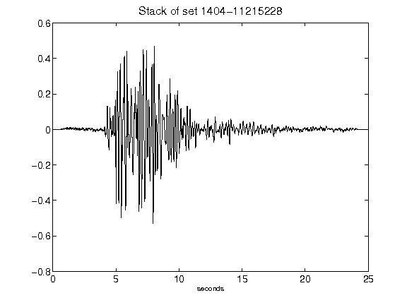](figures/1404-11215228_Stack.png)[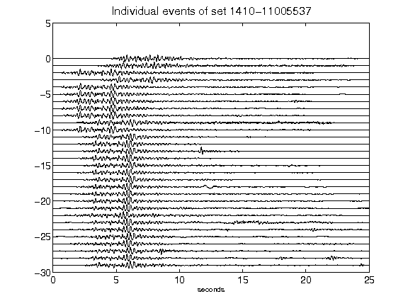](figures/1410-11005537_AllEv.png)[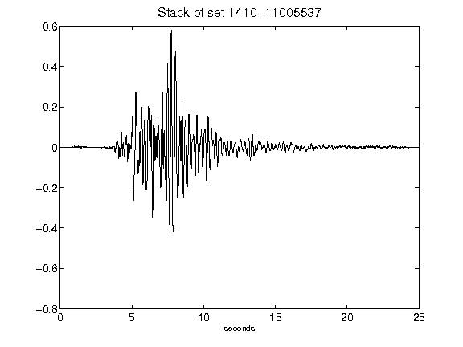](figures/1410-11005537_Stack.png)[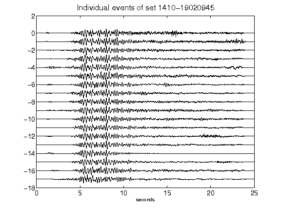](figures/1410-19020945_AllEv.png)[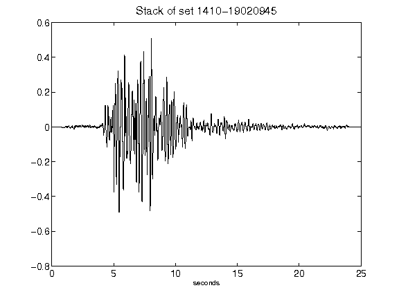](figures/1410-19020945_Stack.png)[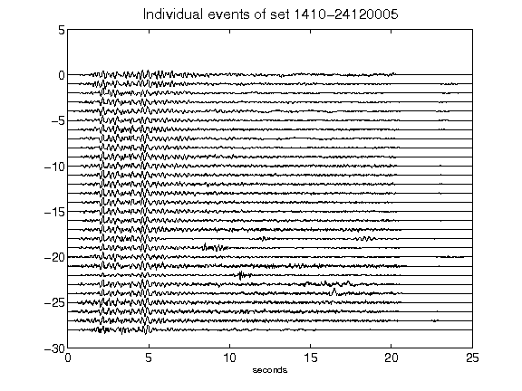](figures/1410-24120005_AllEv.png)[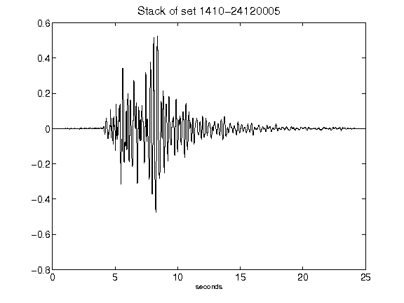](figures/1410-24120005_Stack.png)[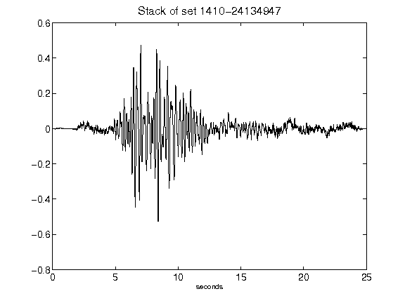](figures/1410-24134947_Stack.png)[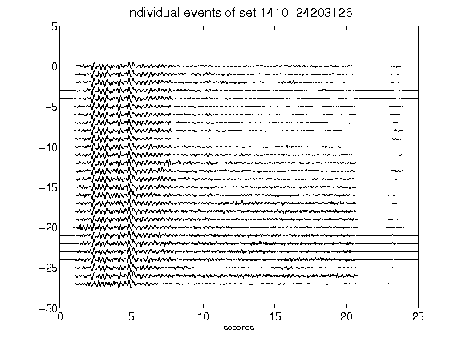](figures/1410-24203126_AllEv.png)[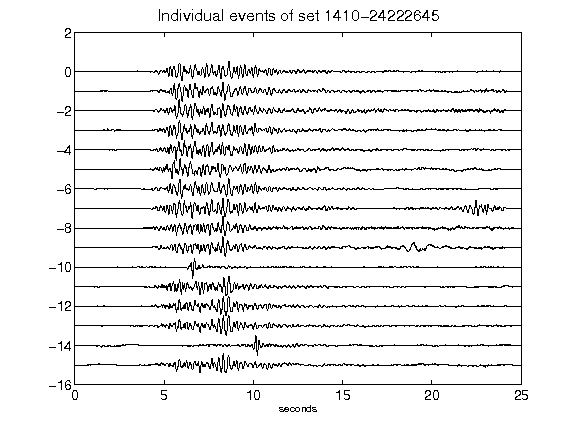](figures/1410-24222645_AllEv.png)[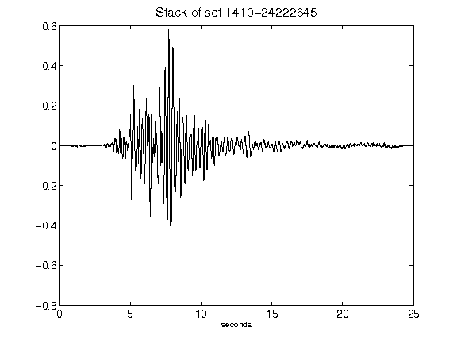](figures/1410-24222645_Stack.png)[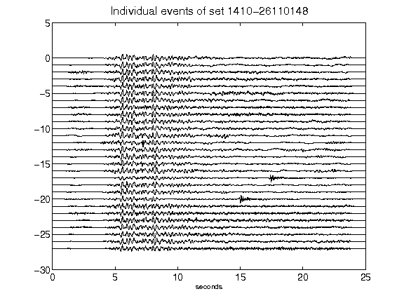](figures/1410-26110148_AllEv.png)[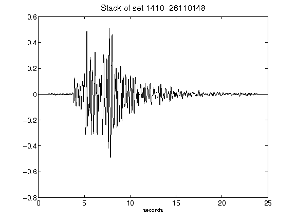](figures/1410-26110148_Stack.png)[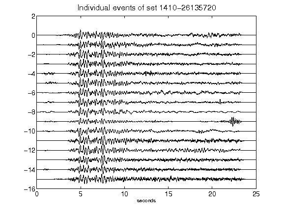](figures/1410-26135720_AllEv.png)[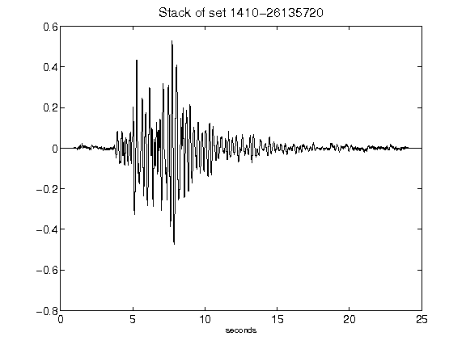](figures/1410-26135720_Stack.png)