# Repeating Earthquake Activity at RCM

## Waveforms
[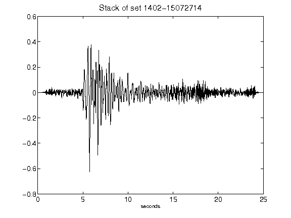](figures/1402-15072714_Stack.png)[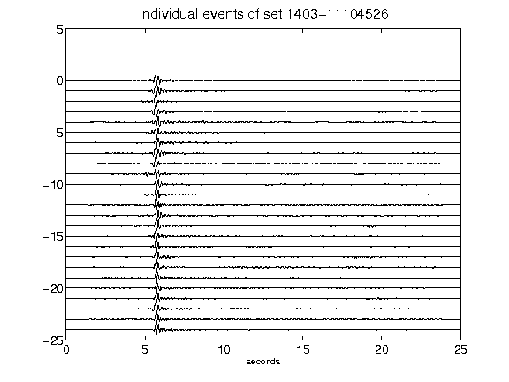](figures/1403-11104526_AllEv.png)[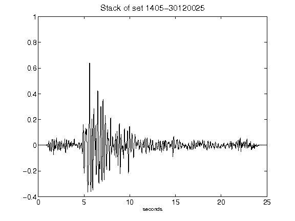](figures/1405-30120025_Stack.png)[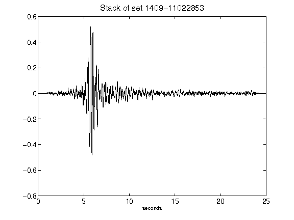](figures/1409-11022853_Stack.png)[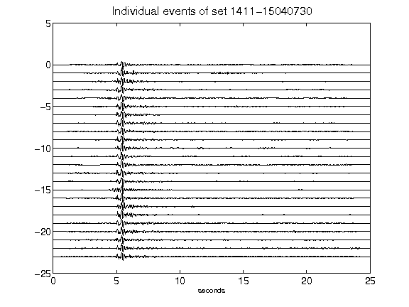](figures/1411-15040730_AllEv.png)[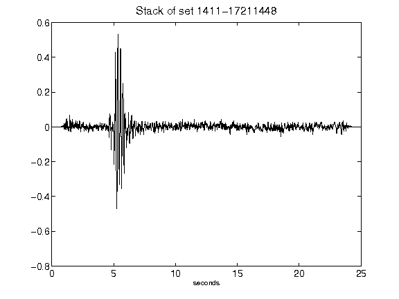](figures/1411-17211448_Stack.png)[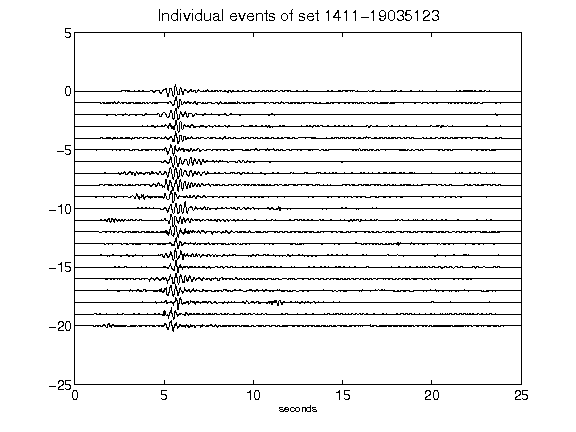](figures/1411-19035123_AllEv.png)[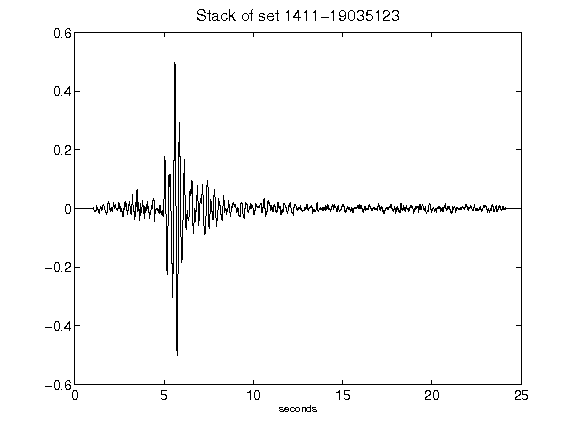](figures/1411-19035123_Stack.png)[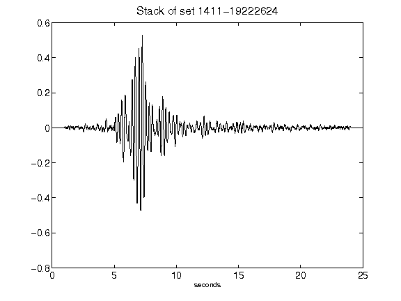](figures/1411-19222624_Stack.png)[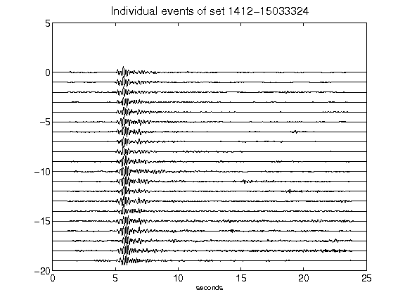](figures/1412-15033324_AllEv.png)[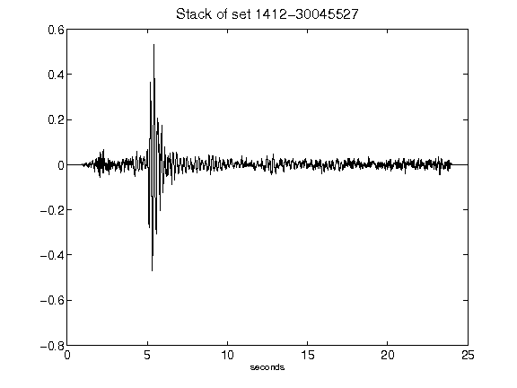](figures/1412-30045527_Stack.png)[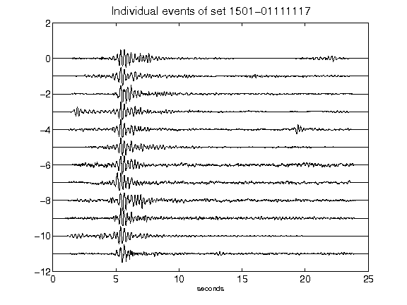](figures/1501-01111117_AllEv.png)[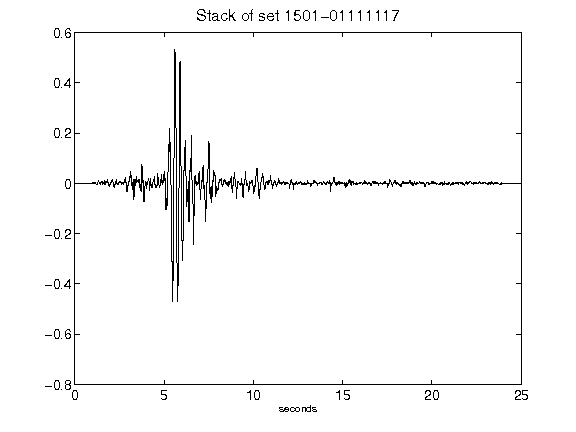](figures/1501-01111117_Stack.png)[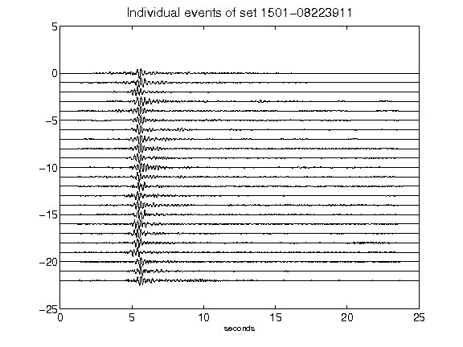](figures/1501-08223911_AllEv.png)[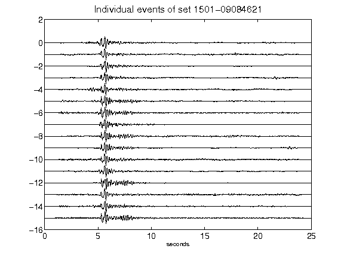](figures/1501-09084621_AllEv.png)[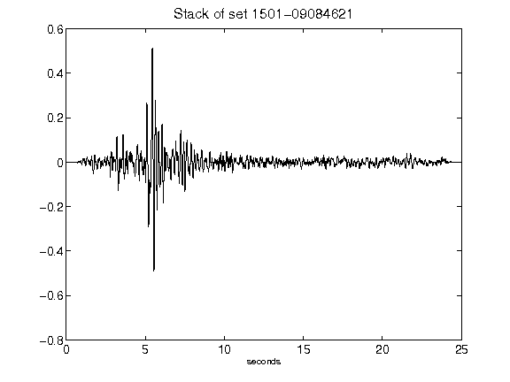](figures/1501-09084621_Stack.png)[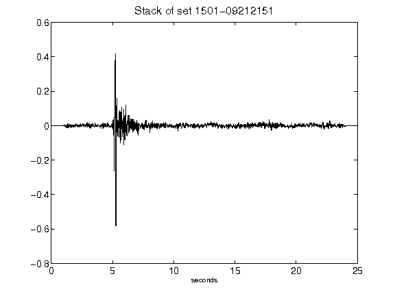](figures/1501-09212151_Stack.png)[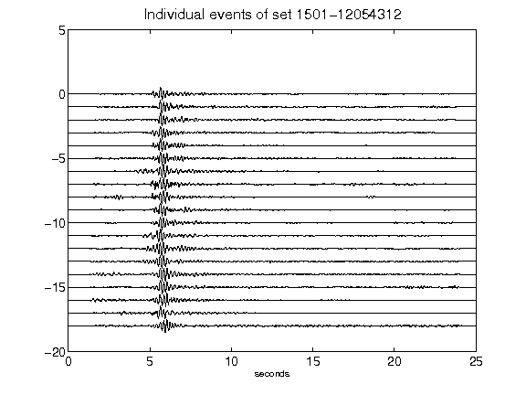](figures/1501-12054312_AllEv.png)[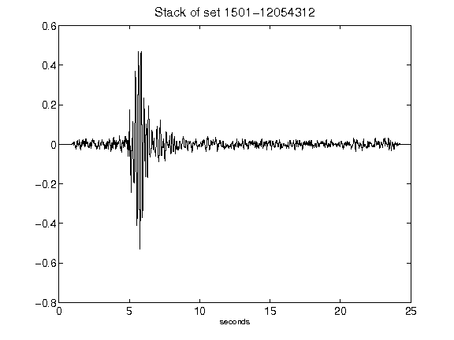](figures/1501-12054312_Stack.png)[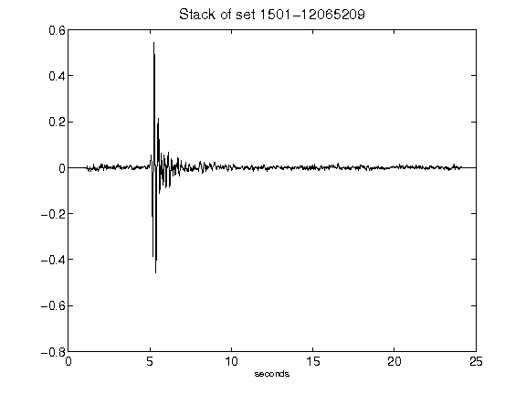](figures/1501-12065209_Stack.png)[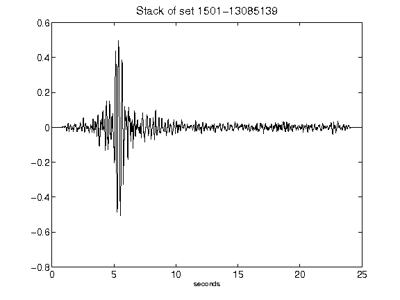](figures/1501-13085139_Stack.png)[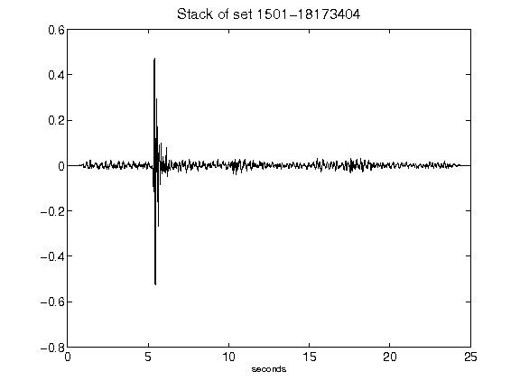](figures/1501-18173404_Stack.png)[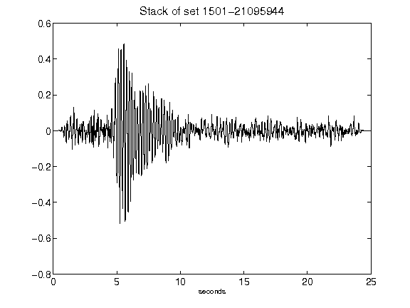](figures/1501-21095944_Stack.png)[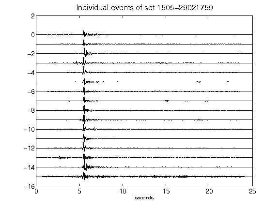](figures/1505-29021759_AllEv.png)[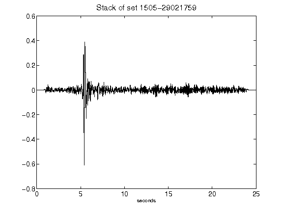](figures/1505-29021759_Stack.png)[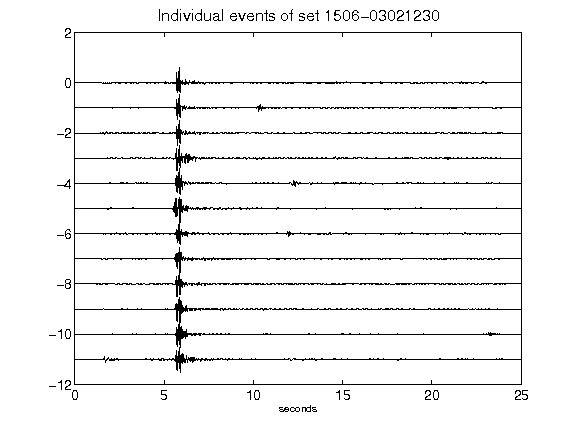](figures/1506-03021230_AllEv.png)[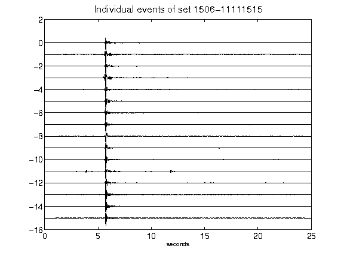](figures/1506-11111515_AllEv.png)[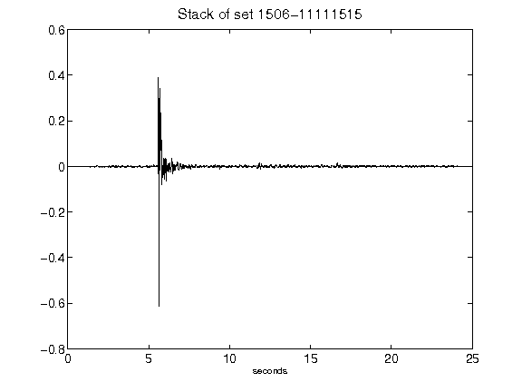](figures/1506-11111515_Stack.png)