# Repeating Earthquake Activity at RCM

## Waveforms
[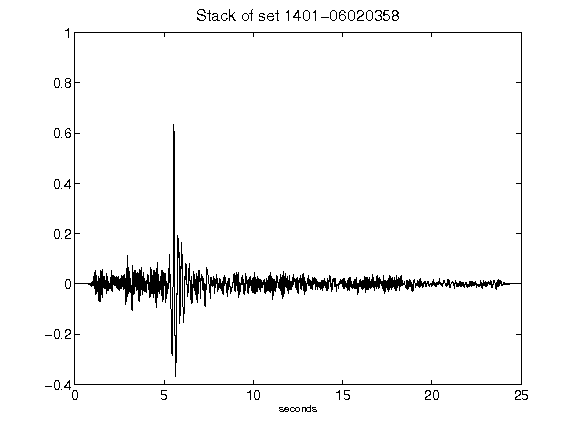](figures/1401-06020358_Stack.png)[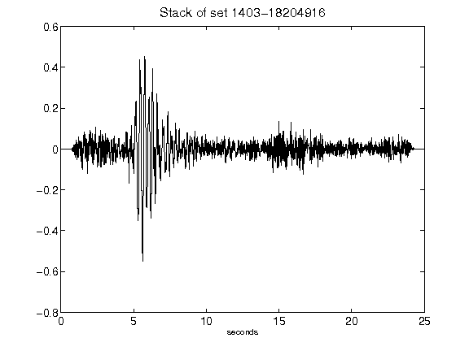](figures/1403-18204916_Stack.png)[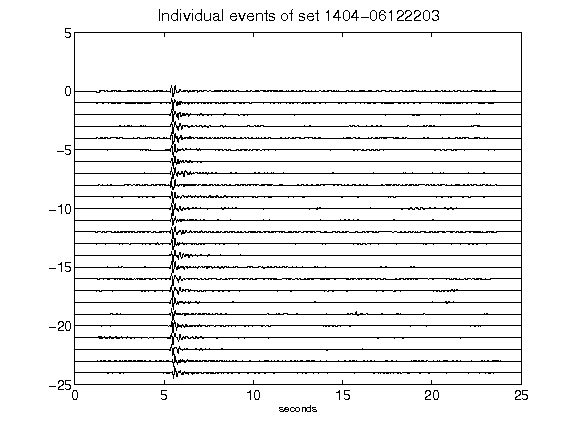](figures/1404-06122203_AllEv.png)[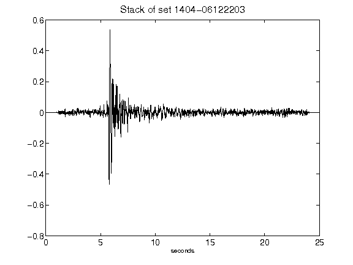](figures/1404-06122203_Stack.png)[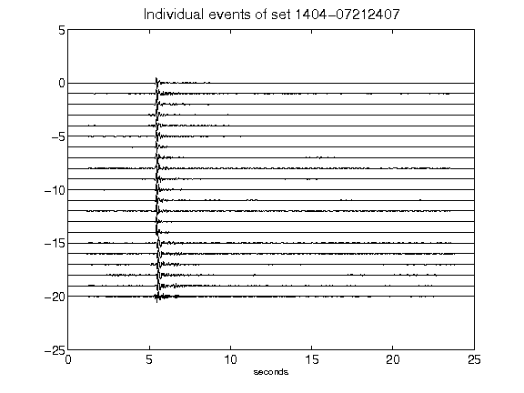](figures/1404-07212407_AllEv.png)[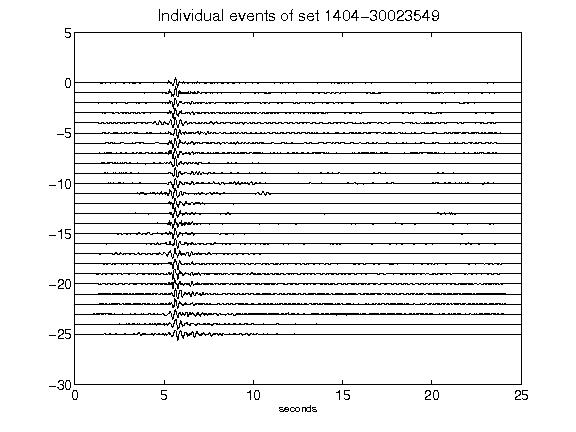](figures/1404-30023549_AllEv.png)[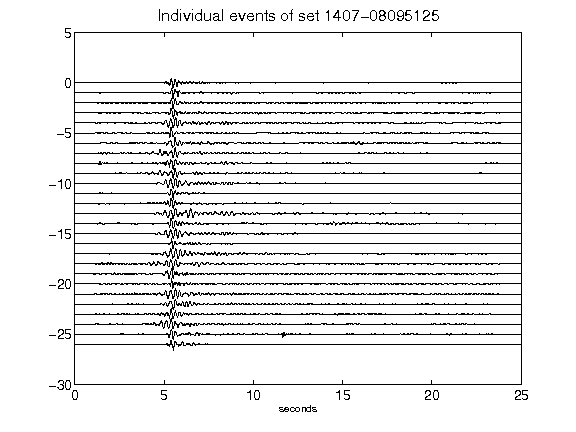](figures/1407-08095125_AllEv.png)[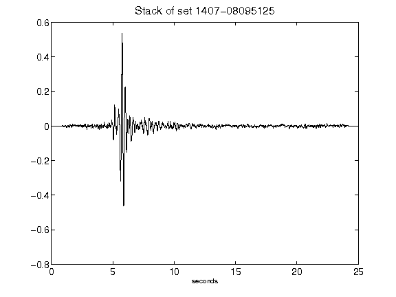](figures/1407-08095125_Stack.png)[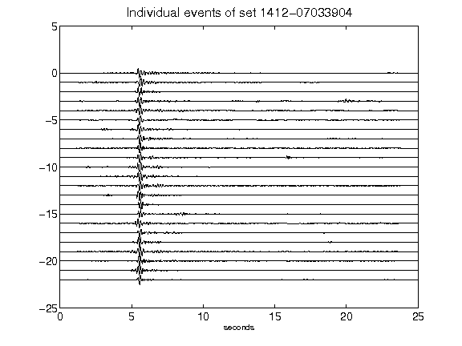](figures/1412-07033904_AllEv.png)[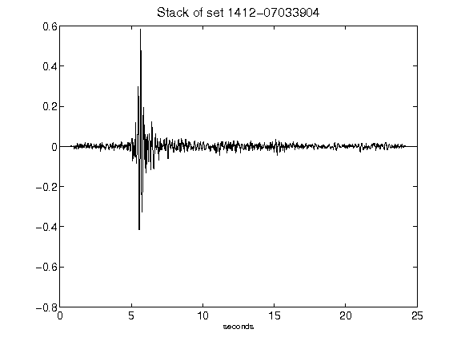](figures/1412-07033904_Stack.png)[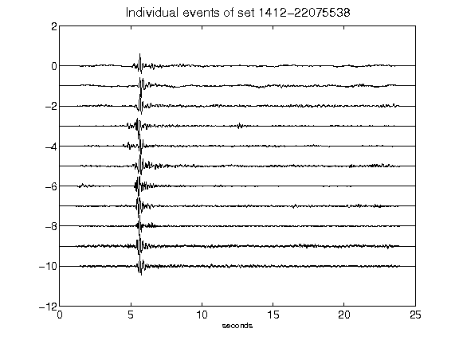](figures/1412-22075538_AllEv.png)[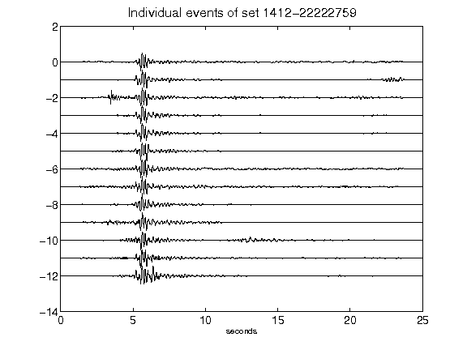](figures/1412-22222759_AllEv.png)[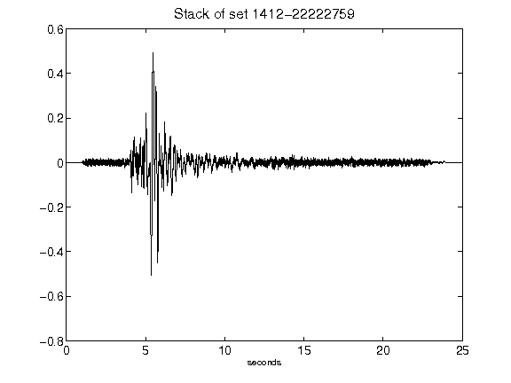](figures/1412-22222759_Stack.png)[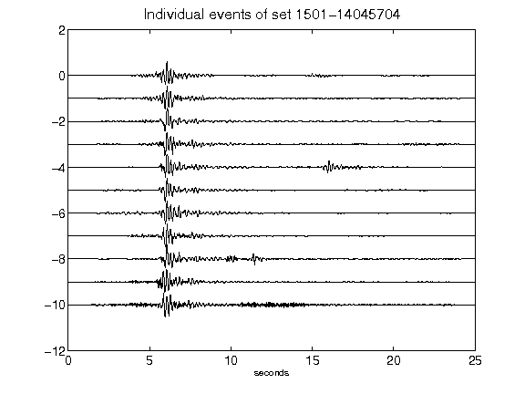](figures/1501-14045704_AllEv.png)[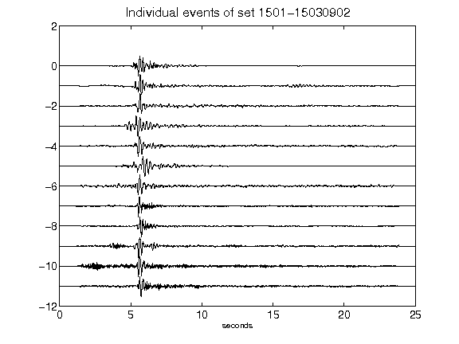](figures/1501-15030902_AllEv.png)[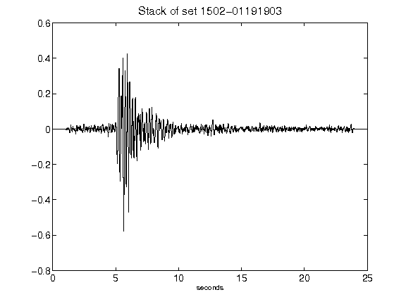](figures/1502-01191903_Stack.png)[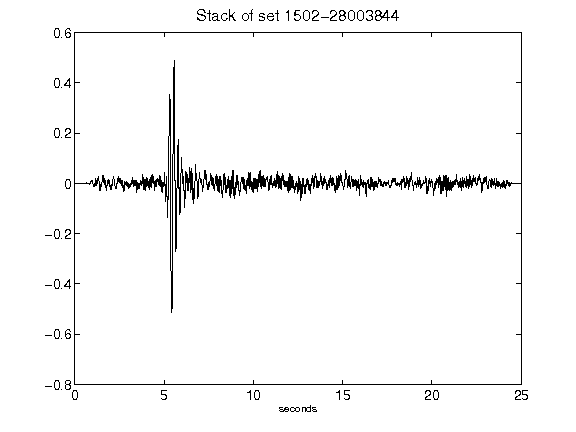](figures/1502-28003844_Stack.png)[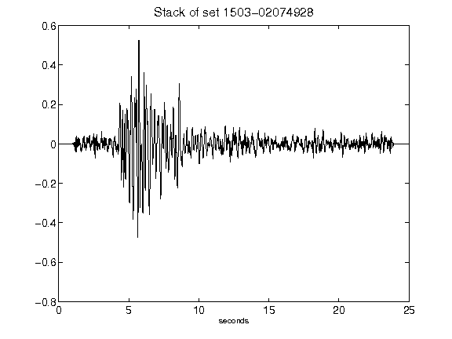](figures/1503-02074928_Stack.png)[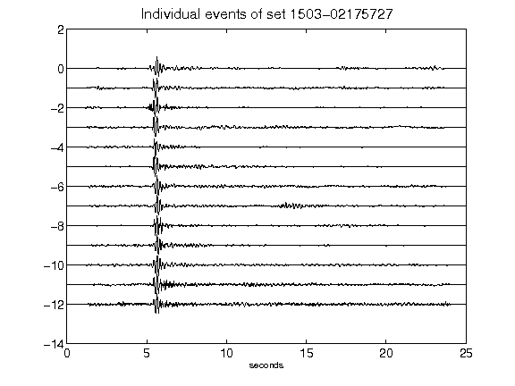](figures/1503-02175727_AllEv.png)[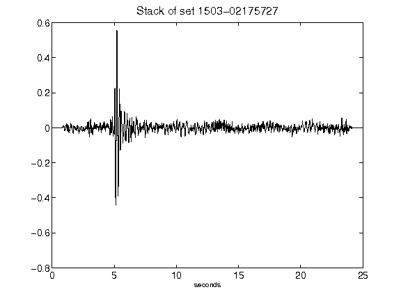](figures/1503-02175727_Stack.png)[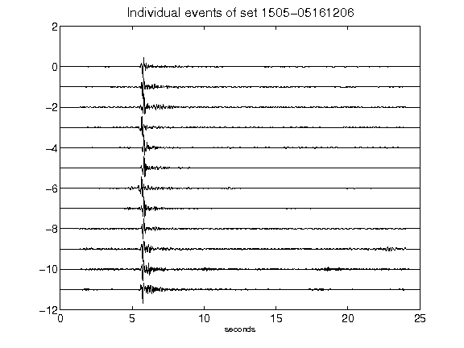](figures/1505-05161206_AllEv.png)[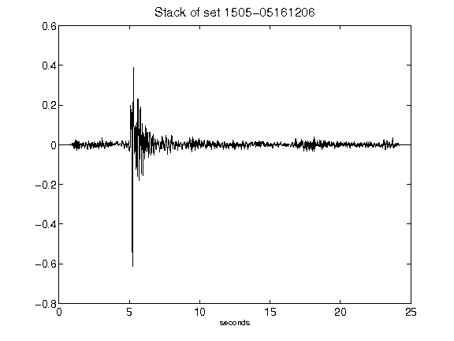](figures/1505-05161206_Stack.png)[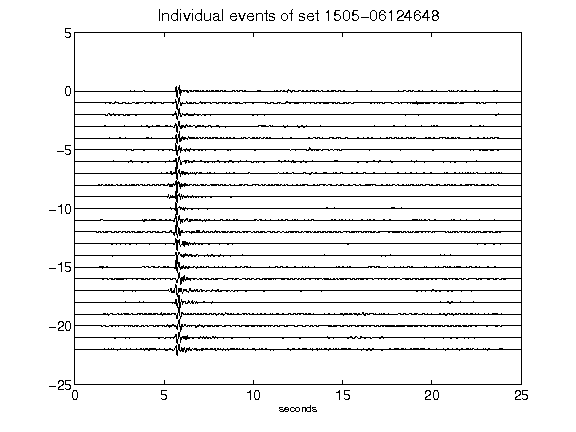](figures/1505-06124648_AllEv.png)[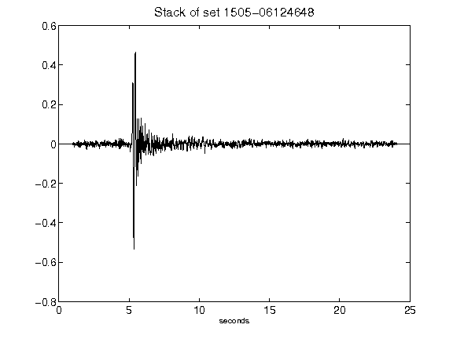](figures/1505-06124648_Stack.png)