# Repeating Earthquake Activity at RCM

## Waveforms
[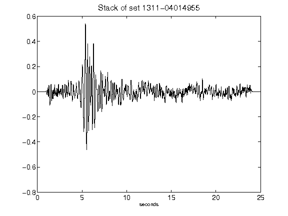](figures/1311-04014955_Stack.png)[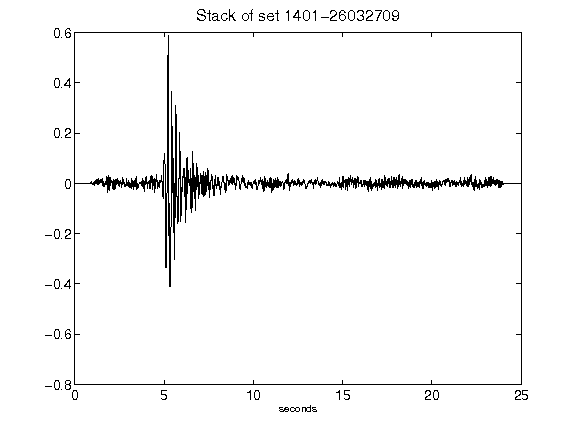](figures/1401-26032709_Stack.png)[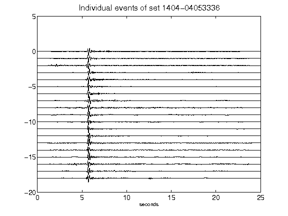](figures/1404-04053336_AllEv.png)[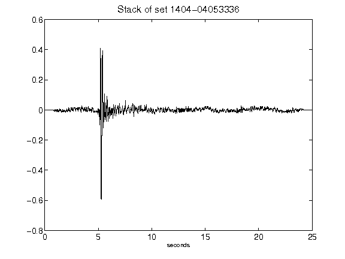](figures/1404-04053336_Stack.png)[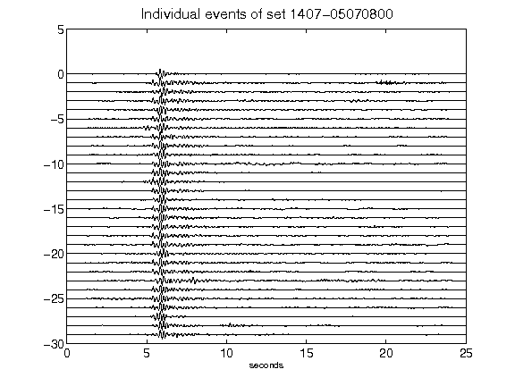](figures/1407-05070800_AllEv.png)[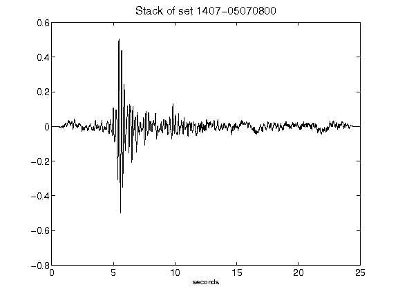](figures/1407-05070800_Stack.png)[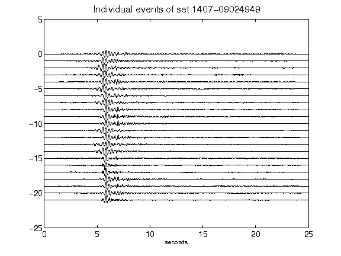](figures/1407-09024949_AllEv.png)[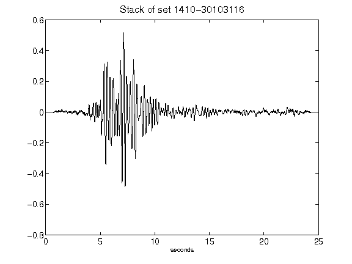](figures/1410-30103116_Stack.png)[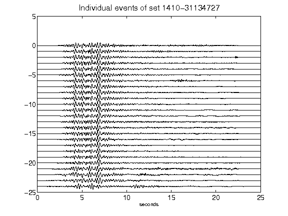](figures/1410-31134727_AllEv.png)[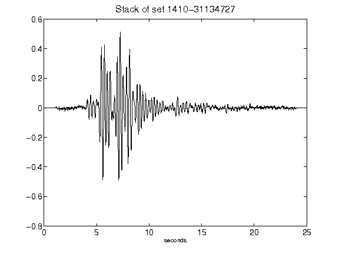](figures/1410-31134727_Stack.png)[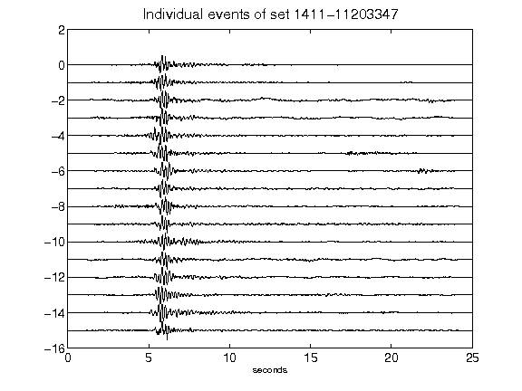](figures/1411-11203347_AllEv.png)[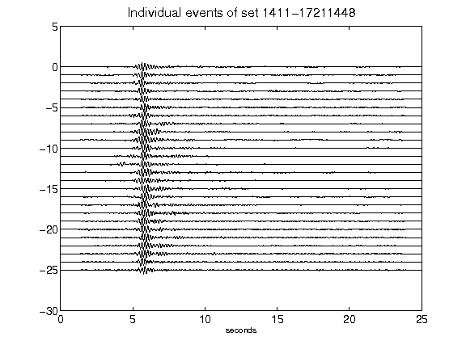](figures/1411-17211448_AllEv.png)