# Repeating Earthquake Activity at RCM

## Waveforms
[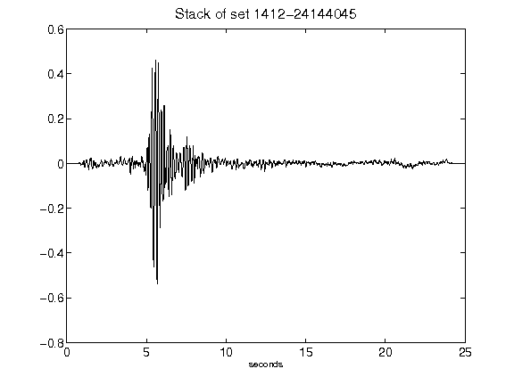](figures/1412-24144045_Stack.png)[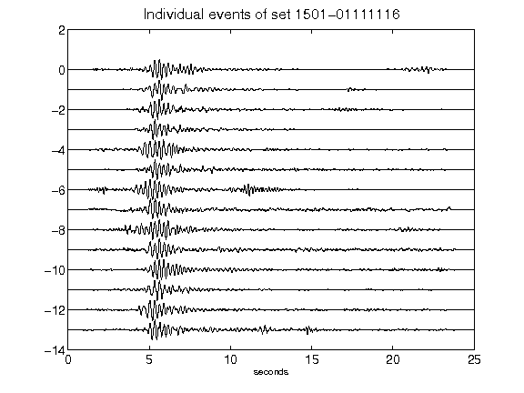](figures/1501-01111116_AllEv.png)[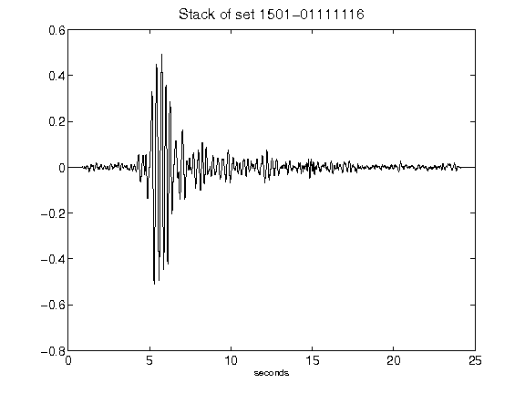](figures/1501-01111116_Stack.png)[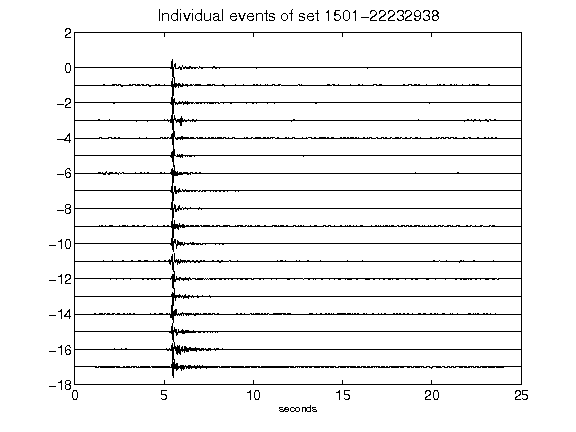](figures/1501-22232938_AllEv.png)[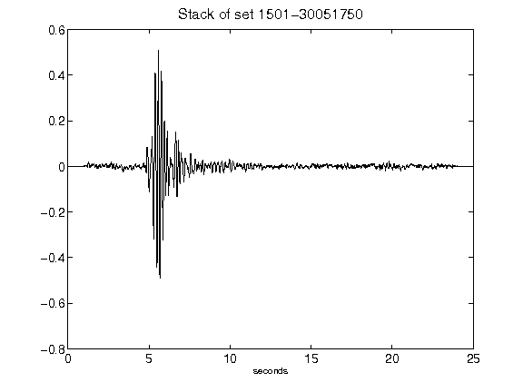](figures/1501-30051750_Stack.png)[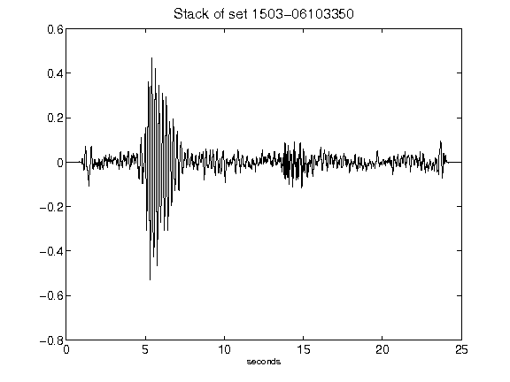](figures/1503-06103350_Stack.png)[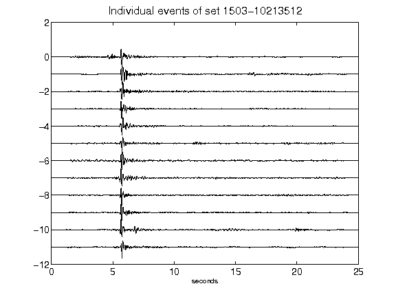](figures/1503-10213512_AllEv.png)[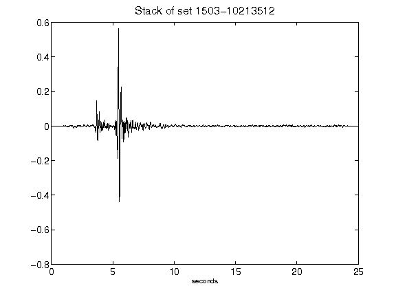](figures/1503-10213512_Stack.png)[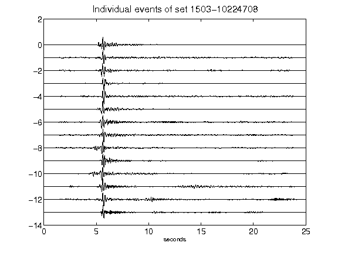](figures/1503-10224708_AllEv.png)[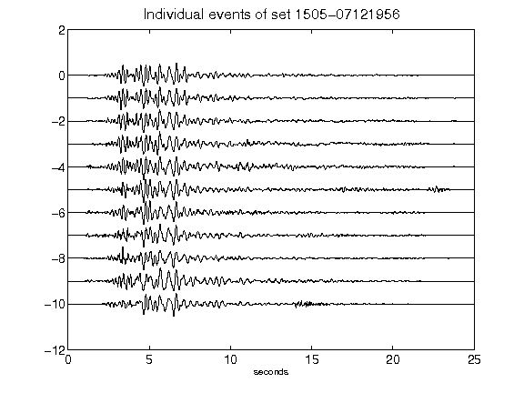](figures/1505-07121956_AllEv.png)[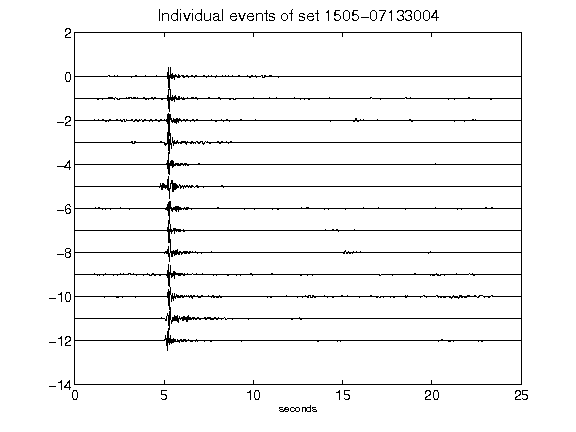](figures/1505-07133004_AllEv.png)[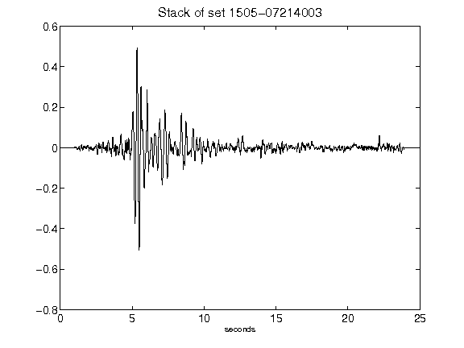](figures/1505-07214003_Stack.png)[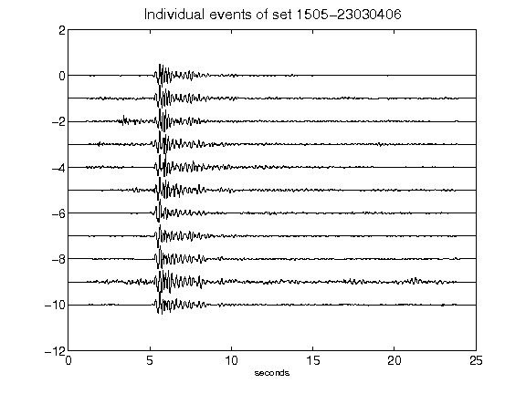](figures/1505-23030406_AllEv.png)