# Repeating Earthquake Activity at RCM

## Waveforms
[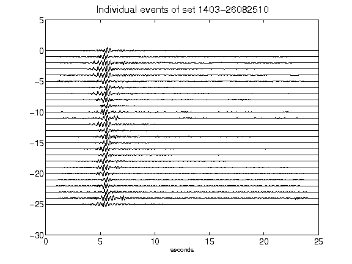](figures/1403-26082510_AllEv.png)[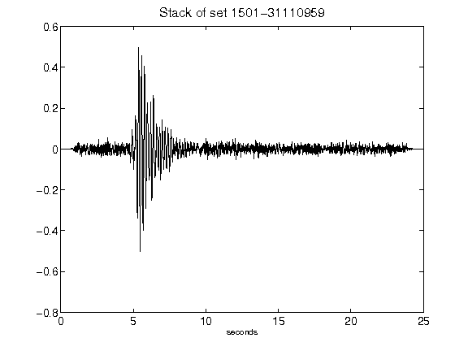](figures/1501-31110959_Stack.png)[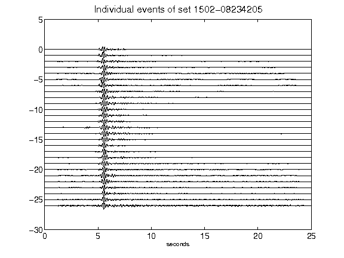](figures/1502-08234205_AllEv.png)[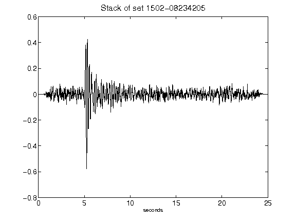](figures/1502-08234205_Stack.png)[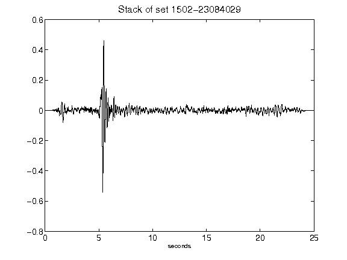](figures/1502-23084029_Stack.png)[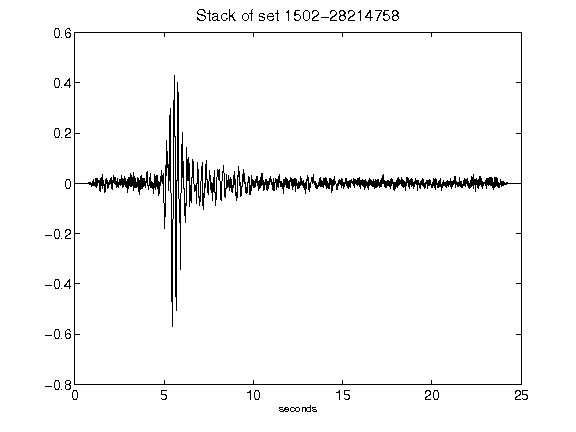](figures/1502-28214758_Stack.png)[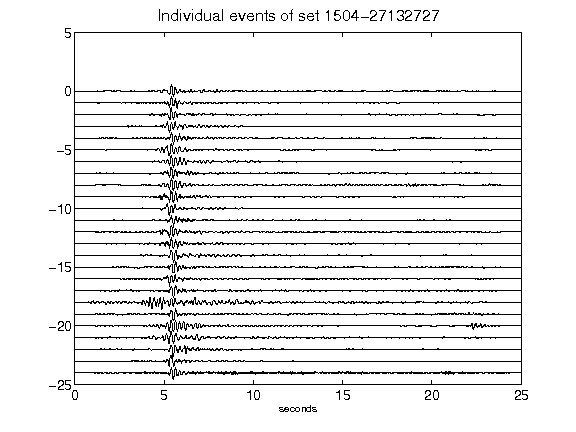](figures/1504-27132727_AllEv.png)[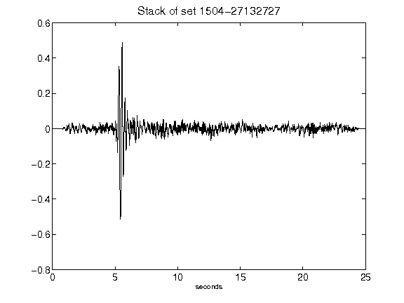](figures/1504-27132727_Stack.png)[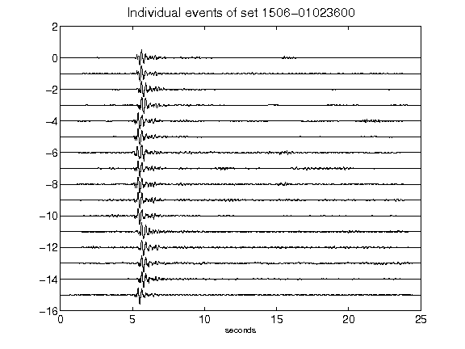](figures/1506-01023600_AllEv.png)[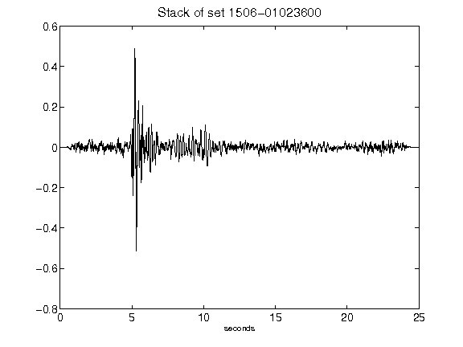](figures/1506-01023600_Stack.png)[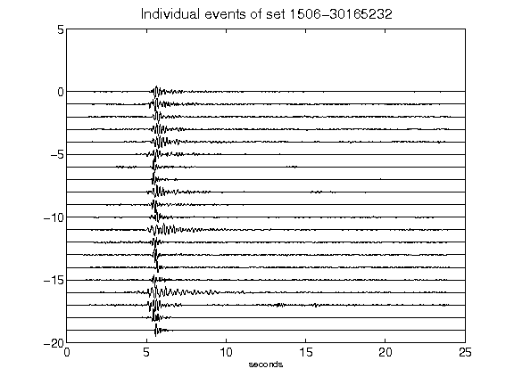](figures/1506-30165232_AllEv.png)[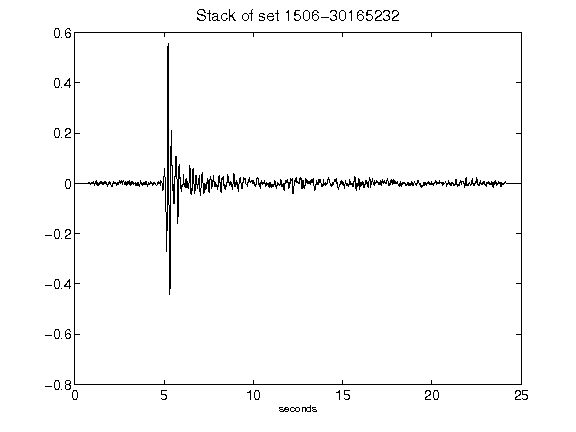](figures/1506-30165232_Stack.png)[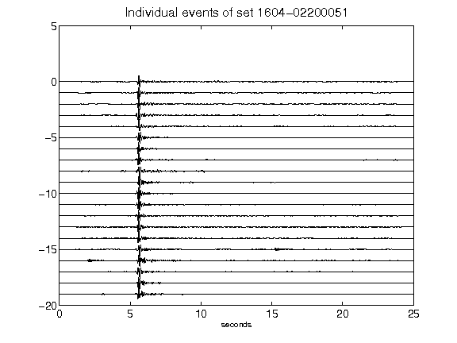](figures/1604-02200051_AllEv.png)[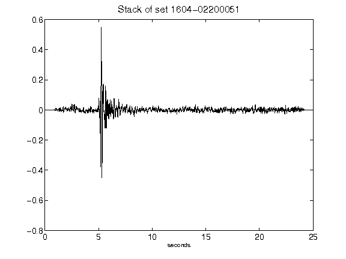](figures/1604-02200051_Stack.png)[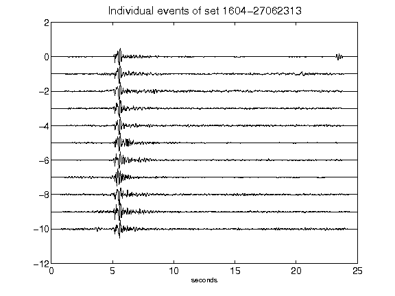](figures/1604-27062313_AllEv.png)[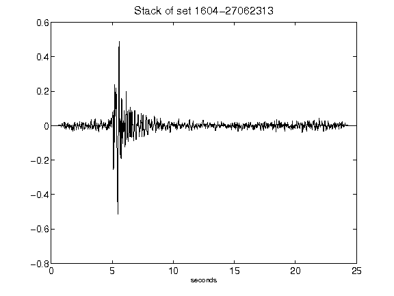](figures/1604-27062313_Stack.png)[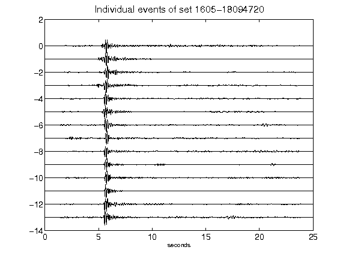](figures/1605-18094720_AllEv.png)[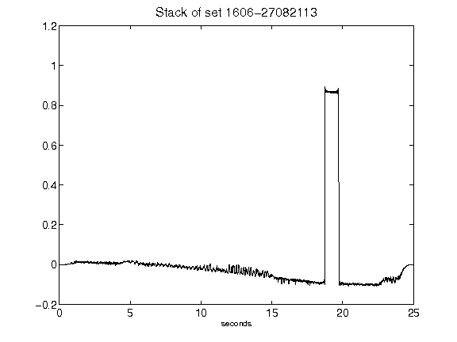](figures/1606-27082113_Stack.png)