# Repeating Earthquake Activity at RCM

## Waveforms
[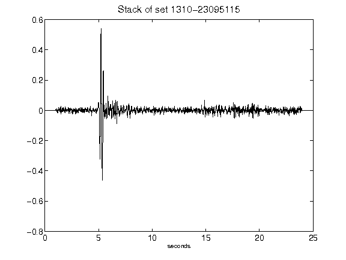](figures/1310-23095115_Stack.png)[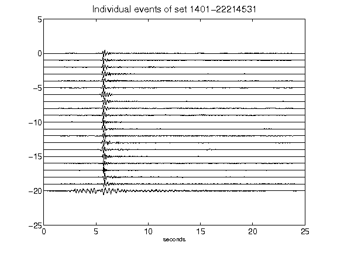](figures/1401-22214531_AllEv.png)[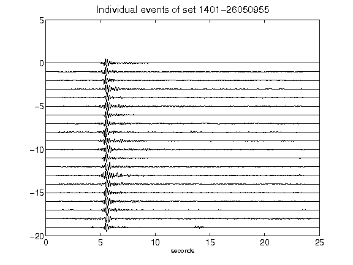](figures/1401-26050955_AllEv.png)[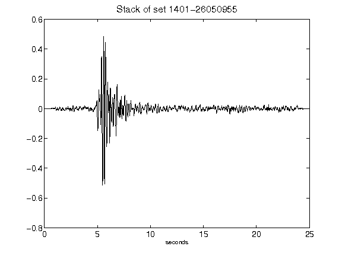](figures/1401-26050955_Stack.png)[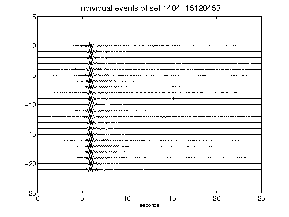](figures/1404-15120453_AllEv.png)[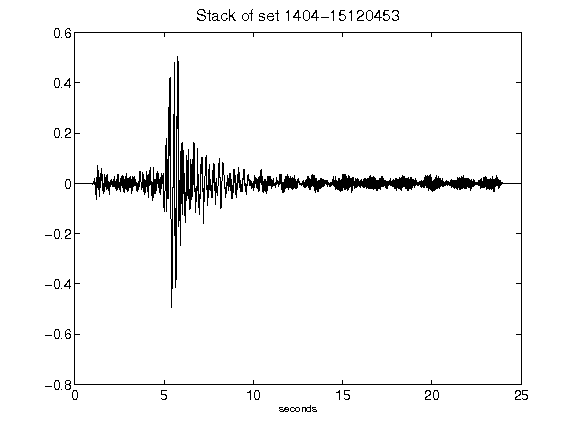](figures/1404-15120453_Stack.png)[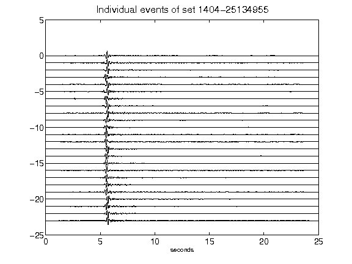](figures/1404-25134955_AllEv.png)[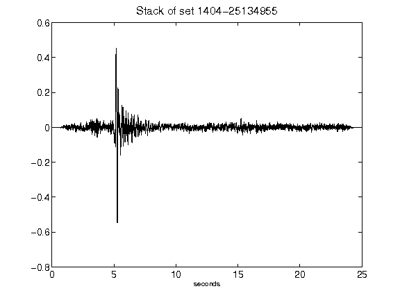](figures/1404-25134955_Stack.png)[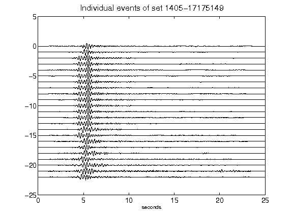](figures/1405-17175149_AllEv.png)[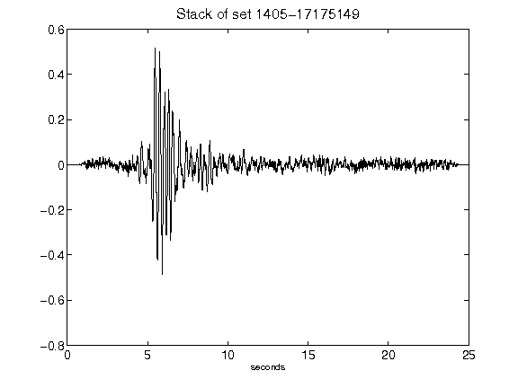](figures/1405-17175149_Stack.png)[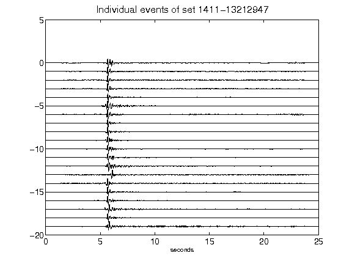](figures/1411-13212947_AllEv.png)[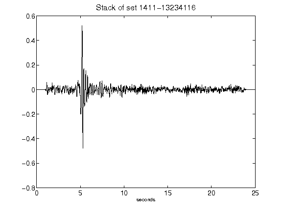](figures/1411-13234116_Stack.png)[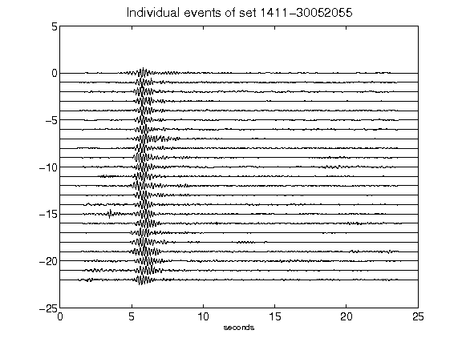](figures/1411-30052055_AllEv.png)[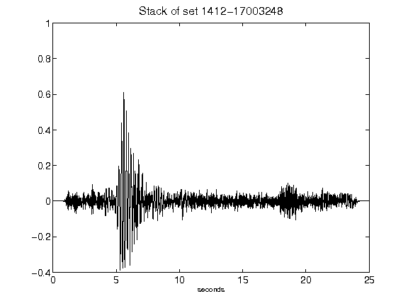](figures/1412-17003248_Stack.png)[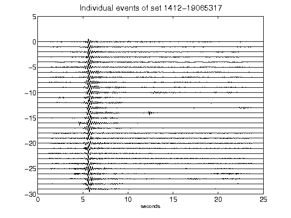](figures/1412-19065317_AllEv.png)[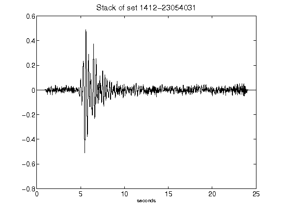](figures/1412-23054031_Stack.png)[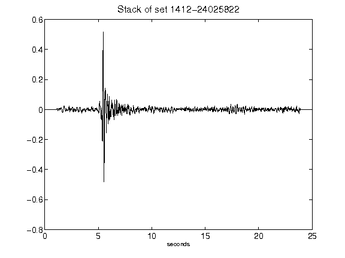](figures/1412-24025822_Stack.png)[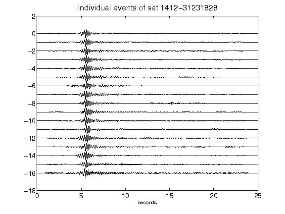](figures/1412-31231828_AllEv.png)[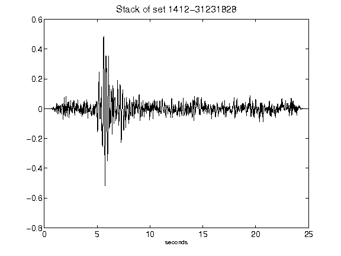](figures/1412-31231828_Stack.png)[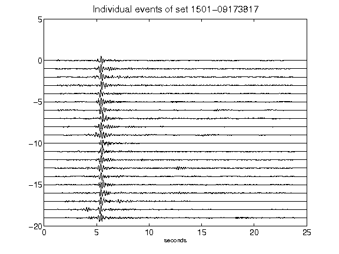](figures/1501-09173817_AllEv.png)[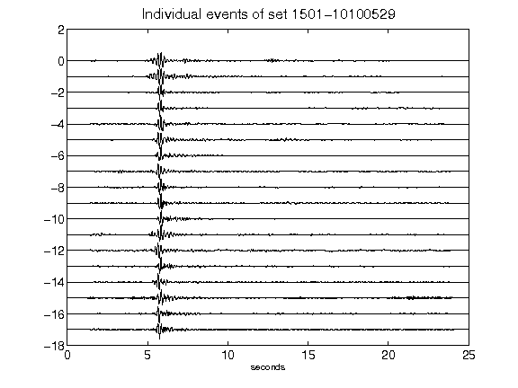](figures/1501-10100529_AllEv.png)[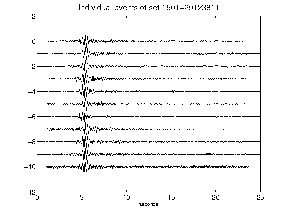](figures/1501-29123811_AllEv.png)[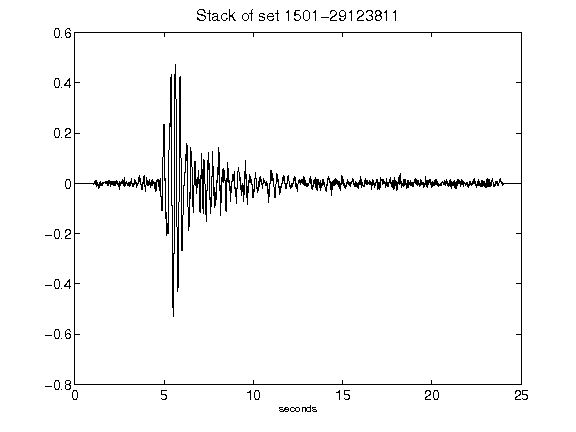](figures/1501-29123811_Stack.png)[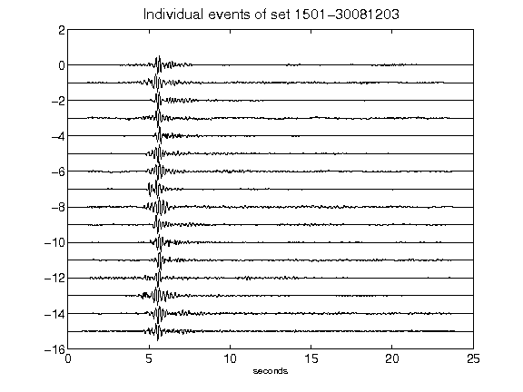](figures/1501-30081203_AllEv.png)[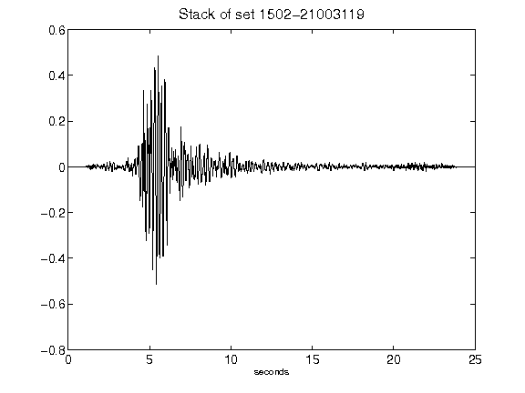](figures/1502-21003119_Stack.png)[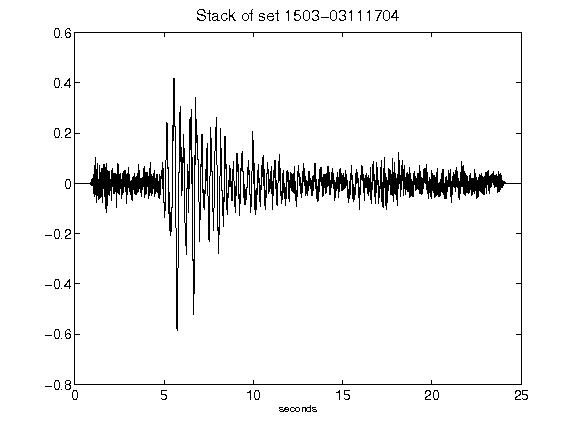](figures/1503-03111704_Stack.png)[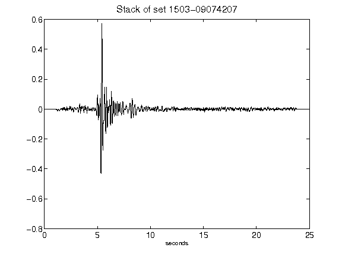](figures/1503-09074207_Stack.png)[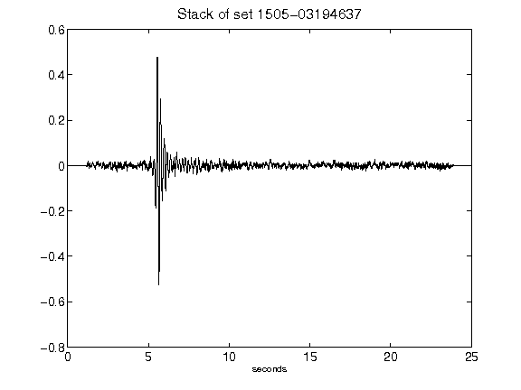](figures/1505-03194637_Stack.png)[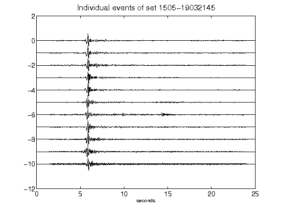](figures/1505-19032145_AllEv.png)[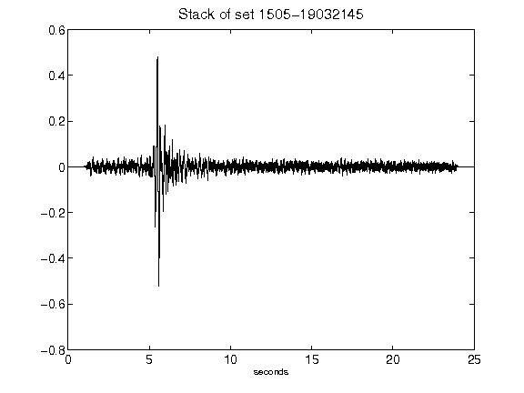](figures/1505-19032145_Stack.png)[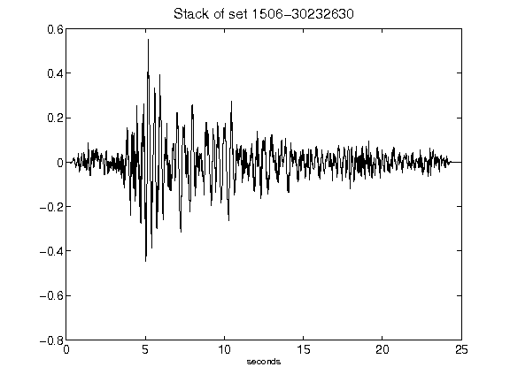](figures/1506-30232630_Stack.png)