# Repeating Earthquake Activity at RCM

## Waveforms
[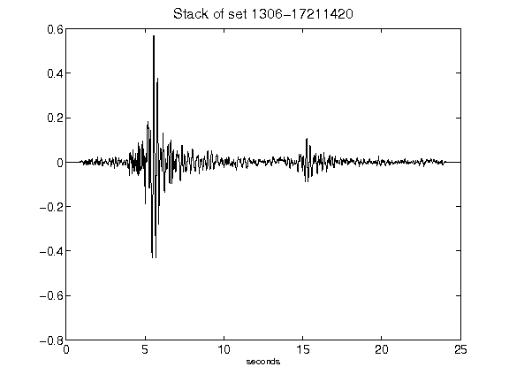](figures/1306-17211420_Stack.png)[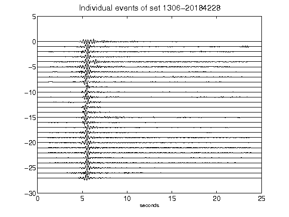](figures/1306-20184228_AllEv.png)[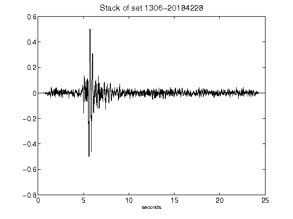](figures/1306-20184228_Stack.png)[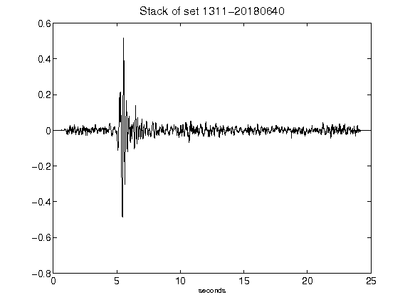](figures/1311-20180640_Stack.png)[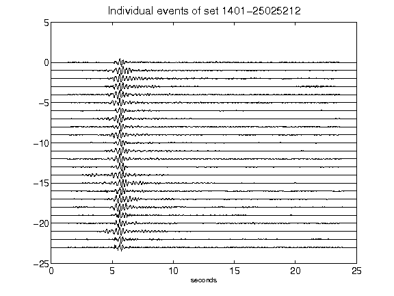](figures/1401-25025212_AllEv.png)[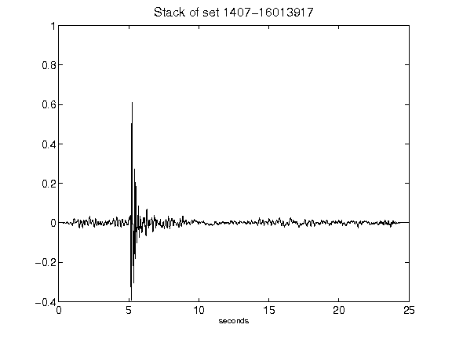](figures/1407-16013917_Stack.png)[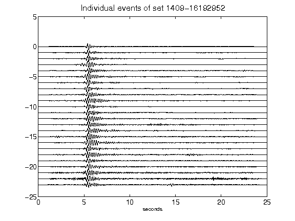](figures/1409-16192952_AllEv.png)[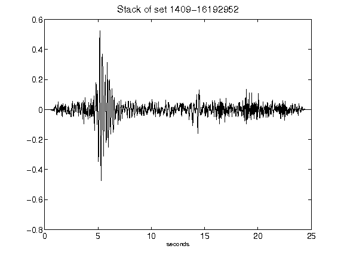](figures/1409-16192952_Stack.png)[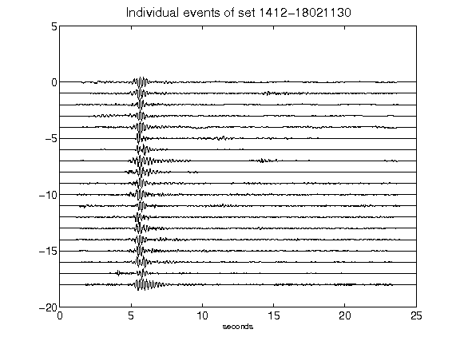](figures/1412-18021130_AllEv.png)[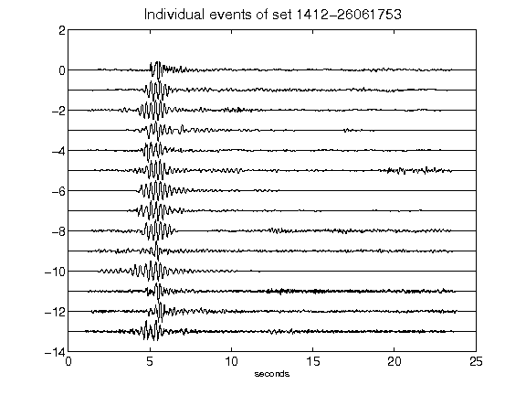](figures/1412-26061753_AllEv.png)[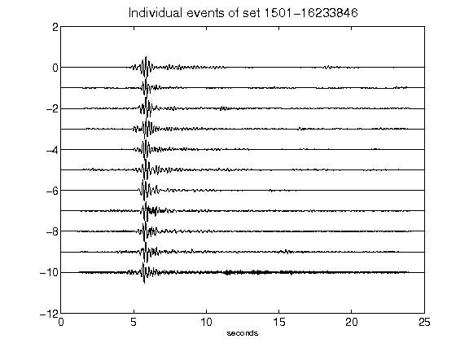](figures/1501-16233846_AllEv.png)[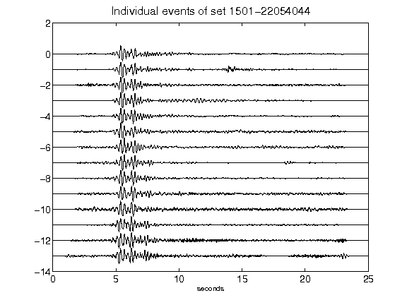](figures/1501-22054044_AllEv.png)[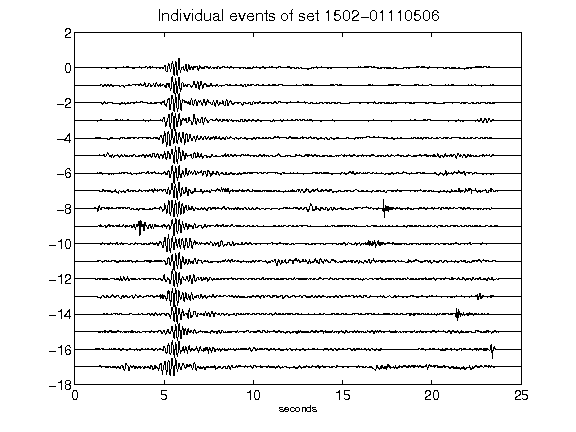](figures/1502-01110506_AllEv.png)[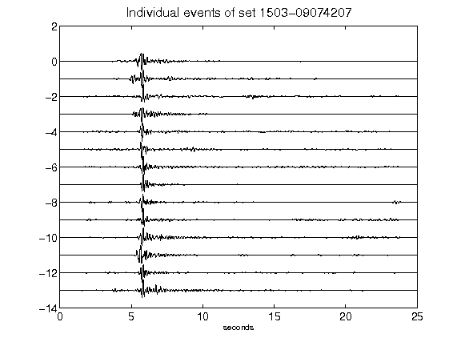](figures/1503-09074207_AllEv.png)[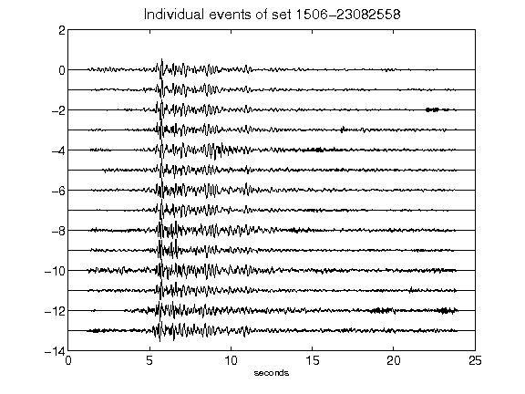](figures/1506-23082558_AllEv.png)