# Repeating Earthquake Activity at RCM

## Waveforms
[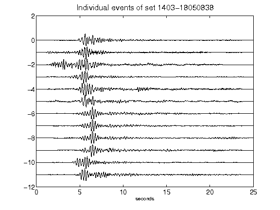](figures/1403-18050838_AllEv.png)[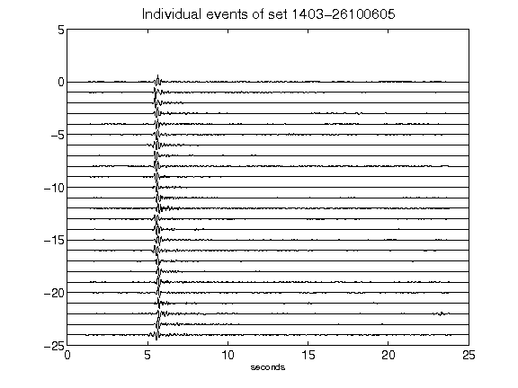](figures/1403-26100605_AllEv.png)[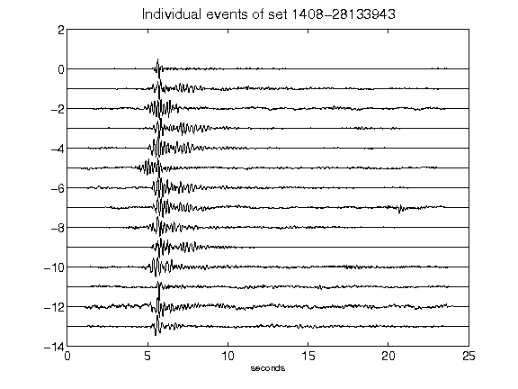](figures/1408-28133943_AllEv.png)[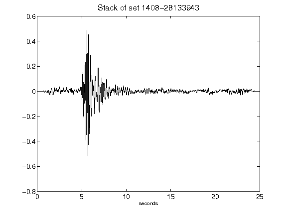](figures/1408-28133943_Stack.png)[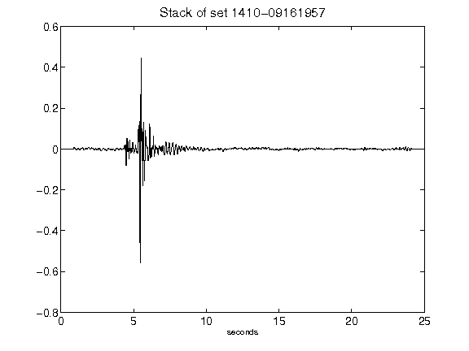](figures/1410-09161957_Stack.png)[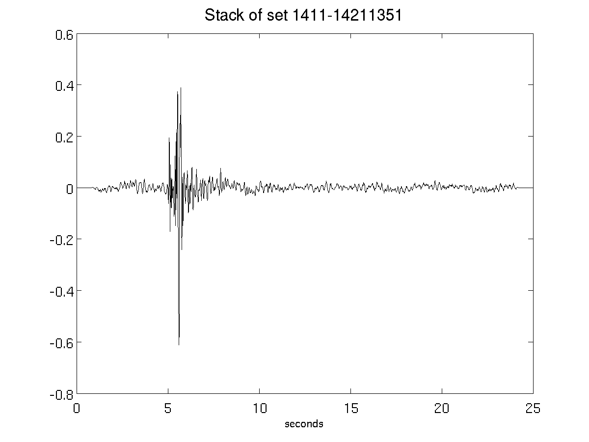](figures/1411-14211351_Stack.png)[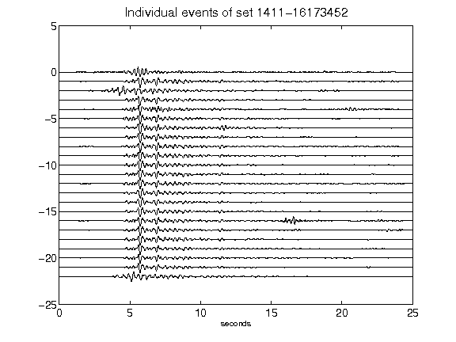](figures/1411-16173452_AllEv.png)[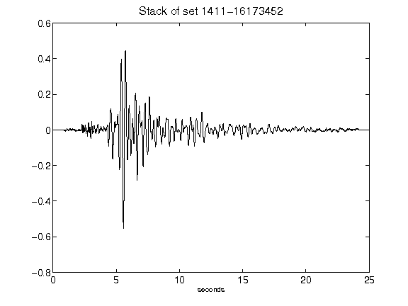](figures/1411-16173452_Stack.png)[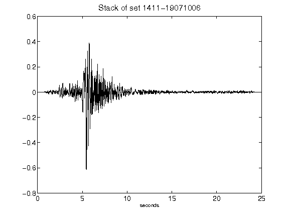](figures/1411-19071006_Stack.png)[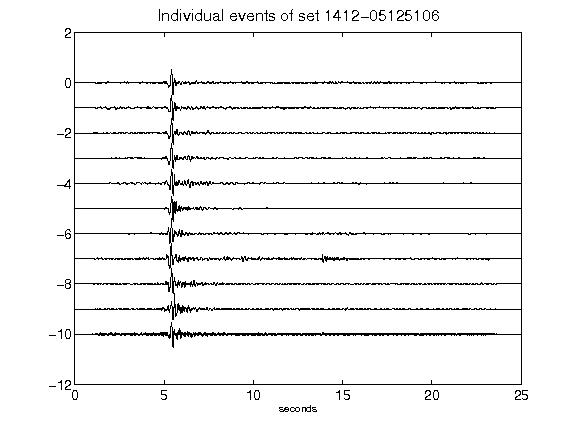](figures/1412-05125106_AllEv.png)[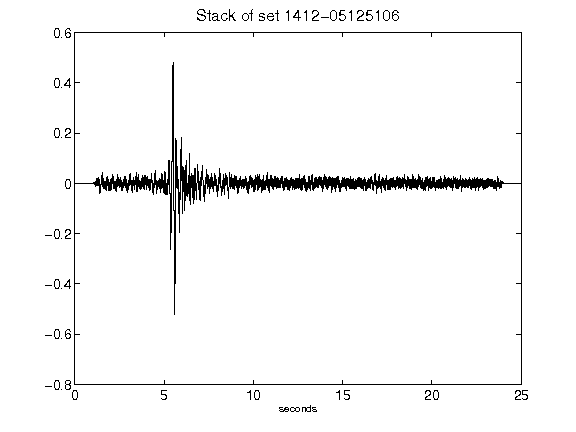](figures/1412-05125106_Stack.png)[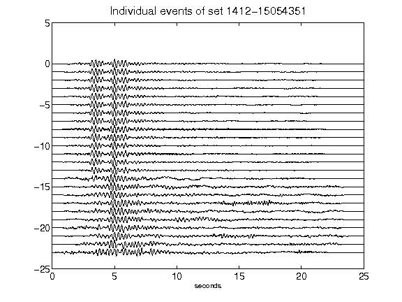](figures/1412-15054351_AllEv.png)[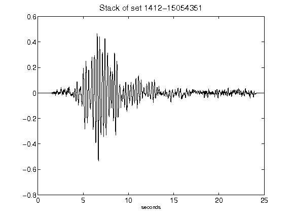](figures/1412-15054351_Stack.png)[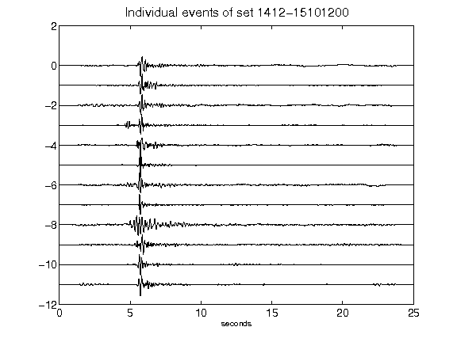](figures/1412-15101200_AllEv.png)[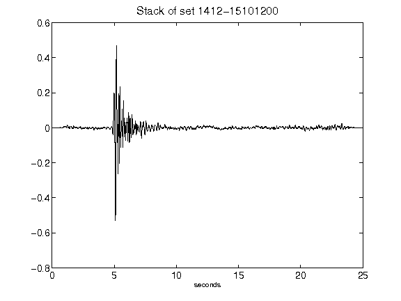](figures/1412-15101200_Stack.png)[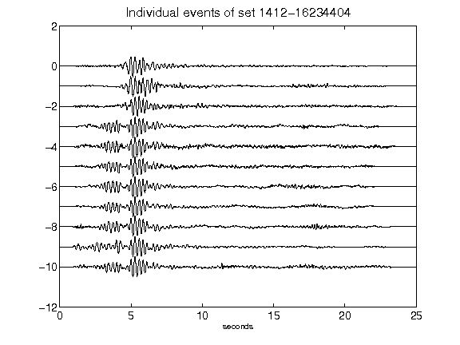](figures/1412-16234404_AllEv.png)[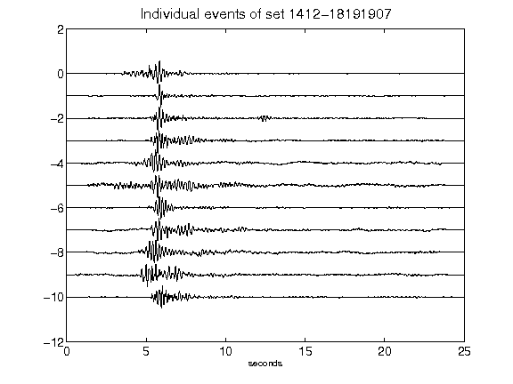](figures/1412-18191907_AllEv.png)[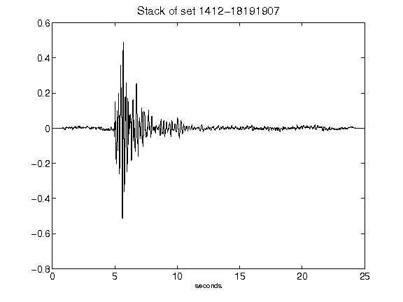](figures/1412-18191907_Stack.png)[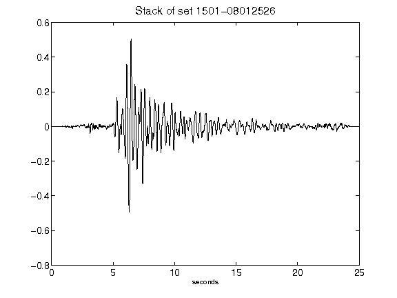](figures/1501-08012526_Stack.png)[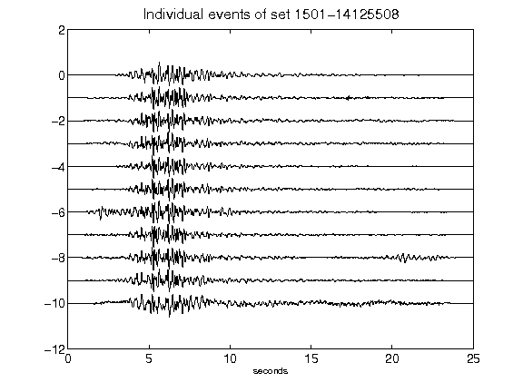](figures/1501-14125508_AllEv.png)[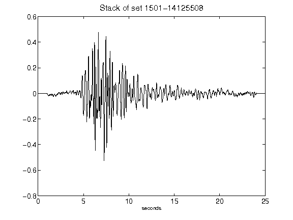](figures/1501-14125508_Stack.png)[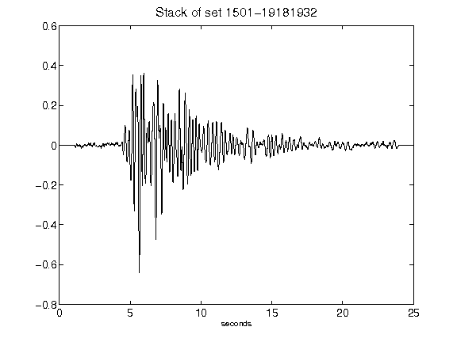](figures/1501-19181932_Stack.png)[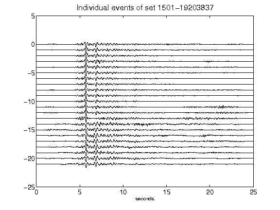](figures/1501-19203837_AllEv.png)[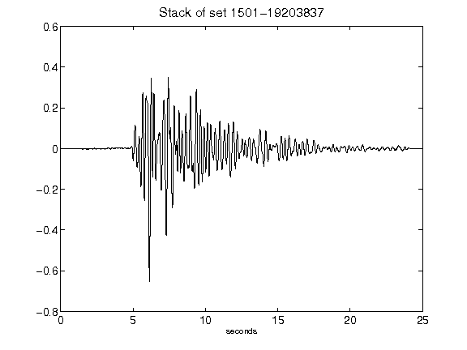](figures/1501-19203837_Stack.png)[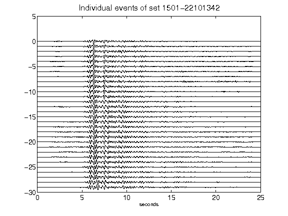](figures/1501-22101342_AllEv.png)[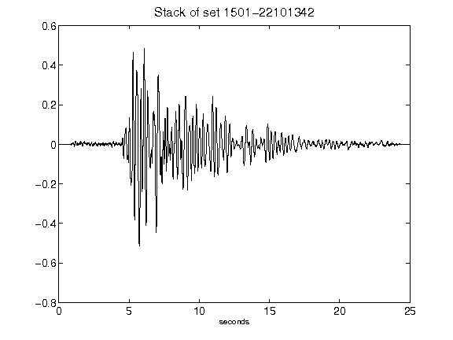](figures/1501-22101342_Stack.png)[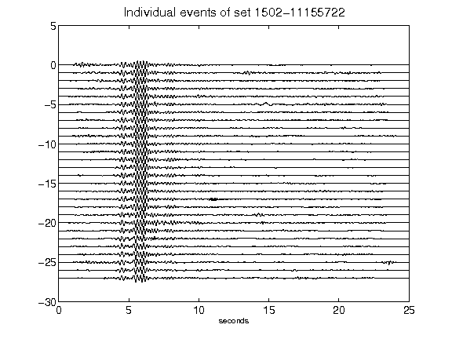](figures/1502-11155722_AllEv.png)[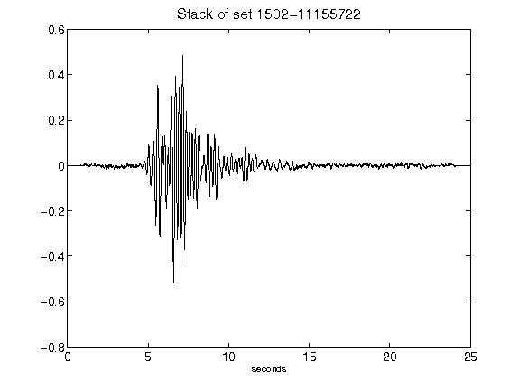](figures/1502-11155722_Stack.png)[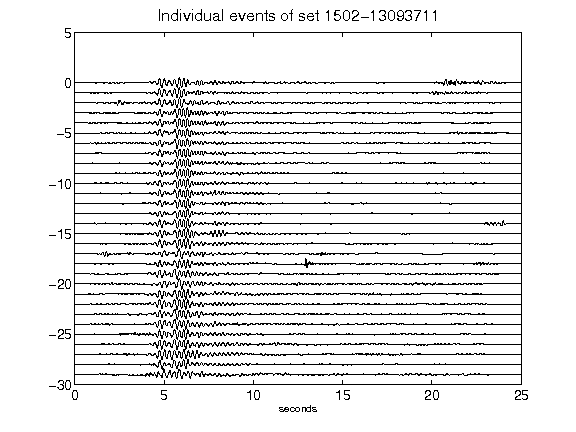](figures/1502-13093711_AllEv.png)[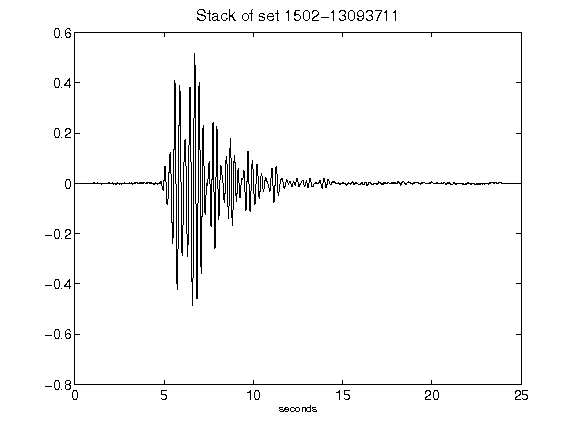](figures/1502-13093711_Stack.png)