# Repeating Earthquake Activity at RCM

## Waveforms
[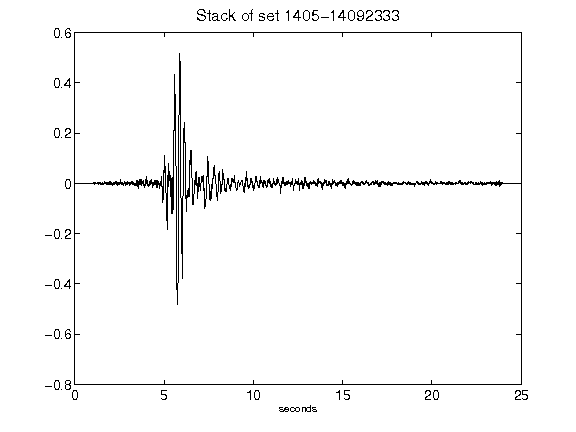](figures/1405-14092333_Stack.png)[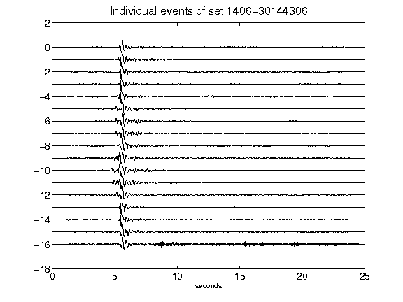](figures/1406-30144306_AllEv.png)[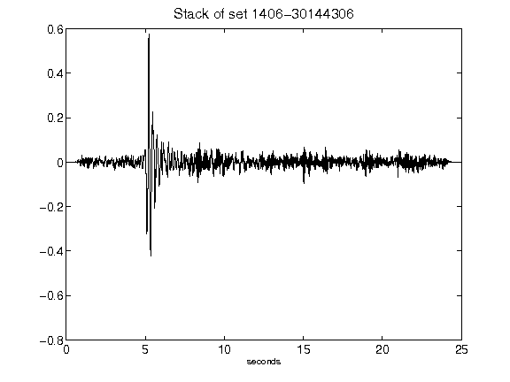](figures/1406-30144306_Stack.png)[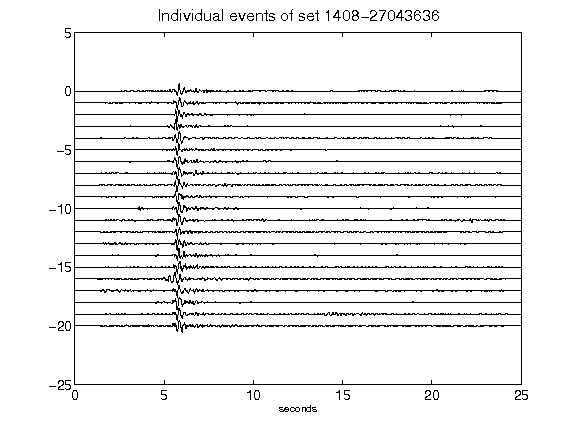](figures/1408-27043636_AllEv.png)[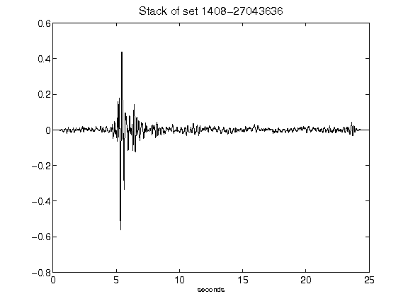](figures/1408-27043636_Stack.png)[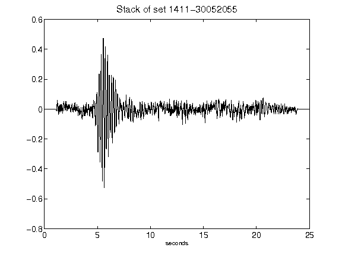](figures/1411-30052055_Stack.png)[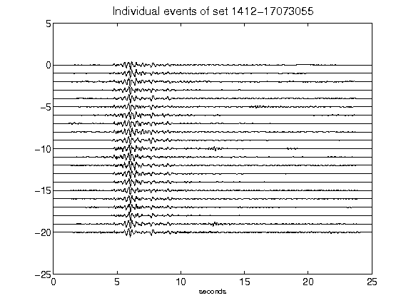](figures/1412-17073055_AllEv.png)[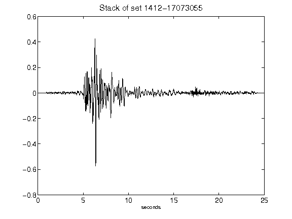](figures/1412-17073055_Stack.png)[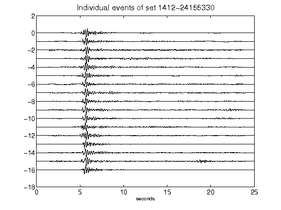](figures/1412-24155330_AllEv.png)[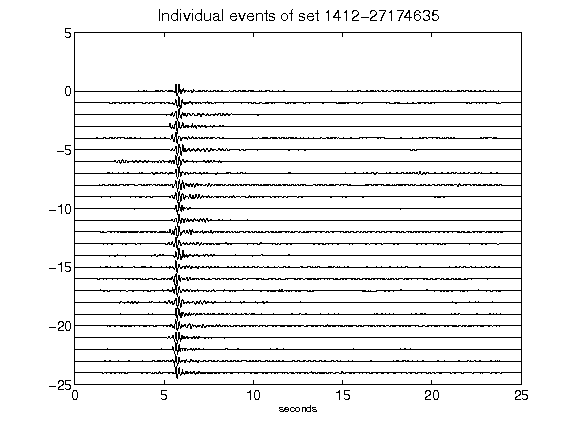](figures/1412-27174635_AllEv.png)[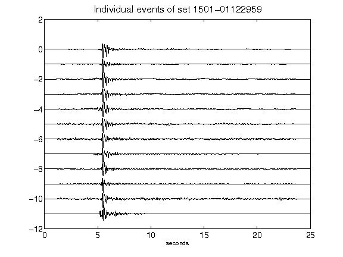](figures/1501-01122959_AllEv.png)[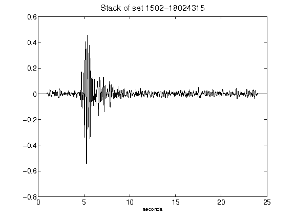](figures/1502-18024315_Stack.png)[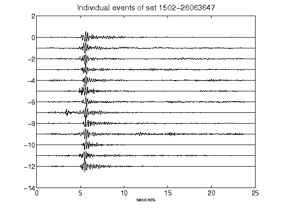](figures/1502-26063647_AllEv.png)[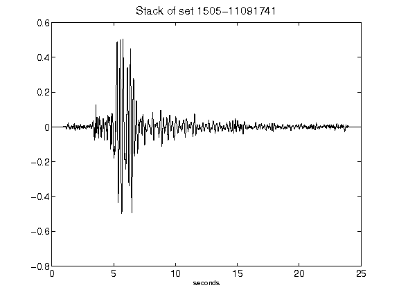](figures/1505-11091741_Stack.png)[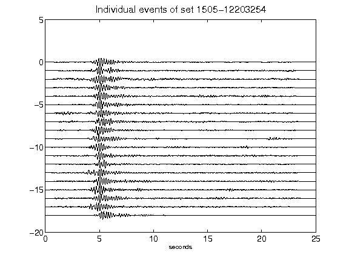](figures/1505-12203254_AllEv.png)[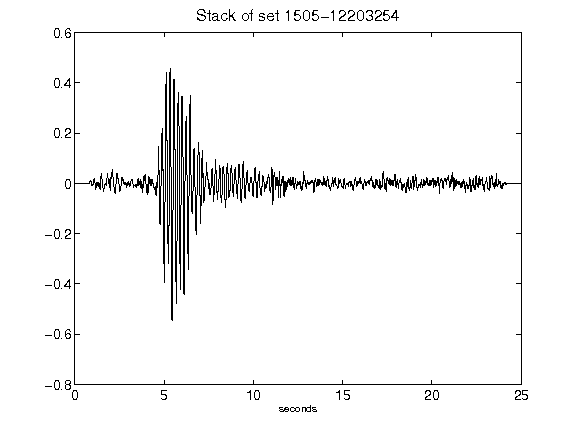](figures/1505-12203254_Stack.png)