# Repeating Earthquake Activity at RCM

## Waveforms
[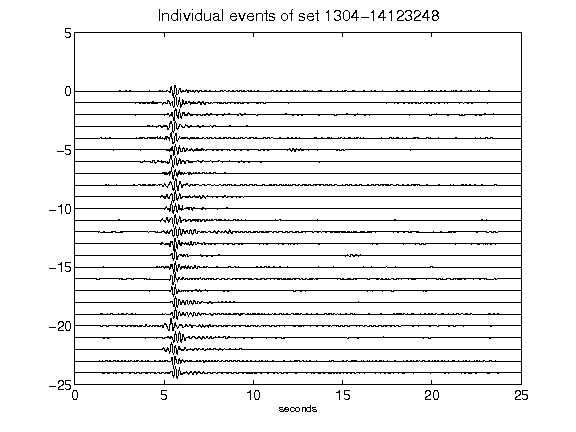](figures/1304-14123248_AllEv.png)[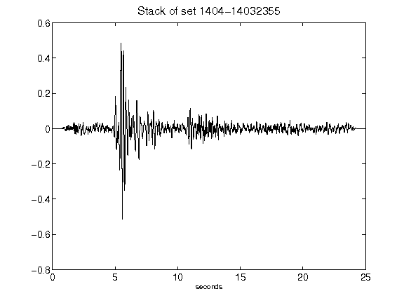](figures/1404-14032355_Stack.png)[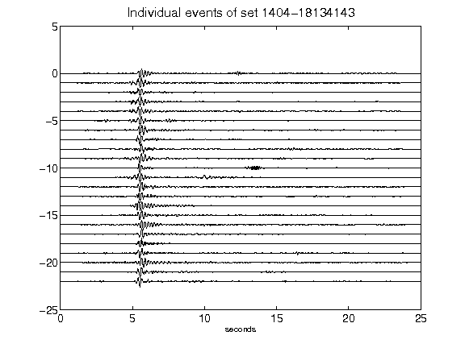](figures/1404-18134143_AllEv.png)[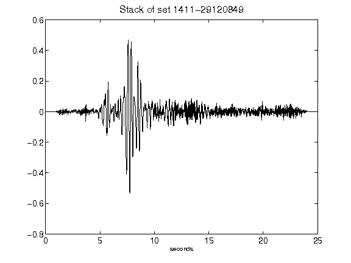](figures/1411-29120849_Stack.png)[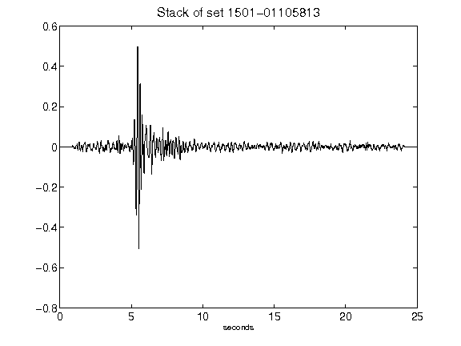](figures/1501-01105813_Stack.png)[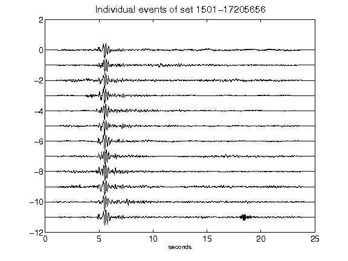](figures/1501-17205656_AllEv.png)[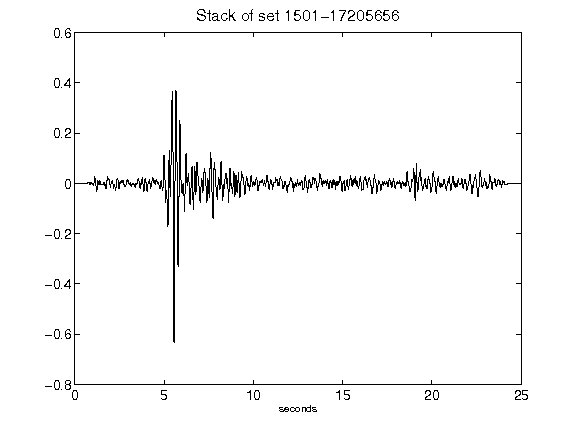](figures/1501-17205656_Stack.png)[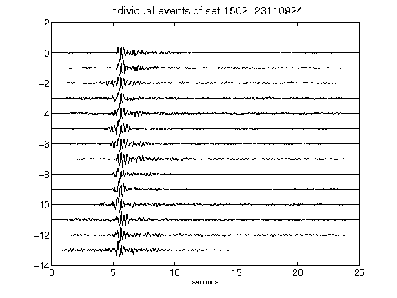](figures/1502-23110924_AllEv.png)[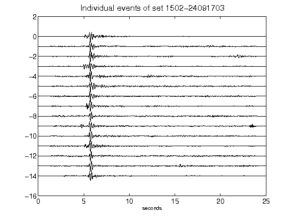](figures/1502-24091703_AllEv.png)[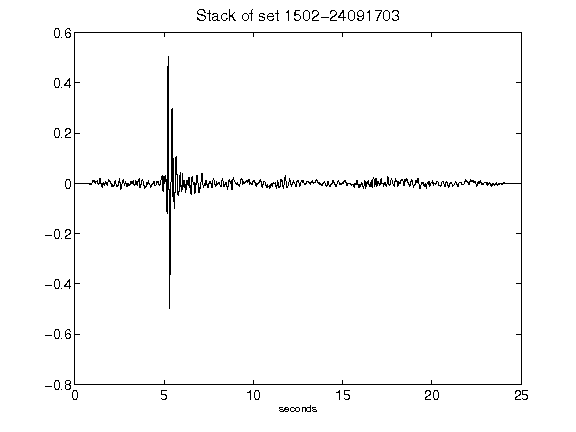](figures/1502-24091703_Stack.png)[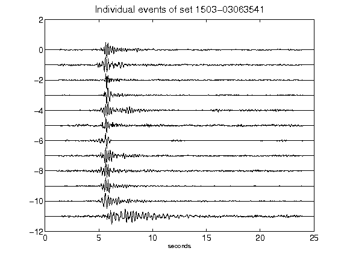](figures/1503-03063541_AllEv.png)[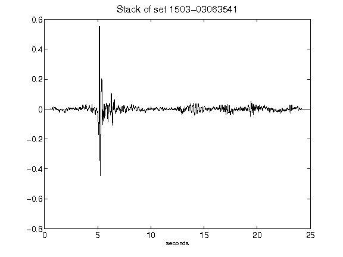](figures/1503-03063541_Stack.png)[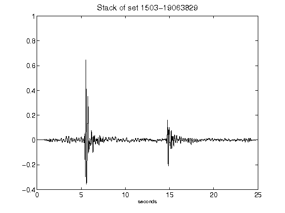](figures/1503-19063829_Stack.png)[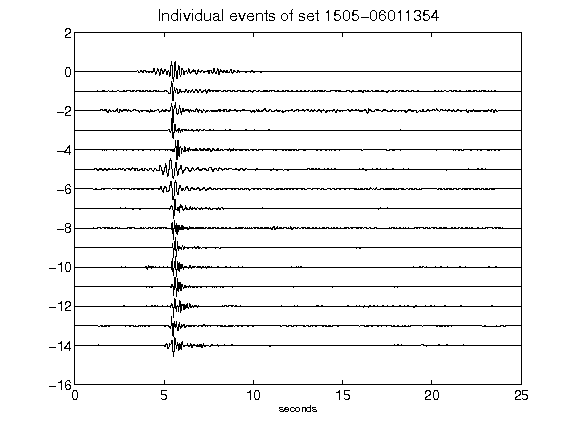](figures/1505-06011354_AllEv.png)[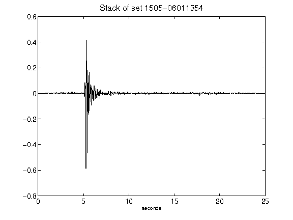](figures/1505-06011354_Stack.png)[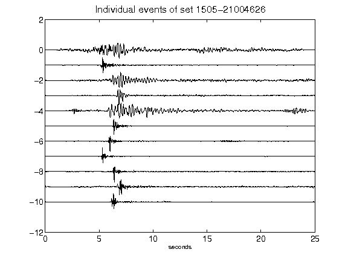](figures/1505-21004626_AllEv.png)[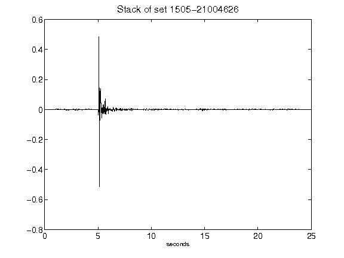](figures/1505-21004626_Stack.png)