# Repeating Earthquake Activity at RCM

## Waveforms
[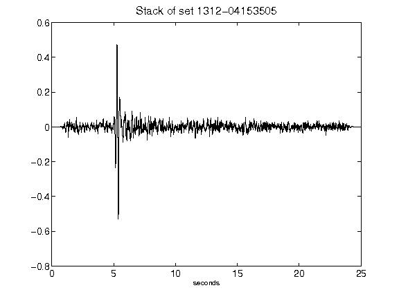](figures/1312-04153505_Stack.png)[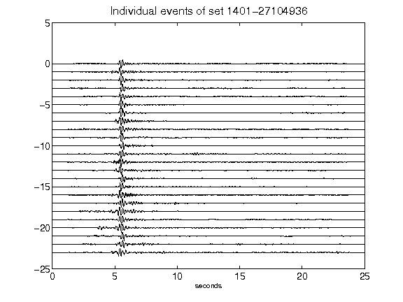](figures/1401-27104936_AllEv.png)[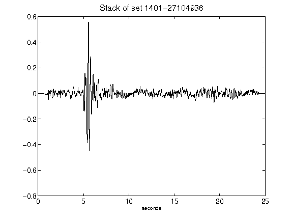](figures/1401-27104936_Stack.png)[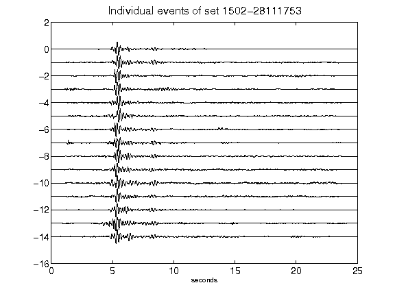](figures/1502-28111753_AllEv.png)[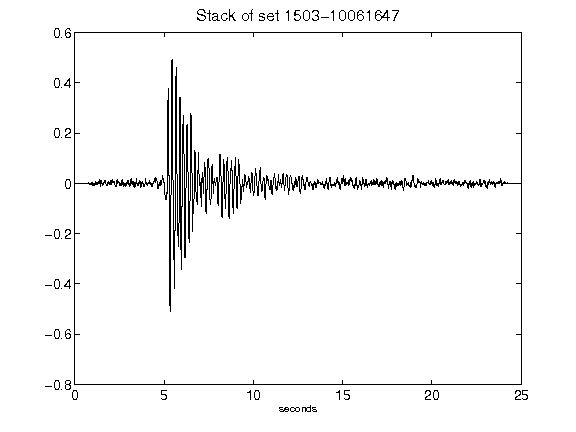](figures/1503-10061647_Stack.png)[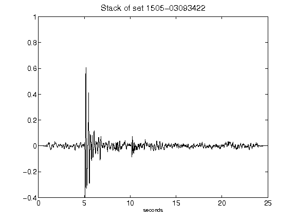](figures/1505-03093422_Stack.png)[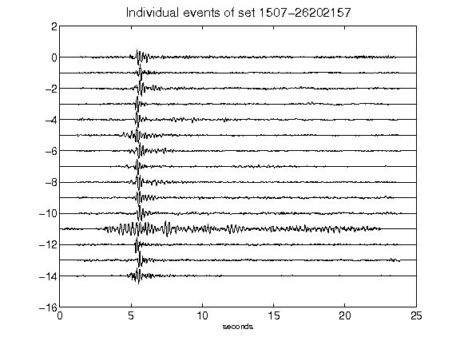](figures/1507-26202157_AllEv.png)[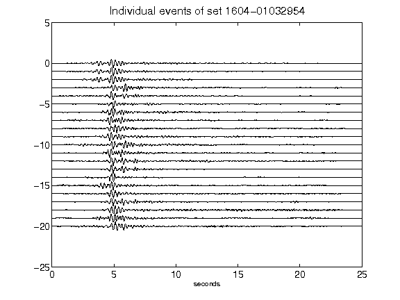](figures/1604-01032954_AllEv.png)[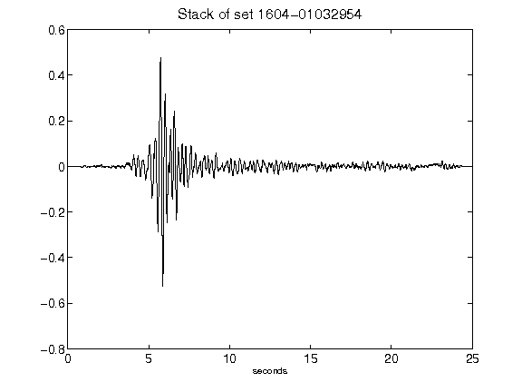](figures/1604-01032954_Stack.png)[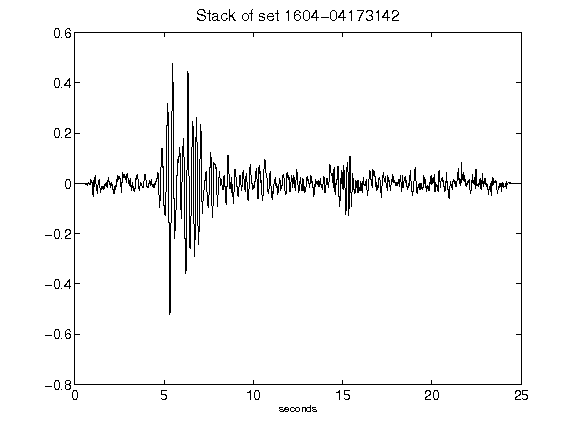](figures/1604-04173142_Stack.png)[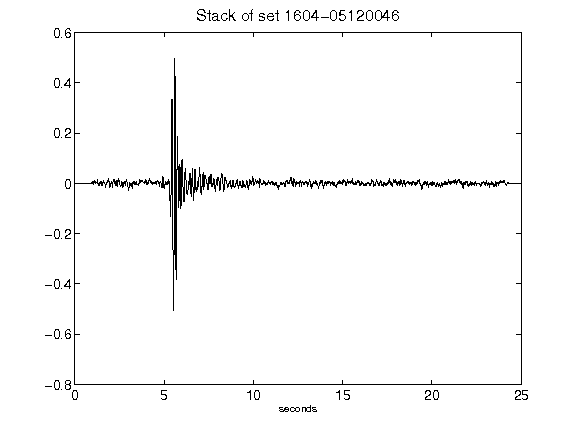](figures/1604-05120046_Stack.png)[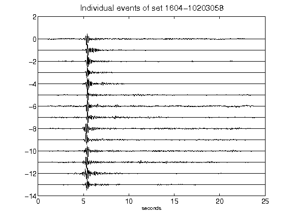](figures/1604-10203058_AllEv.png)[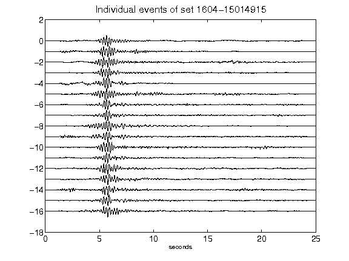](figures/1604-15014915_AllEv.png)[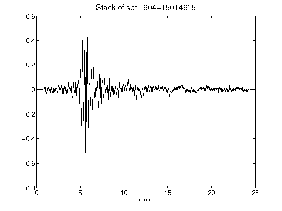](figures/1604-15014915_Stack.png)[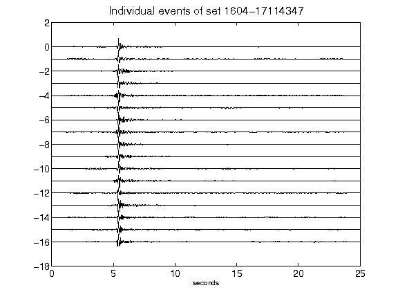](figures/1604-17114347_AllEv.png)[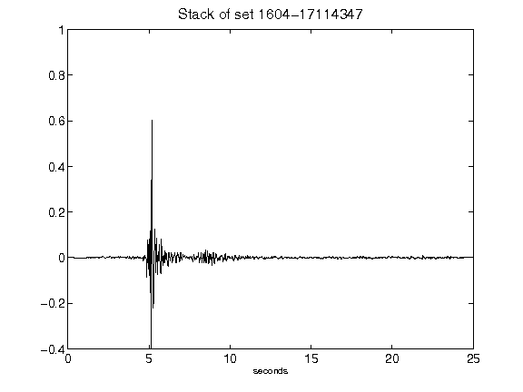](figures/1604-17114347_Stack.png)