# Repeating Earthquake Activity at RCM

## Waveforms
[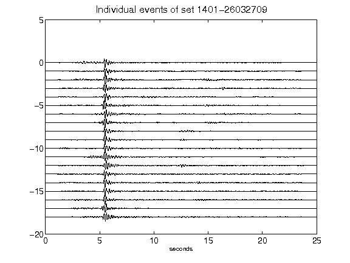](figures/1401-26032709_AllEv.png)[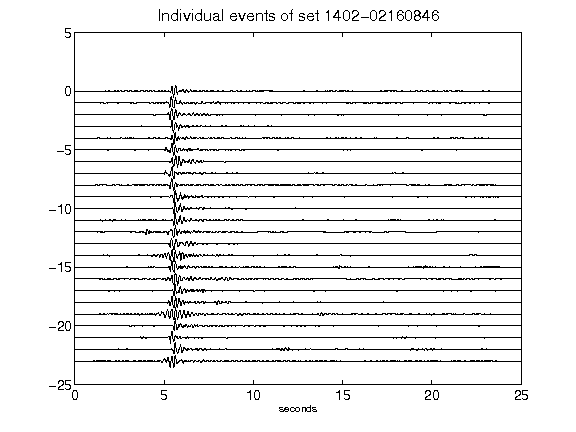](figures/1402-02160846_AllEv.png)[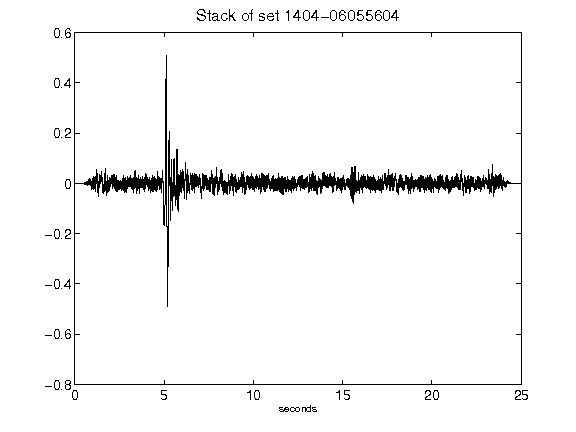](figures/1404-06055604_Stack.png)[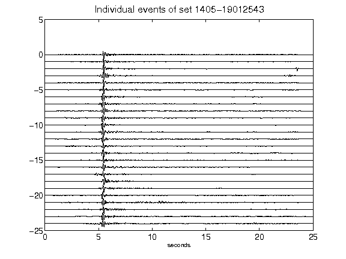](figures/1405-19012543_AllEv.png)[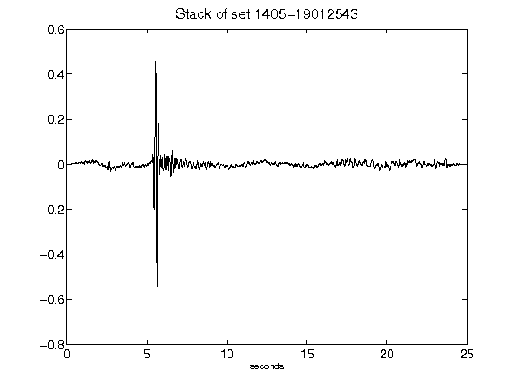](figures/1405-19012543_Stack.png)[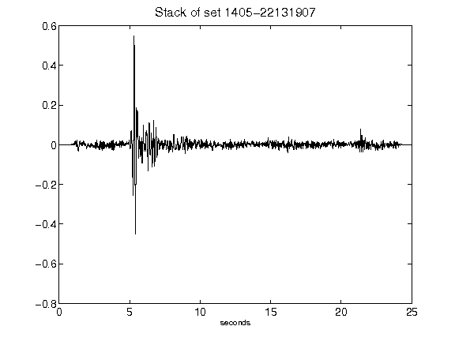](figures/1405-22131907_Stack.png)[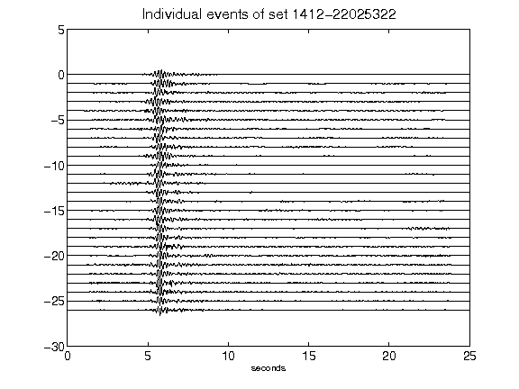](figures/1412-22025322_AllEv.png)[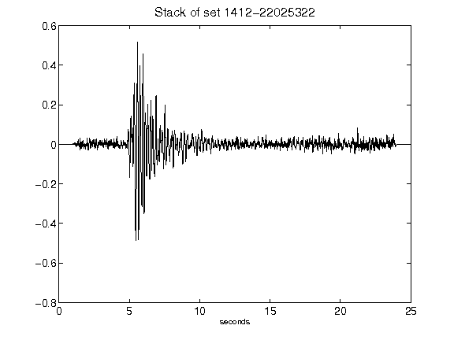](figures/1412-22025322_Stack.png)[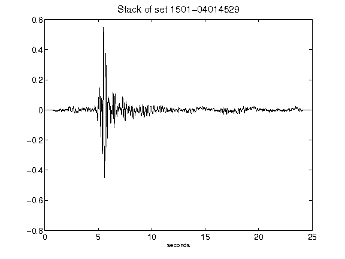](figures/1501-04014529_Stack.png)[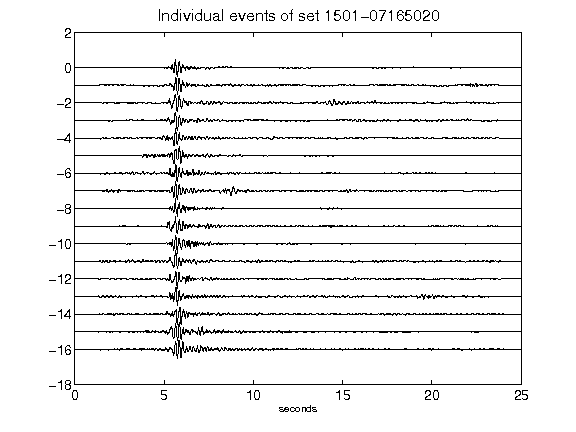](figures/1501-07165020_AllEv.png)[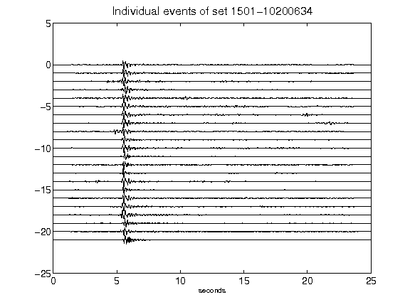](figures/1501-10200634_AllEv.png)[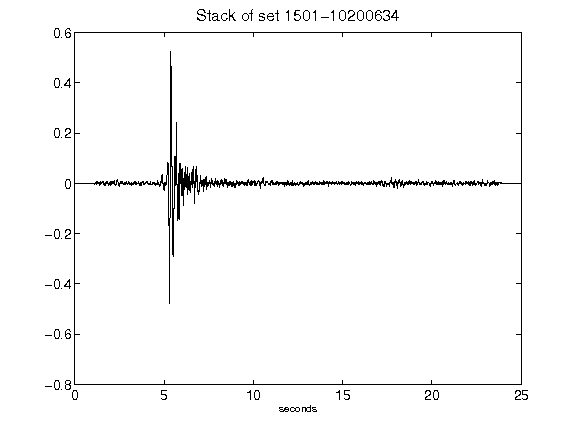](figures/1501-10200634_Stack.png)[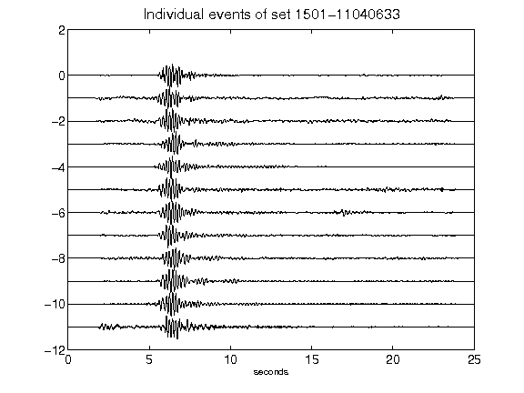](figures/1501-11040633_AllEv.png)[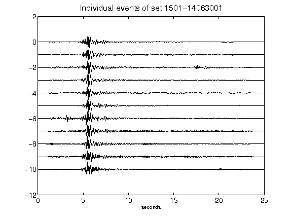](figures/1501-14063001_AllEv.png)[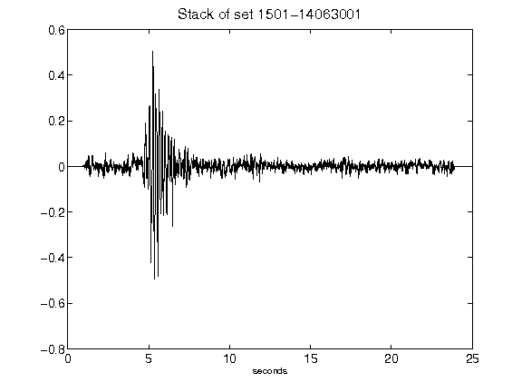](figures/1501-14063001_Stack.png)[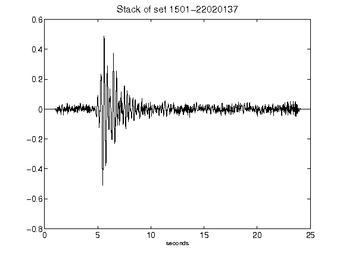](figures/1501-22020137_Stack.png)[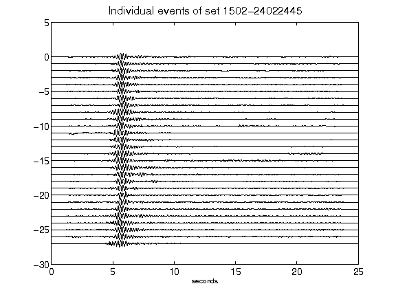](figures/1502-24022445_AllEv.png)[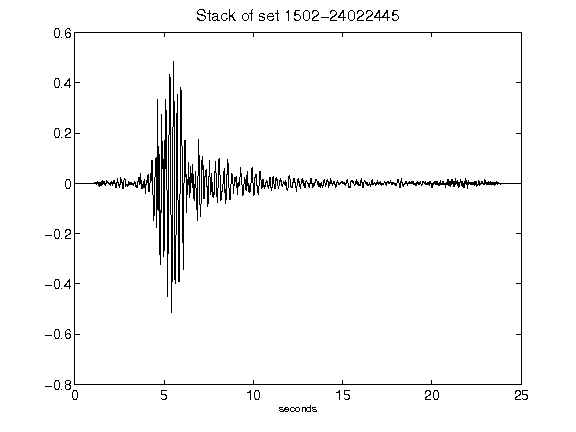](figures/1502-24022445_Stack.png)[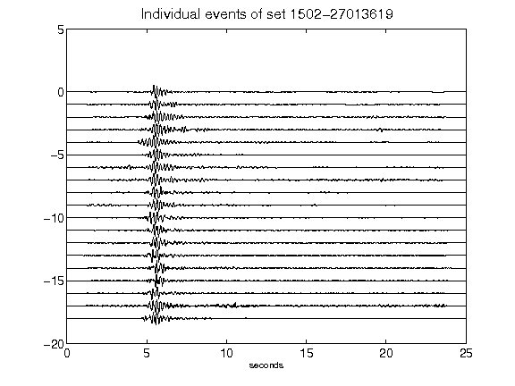](figures/1502-27013619_AllEv.png)[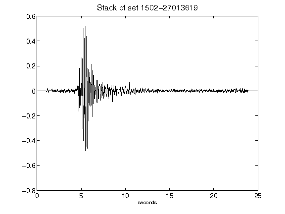](figures/1502-27013619_Stack.png)[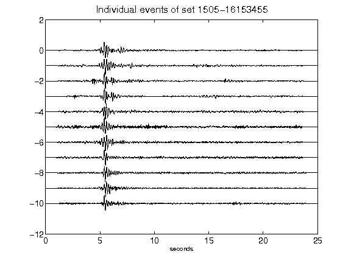](figures/1505-16153455_AllEv.png)[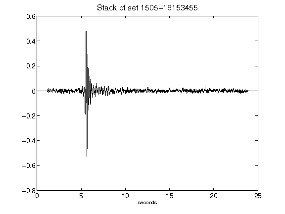](figures/1505-16153455_Stack.png)