# Repeating Earthquake Activity at RCM

## Waveforms
[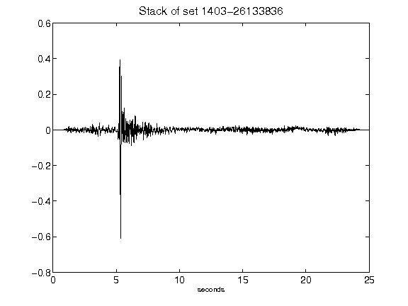](figures/1403-26133836_Stack.png)[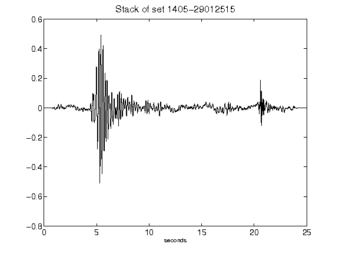](figures/1405-29012515_Stack.png)[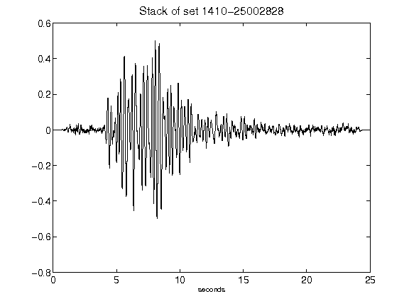](figures/1410-25002828_Stack.png)[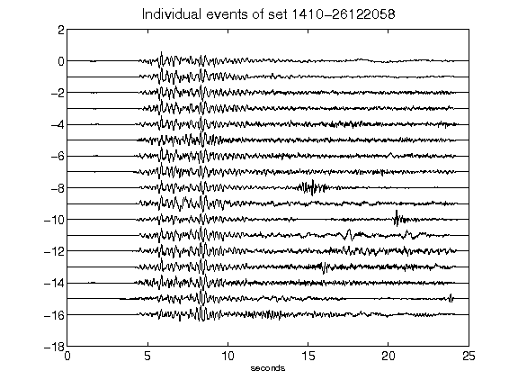](figures/1410-26122058_AllEv.png)[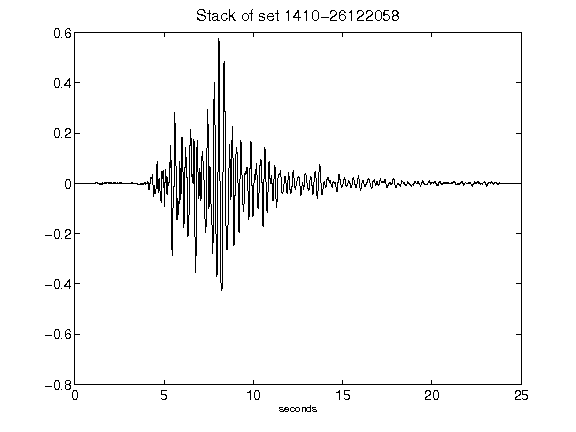](figures/1410-26122058_Stack.png)[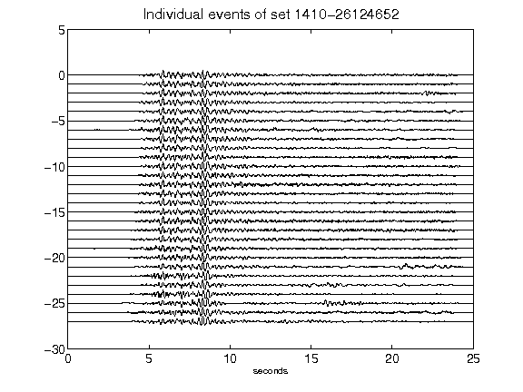](figures/1410-26124652_AllEv.png)[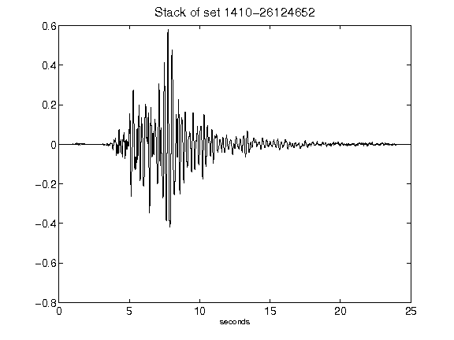](figures/1410-26124652_Stack.png)[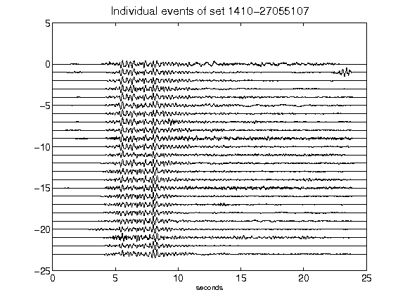](figures/1410-27055107_AllEv.png)[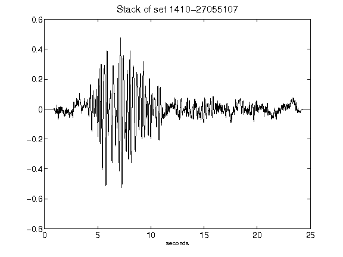](figures/1410-27055107_Stack.png)[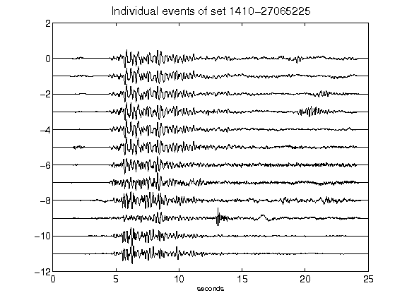](figures/1410-27065225_AllEv.png)[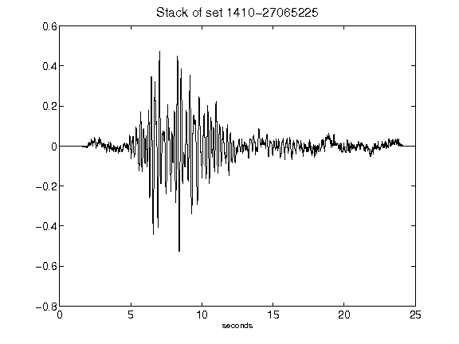](figures/1410-27065225_Stack.png)[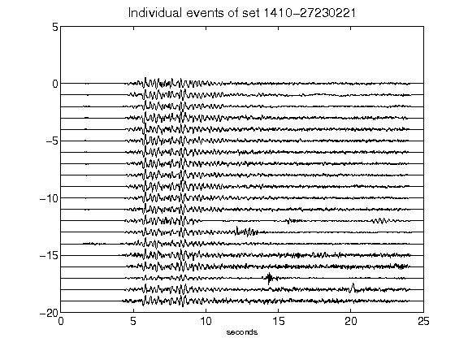](figures/1410-27230221_AllEv.png)[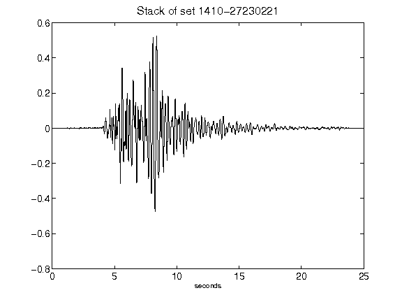](figures/1410-27230221_Stack.png)[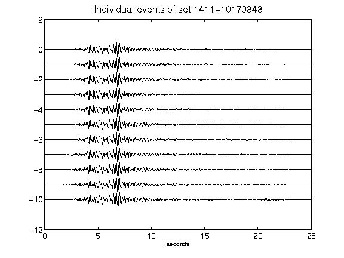](figures/1411-10170848_AllEv.png)[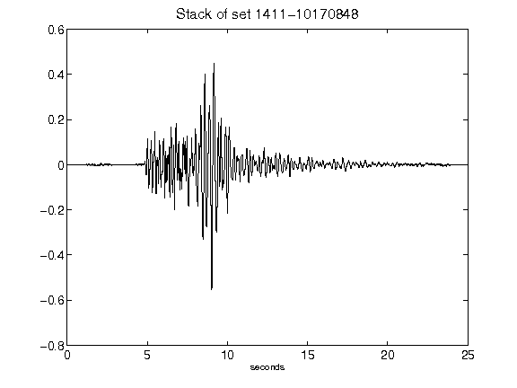](figures/1411-10170848_Stack.png)[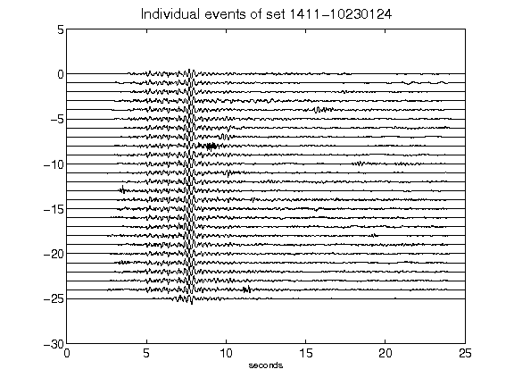](figures/1411-10230124_AllEv.png)[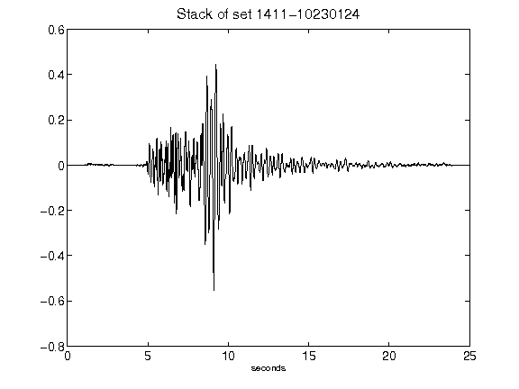](figures/1411-10230124_Stack.png)[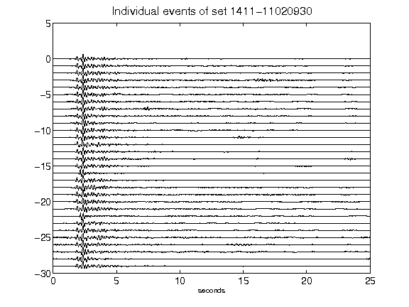](figures/1411-11020930_AllEv.png)[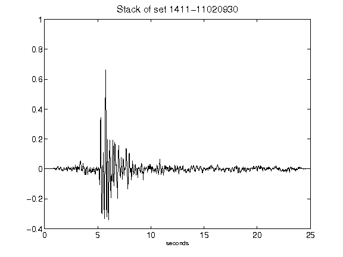](figures/1411-11020930_Stack.png)[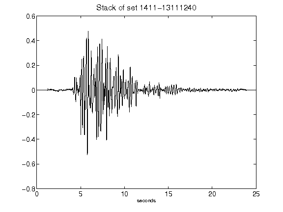](figures/1411-13111240_Stack.png)[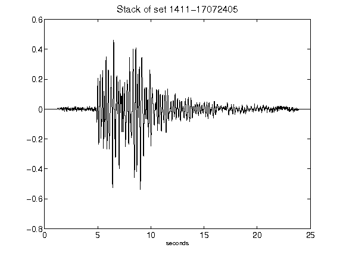](figures/1411-17072405_Stack.png)[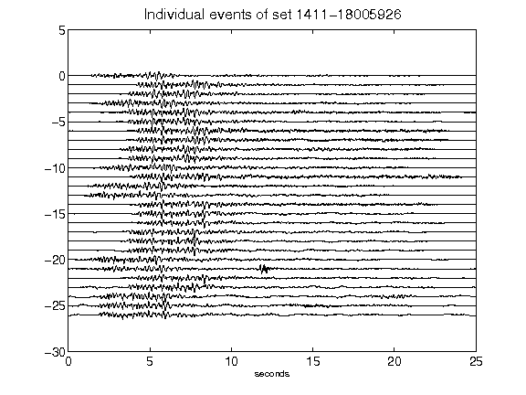](figures/1411-18005926_AllEv.png)[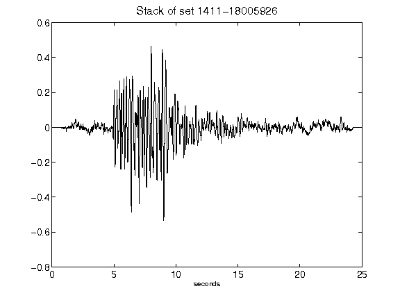](figures/1411-18005926_Stack.png)[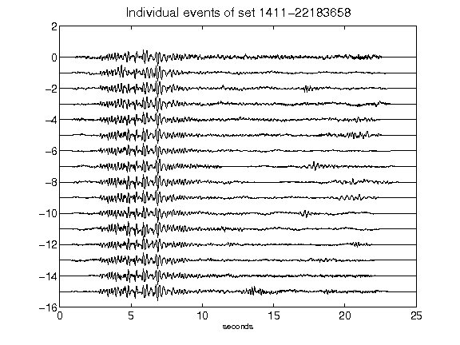](figures/1411-22183658_AllEv.png)[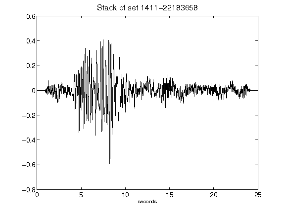](figures/1411-22183658_Stack.png)