# Repeating Earthquake Activity at RCM

## Waveforms
[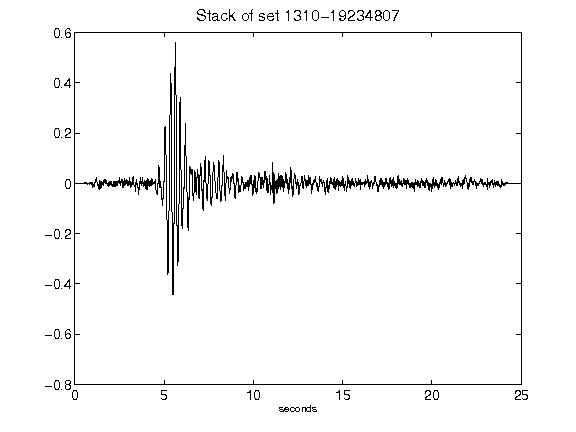](figures/1310-19234807_Stack.png)[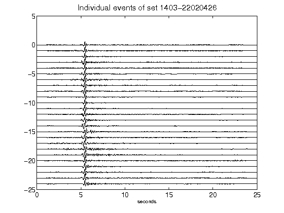](figures/1403-22020426_AllEv.png)[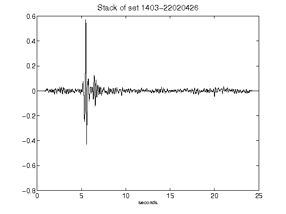](figures/1403-22020426_Stack.png)[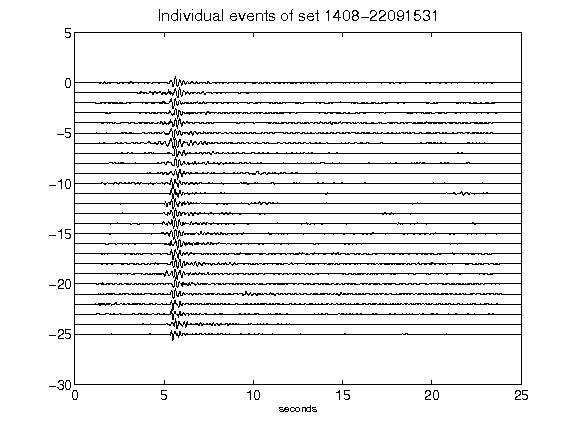](figures/1408-22091531_AllEv.png)[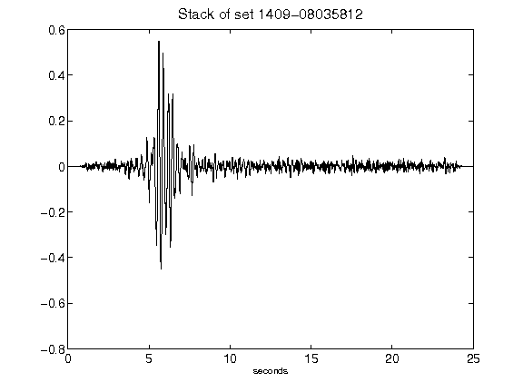](figures/1409-08035812_Stack.png)[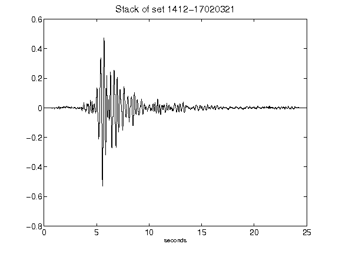](figures/1412-17020321_Stack.png)[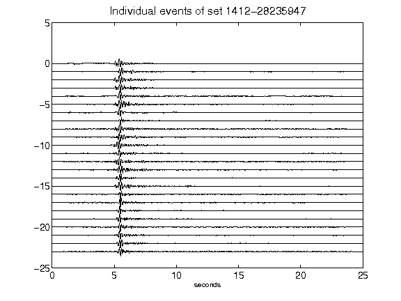](figures/1412-28235947_AllEv.png)[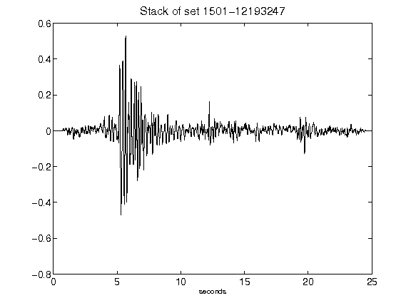](figures/1501-12193247_Stack.png)[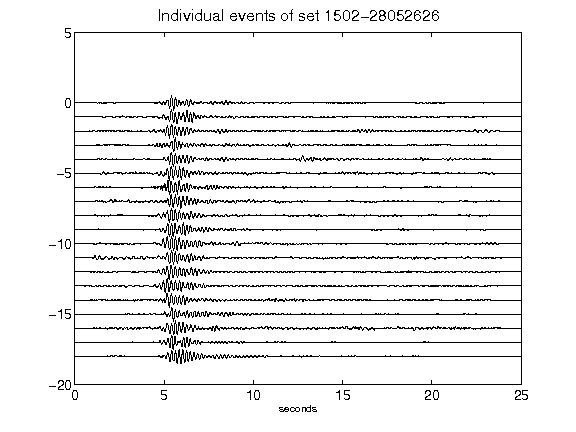](figures/1502-28052626_AllEv.png)[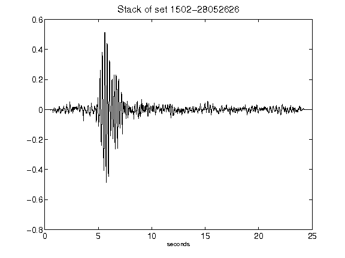](figures/1502-28052626_Stack.png)[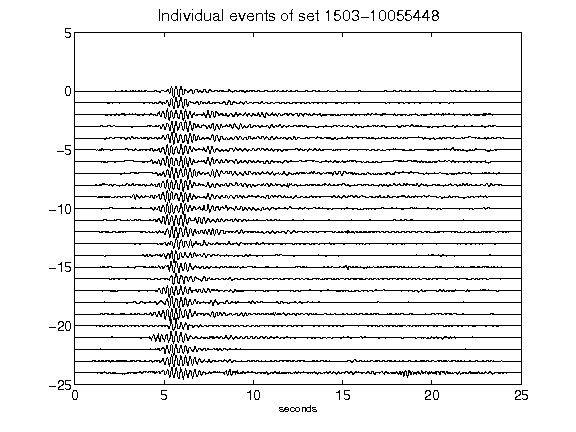](figures/1503-10055448_AllEv.png)[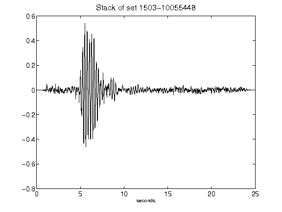](figures/1503-10055448_Stack.png)[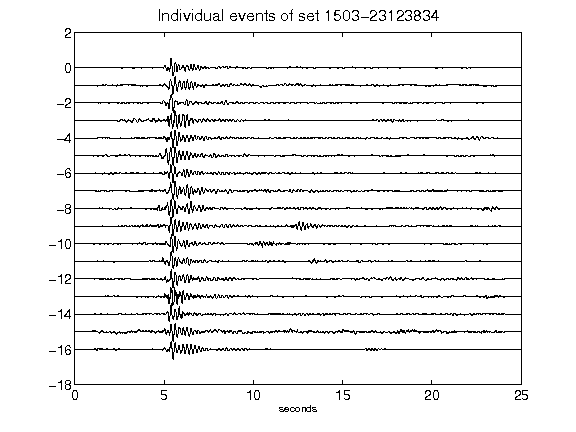](figures/1503-23123834_AllEv.png)[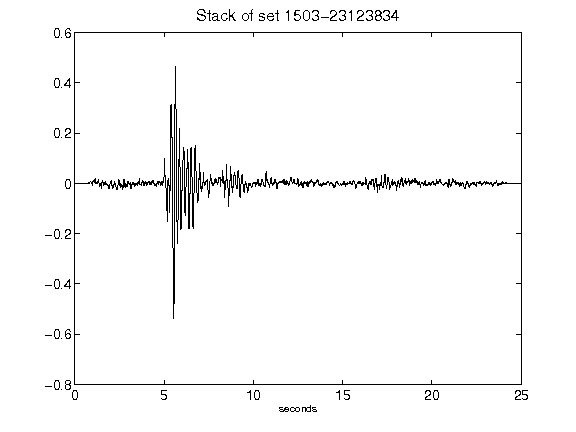](figures/1503-23123834_Stack.png)[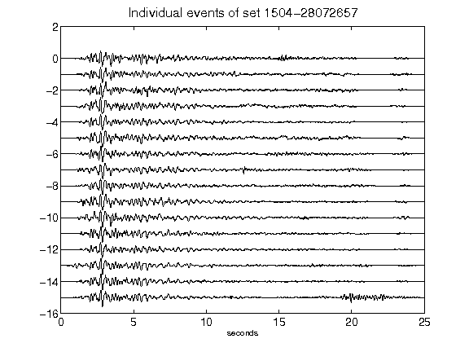](figures/1504-28072657_AllEv.png)