# Repeating Earthquake Activity at RCM

## Waveforms
[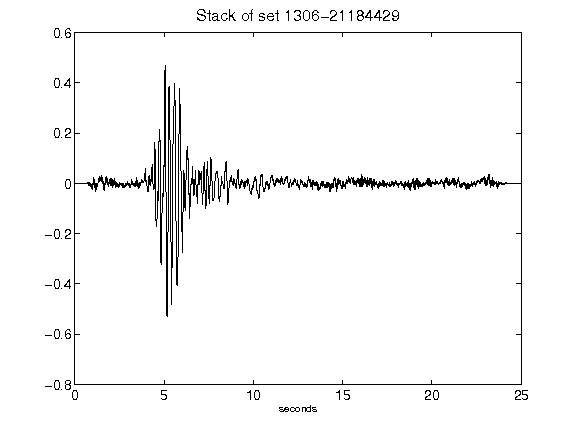](figures/1306-21184429_Stack.png)[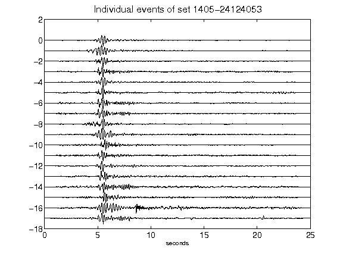](figures/1405-24124053_AllEv.png)[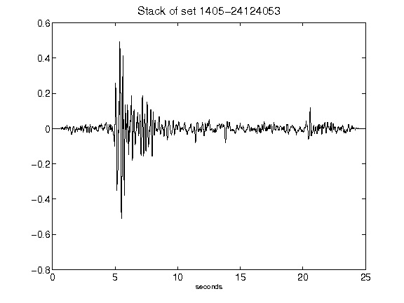](figures/1405-24124053_Stack.png)[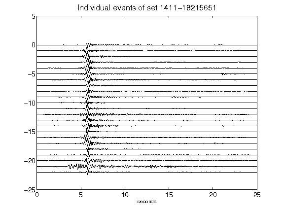](figures/1411-18215651_AllEv.png)[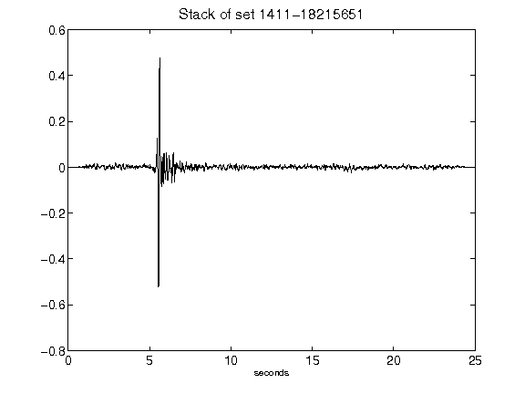](figures/1411-18215651_Stack.png)[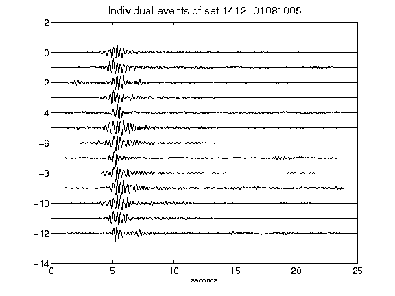](figures/1412-01081005_AllEv.png)[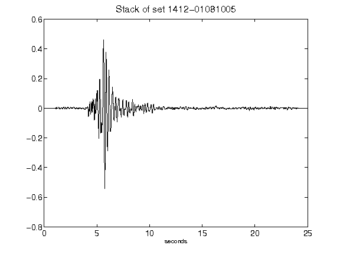](figures/1412-01081005_Stack.png)[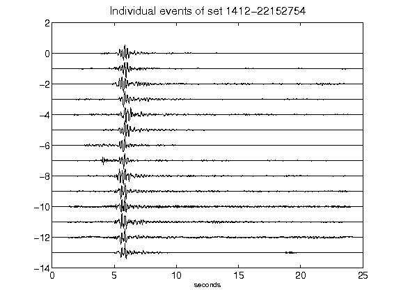](figures/1412-22152754_AllEv.png)[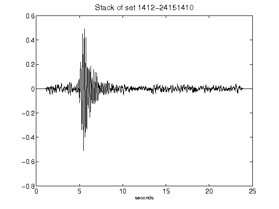](figures/1412-24151410_Stack.png)[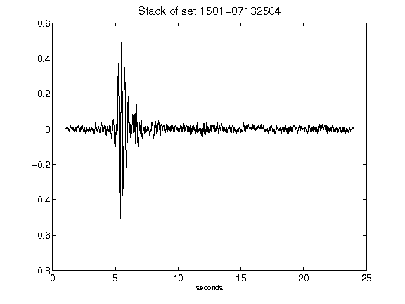](figures/1501-07132504_Stack.png)[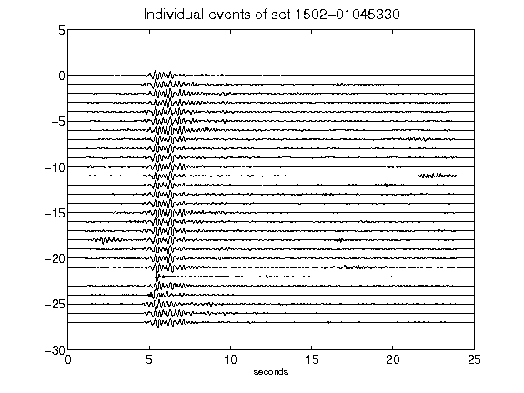](figures/1502-01045330_AllEv.png)[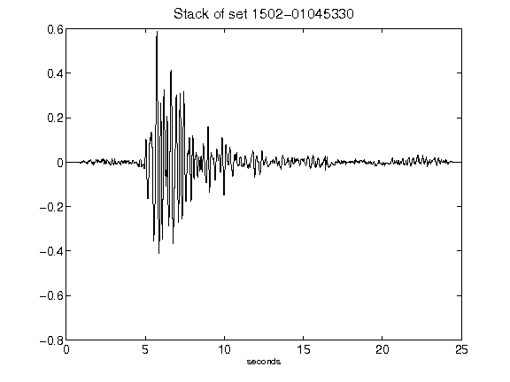](figures/1502-01045330_Stack.png)[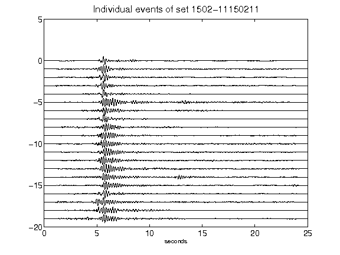](figures/1502-11150211_AllEv.png)[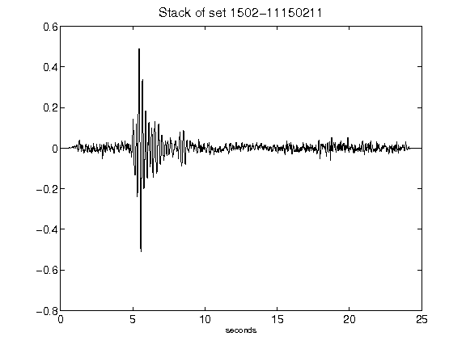](figures/1502-11150211_Stack.png)[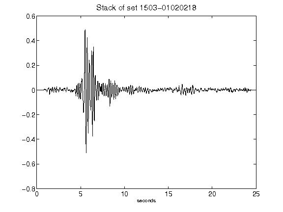](figures/1503-01020218_Stack.png)[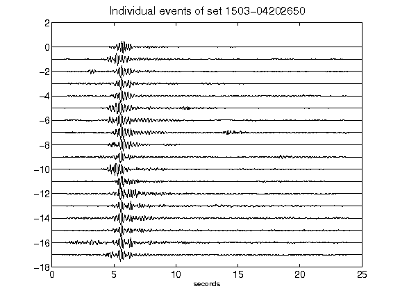](figures/1503-04202650_AllEv.png)[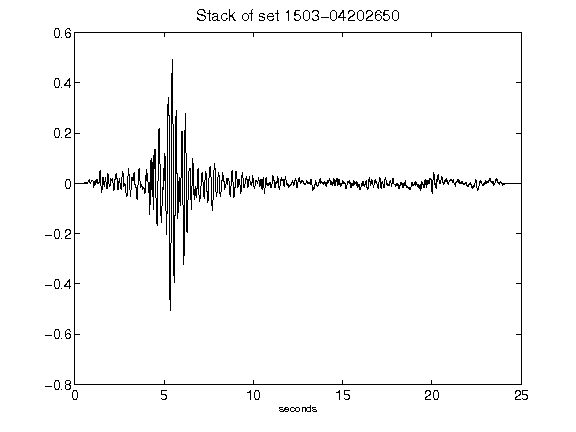](figures/1503-04202650_Stack.png)[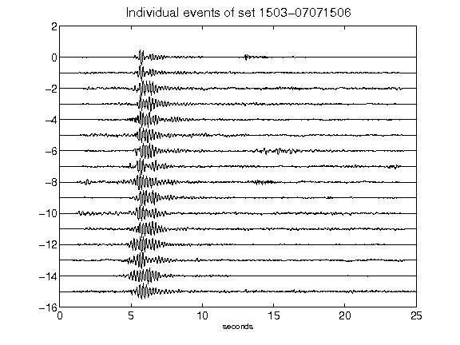](figures/1503-07071506_AllEv.png)[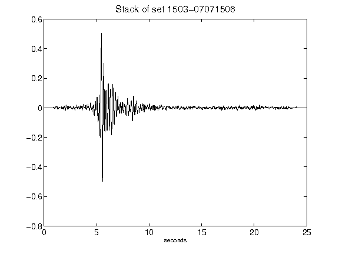](figures/1503-07071506_Stack.png)