# Repeating Earthquake Activity at RCM

## Waveforms
[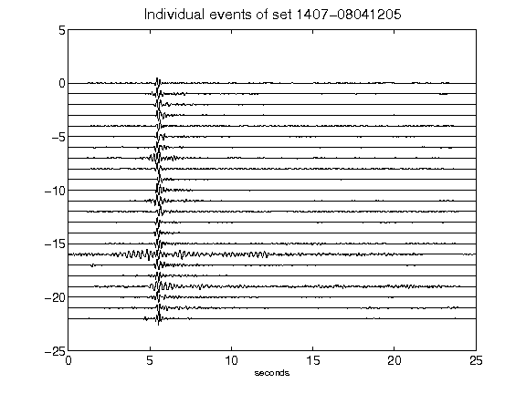](figures/1407-08041205_AllEv.png)[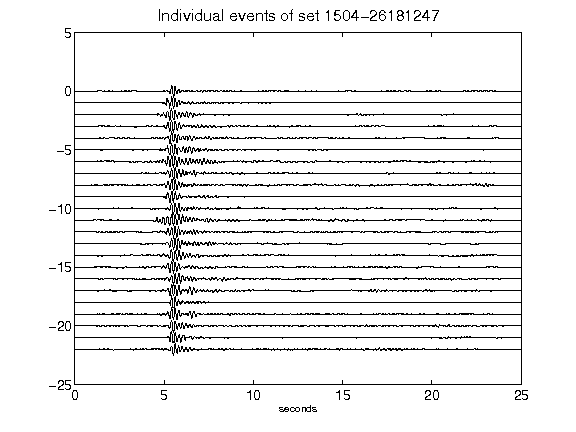](figures/1504-26181247_AllEv.png)[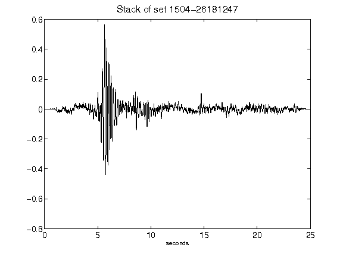](figures/1504-26181247_Stack.png)[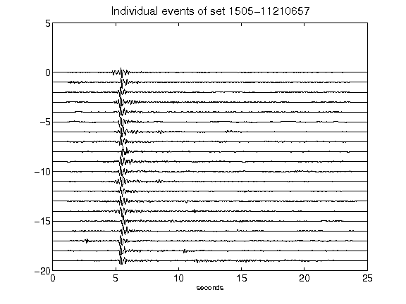](figures/1505-11210657_AllEv.png)[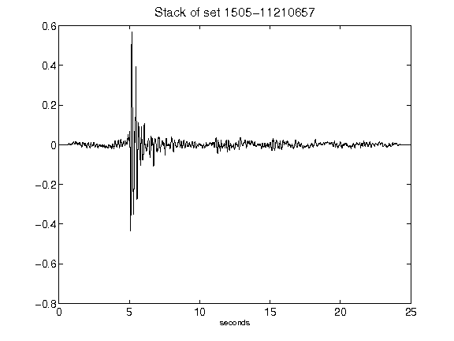](figures/1505-11210657_Stack.png)[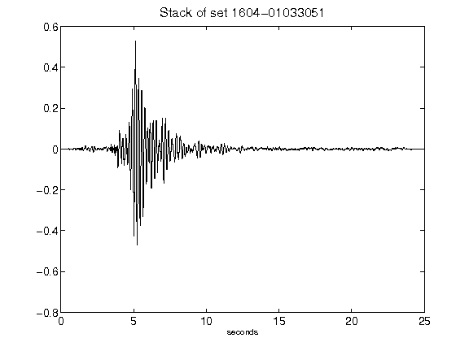](figures/1604-01033051_Stack.png)[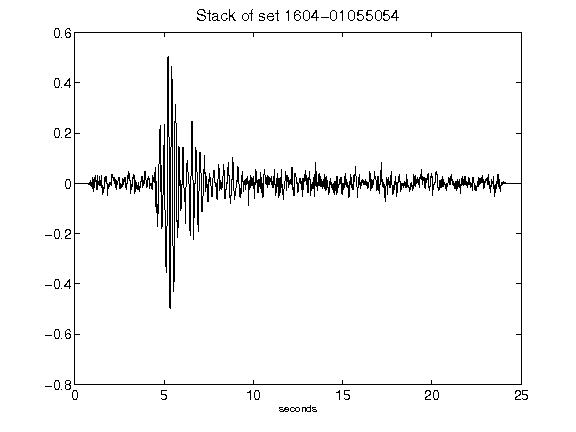](figures/1604-01055054_Stack.png)[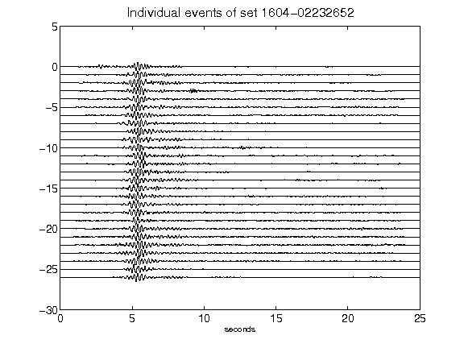](figures/1604-02232652_AllEv.png)[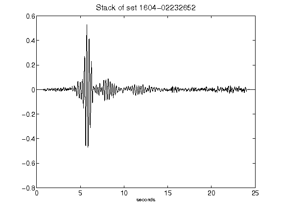](figures/1604-02232652_Stack.png)[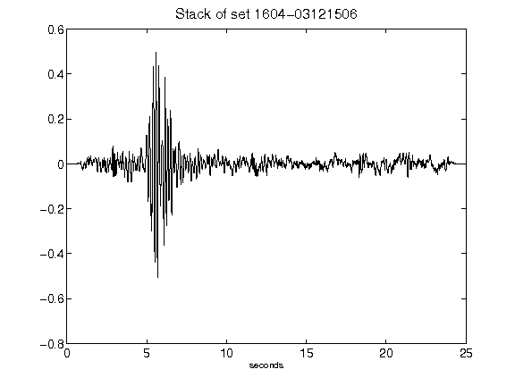](figures/1604-03121506_Stack.png)[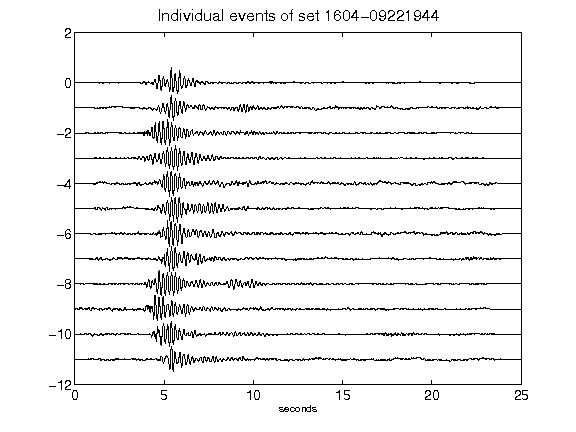](figures/1604-09221944_AllEv.png)[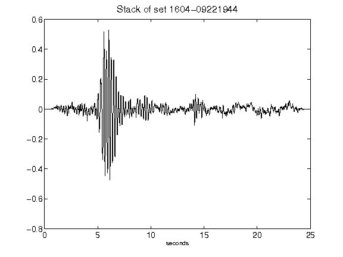](figures/1604-09221944_Stack.png)[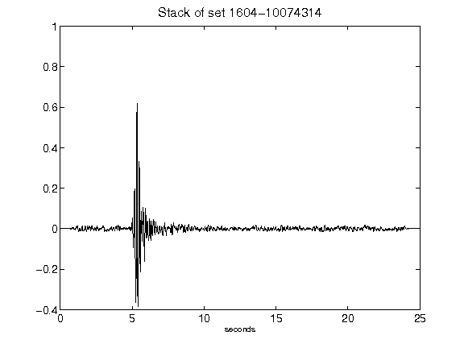](figures/1604-10074314_Stack.png)[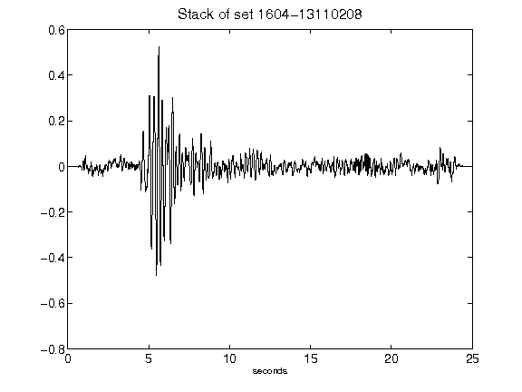](figures/1604-13110208_Stack.png)[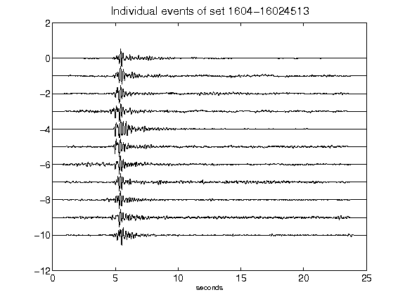](figures/1604-16024513_AllEv.png)[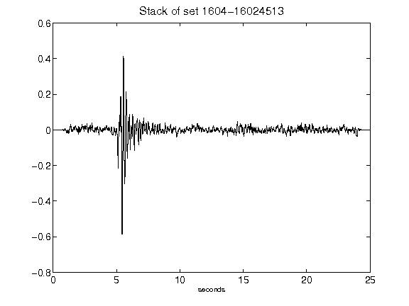](figures/1604-16024513_Stack.png)[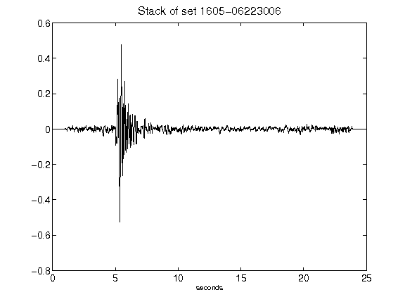](figures/1605-06223006_Stack.png)