# Repeating Earthquake Activity at RCM

## Waveforms
[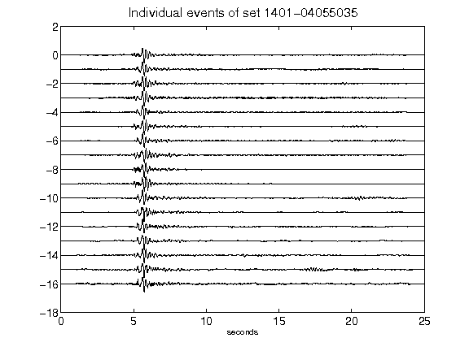](figures/1401-04055035_AllEv.png)[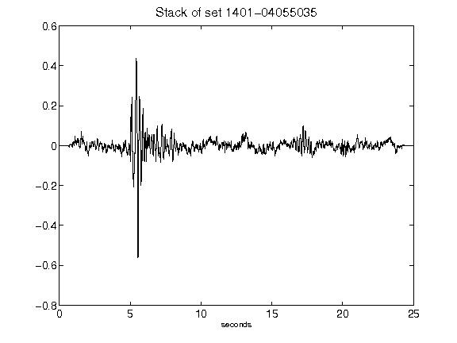](figures/1401-04055035_Stack.png)[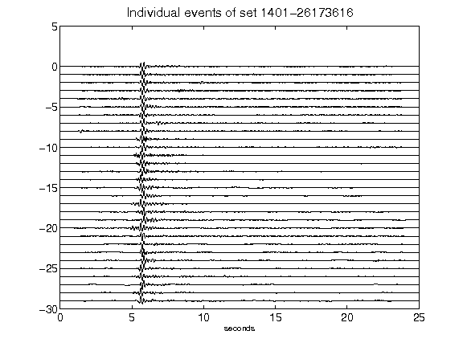](figures/1401-26173616_AllEv.png)[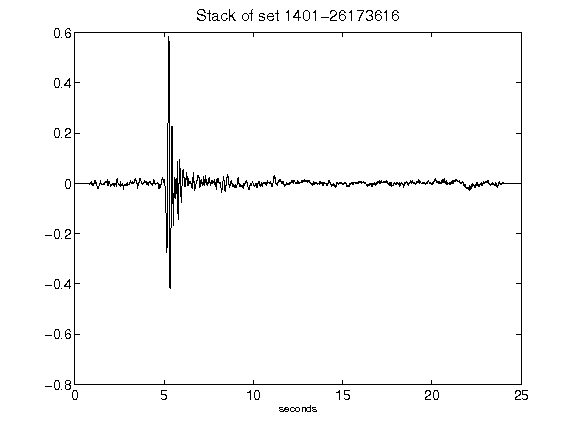](figures/1401-26173616_Stack.png)[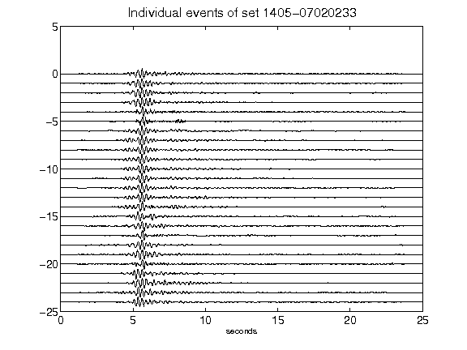](figures/1405-07020233_AllEv.png)[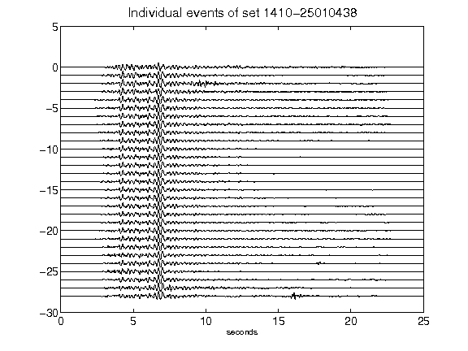](figures/1410-25010438_AllEv.png)[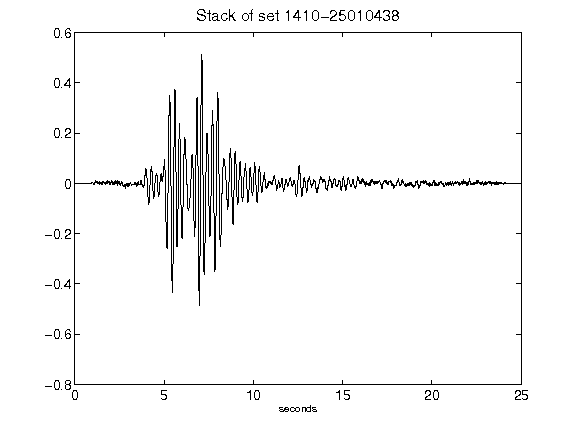](figures/1410-25010438_Stack.png)[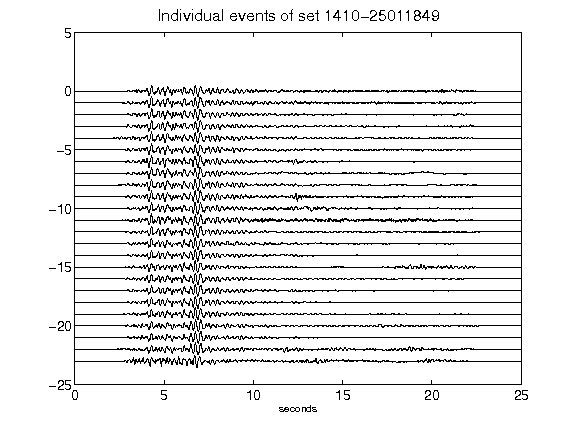](figures/1410-25011849_AllEv.png)[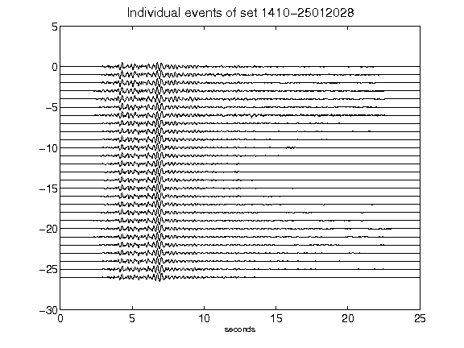](figures/1410-25012028_AllEv.png)[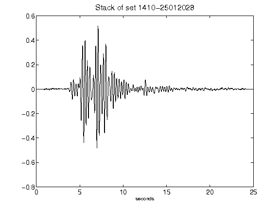](figures/1410-25012028_Stack.png)[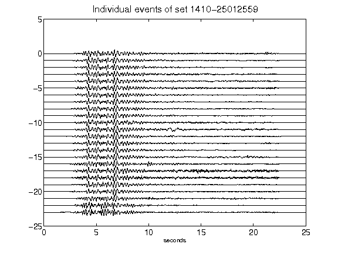](figures/1410-25012559_AllEv.png)[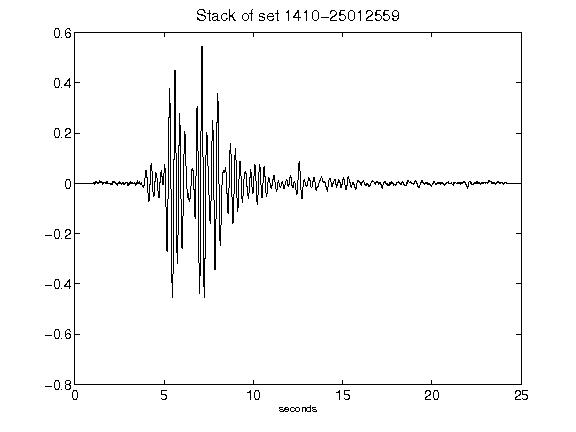](figures/1410-25012559_Stack.png)[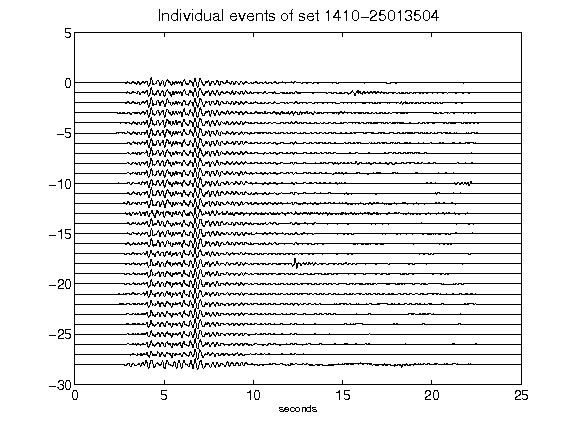](figures/1410-25013504_AllEv.png)[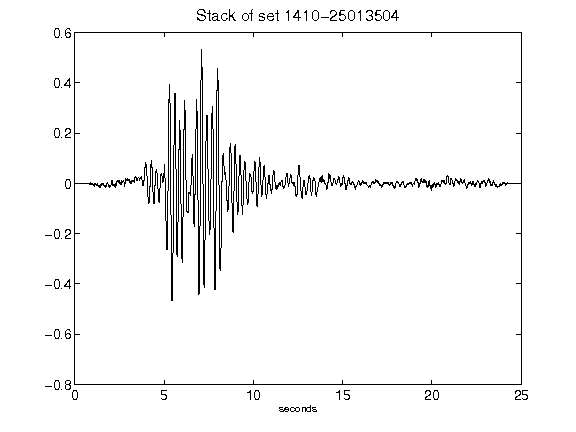](figures/1410-25013504_Stack.png)[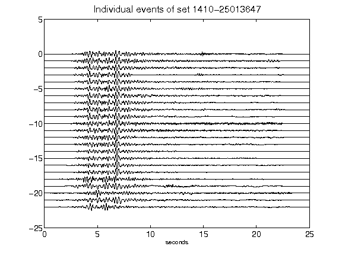](figures/1410-25013647_AllEv.png)[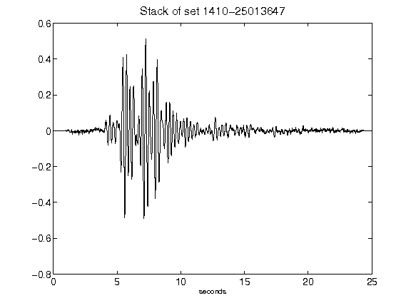](figures/1410-25013647_Stack.png)[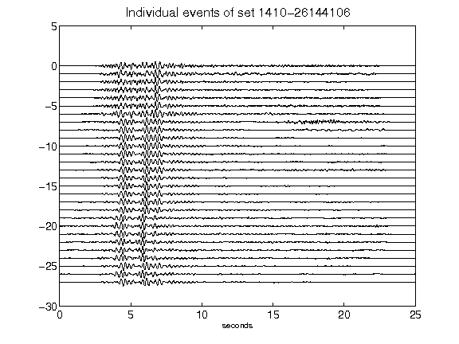](figures/1410-26144106_AllEv.png)[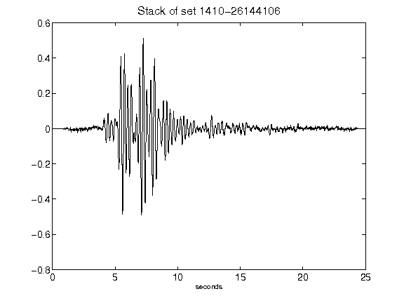](figures/1410-26144106_Stack.png)[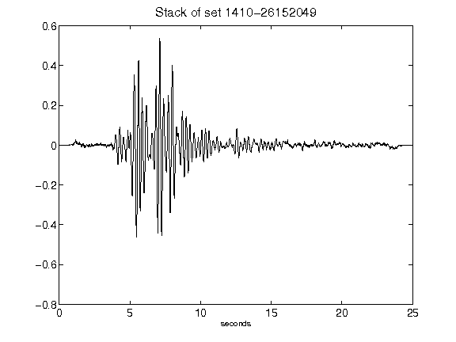](figures/1410-26152049_Stack.png)[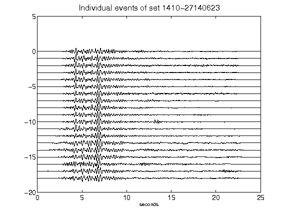](figures/1410-27140623_AllEv.png)[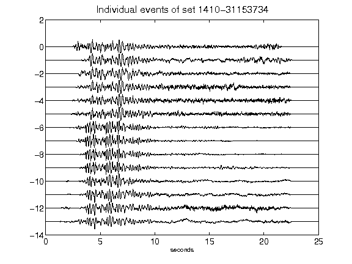](figures/1410-31153734_AllEv.png)[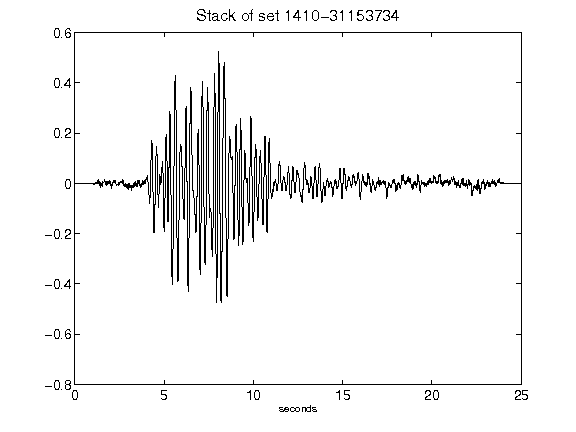](figures/1410-31153734_Stack.png)[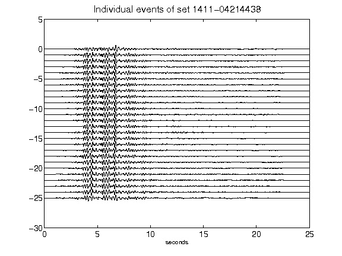](figures/1411-04214438_AllEv.png)[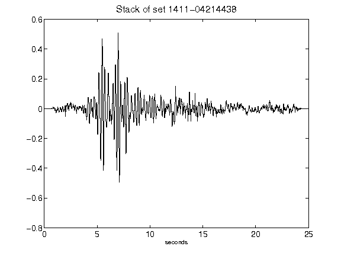](figures/1411-04214438_Stack.png)[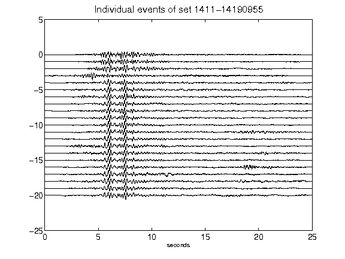](figures/1411-14190955_AllEv.png)[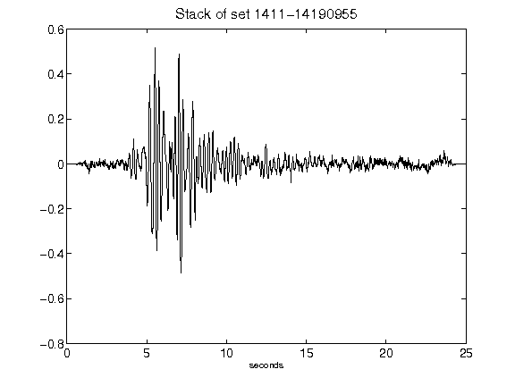](figures/1411-14190955_Stack.png)[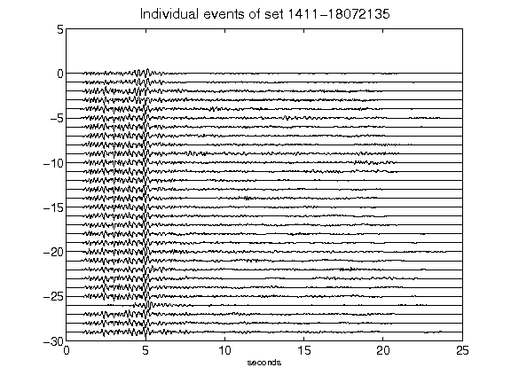](figures/1411-18072135_AllEv.png)[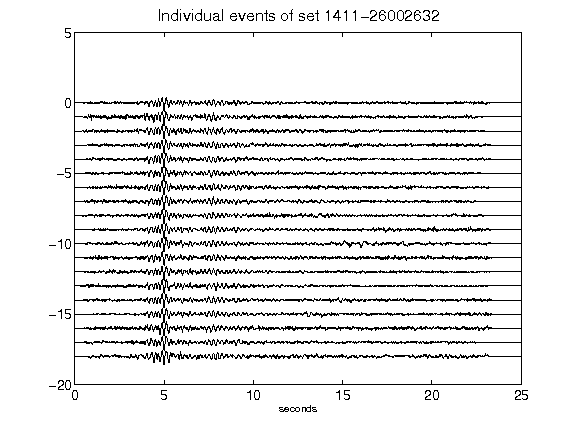](figures/1411-26002632_AllEv.png)