# Repeating Earthquake Activity at RCM

## Waveforms
[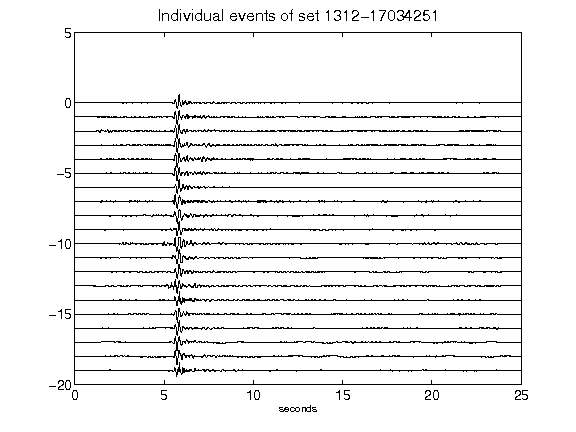](figures/1312-17034251_AllEv.png)[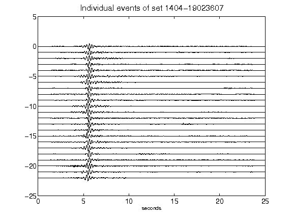](figures/1404-19023607_AllEv.png)[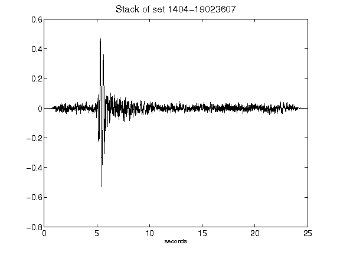](figures/1404-19023607_Stack.png)[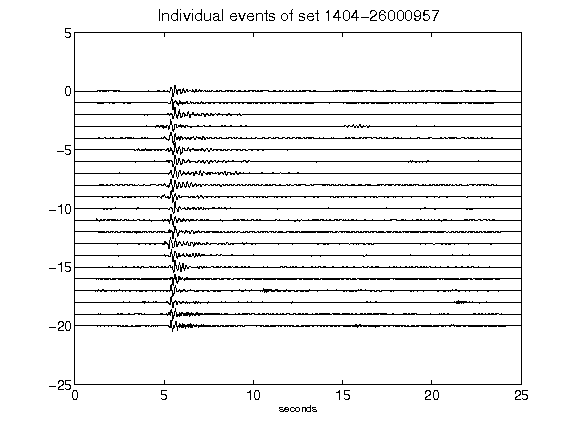](figures/1404-26000957_AllEv.png)[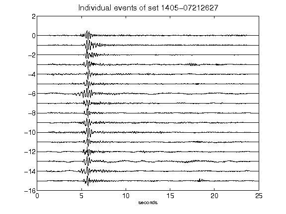](figures/1405-07212627_AllEv.png)[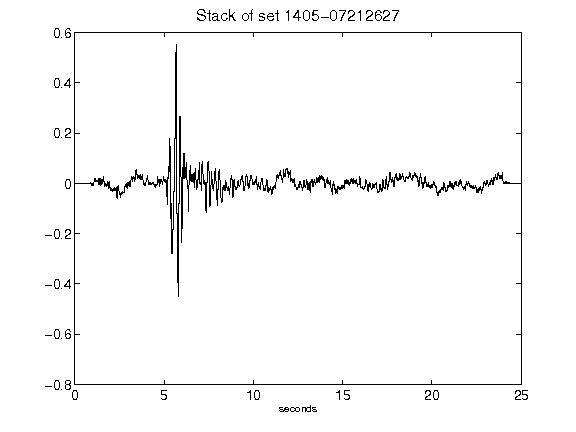](figures/1405-07212627_Stack.png)[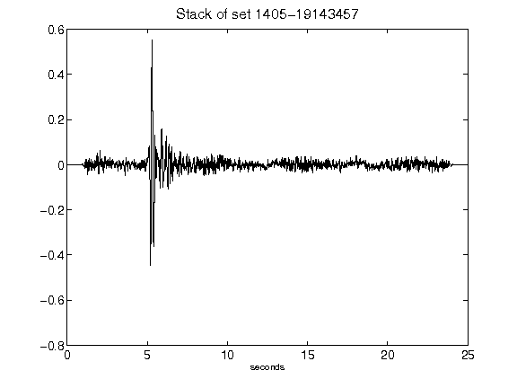](figures/1405-19143457_Stack.png)[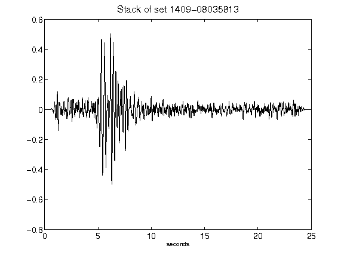](figures/1409-08035813_Stack.png)[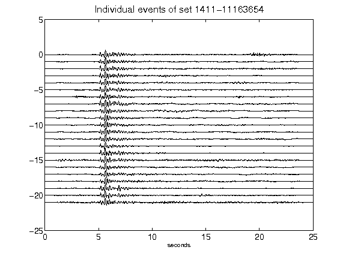](figures/1411-11163654_AllEv.png)[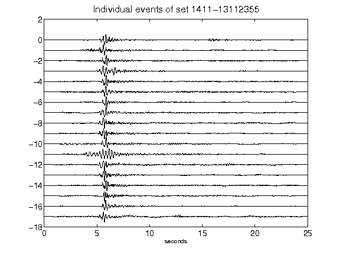](figures/1411-13112355_AllEv.png)[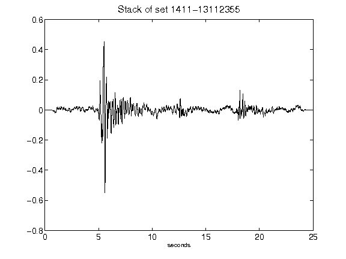](figures/1411-13112355_Stack.png)[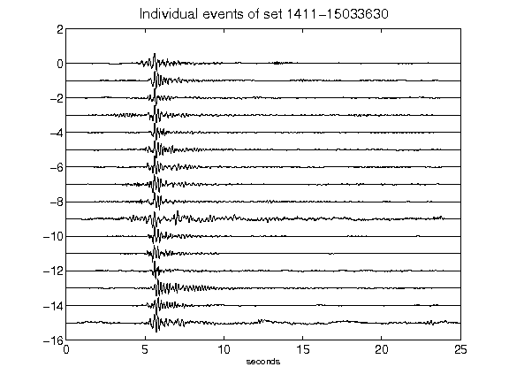](figures/1411-15033630_AllEv.png)[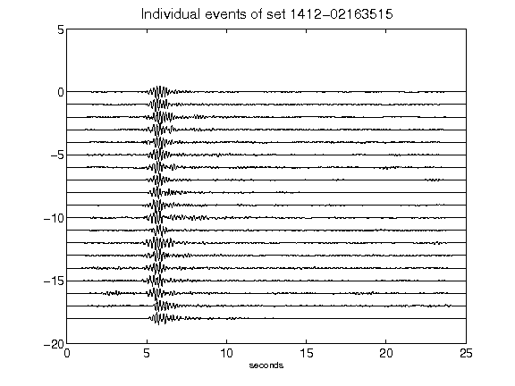](figures/1412-02163515_AllEv.png)