# Repeating Earthquake Activity at RCM

## Waveforms
[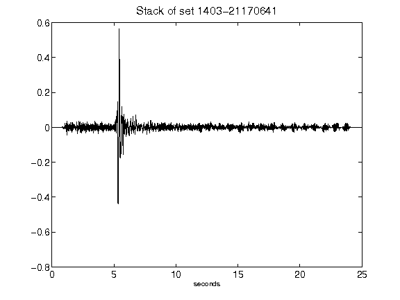](figures/1403-21170641_Stack.png)[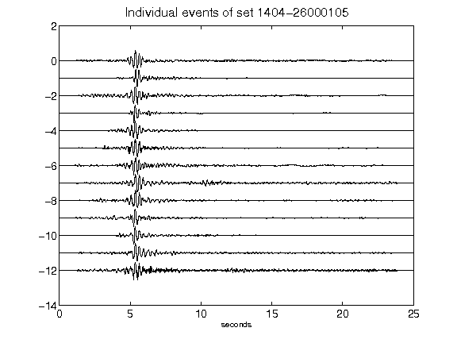](figures/1404-26000105_AllEv.png)[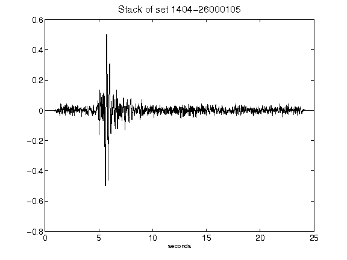](figures/1404-26000105_Stack.png)[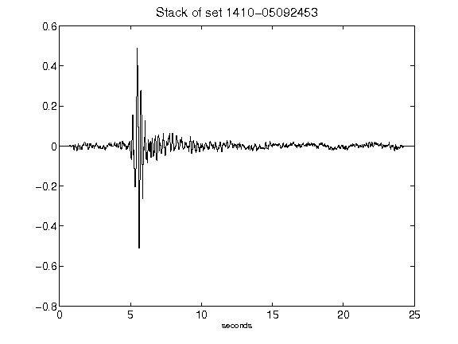](figures/1410-05092453_Stack.png)[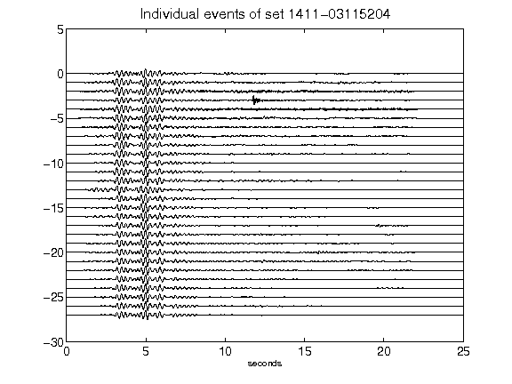](figures/1411-03115204_AllEv.png)[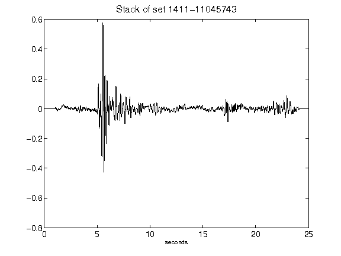](figures/1411-11045743_Stack.png)[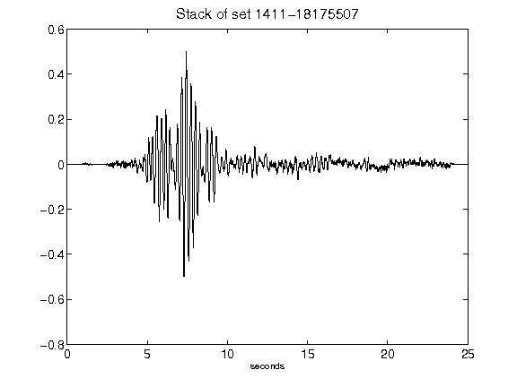](figures/1411-18175507_Stack.png)[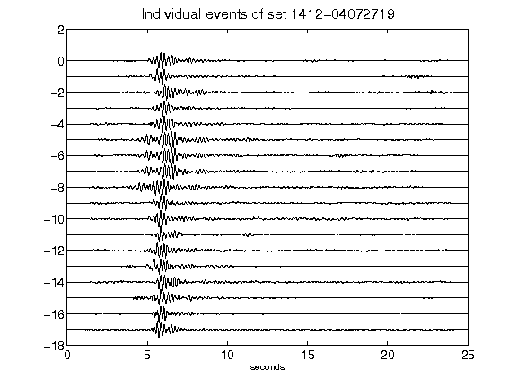](figures/1412-04072719_AllEv.png)[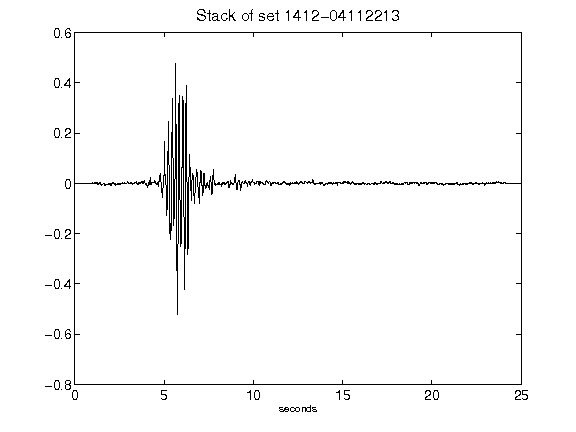](figures/1412-04112213_Stack.png)[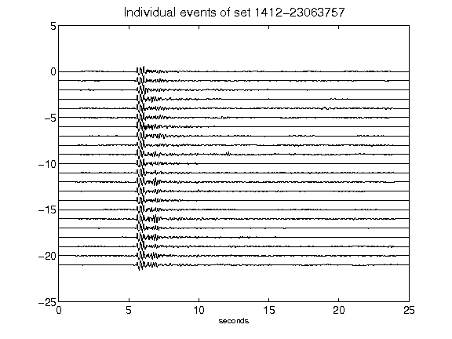](figures/1412-23063757_AllEv.png)[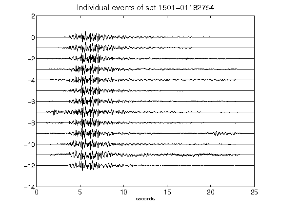](figures/1501-01182754_AllEv.png)[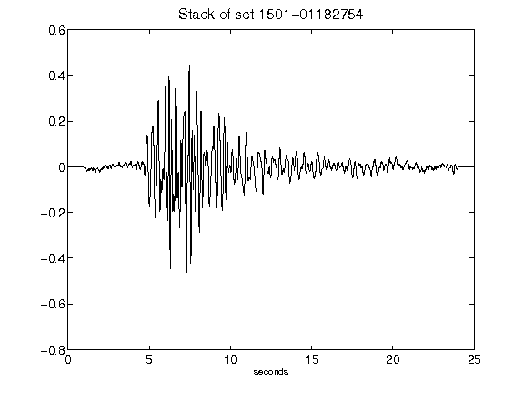](figures/1501-01182754_Stack.png)[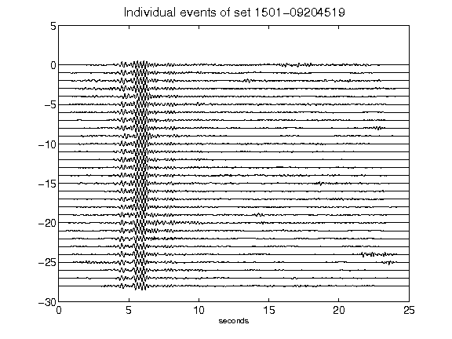](figures/1501-09204519_AllEv.png)[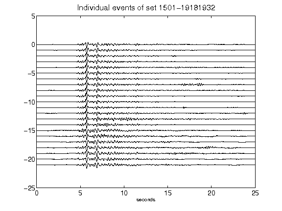](figures/1501-19181932_AllEv.png)[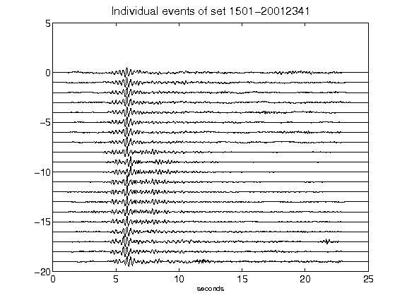](figures/1501-20012341_AllEv.png)[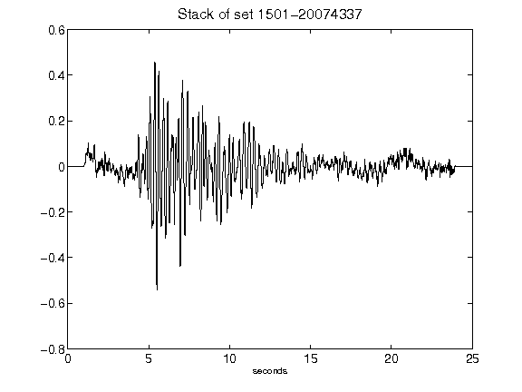](figures/1501-20074337_Stack.png)[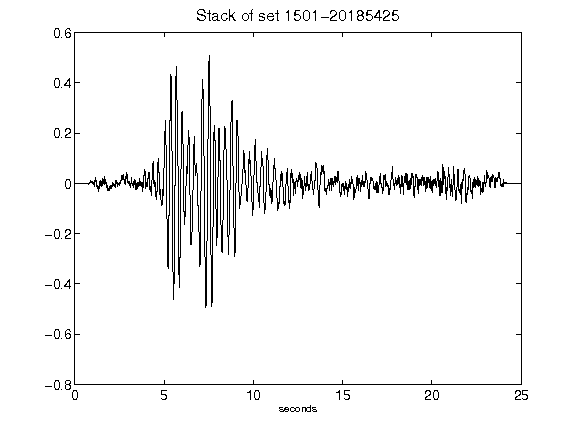](figures/1501-20185425_Stack.png)[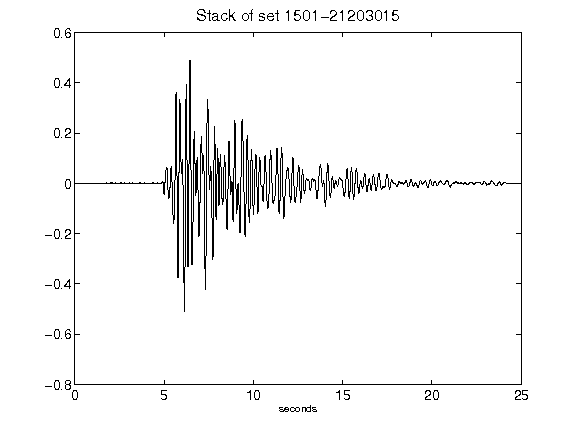](figures/1501-21203015_Stack.png)[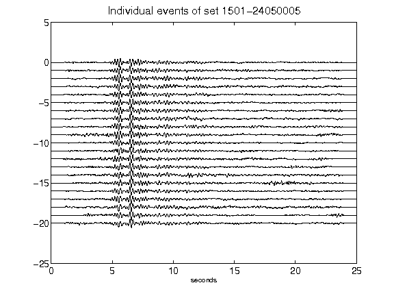](figures/1501-24050005_AllEv.png)[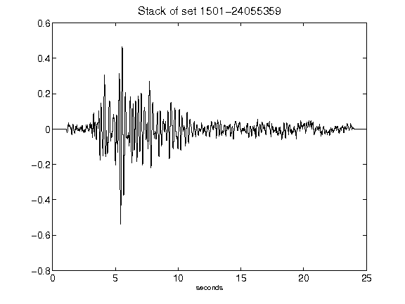](figures/1501-24055359_Stack.png)[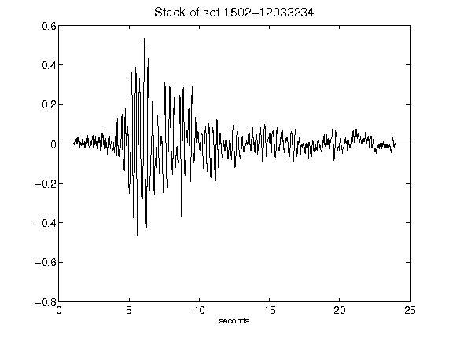](figures/1502-12033234_Stack.png)