# Repeating Earthquake Activity at RCM

## Waveforms
[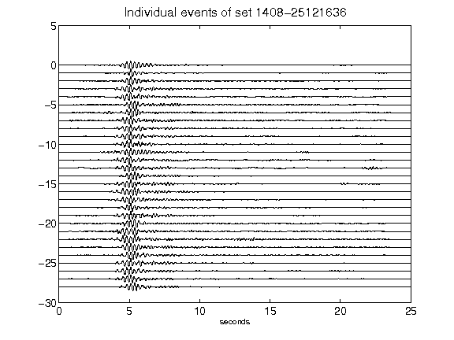](figures/1408-25121636_AllEv.png)[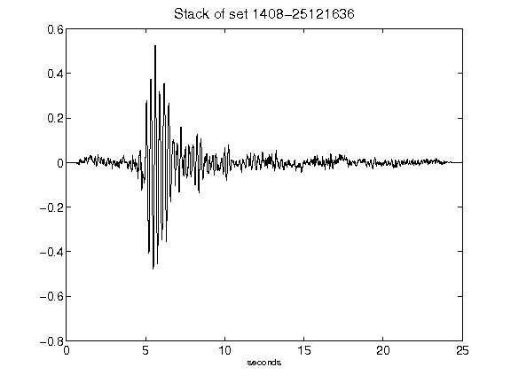](figures/1408-25121636_Stack.png)[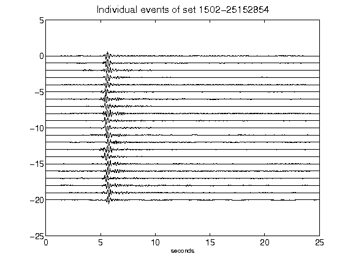](figures/1502-25152854_AllEv.png)[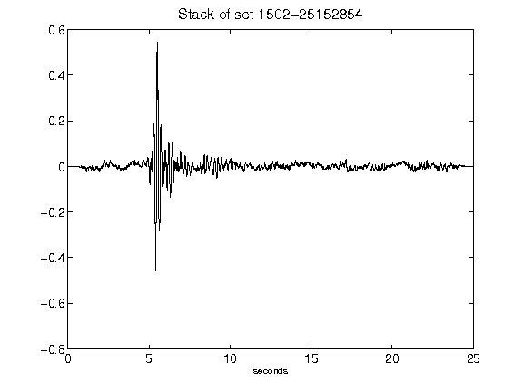](figures/1502-25152854_Stack.png)[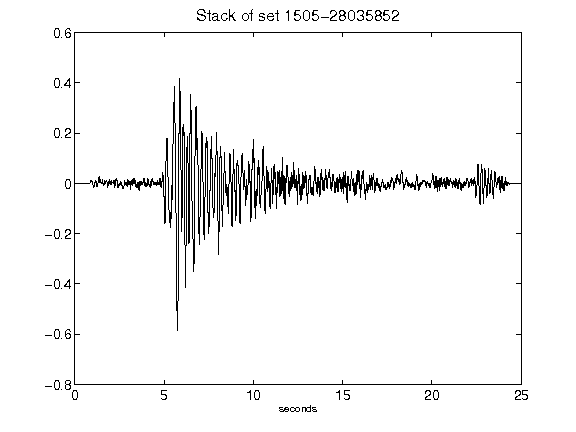](figures/1505-28035852_Stack.png)[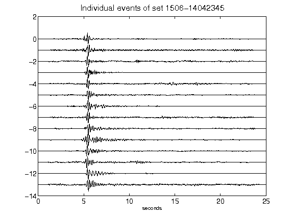](figures/1506-14042345_AllEv.png)[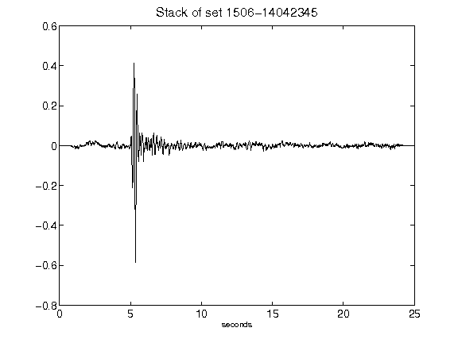](figures/1506-14042345_Stack.png)[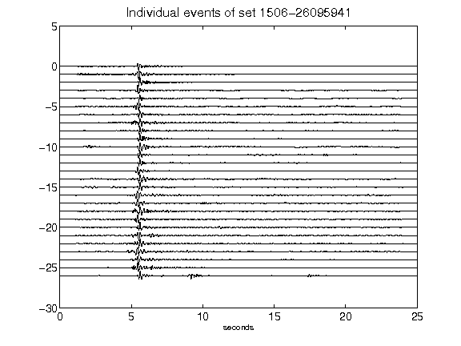](figures/1506-26095941_AllEv.png)[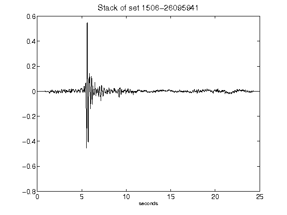](figures/1506-26095941_Stack.png)[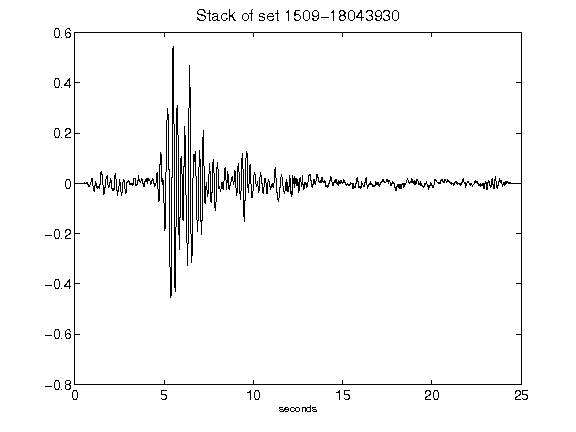](figures/1509-18043930_Stack.png)[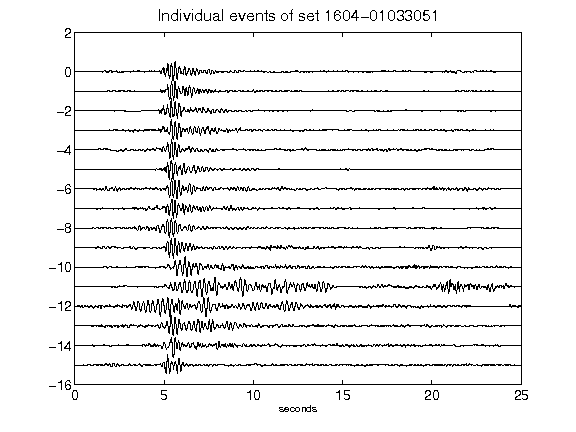](figures/1604-01033051_AllEv.png)[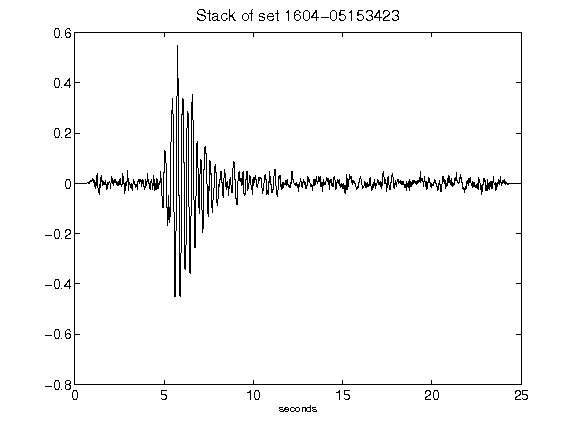](figures/1604-05153423_Stack.png)[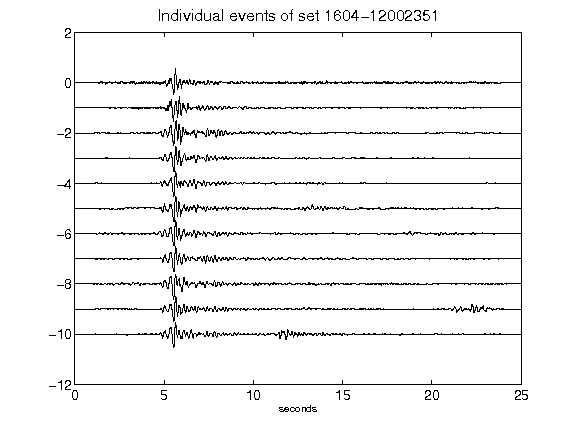](figures/1604-12002351_AllEv.png)[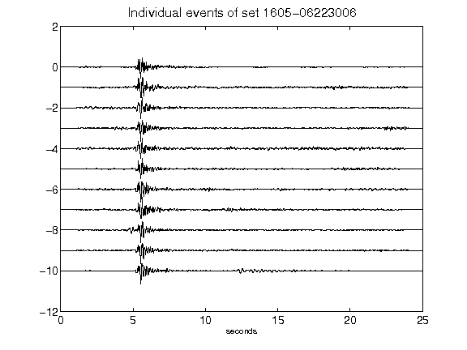](figures/1605-06223006_AllEv.png)