# Repeating Earthquake Activity at RCM

## Waveforms
[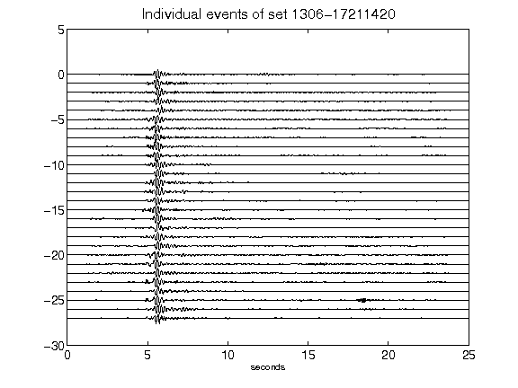](figures/1306-17211420_AllEv.png)[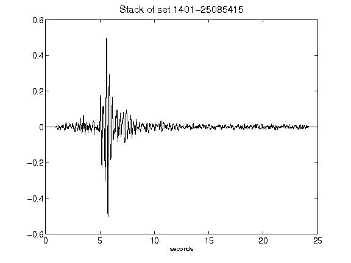](figures/1401-25085415_Stack.png)[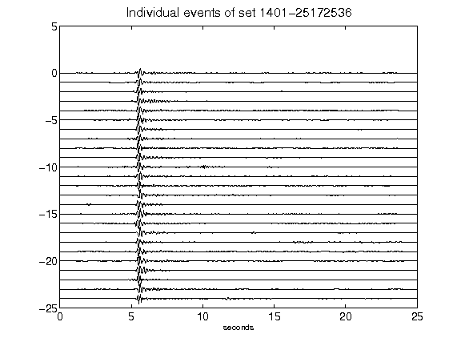](figures/1401-25172536_AllEv.png)[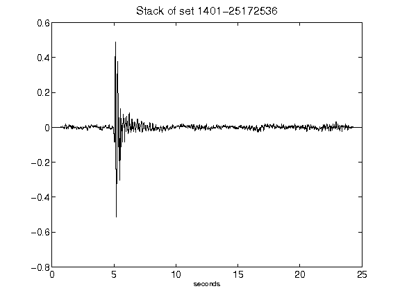](figures/1401-25172536_Stack.png)[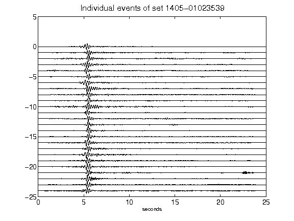](figures/1405-01023539_AllEv.png)[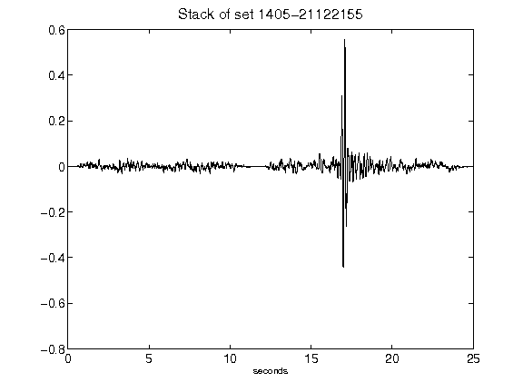](figures/1405-21122155_Stack.png)[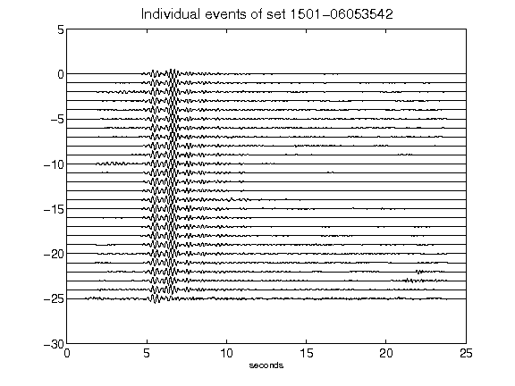](figures/1501-06053542_AllEv.png)[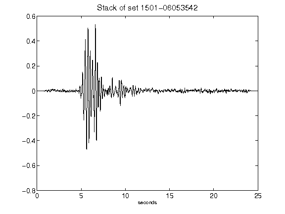](figures/1501-06053542_Stack.png)[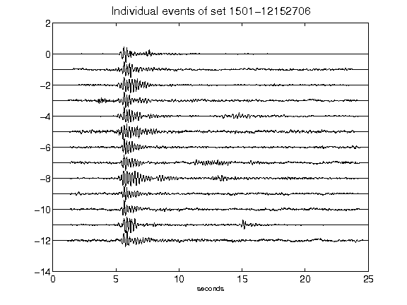](figures/1501-12152706_AllEv.png)[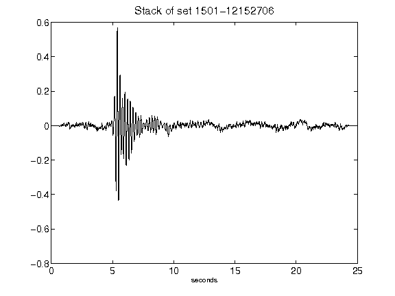](figures/1501-12152706_Stack.png)[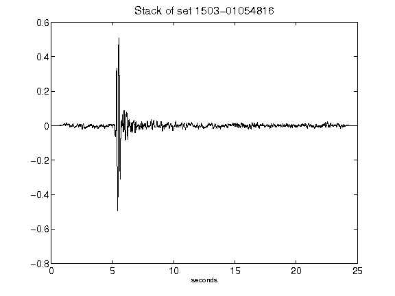](figures/1503-01054816_Stack.png)