# Repeating Earthquake Activity at RCM

## Waveforms
[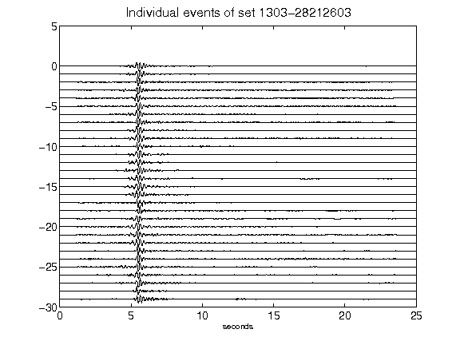](figures/1303-28212603_AllEv.png)[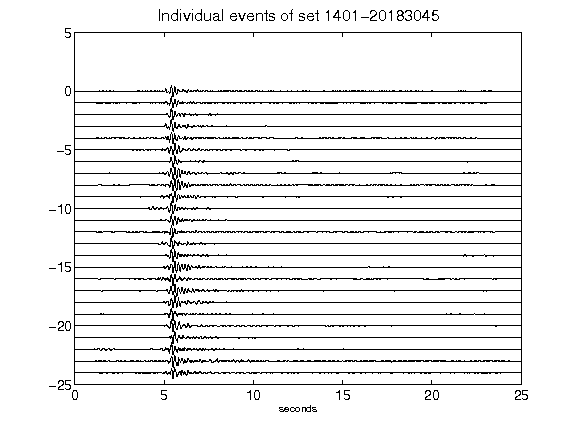](figures/1401-20183045_AllEv.png)[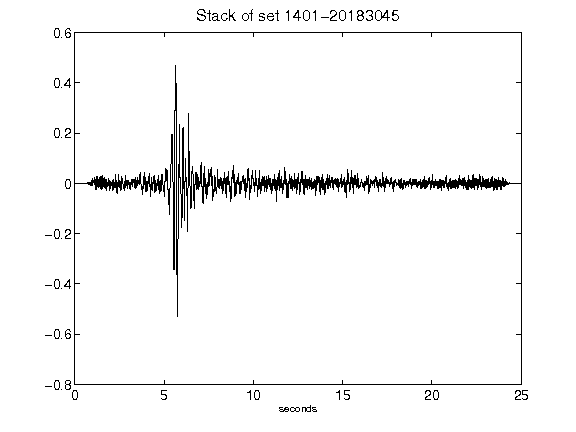](figures/1401-20183045_Stack.png)[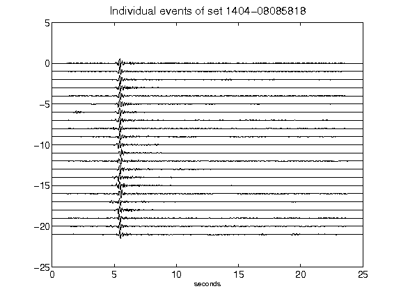](figures/1404-08085818_AllEv.png)[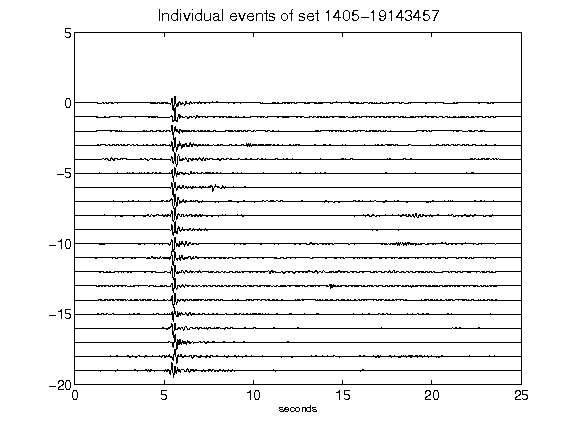](figures/1405-19143457_AllEv.png)[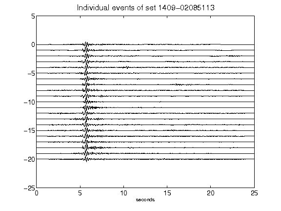](figures/1409-02085113_AllEv.png)[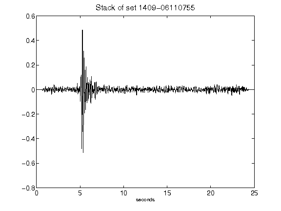](figures/1409-06110755_Stack.png)[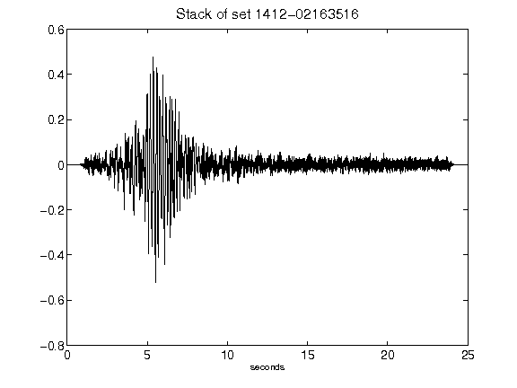](figures/1412-02163516_Stack.png)[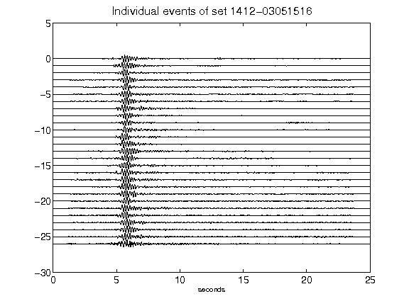](figures/1412-03051516_AllEv.png)[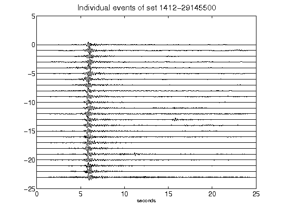](figures/1412-29145500_AllEv.png)[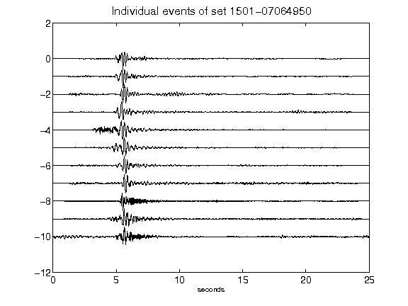](figures/1501-07064950_AllEv.png)[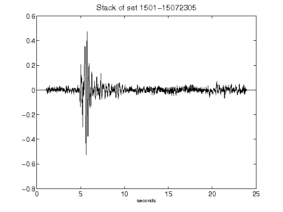](figures/1501-15072305_Stack.png)[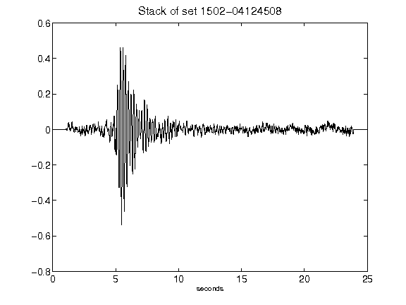](figures/1502-04124508_Stack.png)[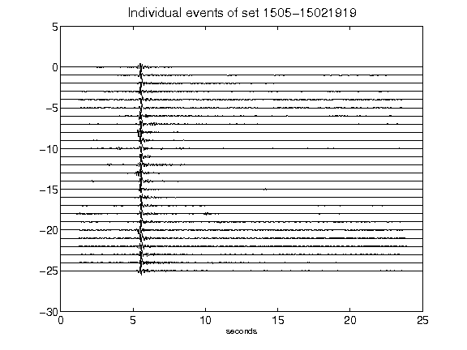](figures/1505-15021919_AllEv.png)[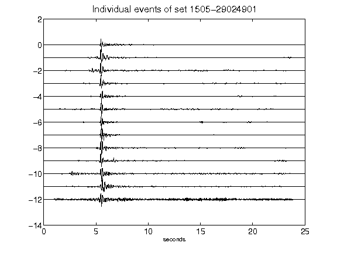](figures/1505-29024901_AllEv.png)[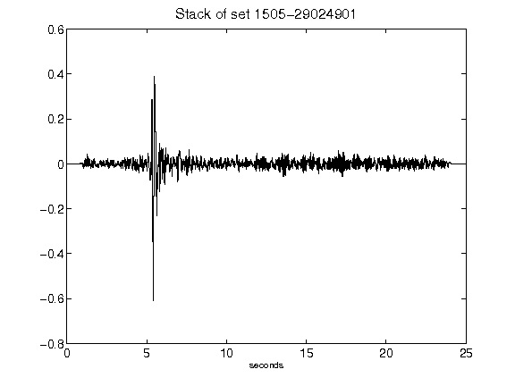](figures/1505-29024901_Stack.png)[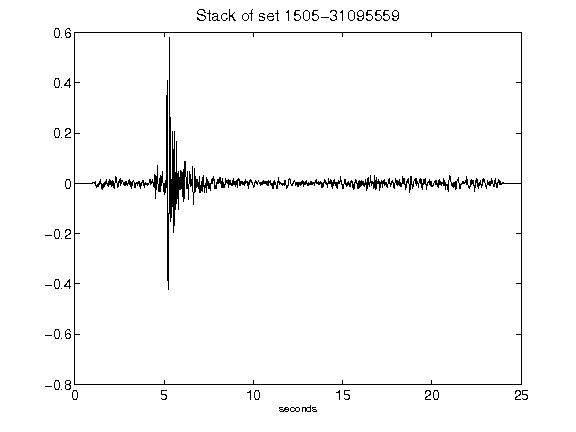](figures/1505-31095559_Stack.png)[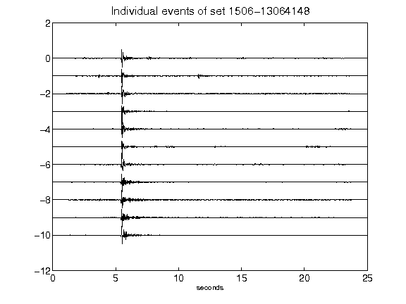](figures/1506-13064148_AllEv.png)[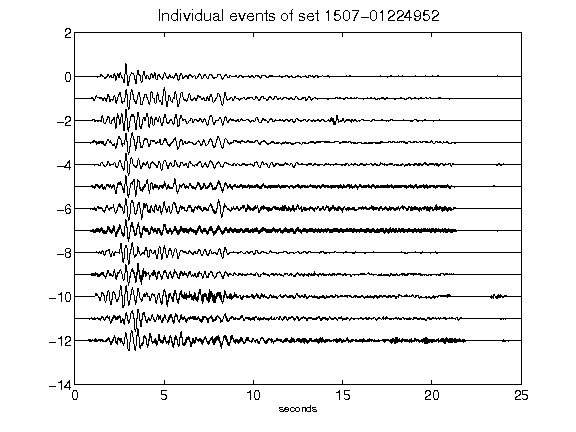](figures/1507-01224952_AllEv.png)