# Repeating Earthquake Activity at RCM

## Waveforms
[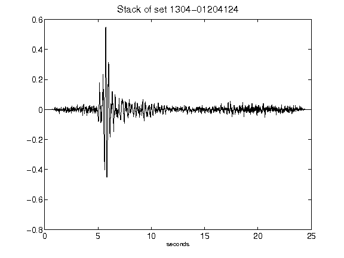](figures/1304-01204124_Stack.png)[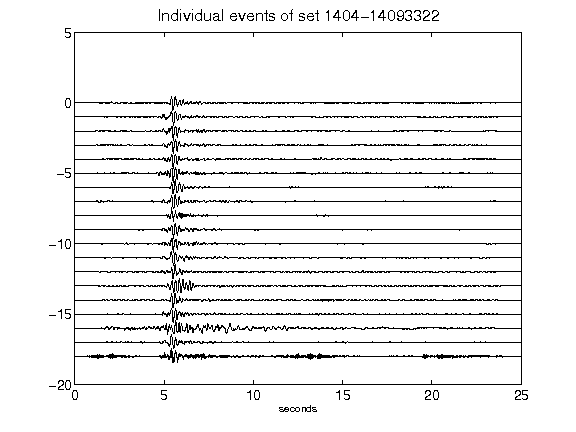](figures/1404-14093322_AllEv.png)[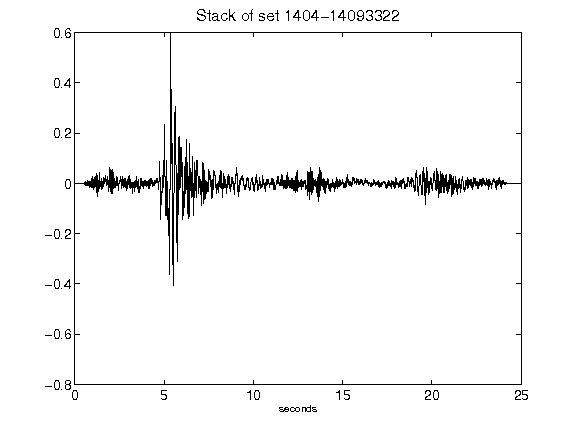](figures/1404-14093322_Stack.png)[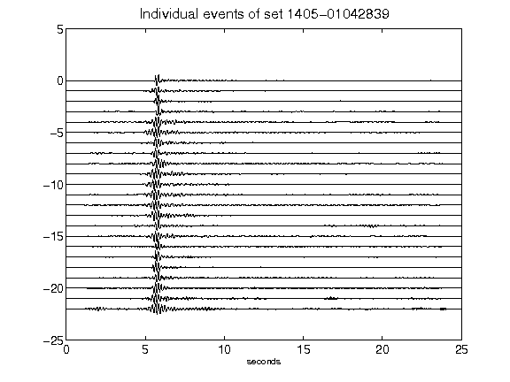](figures/1405-01042839_AllEv.png)[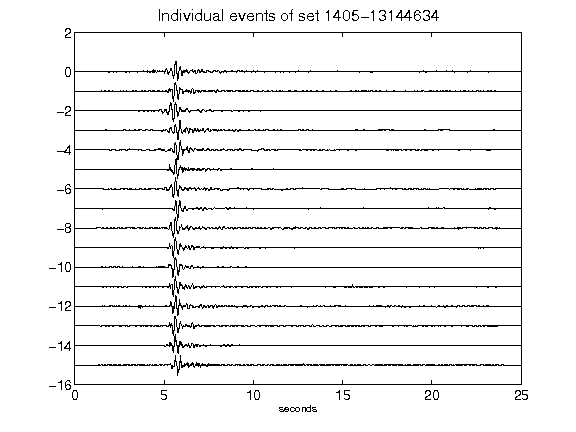](figures/1405-13144634_AllEv.png)[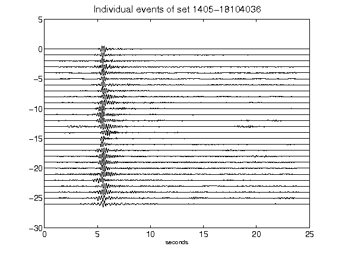](figures/1405-18104036_AllEv.png)[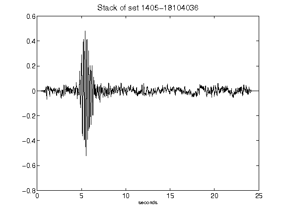](figures/1405-18104036_Stack.png)[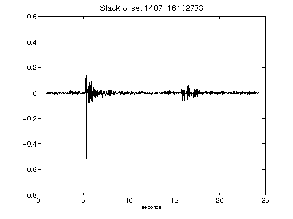](figures/1407-16102733_Stack.png)[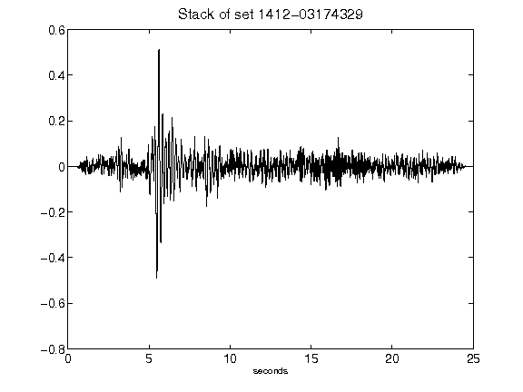](figures/1412-03174329_Stack.png)[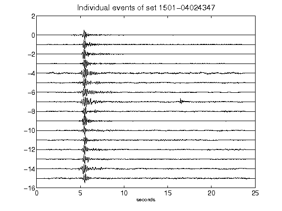](figures/1501-04024347_AllEv.png)[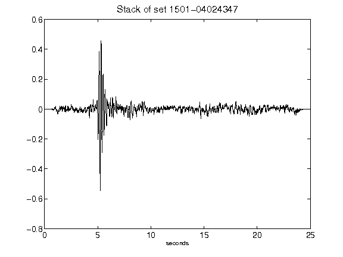](figures/1501-04024347_Stack.png)[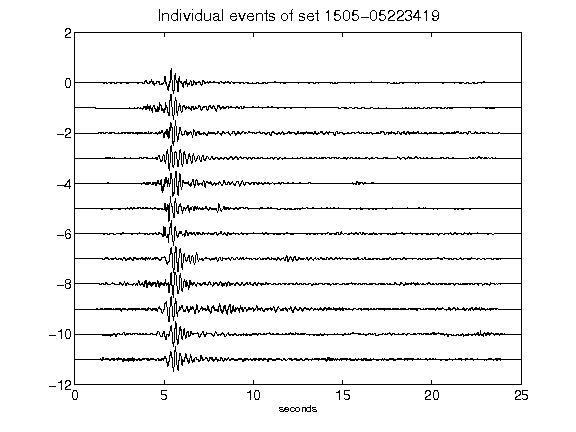](figures/1505-05223419_AllEv.png)[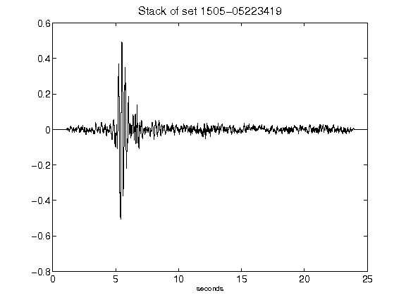](figures/1505-05223419_Stack.png)[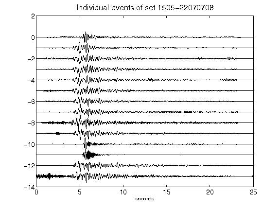](figures/1505-22070708_AllEv.png)[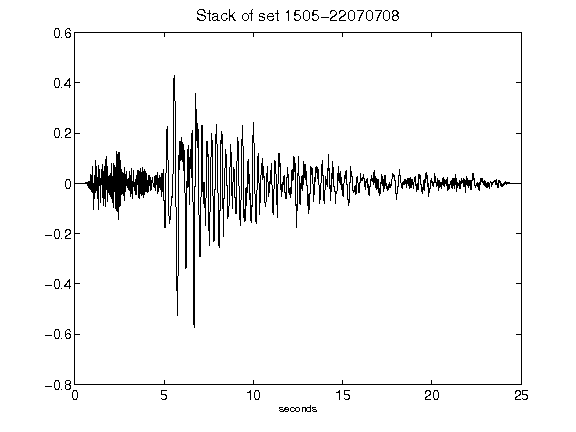](figures/1505-22070708_Stack.png)[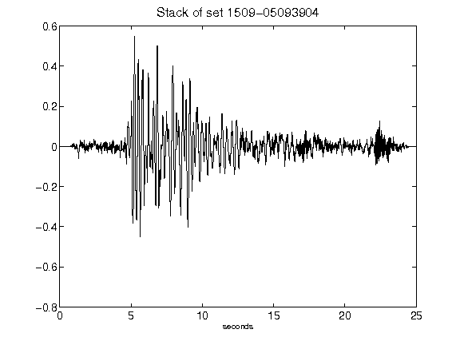](figures/1509-05093904_Stack.png)[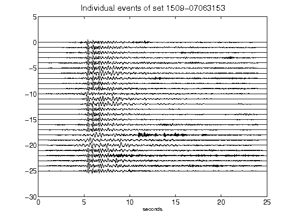](figures/1509-07063153_AllEv.png)[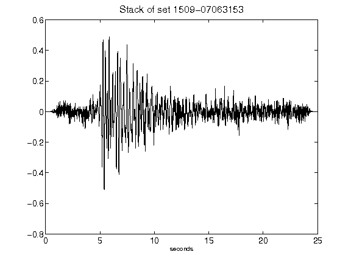](figures/1509-07063153_Stack.png)