# Repeating Earthquake Activity at RCM

## Waveforms
[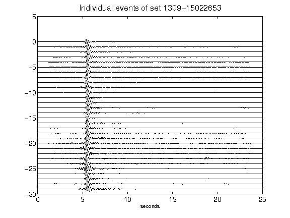](figures/1309-15022653_AllEv.png)[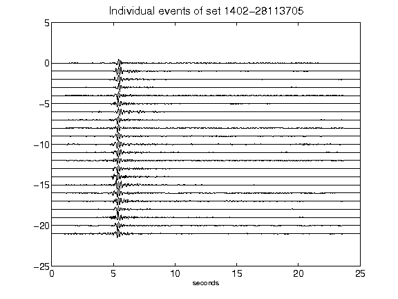](figures/1402-28113705_AllEv.png)[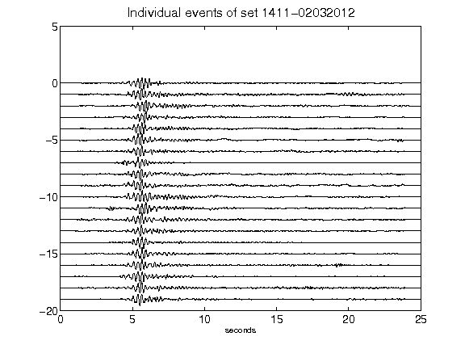](figures/1411-02032012_AllEv.png)[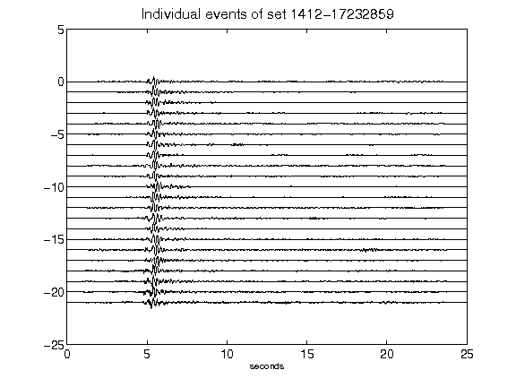](figures/1412-17232859_AllEv.png)[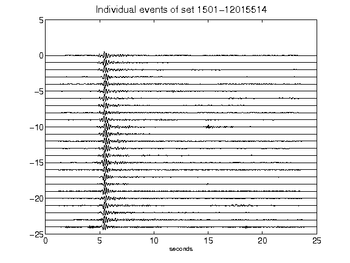](figures/1501-12015514_AllEv.png)[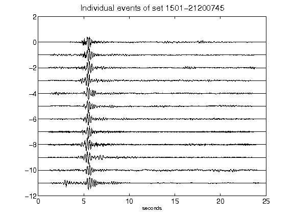](figures/1501-21200745_AllEv.png)[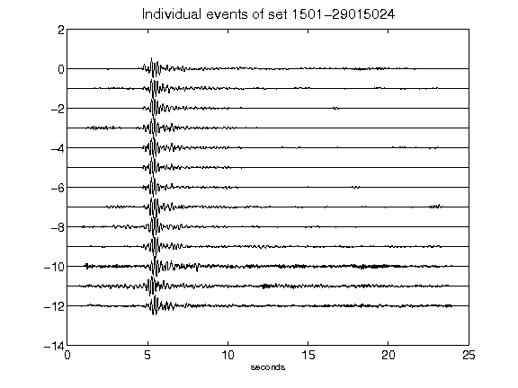](figures/1501-29015024_AllEv.png)[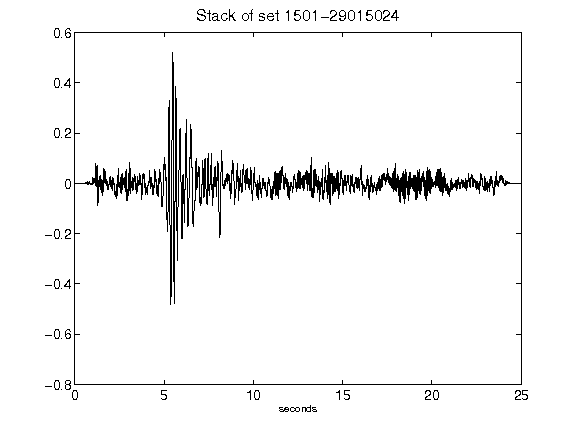](figures/1501-29015024_Stack.png)[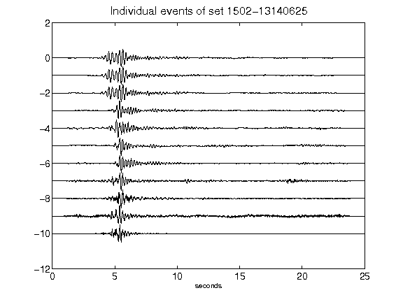](figures/1502-13140625_AllEv.png)[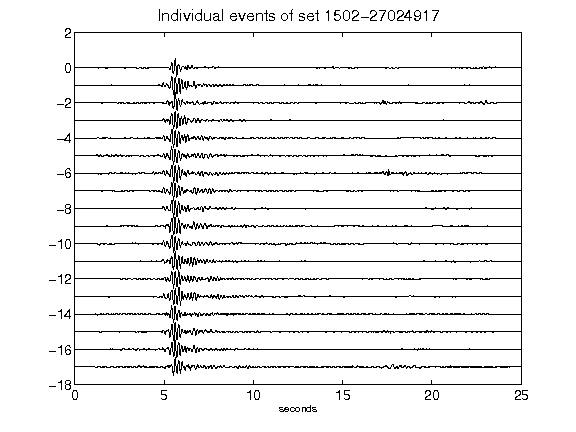](figures/1502-27024917_AllEv.png)[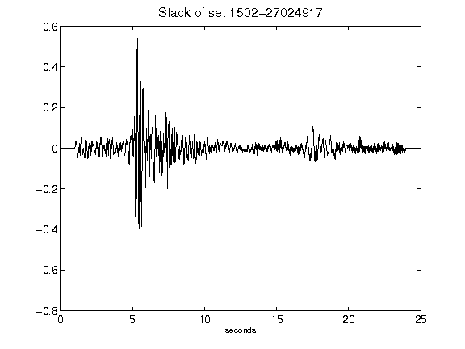](figures/1502-27024917_Stack.png)[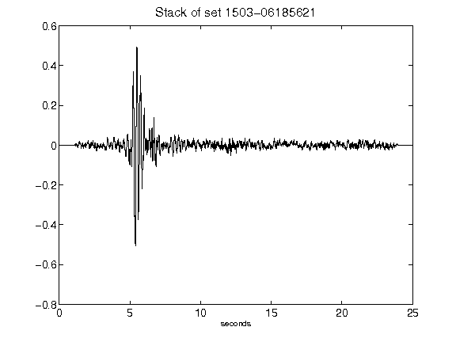](figures/1503-06185621_Stack.png)[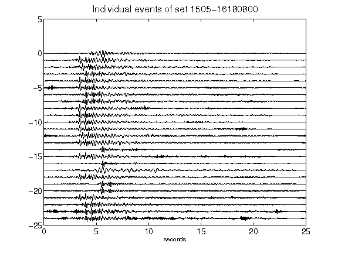](figures/1505-16180800_AllEv.png)[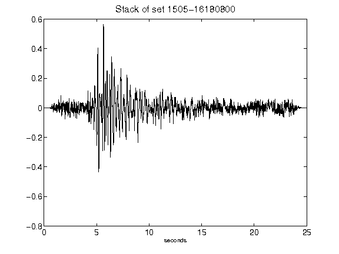](figures/1505-16180800_Stack.png)[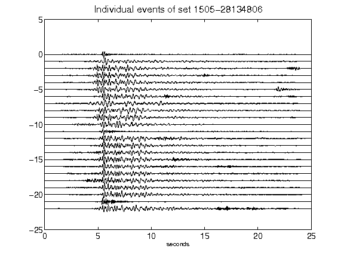](figures/1505-28134806_AllEv.png)[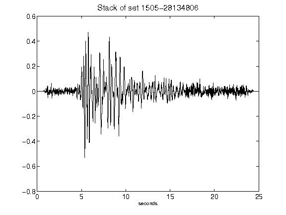](figures/1505-28134806_Stack.png)