# Repeating Earthquake Activity at RCM

## Waveforms
[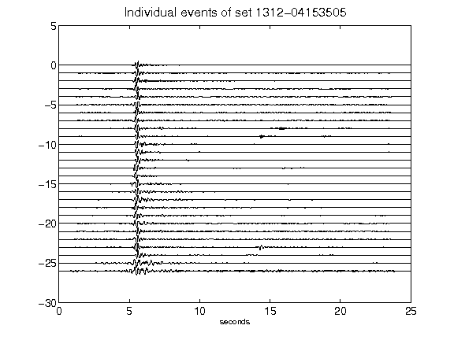](figures/1312-04153505_AllEv.png)[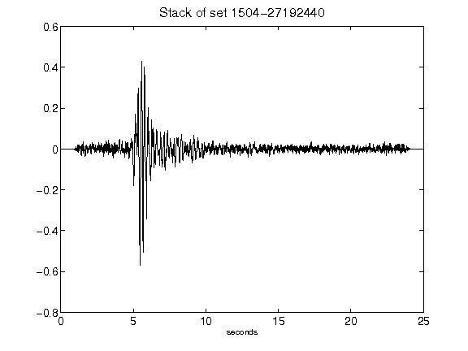](figures/1504-27192440_Stack.png)[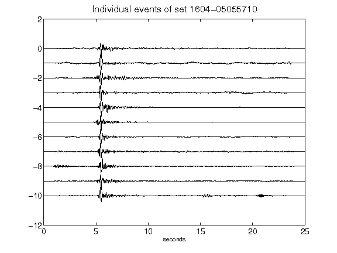](figures/1604-05055710_AllEv.png)[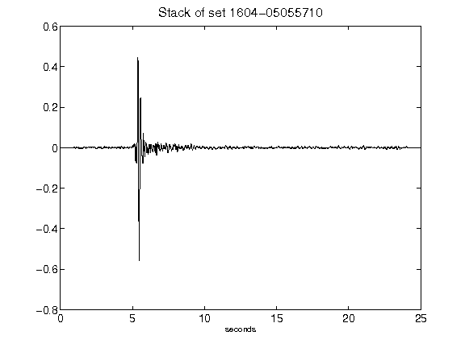](figures/1604-05055710_Stack.png)[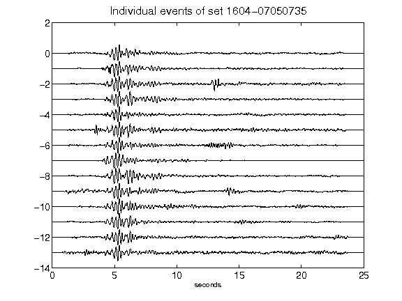](figures/1604-07050735_AllEv.png)[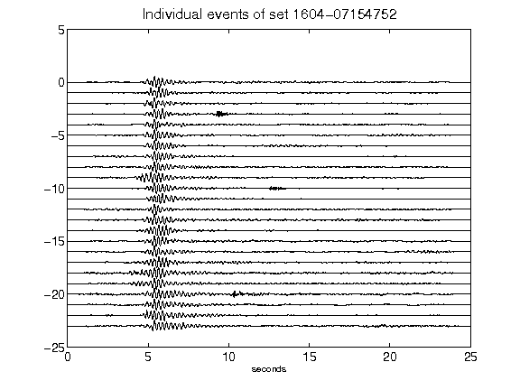](figures/1604-07154752_AllEv.png)[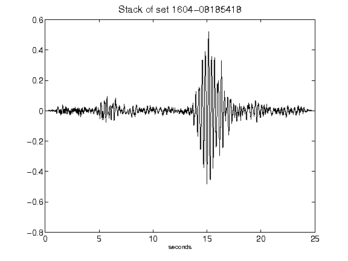](figures/1604-08185418_Stack.png)[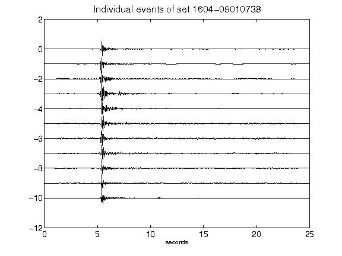](figures/1604-09010738_AllEv.png)[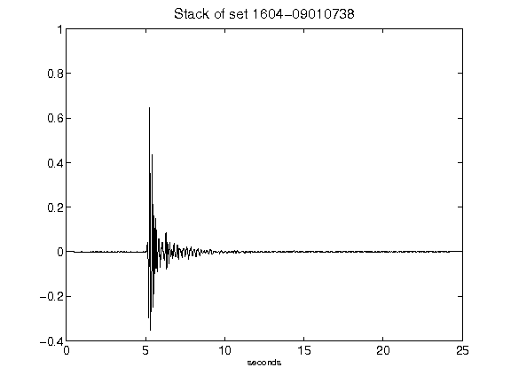](figures/1604-09010738_Stack.png)[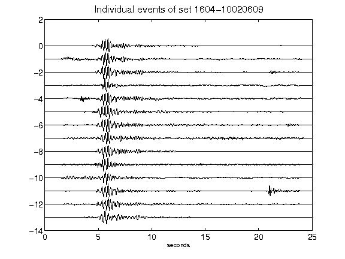](figures/1604-10020609_AllEv.png)[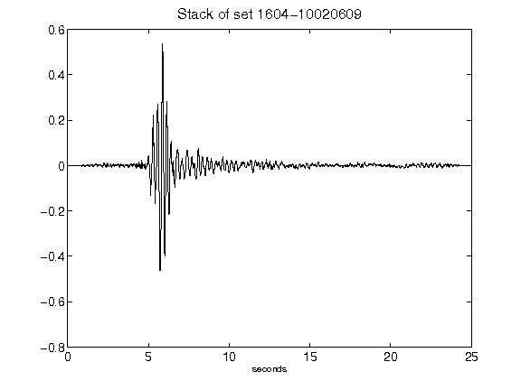](figures/1604-10020609_Stack.png)[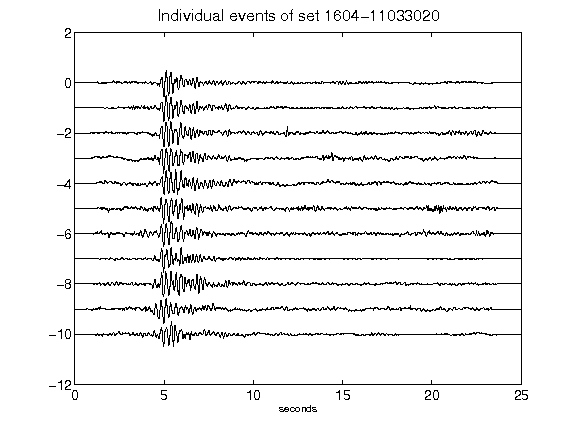](figures/1604-11033020_AllEv.png)