# Repeating Earthquake Activity at RCM

## Waveforms
[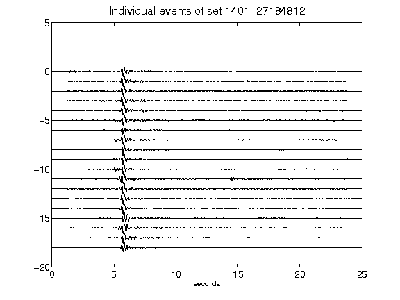](figures/1401-27184812_AllEv.png)[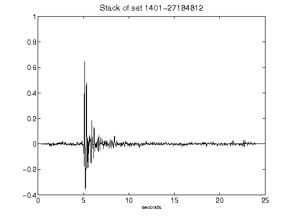](figures/1401-27184812_Stack.png)[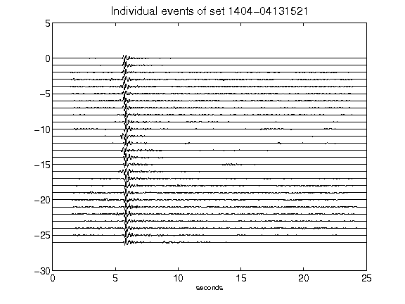](figures/1404-04131521_AllEv.png)[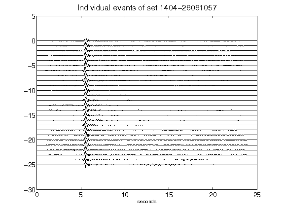](figures/1404-26061057_AllEv.png)[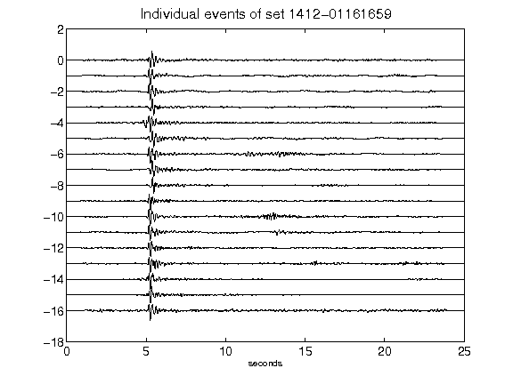](figures/1412-01161659_AllEv.png)[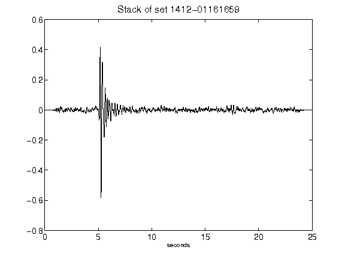](figures/1412-01161659_Stack.png)[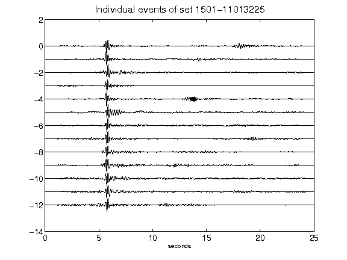](figures/1501-11013225_AllEv.png)[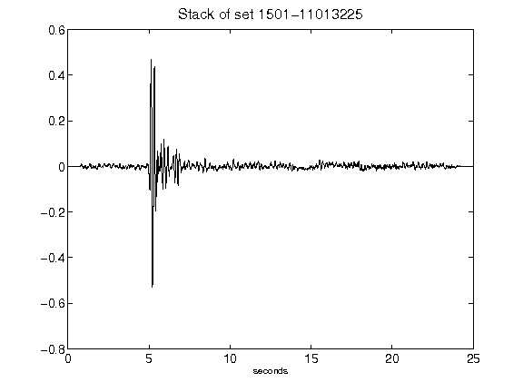](figures/1501-11013225_Stack.png)[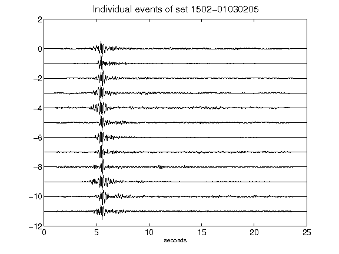](figures/1502-01030205_AllEv.png)[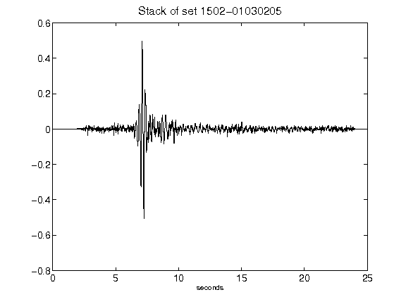](figures/1502-01030205_Stack.png)[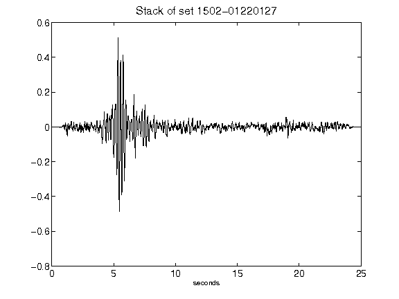](figures/1502-01220127_Stack.png)[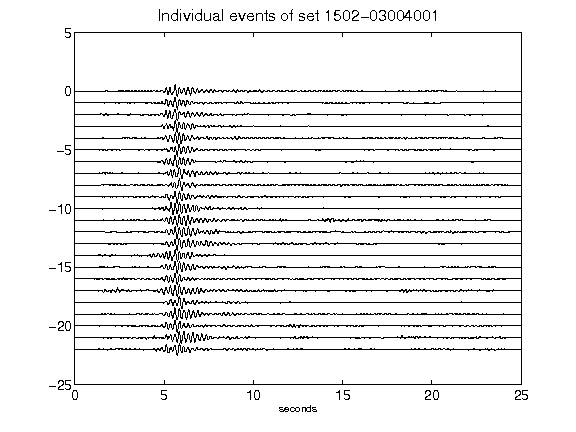](figures/1502-03004001_AllEv.png)[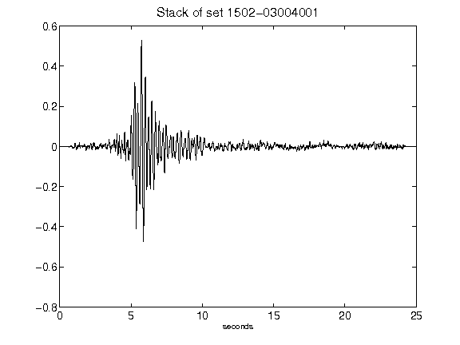](figures/1502-03004001_Stack.png)