# Repeating Earthquake Activity at RCM

## Waveforms
[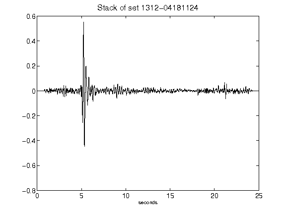](figures/1312-04181124_Stack.png)[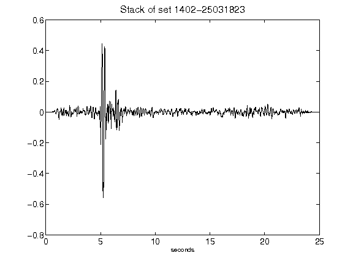](figures/1402-25031823_Stack.png)[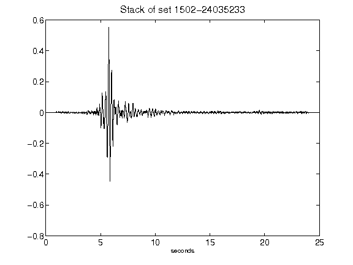](figures/1502-24035233_Stack.png)[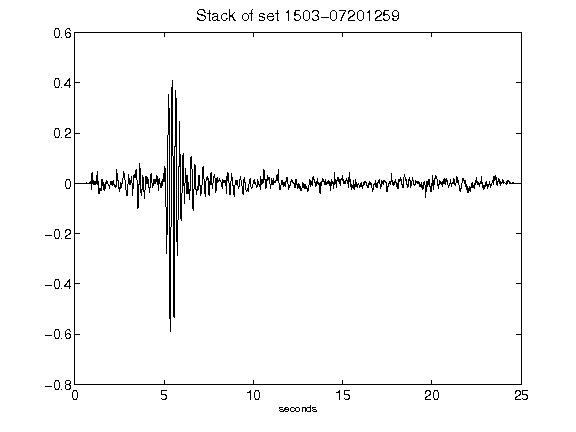](figures/1503-07201259_Stack.png)[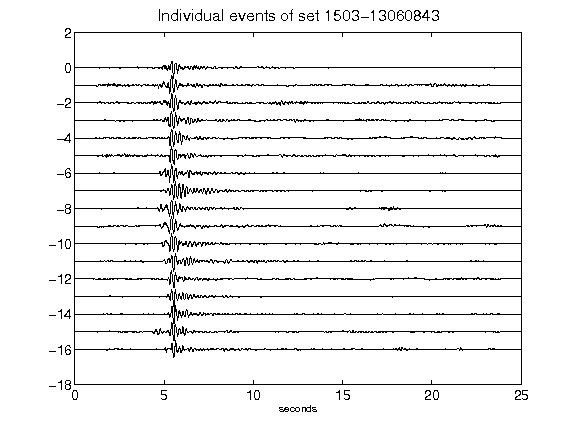](figures/1503-13060843_AllEv.png)[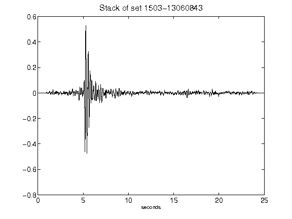](figures/1503-13060843_Stack.png)[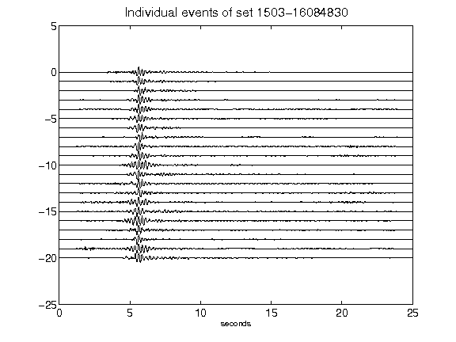](figures/1503-16084830_AllEv.png)[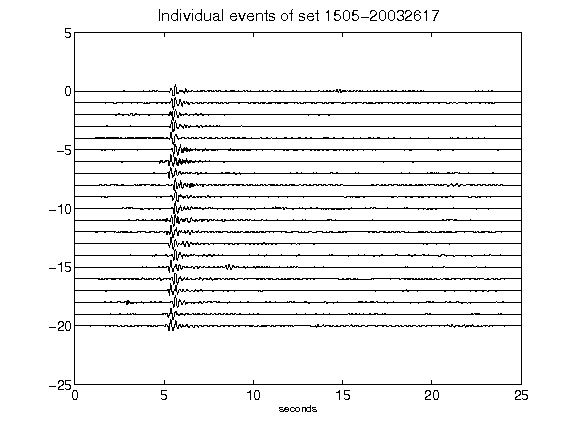](figures/1505-20032617_AllEv.png)[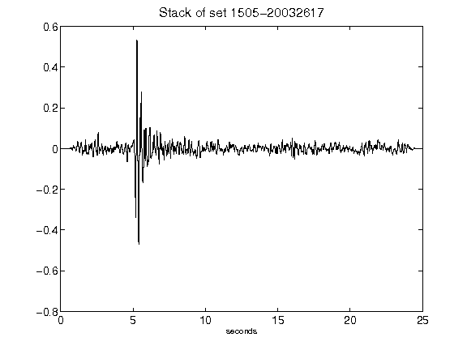](figures/1505-20032617_Stack.png)[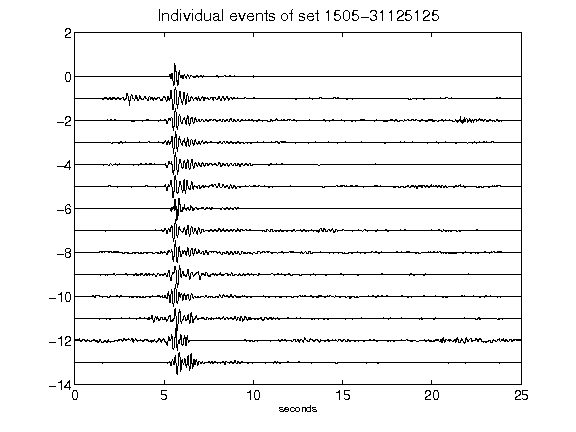](figures/1505-31125125_AllEv.png)[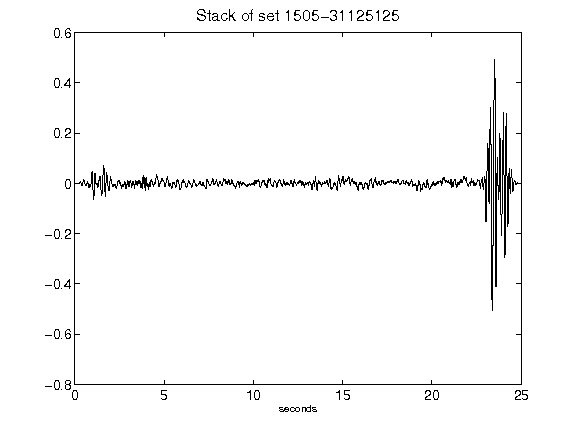](figures/1505-31125125_Stack.png)[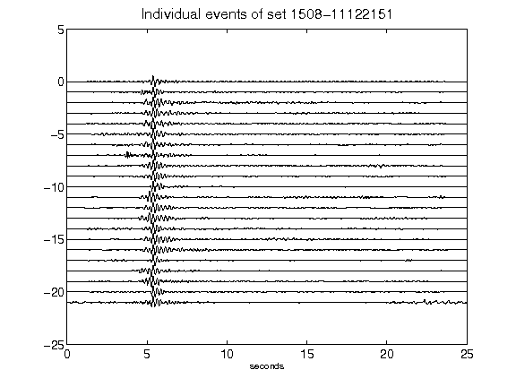](figures/1508-11122151_AllEv.png)[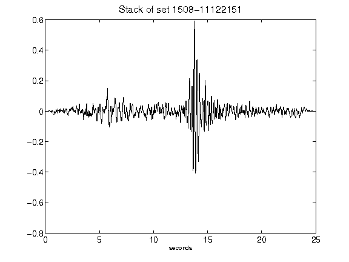](figures/1508-11122151_Stack.png)[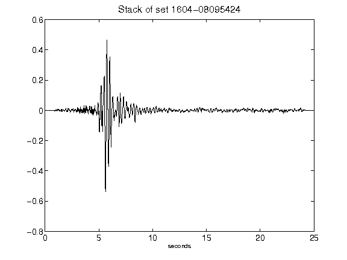](figures/1604-08095424_Stack.png)[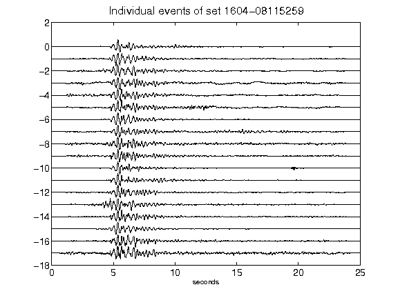](figures/1604-08115259_AllEv.png)