# Repeating Earthquake Activity at RCM

## Waveforms
[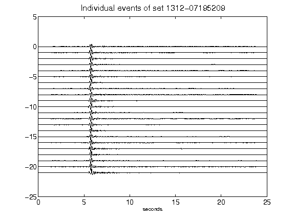](figures/1312-07195209_AllEv.png)[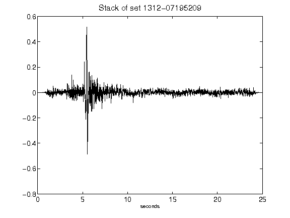](figures/1312-07195209_Stack.png)[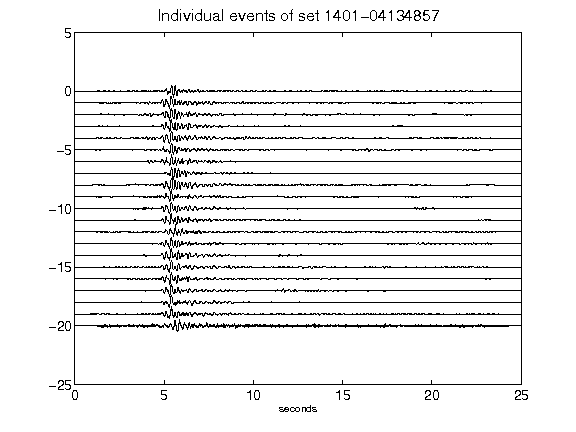](figures/1401-04134857_AllEv.png)[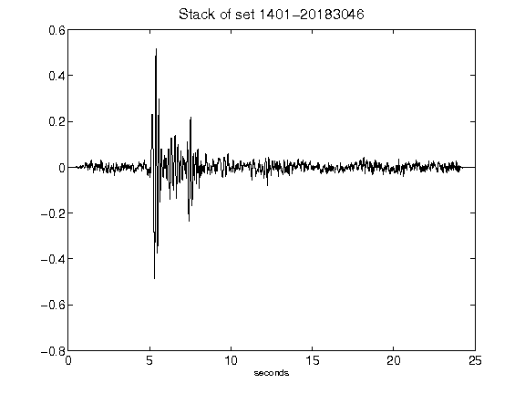](figures/1401-20183046_Stack.png)[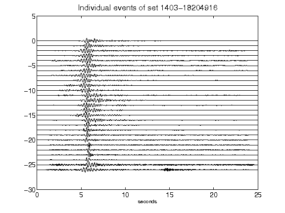](figures/1403-18204916_AllEv.png)[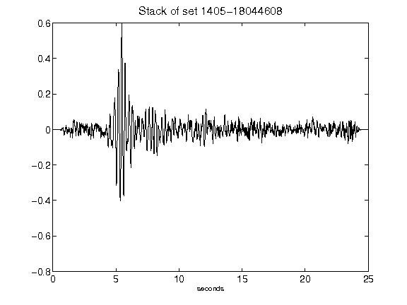](figures/1405-18044608_Stack.png)[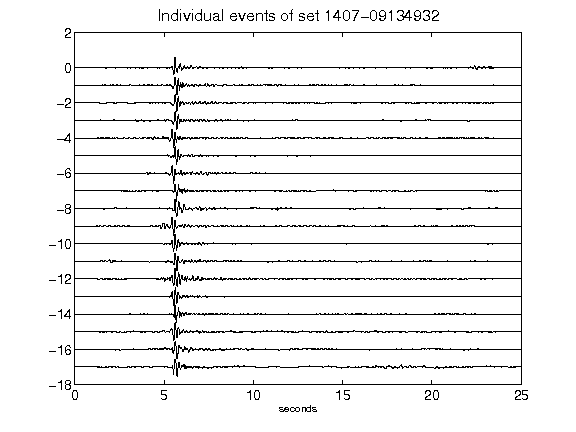](figures/1407-09134932_AllEv.png)[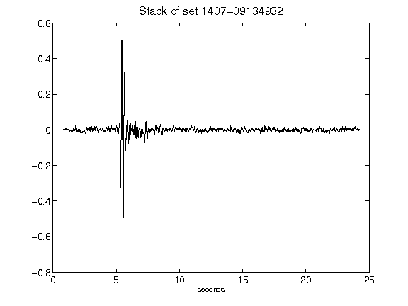](figures/1407-09134932_Stack.png)[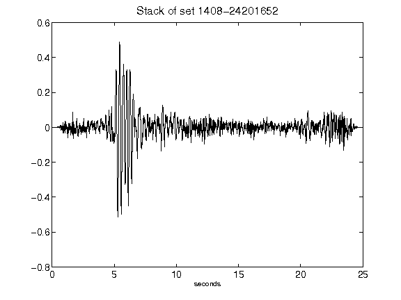](figures/1408-24201652_Stack.png)[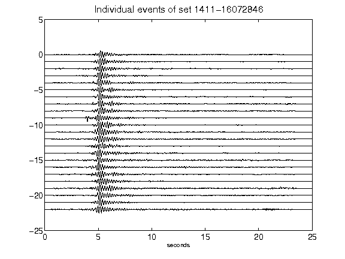](figures/1411-16072846_AllEv.png)[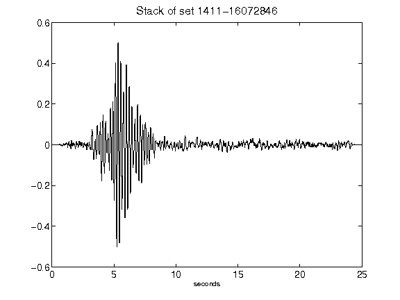](figures/1411-16072846_Stack.png)[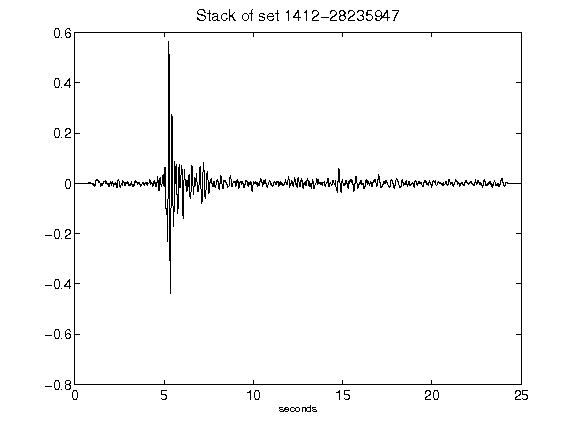](figures/1412-28235947_Stack.png)[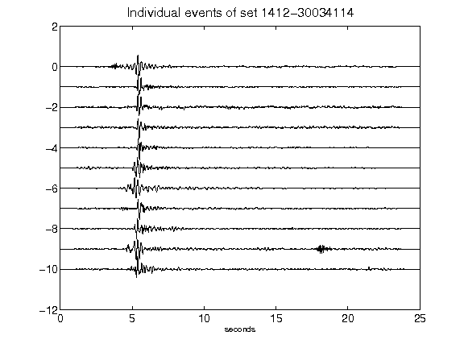](figures/1412-30034114_AllEv.png)[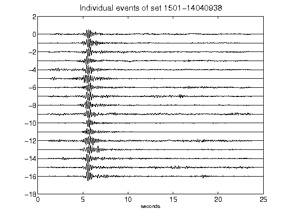](figures/1501-14040938_AllEv.png)[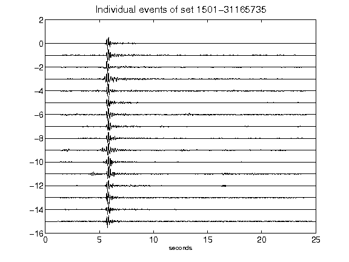](figures/1501-31165735_AllEv.png)[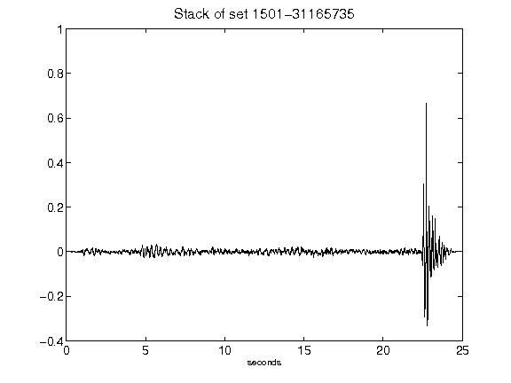](figures/1501-31165735_Stack.png)[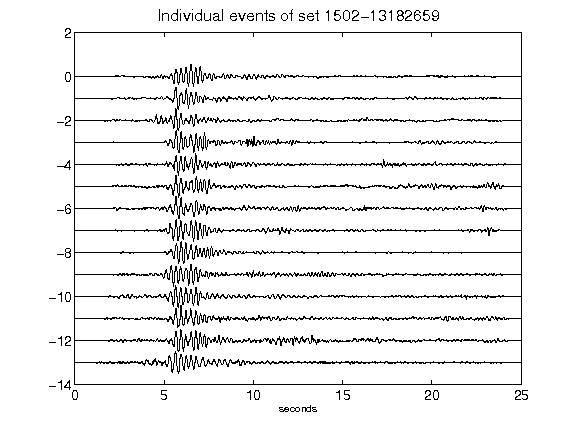](figures/1502-13182659_AllEv.png)[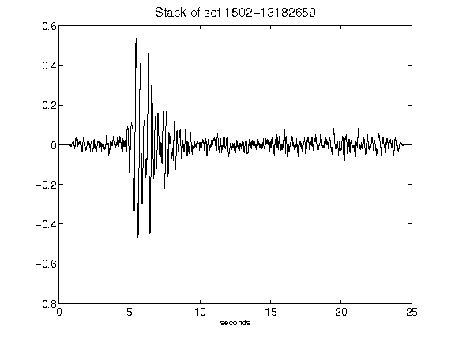](figures/1502-13182659_Stack.png)[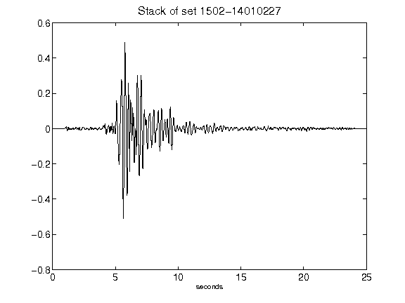](figures/1502-14010227_Stack.png)[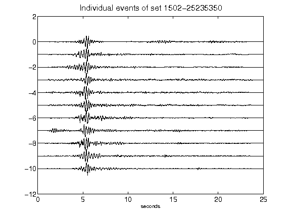](figures/1502-25235350_AllEv.png)[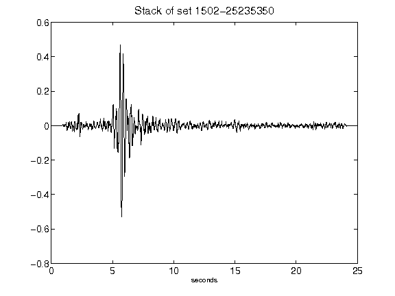](figures/1502-25235350_Stack.png)[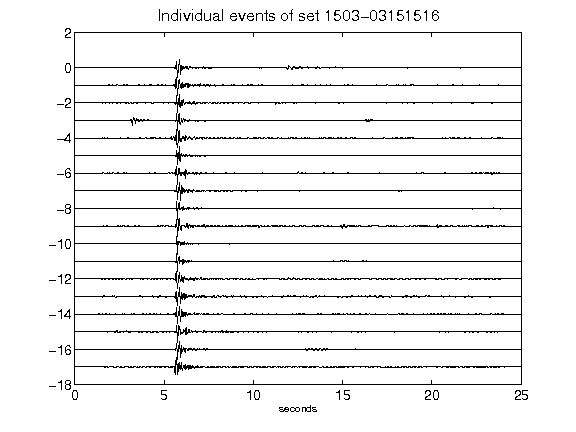](figures/1503-03151516_AllEv.png)[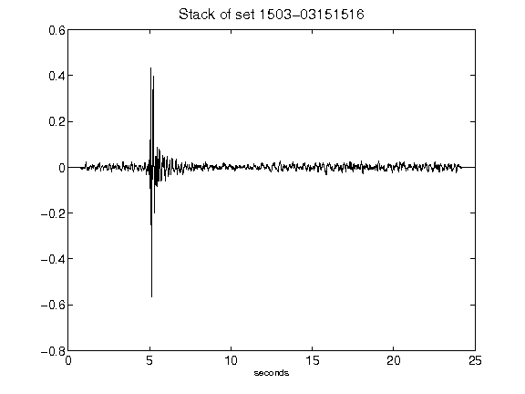](figures/1503-03151516_Stack.png)[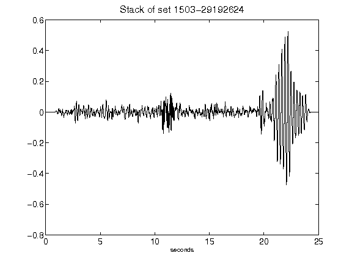](figures/1503-29192624_Stack.png)[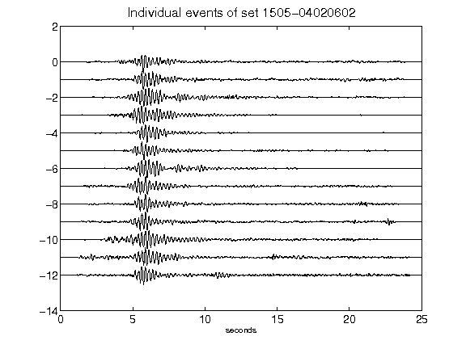](figures/1505-04020602_AllEv.png)[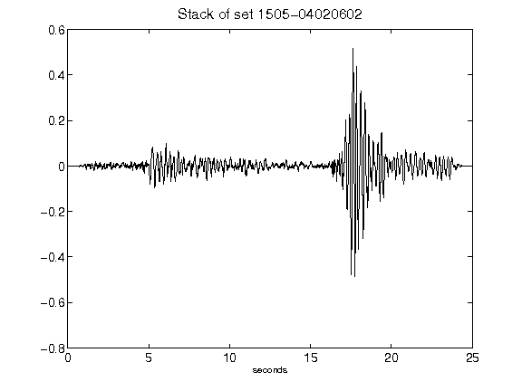](figures/1505-04020602_Stack.png)