# Repeating Earthquake Activity at RCM

## Waveforms
[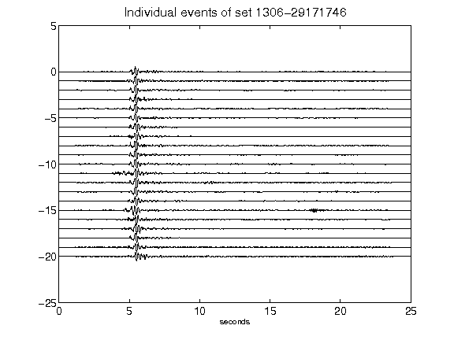](figures/1306-29171746_AllEv.png)[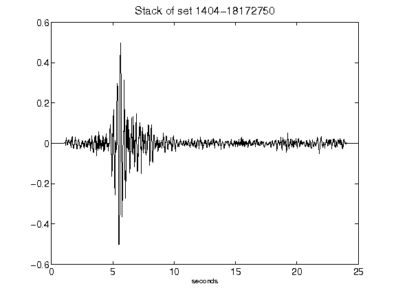](figures/1404-18172750_Stack.png)[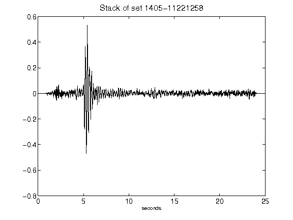](figures/1405-11221258_Stack.png)[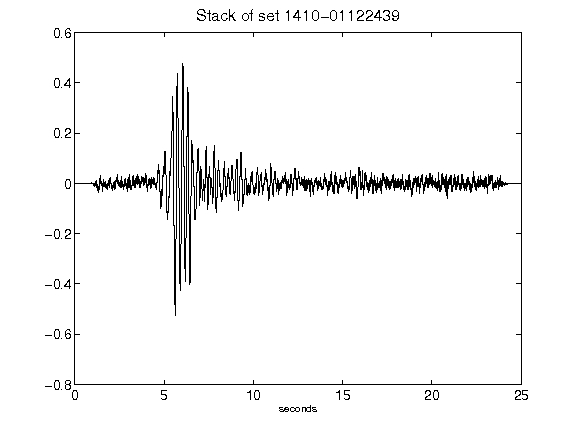](figures/1410-01122439_Stack.png)[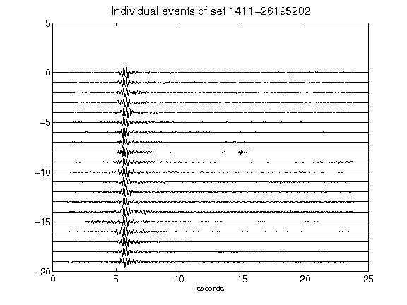](figures/1411-26195202_AllEv.png)[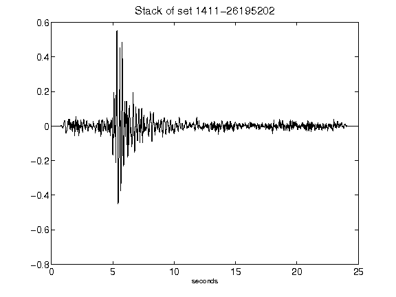](figures/1411-26195202_Stack.png)[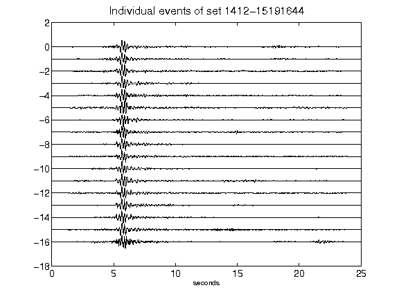](figures/1412-15191644_AllEv.png)[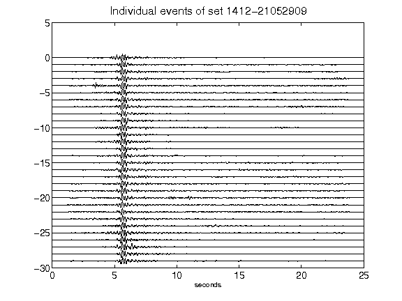](figures/1412-21052909_AllEv.png)[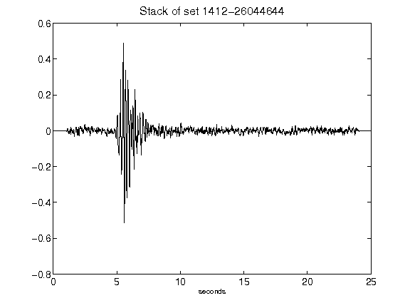](figures/1412-26044644_Stack.png)[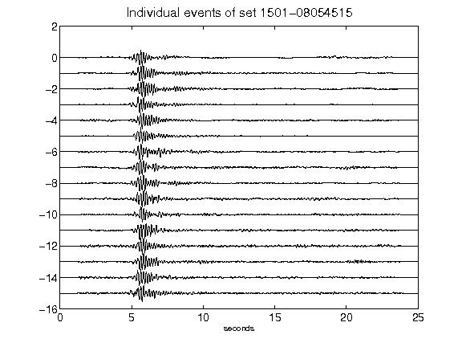](figures/1501-08054515_AllEv.png)[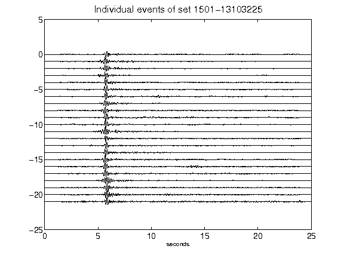](figures/1501-13103225_AllEv.png)[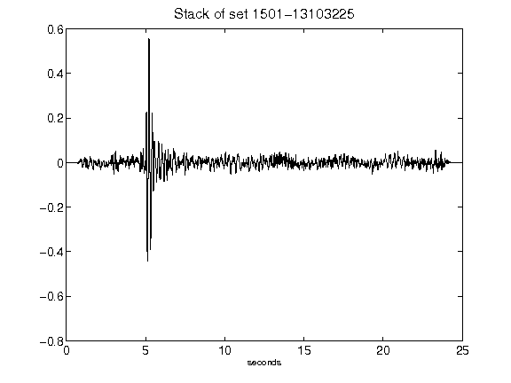](figures/1501-13103225_Stack.png)[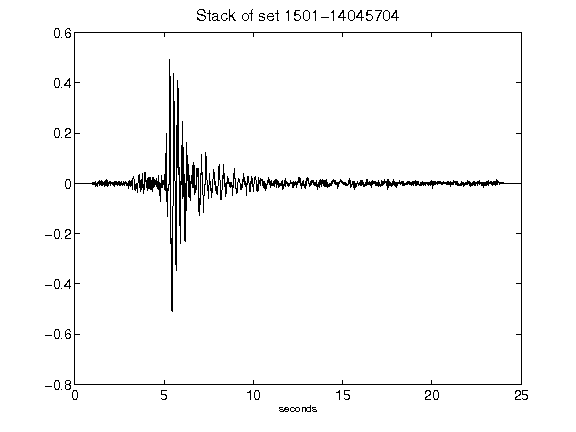](figures/1501-14045704_Stack.png)[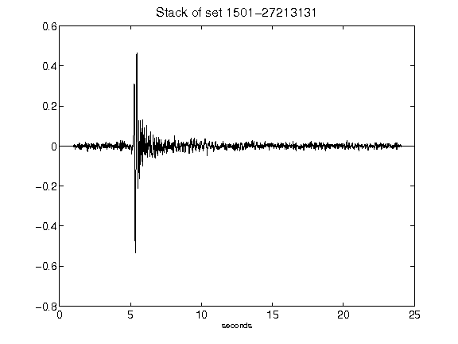](figures/1501-27213131_Stack.png)[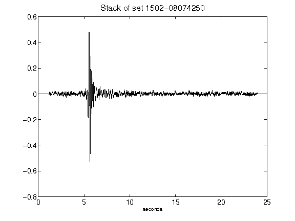](figures/1502-08074250_Stack.png)[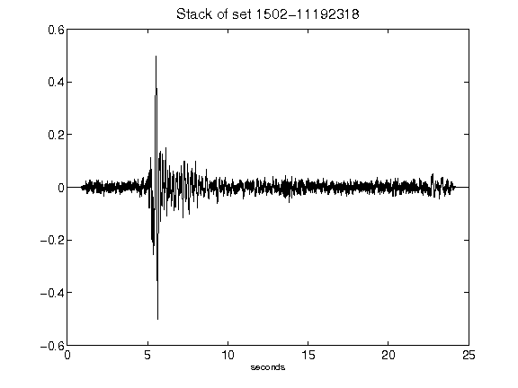](figures/1502-11192318_Stack.png)[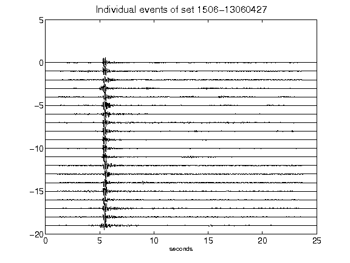](figures/1506-13060427_AllEv.png)