# Repeating Earthquake Activity at RCM

## Waveforms
[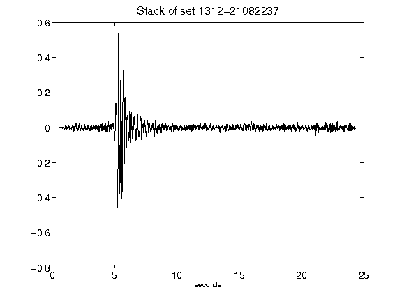](figures/1312-21082237_Stack.png)[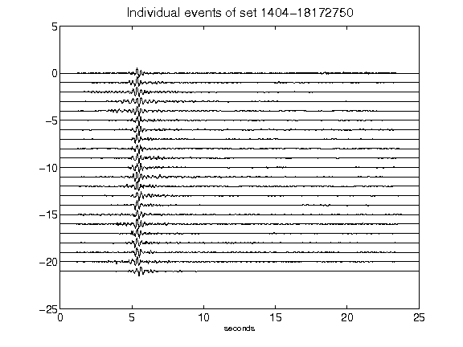](figures/1404-18172750_AllEv.png)[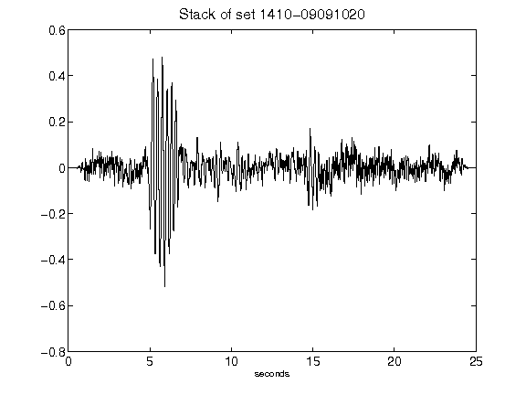](figures/1410-09091020_Stack.png)[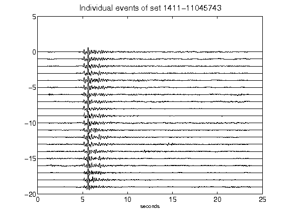](figures/1411-11045743_AllEv.png)[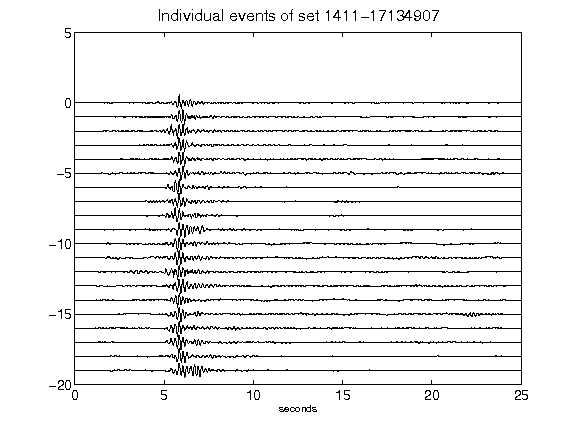](figures/1411-17134907_AllEv.png)[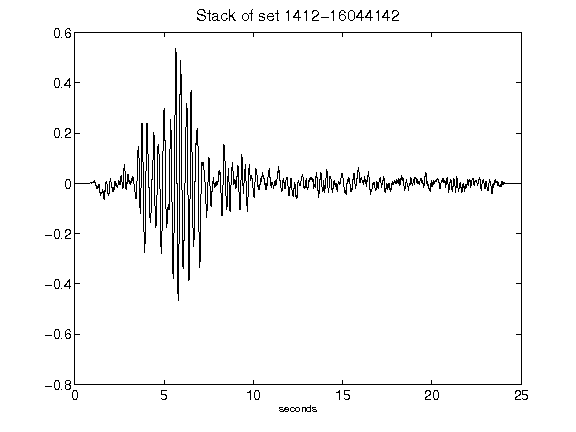](figures/1412-16044142_Stack.png)[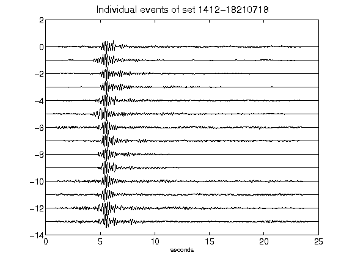](figures/1412-18210718_AllEv.png)[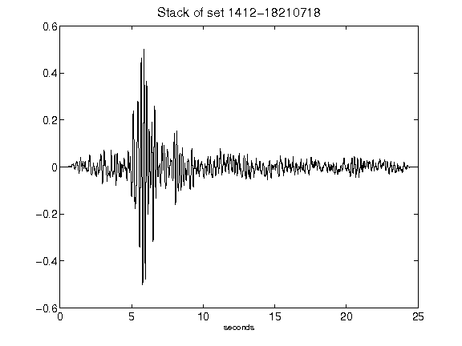](figures/1412-18210718_Stack.png)[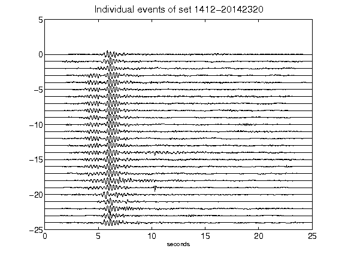](figures/1412-20142320_AllEv.png)[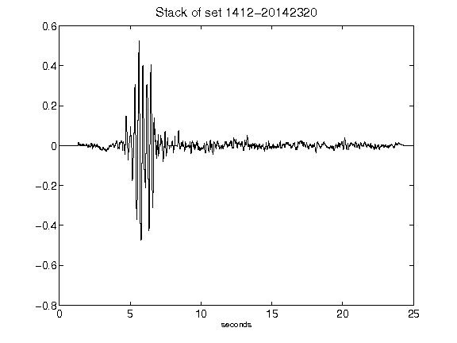](figures/1412-20142320_Stack.png)[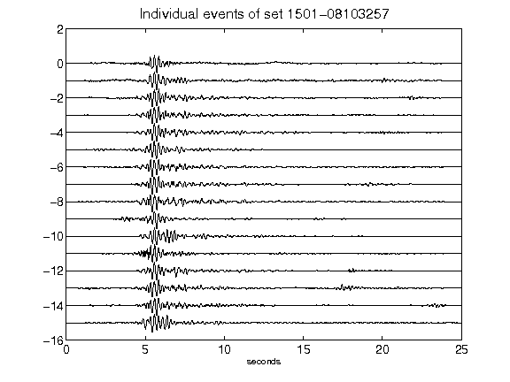](figures/1501-08103257_AllEv.png)[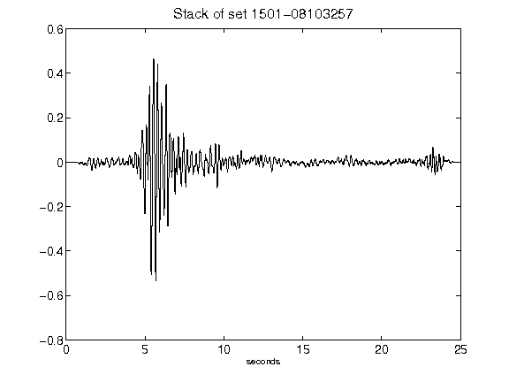](figures/1501-08103257_Stack.png)[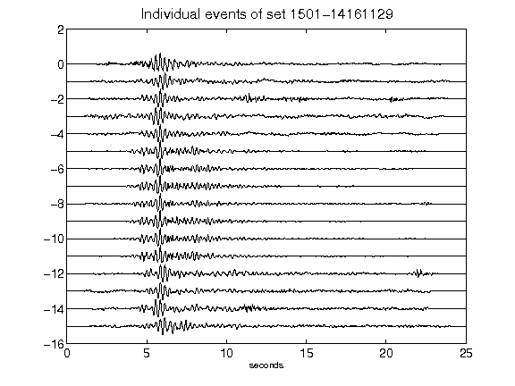](figures/1501-14161129_AllEv.png)[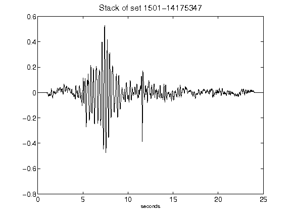](figures/1501-14175347_Stack.png)[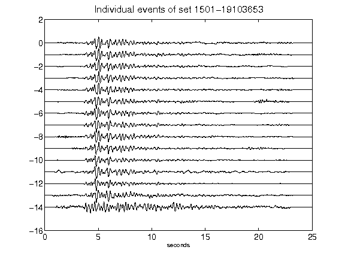](figures/1501-19103653_AllEv.png)[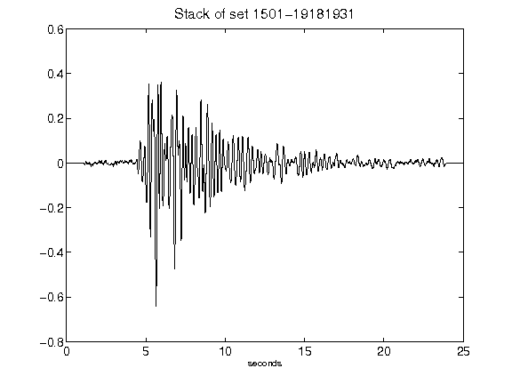](figures/1501-19181931_Stack.png)[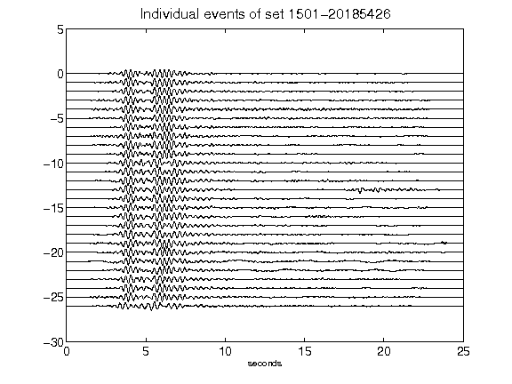](figures/1501-20185426_AllEv.png)