# Repeating Earthquake Activity at RCM

## Waveforms
[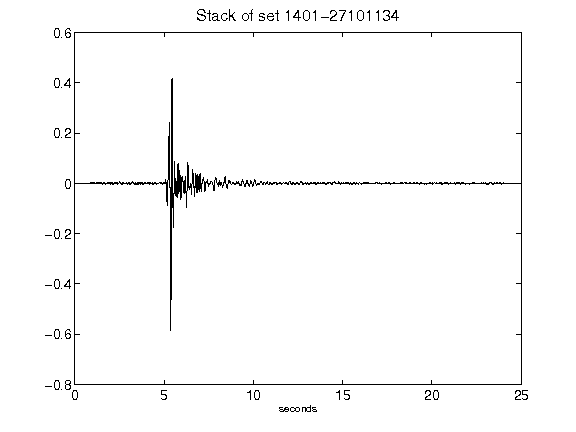](figures/1401-27101134_Stack.png)[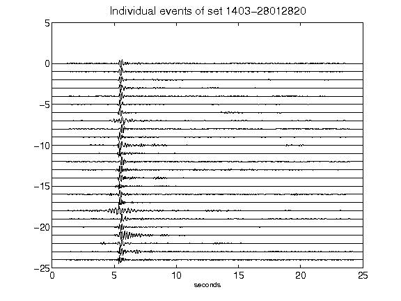](figures/1403-28012820_AllEv.png)[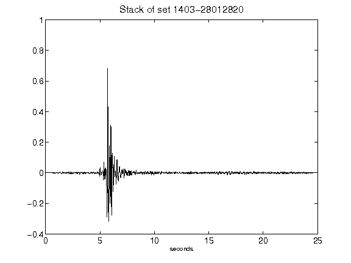](figures/1403-28012820_Stack.png)[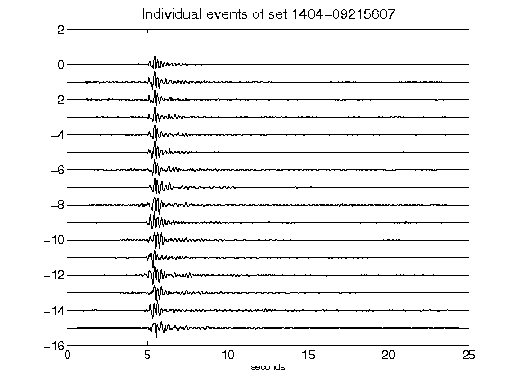](figures/1404-09215607_AllEv.png)[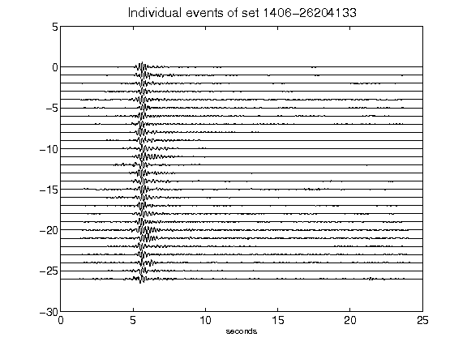](figures/1406-26204133_AllEv.png)[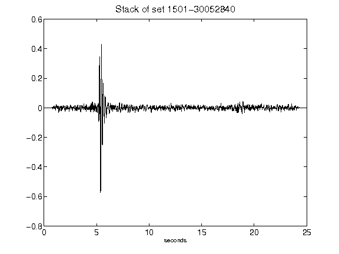](figures/1501-30052840_Stack.png)[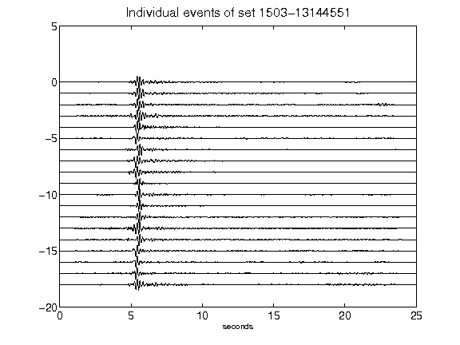](figures/1503-13144551_AllEv.png)[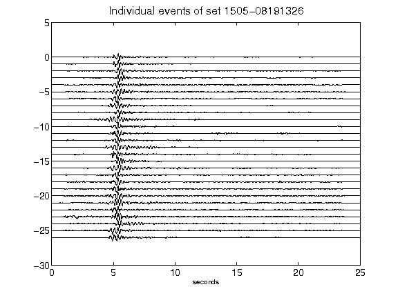](figures/1505-08191326_AllEv.png)[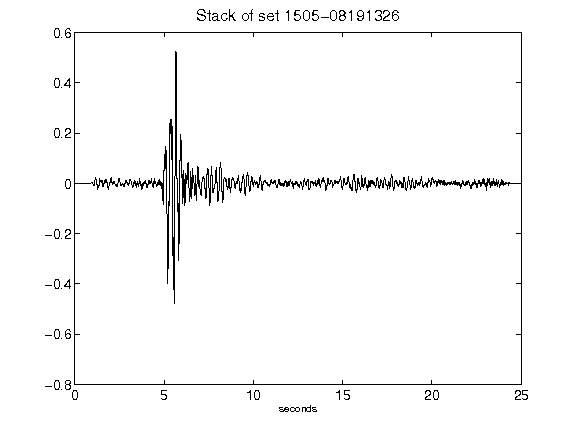](figures/1505-08191326_Stack.png)[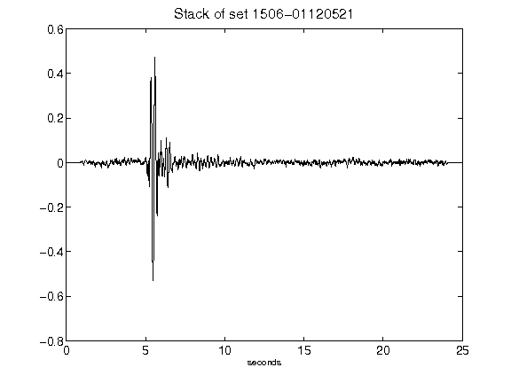](figures/1506-01120521_Stack.png)[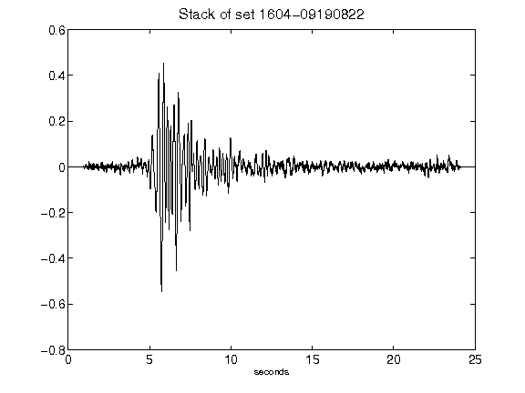](figures/1604-09190822_Stack.png)[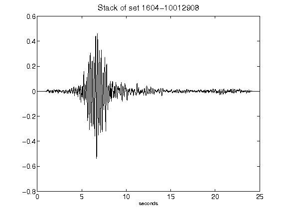](figures/1604-10012908_Stack.png)[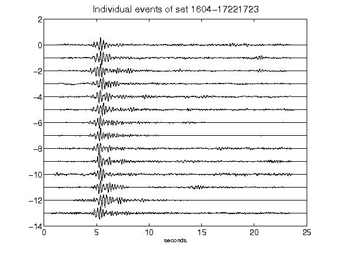](figures/1604-17221723_AllEv.png)[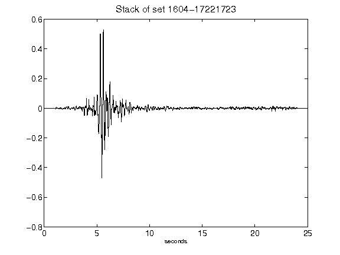](figures/1604-17221723_Stack.png)[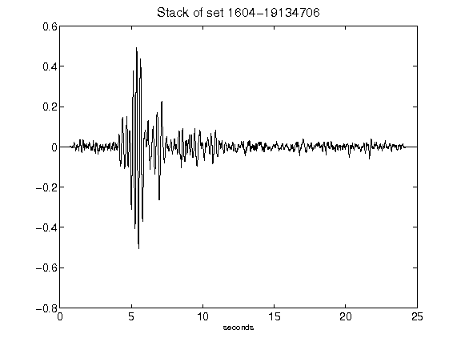](figures/1604-19134706_Stack.png)