# Repeating Earthquake Activity at RCM

## Waveforms
[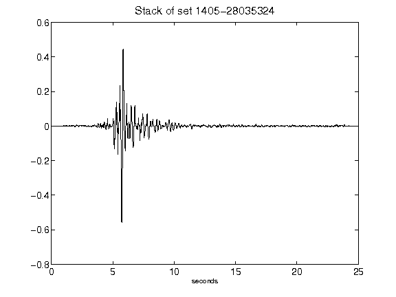](figures/1405-28035324_Stack.png)[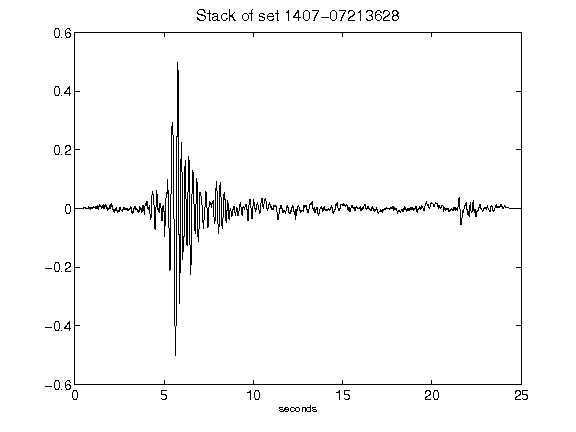](figures/1407-07213628_Stack.png)[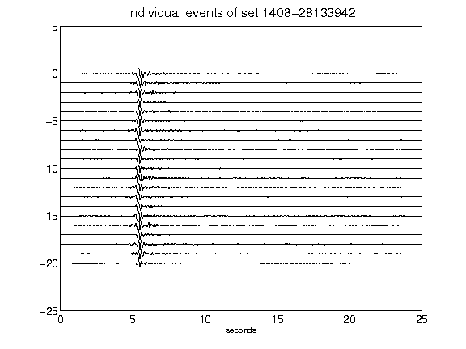](figures/1408-28133942_AllEv.png)[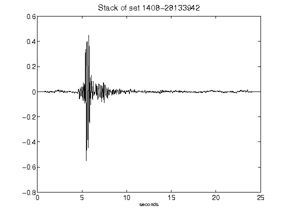](figures/1408-28133942_Stack.png)[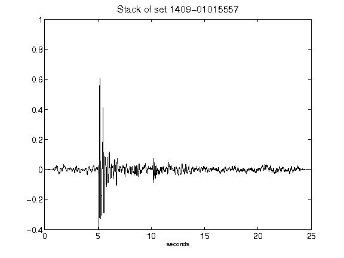](figures/1409-01015557_Stack.png)[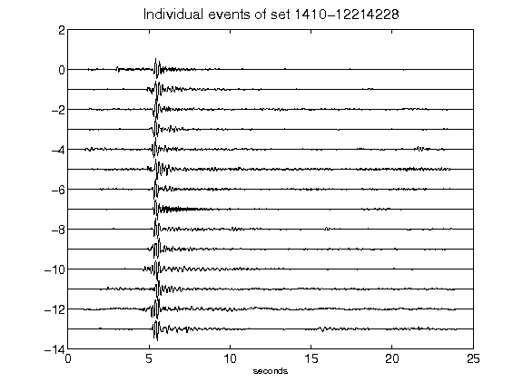](figures/1410-12214228_AllEv.png)[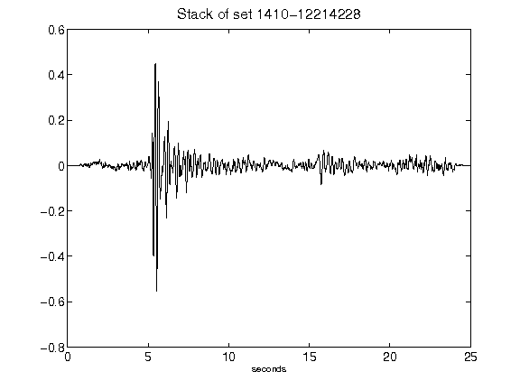](figures/1410-12214228_Stack.png)[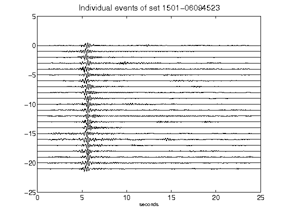](figures/1501-06094523_AllEv.png)[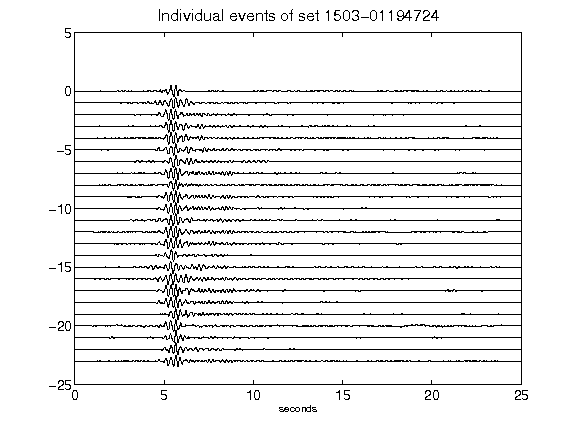](figures/1503-01194724_AllEv.png)[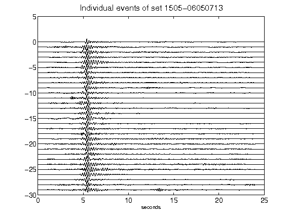](figures/1505-06050713_AllEv.png)[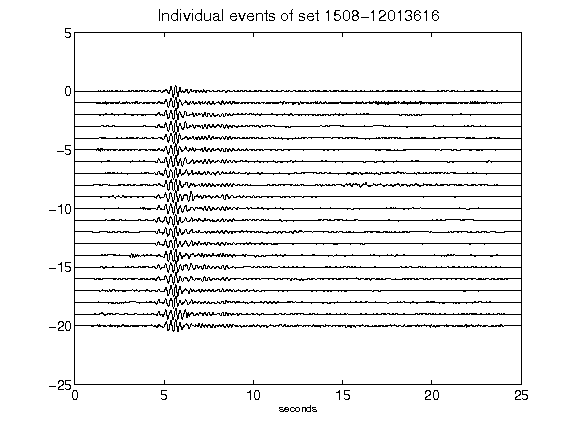](figures/1508-12013616_AllEv.png)[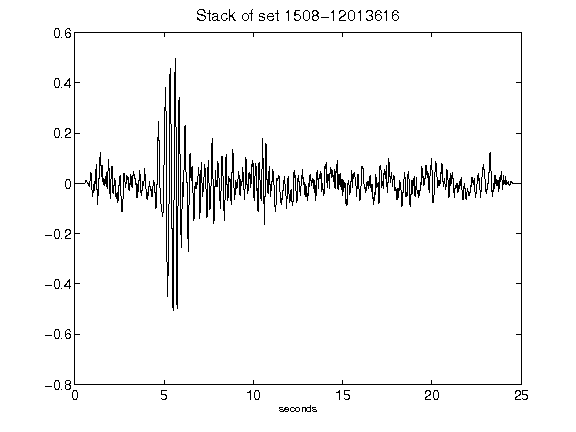](figures/1508-12013616_Stack.png)[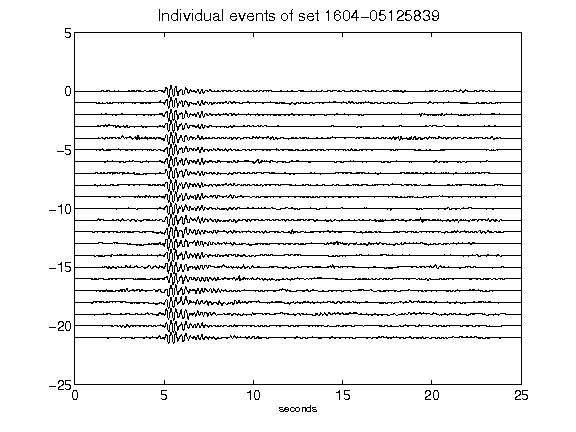](figures/1604-05125839_AllEv.png)[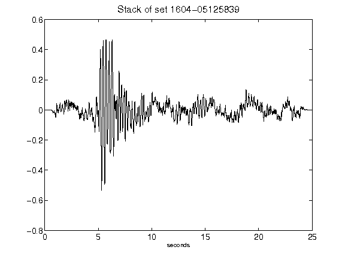](figures/1604-05125839_Stack.png)[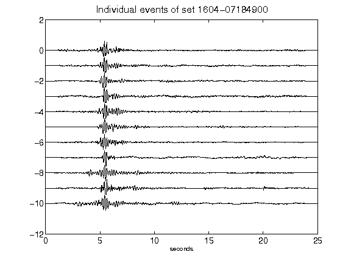](figures/1604-07184900_AllEv.png)[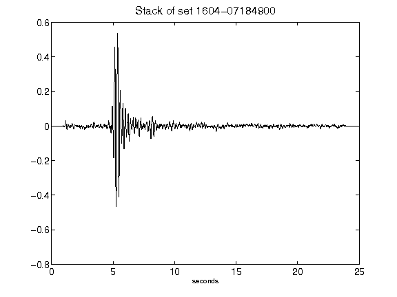](figures/1604-07184900_Stack.png)