# Repeating Earthquake Activity at RCM

## Waveforms
[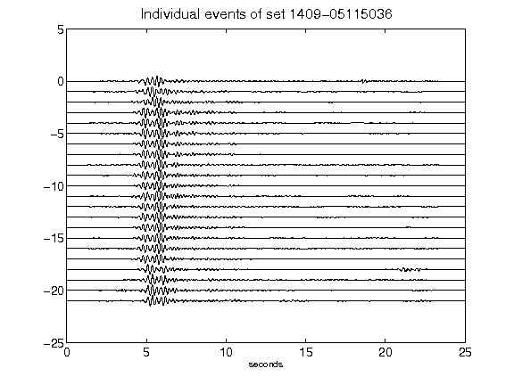](figures/1409-05115036_AllEv.png)[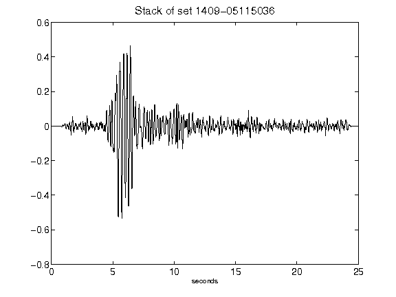](figures/1409-05115036_Stack.png)[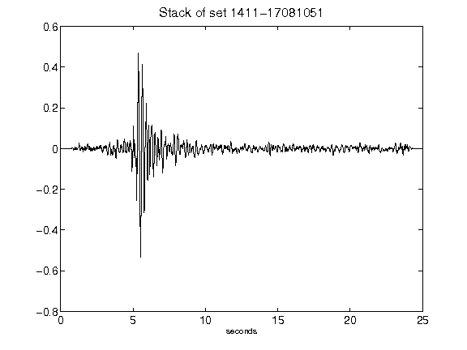](figures/1411-17081051_Stack.png)[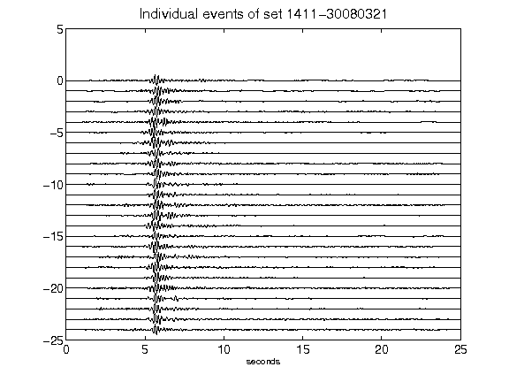](figures/1411-30080321_AllEv.png)[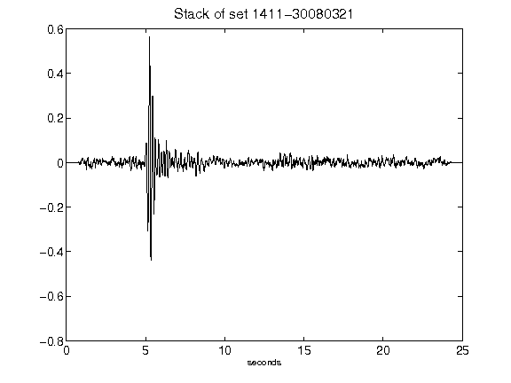](figures/1411-30080321_Stack.png)[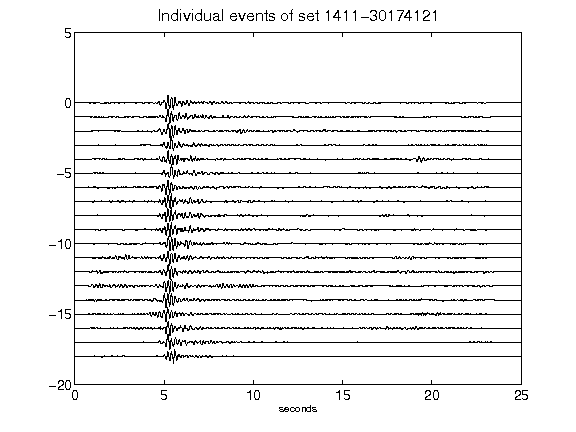](figures/1411-30174121_AllEv.png)[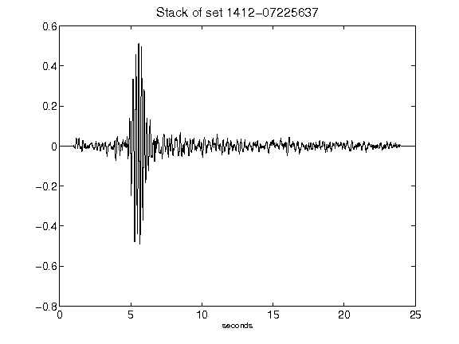](figures/1412-07225637_Stack.png)[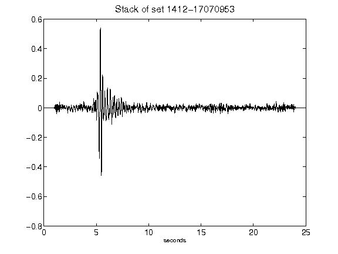](figures/1412-17070953_Stack.png)[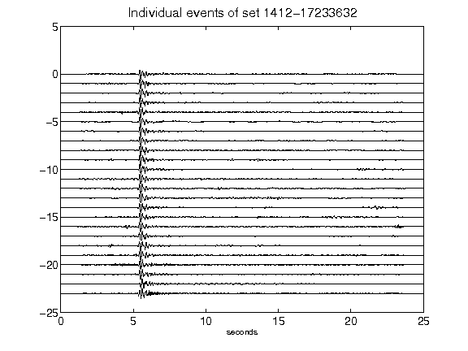](figures/1412-17233632_AllEv.png)[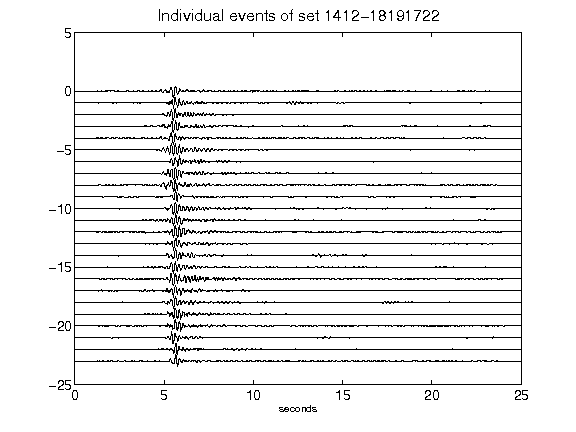](figures/1412-18191722_AllEv.png)[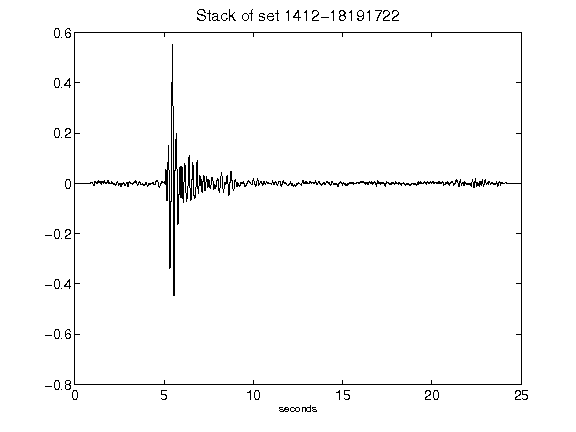](figures/1412-18191722_Stack.png)[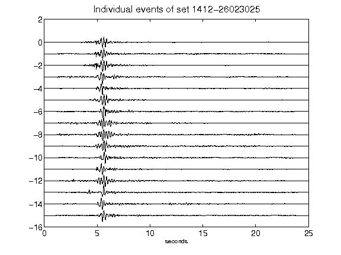](figures/1412-26023025_AllEv.png)[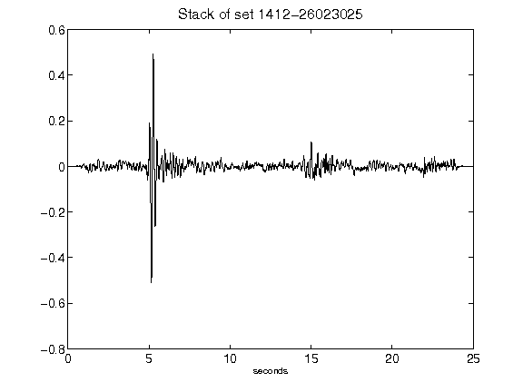](figures/1412-26023025_Stack.png)[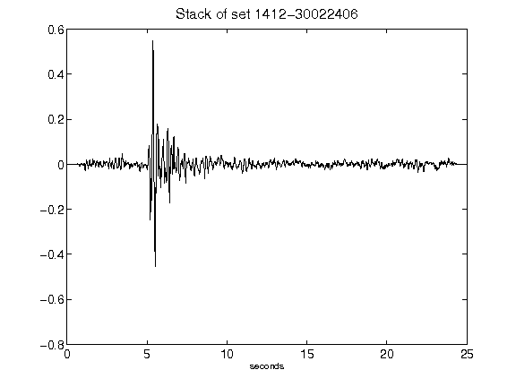](figures/1412-30022406_Stack.png)[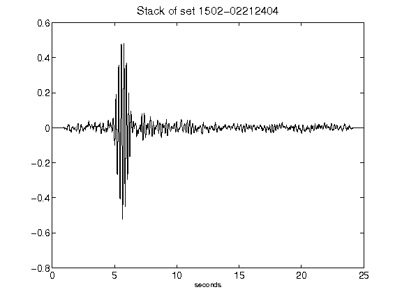](figures/1502-02212404_Stack.png)[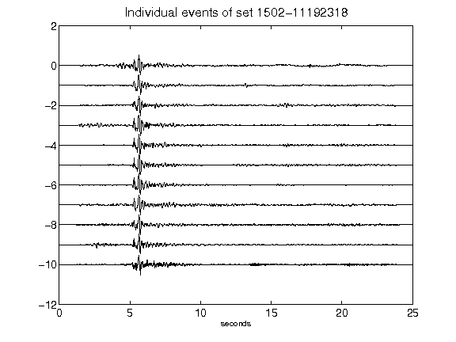](figures/1502-11192318_AllEv.png)[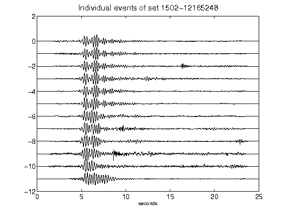](figures/1502-12165248_AllEv.png)[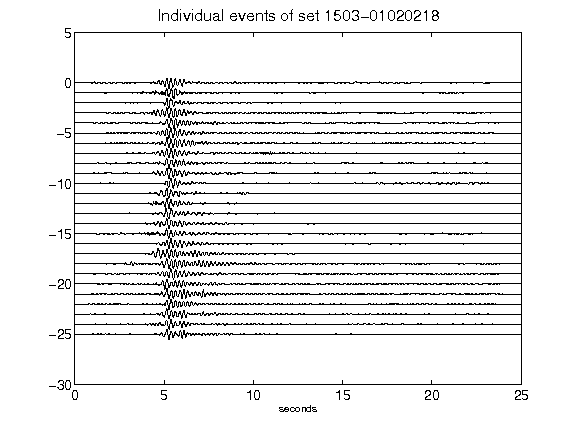](figures/1503-01020218_AllEv.png)[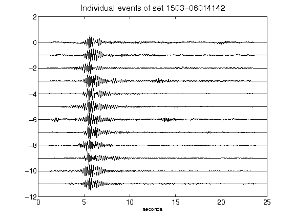](figures/1503-06014142_AllEv.png)[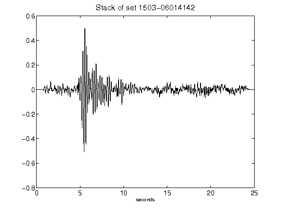](figures/1503-06014142_Stack.png)[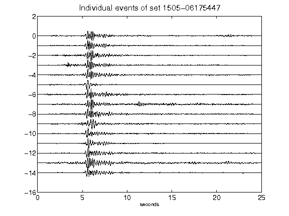](figures/1505-06175447_AllEv.png)[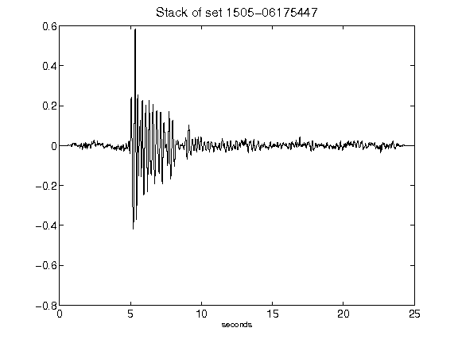](figures/1505-06175447_Stack.png)