# Repeating Earthquake Activity at RCM

## Waveforms
[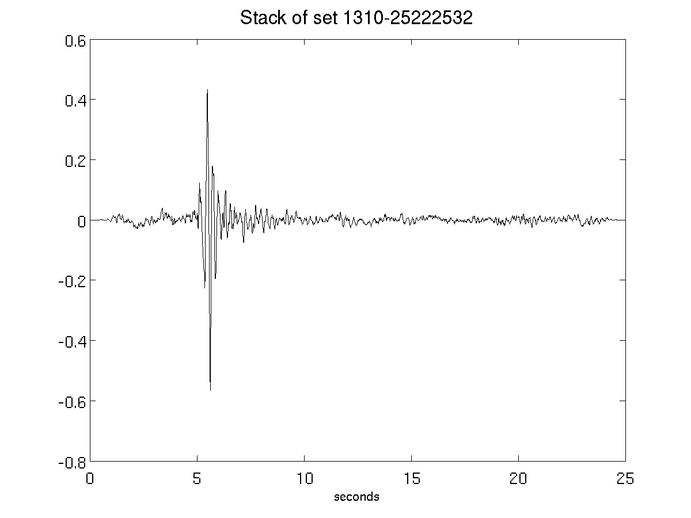](figures/1310-25222532_Stack.png)[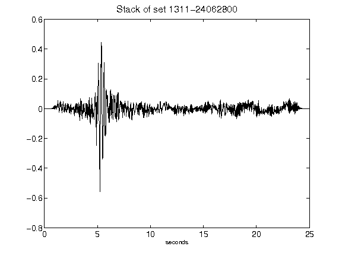](figures/1311-24062800_Stack.png)[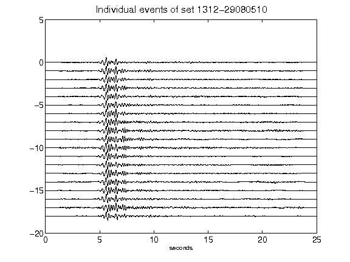](figures/1312-29080510_AllEv.png)[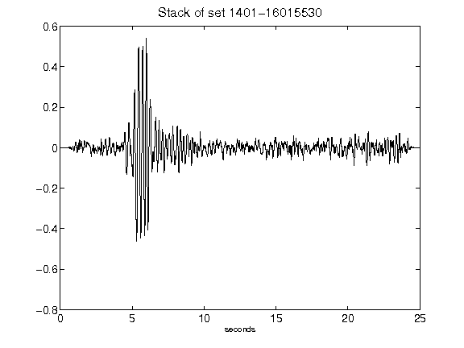](figures/1401-16015530_Stack.png)[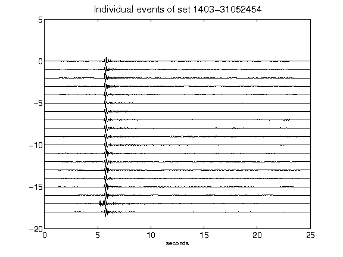](figures/1403-31052454_AllEv.png)[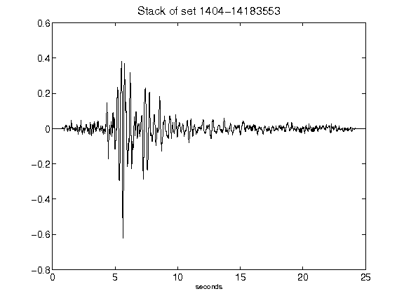](figures/1404-14183553_Stack.png)[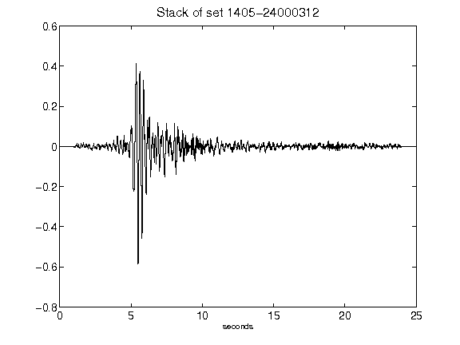](figures/1405-24000312_Stack.png)[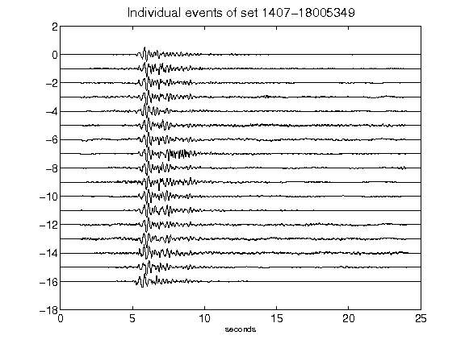](figures/1407-18005349_AllEv.png)[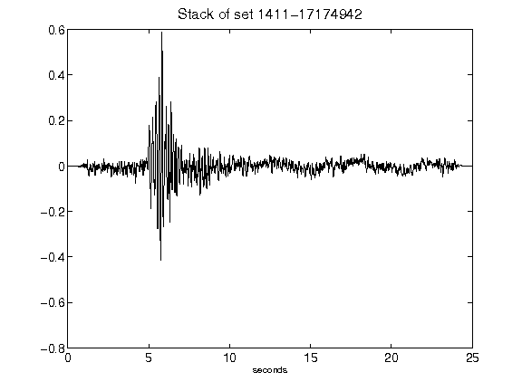](figures/1411-17174942_Stack.png)[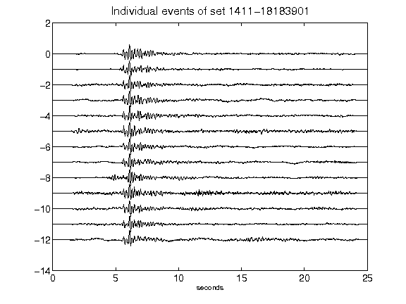](figures/1411-18183901_AllEv.png)[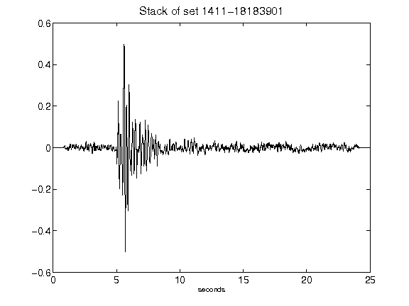](figures/1411-18183901_Stack.png)[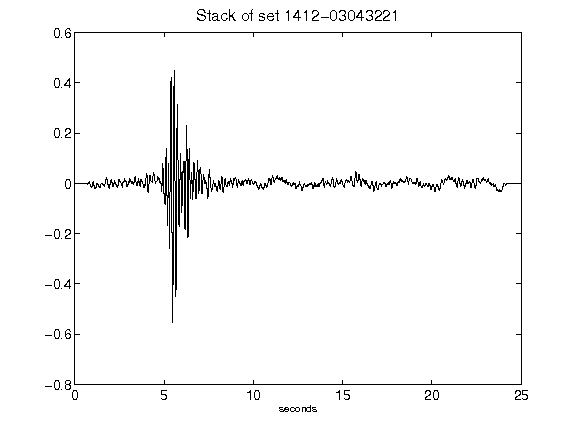](figures/1412-03043221_Stack.png)[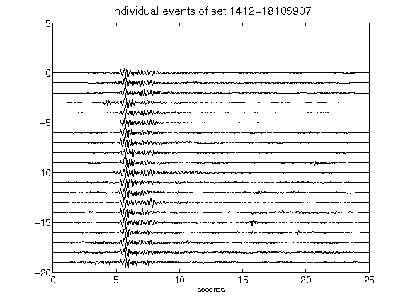](figures/1412-18105907_AllEv.png)[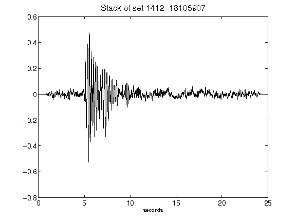](figures/1412-18105907_Stack.png)[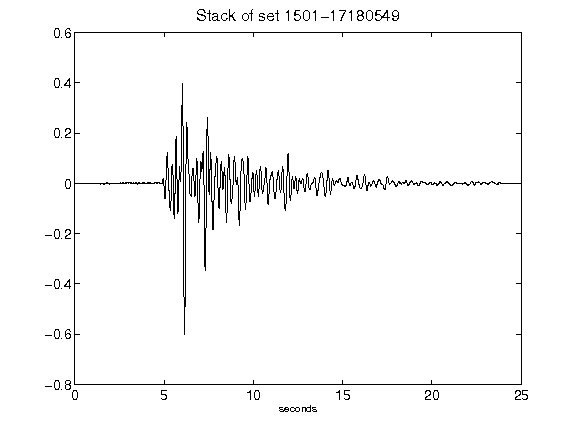](figures/1501-17180549_Stack.png)[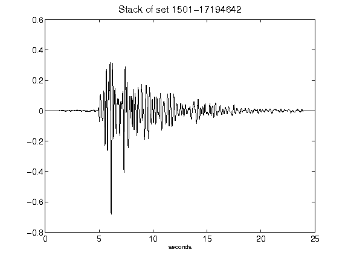](figures/1501-17194642_Stack.png)